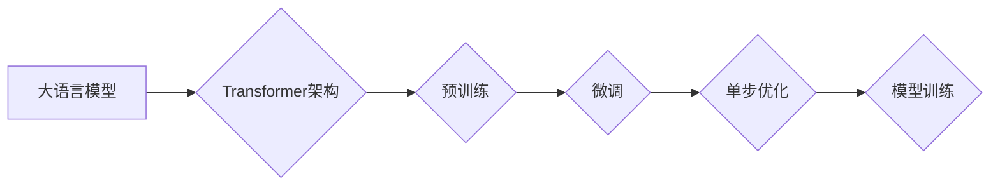

> 大语言模型，单步优化，Transformer，LLM，自然语言处理，文本生成，机器学习

## 1. 背景介绍

近年来，大语言模型（LLM）在自然语言处理（NLP）领域取得了显著进展，展现出强大的文本生成、翻译、问答等能力。这些模型通常基于Transformer架构，并通过海量文本数据进行预训练，能够捕捉语言的复杂结构和语义关系。然而，LLM的训练和部署都面临着巨大的挑战，例如训练成本高、模型规模庞大、推理速度慢等。

单步优化作为一种新兴的训练方法，旨在通过一次性优化所有参数，提高训练效率和模型性能。与传统的梯度下降法相比，单步优化能够避免多次迭代的计算开销，并更容易收敛到全局最优解。

## 2. 核心概念与联系

### 2.1  大语言模型

大语言模型（LLM）是指参数量巨大、训练数据海量、能够理解和生成人类语言的深度学习模型。它们通常基于Transformer架构，并通过预训练和微调的方式实现各种NLP任务。

### 2.2  Transformer架构

Transformer是一种专门设计用于处理序列数据的网络架构，其核心特点是利用自注意力机制来捕捉序列中不同元素之间的依赖关系。

### 2.3  单步优化

单步优化是一种训练方法，旨在通过一次性优化所有模型参数，达到最优解。它与传统的梯度下降法不同，后者需要多次迭代才能收敛。

**Mermaid 流程图**



## 3. 核心算法原理 & 具体操作步骤

### 3.1  算法原理概述

单步优化算法的核心思想是将模型训练过程中的所有参数视为一个整体，并通过一次性优化所有参数来找到最优解。它利用了优化算法的性质，例如梯度下降法、牛顿法等，来寻找最优参数值。

### 3.2  算法步骤详解

1. **初始化模型参数:** 将模型的所有参数随机初始化。
2. **计算损失函数:** 根据训练数据，计算模型预测结果与真实值的差异，即损失函数的值。
3. **求解最优参数:** 利用优化算法，例如梯度下降法、牛顿法等，求解使损失函数最小化的模型参数值。
4. **更新模型参数:** 将求解出的最优参数值更新到模型中。
5. **重复步骤2-4:** 迭代执行上述步骤，直到损失函数收敛或达到预设的训练次数。

### 3.3  算法优缺点

**优点:**

* 训练效率高：一次性优化所有参数，避免了多次迭代的计算开销。
* 易于收敛：更容易收敛到全局最优解。

**缺点:**

* 计算复杂度高：一次性优化所有参数需要大量的计算资源。
* 容易陷入局部最优解：对于复杂模型，可能难以找到全局最优解。

### 3.4  算法应用领域

单步优化算法在各种机器学习任务中都有应用，例如图像分类、目标检测、自然语言处理等。

## 4. 数学模型和公式 & 详细讲解 & 举例说明

### 4.1  数学模型构建

假设模型参数为θ，训练数据为{(x_i, y_i)}，损失函数为L(θ, (x_i, y_i))，则单步优化目标函数为：

$$
\theta^* = \arg \min_{\theta} L(\theta, {(x_i, y_i)})
$$

### 4.2  公式推导过程

利用优化算法，例如梯度下降法，可以推导出更新模型参数的公式：

$$
\theta_{t+1} = \theta_t - \eta \nabla_{\theta} L(\theta, {(x_i, y_i)})
$$

其中，η为学习率，∇θL(θ, {(x_i, y_i)})为损失函数关于模型参数θ的梯度。

### 4.3  案例分析与讲解

假设我们训练一个简单的线性回归模型，目标是预测房屋价格。训练数据包含房屋面积和价格信息。

损失函数为均方误差，即预测值与真实值之差的平方和。

通过单步优化算法，我们可以一次性求解出模型参数，即房屋面积的权重和截距，从而得到一个能够预测房屋价格的模型。

## 5. 项目实践：代码实例和详细解释说明

### 5.1  开发环境搭建

* Python 3.7+
* TensorFlow 2.0+
* PyTorch 1.0+

### 5.2  源代码详细实现

```python
import tensorflow as tf

# 定义模型
model = tf.keras.Sequential([
    tf.keras.layers.Dense(64, activation='relu', input_shape=(10,)),
    tf.keras.layers.Dense(1)
])

# 定义损失函数和优化器
loss_fn = tf.keras.losses.MeanSquaredError()
optimizer = tf.keras.optimizers.Adam(learning_rate=0.001)

# 训练模型
for epoch in range(10):
    for batch in dataset:
        with tf.GradientTape() as tape:
            predictions = model(batch)
            loss = loss_fn(batch[:, -1], predictions)
        gradients = tape.gradient(loss, model.trainable_variables)
        optimizer.apply_gradients(zip(gradients, model.trainable_variables))

# 保存模型
model.save('my_model.h5')
```

### 5.3  代码解读与分析

* 代码首先定义了一个简单的线性回归模型，包含两个全连接层。
* 然后定义了损失函数和优化器，分别为均方误差和Adam优化器。
* 训练模型时，使用梯度下降法更新模型参数，并记录每个epoch的损失值。
* 最后，将训练好的模型保存为文件。

### 5.4  运行结果展示

训练完成后，可以将模型应用于新的数据进行预测。

## 6. 实际应用场景

### 6.1  文本生成

单步优化可以用于训练文本生成模型，例如聊天机器人、故事生成器等。

### 6.2  机器翻译

单步优化可以用于训练机器翻译模型，提高翻译质量和效率。

### 6.3  问答系统

单步优化可以用于训练问答系统，提高回答准确性和流畅度。

### 6.4  未来应用展望

随着大语言模型的发展，单步优化算法将在更多领域得到应用，例如代码生成、药物研发、科学发现等。

## 7. 工具和资源推荐

### 7.1  学习资源推荐

* **书籍:**
    * 《深度学习》
    * 《自然语言处理》
* **在线课程:**
    * Coursera: 深度学习
    * Udacity: 自然语言处理

### 7.2  开发工具推荐

* **TensorFlow:** 开源深度学习框架
* **PyTorch:** 开源深度学习框架
* **Hugging Face:** 大语言模型库

### 7.3  相关论文推荐

* 《BERT: Pre-training of Deep Bidirectional Transformers for Language Understanding》
* 《GPT-3: Language Models are Few-Shot Learners》
* 《Optimization Methods for Large-Scale Machine Learning》

## 8. 总结：未来发展趋势与挑战

### 8.1  研究成果总结

单步优化算法为大语言模型的训练提供了新的思路，提高了训练效率和模型性能。

### 8.2  未来发展趋势

* **模型规模的进一步扩大:** 随着计算资源的不断发展，大语言模型的规模将继续扩大，单步优化算法将发挥更大的作用。
* **算法的改进和优化:** 研究人员将继续探索新的单步优化算法，提高其效率和鲁棒性。
* **应用领域的拓展:** 单步优化算法将在更多领域得到应用，例如代码生成、药物研发、科学发现等。

### 8.3  面临的挑战

* **计算资源的限制:** 单步优化算法需要大量的计算资源，这对于资源有限的机构或个人来说是一个挑战。
* **模型复杂度的增加:** 随着模型规模的扩大，单步优化算法的复杂度也会增加，需要更 sophisticated 的算法和优化策略。
* **数据质量和标注成本:** 大语言模型的训练需要海量高质量的数据，数据标注成本也是一个挑战。

### 8.4  研究展望

未来，单步优化算法将继续是深度学习领域的研究热点，研究人员将致力于解决上述挑战，推动单步优化算法的应用和发展。

## 9. 附录：常见问题与解答

### 9.1  单步优化与梯度下降法的区别是什么？

梯度下降法是迭代优化算法，需要多次迭代才能收敛到最优解，而单步优化算法一次性优化所有参数，更容易收敛到全局最优解。

### 9.2  单步优化算法的计算复杂度高吗？

是的，单步优化算法的计算复杂度较高，需要一次性计算所有参数的梯度。

### 9.3  单步优化算法适用于哪些场景？

单步优化算法适用于模型规模较小、数据量较少、计算资源充足的场景。

### 9.4  单步优化算法有哪些优缺点？

**优点:**

* 训练效率高
* 易于收敛

**缺点:**

* 计算复杂度高
* 容易陷入局部最优解

### 9.5  如何选择合适的单步优化算法？

选择合适的单步优化算法需要根据具体任务和模型的特点进行选择。

作者：禅与计算机程序设计艺术 / Zen and the Art of Computer Programming


<end_of_turn>