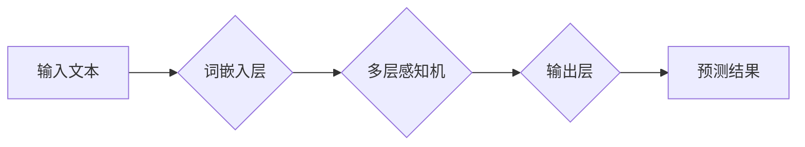

> 大语言模型、图灵机、神经网络、深度学习、自然语言处理、文本生成、机器翻译

## 1. 背景介绍

自人类发明了文字以来，语言一直是人类交流和表达思想的重要工具。随着计算机技术的飞速发展，自然语言处理（NLP）领域也取得了长足的进步。大语言模型（LLM）作为NLP领域的新兴技术，凭借其强大的文本生成、理解和翻译能力，正在改变着我们与世界交互的方式。

LLM的出现，标志着人工智能迈向一个新的里程碑。它们能够理解和生成人类语言，并完成各种复杂的任务，例如：

* **文本生成:** 写作故事、诗歌、文章、代码等。
* **机器翻译:** 将文本从一种语言翻译成另一种语言。
* **问答系统:** 回答用户提出的问题。
* **对话系统:** 与用户进行自然流畅的对话。
* **文本摘要:** 生成文本的简短摘要。

LLM的应用前景广阔，在各个领域都具有巨大的潜力。

## 2. 核心概念与联系

### 2.1 图灵机

图灵机是理论计算机科学中的一种抽象模型，由英国数学家艾伦·图灵于1936年提出。它是一种无限的存储器和一个有限状态机，通过一系列规则来处理输入数据。图灵机能够模拟任何算法，因此被认为是通用计算模型。

### 2.2 神经网络

神经网络是一种受生物神经网络启发的机器学习模型。它由多个层组成，每层包含多个神经元。神经元之间通过连接进行信息传递，每个连接都有一个权重。通过训练，神经网络可以学习到数据的特征和模式，并根据这些特征进行预测或分类。

### 2.3 联系

LLM本质上是一种基于深度学习的神经网络模型。它利用图灵机的通用计算能力，通过大量的文本数据进行训练，学习到语言的语法、语义和上下文关系。

**Mermaid 流程图**



## 3. 核心算法原理 & 具体操作步骤

### 3.1 算法原理概述

LLM的核心算法是基于Transformer架构的深度学习模型。Transformer模型利用自注意力机制来捕捉文本序列中的长距离依赖关系，从而能够更好地理解和生成文本。

### 3.2 算法步骤详解

1. **词嵌入:** 将输入文本中的每个词转换为一个低维向量，称为词嵌入。词嵌入能够捕捉词语之间的语义关系。
2. **自注意力机制:** 利用自注意力机制来计算每个词与其他词之间的相关性，从而捕捉文本序列中的长距离依赖关系。
3. **多层感知机:** 将自注意力机制的输出作为输入，通过多层感知机进行处理，提取文本的语义特征。
4. **输出层:** 将多层感知机的输出作为输入，通过softmax函数进行概率分布，预测下一个词。

### 3.3 算法优缺点

**优点:**

* 能够捕捉文本序列中的长距离依赖关系。
* 训练效率高，能够处理大量的文本数据。
* 生成文本质量高，能够生成流畅、自然的文本。

**缺点:**

* 计算复杂度高，需要大量的计算资源。
* 训练数据量大，需要大量的标注数据。
* 容易受到训练数据中的偏差影响。

### 3.4 算法应用领域

LLM在各个领域都有广泛的应用，例如：

* **自然语言理解:** 文本分类、情感分析、问答系统等。
* **自然语言生成:** 文本摘要、机器翻译、对话系统等。
* **代码生成:** 自动生成代码、代码补全等。
* **创意写作:** 写作故事、诗歌、剧本等。

## 4. 数学模型和公式 & 详细讲解 & 举例说明

### 4.1 数学模型构建

LLM的数学模型主要基于概率论和统计学。其核心思想是通过训练一个概率模型，来预测下一个词的出现概率。

### 4.2 公式推导过程

**词嵌入:**

$$
\mathbf{w}_i = \mathbf{E}(\mathbf{x}_i)
$$

其中，$\mathbf{w}_i$ 是词 $i$ 的词嵌入向量，$\mathbf{E}$ 是词嵌入矩阵，$\mathbf{x}_i$ 是词 $i$ 的索引。

**自注意力机制:**

$$
\mathbf{Attention}(Q, K, V) = \frac{\exp(\frac{Q K^T}{\sqrt{d_k}})}{\sum_{j=1}^{N} \exp(\frac{Q K^T}{\sqrt{d_k}})} V
$$

其中，$Q$, $K$, $V$ 分别是查询矩阵、键矩阵和值矩阵，$d_k$ 是键向量的维度，$N$ 是序列长度。

**多层感知机:**

$$
\mathbf{h}_l = \sigma(\mathbf{W}_l \mathbf{h}_{l-1} + \mathbf{b}_l)
$$

其中，$\mathbf{h}_l$ 是第 $l$ 层的隐藏状态向量，$\mathbf{W}_l$ 和 $\mathbf{b}_l$ 分别是第 $l$ 层的权重矩阵和偏置向量，$\sigma$ 是激活函数。

**输出层:**

$$
\mathbf{p} = \text{softmax}(\mathbf{W}_o \mathbf{h}_L + \mathbf{b}_o)
$$

其中，$\mathbf{p}$ 是预测每个词的概率分布，$\mathbf{W}_o$ 和 $\mathbf{b}_o$ 分别是输出层的权重矩阵和偏置向量，$\text{softmax}$ 是softmax函数。

### 4.3 案例分析与讲解

例如，在机器翻译任务中，LLM可以将源语言文本翻译成目标语言文本。

1. 将源语言文本中的每个词转换为词嵌入向量。
2. 利用自注意力机制来计算每个词与其他词之间的相关性。
3. 通过多层感知机进行处理，提取文本的语义特征。
4. 利用输出层预测目标语言文本中的每个词的出现概率。
5. 根据概率分布生成目标语言文本。

## 5. 项目实践：代码实例和详细解释说明

### 5.1 开发环境搭建

* Python 3.7+
* PyTorch 1.7+
* CUDA 10.2+

### 5.2 源代码详细实现

```python
import torch
import torch.nn as nn

class Transformer(nn.Module):
    def __init__(self, vocab_size, embedding_dim, num_heads, num_layers, hidden_dim):
        super(Transformer, self).__init__()
        self.embedding = nn.Embedding(vocab_size, embedding_dim)
        self.transformer_encoder = nn.TransformerEncoder(nn.TransformerEncoderLayer(embedding_dim, num_heads, hidden_dim), num_layers)

    def forward(self, x):
        x = self.embedding(x)
        x = self.transformer_encoder(x)
        return x

# 实例化模型
model = Transformer(vocab_size=10000, embedding_dim=512, num_heads=8, num_layers=6, hidden_dim=2048)

# 定义损失函数和优化器
criterion = nn.CrossEntropyLoss()
optimizer = torch.optim.Adam(model.parameters(), lr=0.001)

# 训练模型
for epoch in range(num_epochs):
    for batch in train_data:
        # 前向传播
        outputs = model(batch)
        # 计算损失
        loss = criterion(outputs, batch_labels)
        # 反向传播
        optimizer.zero_grad()
        loss.backward()
        # 更新参数
        optimizer.step()

```

### 5.3 代码解读与分析

* **词嵌入层:** 将每个词转换为一个低维向量，用于表示词语的语义信息。
* **Transformer编码器:** 利用自注意力机制和多层感知机来捕捉文本序列中的长距离依赖关系。
* **输出层:** 利用softmax函数将隐藏状态向量映射到每个词的概率分布。

### 5.4 运行结果展示

训练完成后，可以将模型应用于文本生成、机器翻译等任务。

## 6. 实际应用场景

### 6.1 文本生成

LLM可以用于生成各种类型的文本，例如：

* **故事、诗歌、剧本:** 可以根据给定的主题或关键词生成创意文本。
* **文章、博客:** 可以根据给定的主题或关键词生成新闻报道、评论文章等。
* **代码:** 可以根据给定的功能需求生成代码。

### 6.2 机器翻译

LLM可以用于将文本从一种语言翻译成另一种语言，例如：

* **网页翻译:** 可以将网页内容翻译成目标语言。
* **文档翻译:** 可以将文档内容翻译成目标语言。
* **实时翻译:** 可以实时翻译语音或视频。

### 6.3 问答系统

LLM可以用于构建问答系统，例如：

* **客服机器人:** 可以回答用户的常见问题。
* **搜索引擎:** 可以根据用户的查询关键词提供相关信息。
* **教育机器人:** 可以回答学生的学习问题。

### 6.4 未来应用展望

LLM的应用前景广阔，未来可能会在以下领域得到更广泛的应用：

* **个性化教育:** 根据学生的学习进度和需求提供个性化的学习内容。
* **医疗诊断:** 辅助医生进行疾病诊断和治疗方案制定。
* **法律服务:** 辅助律师进行法律研究和案件分析。

## 7. 工具和资源推荐

### 7.1 学习资源推荐

* **书籍:**
    * 《深度学习》
    * 《自然语言处理》
* **在线课程:**
    * Coursera: 自然语言处理
    * Udacity: 深度学习
* **博客:**
    * The Gradient
    * Towards Data Science

### 7.2 开发工具推荐

* **PyTorch:** 深度学习框架
* **TensorFlow:** 深度学习框架
* **Hugging Face Transformers:** 预训练模型库

### 7.3 相关论文推荐

* **Attention Is All You Need:** https://arxiv.org/abs/1706.03762
* **BERT: Pre-training of Deep Bidirectional Transformers for Language Understanding:** https://arxiv.org/abs/1810.04805

## 8. 总结：未来发展趋势与挑战

### 8.1 研究成果总结

LLM在自然语言处理领域取得了长足的进步，能够完成各种复杂的任务，并展现出强大的文本生成能力。

### 8.2 未来发展趋势

* **模型规模更大:** 训练更大的模型，以提高模型的性能。
* **多模态学习:** 将文本与其他模态数据（例如图像、音频）进行融合，以提高模型的理解能力。
* **可解释性增强:** 研究如何提高LLM的透明度和可解释性，使其能够更好地被理解和信任。

### 8.3 面临的挑战

* **数据偏见:** 训练数据可能存在偏见，导致模型生成带有偏见的文本。
* **计算资源:** 训练大型LLM需要大量的计算资源，成本较高。
* **伦理问题:** LLM可能被用于生成虚假信息或进行恶意攻击，需要考虑其伦理问题。

### 8.4 研究展望

未来，LLM的研究将继续朝着更强大、更安全、更可解释的方向发展。


## 9. 附录：常见问题与解答

**Q1: 如何选择合适的LLM模型？**

**A1:** 选择合适的LLM模型需要根据具体的应用场景和需求进行考虑。例如，如果需要生成高质量的创意文本，可以选择GPT-3等文本生成模型；如果需要进行机器翻译，可以选择T5等翻译模型。

**Q2: 如何训练自己的LLM模型？**

**A2:** 训练自己的