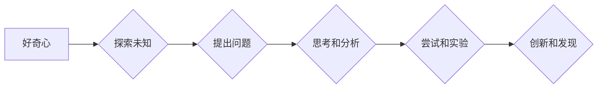

>  好奇心、创新、发现、人工智能、算法、机器学习、深度学习、数据科学

## 1. 背景介绍

在瞬息万变的科技时代，创新和发现是推动社会进步的引擎。而好奇心，作为人类最原始的驱动力之一，扮演着至关重要的角色。它激发我们对未知世界的探索，促使我们不断地提问、思考和尝试，最终引领我们走向新的发现和突破。

人工智能（AI）作为科技发展的新热点，正以惊人的速度改变着我们的生活。从自动驾驶到语音识别，从医疗诊断到金融预测，AI技术的应用领域日益广泛。然而，AI的发展离不开好奇心的驱动力。

正是源于对人类认知机制的无限好奇，才促使科学家们探索人工智能的可能性。正是对数据背后的规律的探索，才推动了机器学习和深度学习的不断发展。正是对未来世界的想象，才激励着我们不断地研究和创新，将AI技术应用于更广泛的领域。

## 2. 核心概念与联系

好奇心与创新、发现之间存在着密不可分的联系。

**好奇心**是探索未知的渴望，它让我们对世界保持着求知欲和探索精神。

**创新**是指创造出新的事物或方法，它需要打破既有思维模式，提出新的想法和解决方案。

**发现**是指揭示未知的规律或知识，它需要对世界进行深入的观察和分析。

好奇心是创新和发现的源泉，它激发我们对未知的探索，推动我们不断地思考、尝试和突破。

**Mermaid 流程图：**



## 3. 核心算法原理 & 具体操作步骤

### 3.1  算法原理概述

机器学习算法的核心原理是通过学习数据中的模式和规律，从而能够对新的数据进行预测或分类。

机器学习算法可以分为监督学习、无监督学习和强化学习三大类。

* **监督学习:**  在训练数据中，每个样本都带有对应的标签，算法的目标是学习出能够将新的样本与对应的标签匹配的模型。
* **无监督学习:**  训练数据中没有标签，算法的目标是发现数据中的潜在结构和模式。
* **强化学习:**  算法通过与环境交互，学习如何采取最优的行动以获得最大的奖励。

### 3.2  算法步骤详解

以监督学习为例，其基本步骤如下：

1. **数据收集和预处理:** 收集相关数据，并进行清洗、转换和特征工程等预处理操作。
2. **模型选择:** 根据具体任务选择合适的机器学习模型，例如线性回归、逻辑回归、决策树、支持向量机等。
3. **模型训练:** 使用训练数据训练模型，调整模型参数以最小化模型误差。
4. **模型评估:** 使用测试数据评估模型的性能，例如准确率、召回率、F1-score等。
5. **模型部署:** 将训练好的模型部署到实际应用场景中，用于对新数据进行预测或分类。

### 3.3  算法优缺点

**优点:**

* 可以自动学习数据中的模式和规律，无需人工特征工程。
* 可以处理海量数据，并发现隐藏的模式。
* 可以不断学习和改进，随着数据量的增加，模型性能会不断提升。

**缺点:**

* 需要大量的训练数据，否则模型性能会下降。
* 对数据质量要求较高，数据噪声或偏差会影响模型性能。
* 模型解释性较差，难以理解模型是如何做出决策的。

### 3.4  算法应用领域

机器学习算法广泛应用于各个领域，例如：

* **图像识别:**  识别物体、人脸、场景等。
* **自然语言处理:**  文本分类、情感分析、机器翻译等。
* **推荐系统:**  根据用户行为推荐商品、内容等。
* **医疗诊断:**  辅助医生诊断疾病、预测患者风险等。
* **金融预测:**  预测股票价格、信用风险等。

## 4. 数学模型和公式 & 详细讲解 & 举例说明

### 4.1  数学模型构建

机器学习算法通常基于数学模型进行构建。例如，线性回归模型的数学表达式为：

$$y = w_0 + w_1x_1 + w_2x_2 + ... + w_nx_n + \epsilon$$

其中：

* $y$ 是预测值
* $w_0, w_1, ..., w_n$ 是模型参数
* $x_1, x_2, ..., x_n$ 是输入特征
* $\epsilon$ 是误差项

### 4.2  公式推导过程

模型参数的学习过程通常使用梯度下降算法进行优化。梯度下降算法的目标是找到使模型误差最小化的参数值。

梯度下降算法的基本公式为：

$$w_{i} = w_{i} - \alpha \frac{\partial Loss}{\partial w_{i}}$$

其中：

* $w_i$ 是模型参数
* $\alpha$ 是学习率
* $\frac{\partial Loss}{\partial w_i}$ 是损失函数对参数 $w_i$ 的梯度

### 4.3  案例分析与讲解

例如，在训练线性回归模型时，损失函数通常使用均方误差（MSE）：

$$Loss = \frac{1}{n} \sum_{i=1}^{n} (y_i - \hat{y}_i)^2$$

其中：

* $n$ 是样本数量
* $y_i$ 是真实值
* $\hat{y}_i$ 是模型预测值

通过计算损失函数对参数的梯度，并使用梯度下降算法进行更新，模型参数会逐渐收敛到使损失函数最小化的值。

## 5. 项目实践：代码实例和详细解释说明

### 5.1  开发环境搭建

使用 Python 语言进行机器学习开发，需要安装以下软件包：

* Python 3.x
* NumPy
* Pandas
* Scikit-learn

### 5.2  源代码详细实现

以下是一个使用 Scikit-learn 库实现线性回归模型的代码示例：

```python
import numpy as np
from sklearn.linear_model import LinearRegression
from sklearn.model_selection import train_test_split

# 生成示例数据
X = np.array([[1], [2], [3], [4], [5]])
y = np.array([2, 4, 5, 4, 5])

# 将数据划分为训练集和测试集
X_train, X_test, y_train, y_test = train_test_split(X, y, test_size=0.2, random_state=42)

# 创建线性回归模型
model = LinearRegression()

# 训练模型
model.fit(X_train, y_train)

# 预测测试集数据
y_pred = model.predict(X_test)

# 打印模型参数
print("模型参数:", model.coef_)
print("截距:", model.intercept_)

# 打印预测结果
print("预测结果:", y_pred)
```

### 5.3  代码解读与分析

* 代码首先导入必要的库函数。
* 然后生成示例数据，并将其划分为训练集和测试集。
* 创建线性回归模型，并使用训练集进行模型训练。
* 使用训练好的模型对测试集数据进行预测。
* 打印模型参数和预测结果。

### 5.4  运行结果展示

运行上述代码，会输出模型参数和预测结果。

## 6. 实际应用场景

### 6.1  医疗诊断

机器学习算法可以用于辅助医生诊断疾病。例如，通过训练模型识别病人的影像学数据，例如 X 光片、CT 扫描等，可以帮助医生更准确地诊断疾病。

### 6.2  金融预测

机器学习算法可以用于预测股票价格、信用风险等。例如，通过训练模型分析股票市场数据，可以帮助投资者做出更明智的投资决策。

### 6.3  推荐系统

机器学习算法可以用于构建推荐系统，例如推荐商品、内容等。例如，通过训练模型分析用户的行为数据，可以推荐用户可能感兴趣的商品或内容。

### 6.4  未来应用展望

随着人工智能技术的不断发展，机器学习算法将在更多领域得到应用。例如，在自动驾驶、机器人、个性化教育等领域，机器学习算法将发挥越来越重要的作用。

## 7. 工具和资源推荐

### 7.1  学习资源推荐

* **在线课程:** Coursera、edX、Udacity 等平台提供丰富的机器学习课程。
* **书籍:** 《机器学习》 (周志华)、《深入理解机器学习》 (李航) 等书籍是机器学习学习的经典教材。
* **博客和网站:** 机器学习相关的博客和网站，例如 Towards Data Science、Machine Learning Mastery 等，提供最新的机器学习资讯和技术分享。

### 7.2  开发工具推荐

* **Python:** 机器学习开发的常用语言。
* **Scikit-learn:** Python 机器学习库，提供各种机器学习算法和工具。
* **TensorFlow:** Google 开发的深度学习框架。
* **PyTorch:** Facebook 开发的深度学习框架。

### 7.3  相关论文推荐

* **《机器学习》 (周志华)**
* **《深入理解机器学习》 (李航)**
* **《Pattern Recognition and Machine Learning》 (Christopher M. Bishop)**

## 8. 总结：未来发展趋势与挑战

### 8.1  研究成果总结

近年来，人工智能领域取得了显著的进展，机器学习算法在各个领域得到了广泛应用。

### 8.2  未来发展趋势

未来，人工智能技术将继续发展，并朝着以下几个方向发展：

* **更强大的模型:** 研究更强大的机器学习模型，例如 Transformer、Generative Adversarial Networks (GANs) 等。
* **更广泛的应用:** 将机器学习算法应用于更多领域，例如医疗、教育、金融等。
* **更智能的系统:** 研究更智能的 AI 系统，例如能够自主学习和决策的系统。

### 8.3  面临的挑战

人工智能技术的发展也面临着一些挑战：

* **数据隐私和安全:** 如何保护用户数据隐私和安全是人工智能技术发展面临的重要挑战。
* **算法偏见:** 机器学习算法可能会受到训练数据中的偏见影响，导致算法输出结果存在偏见。
* **伦理问题:** 人工智能技术的应用可能会引发一些伦理问题，例如人工智能的责任和义务等。

### 8.4  研究展望

未来，我们需要继续加强对人工智能技术的研究，并积极应对人工智能技术发展带来的挑战，以确保人工智能技术能够造福人类社会。

## 9. 附录：常见问题与解答

### 9.1  常见问题

* 什么是机器学习？
* 机器学习算法有哪些？
* 如何选择合适的机器学习算法？
* 如何评估机器学习模型的性能？

### 9.2  解答

* 机器学习是一种人工智能技术，它通过学习数据中的模式和规律，从而能够对新的数据进行预测或分类。
* 机器学习算法有很多种，例如线性回归、逻辑回归、决策树、支持向量机等。
* 选择合适的机器学习算法需要根据具体任务和数据特点进行选择。
* 机器学习模型的性能可以通过准确率、召回率、F1-score等指标进行评估。


作者：禅与计算机程序设计艺术 / Zen and the Art of Computer Programming 
<end_of_turn>