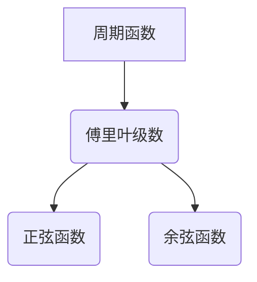

> 微积分,级数,傅里叶分析,信号处理,图像处理,数据分析,正交函数,谐波分析

## 1. 背景介绍

微积分作为数学的基石，为我们提供了研究变化的强大工具。而级数作为微积分的重要组成部分，为我们提供了将函数表示为无穷和的形式，从而揭示了函数的本质特征。傅里叶分析则是利用级数的思想，将任意周期函数分解为一系列正弦和余弦函数的和，从而将复杂函数简化，并揭示其频率成分。

在现代科技发展中，傅里叶分析在信号处理、图像处理、数据分析等领域有着广泛的应用。例如，在语音识别中，我们可以利用傅里叶分析提取语音信号的频率特征，从而实现语音识别；在图像压缩中，我们可以利用傅里叶分析将图像分解为不同频率成分，并丢弃高频成分，从而实现图像压缩；在数据分析中，我们可以利用傅里叶分析分析时间序列数据，提取其周期性特征，从而进行预测分析。

## 2. 核心概念与联系

### 2.1 级数的概念

级数是指一个无穷多个数项的和。例如，1 + 1/2 + 1/4 + 1/8 + ... 就是一个级数。

### 2.2 傅里叶级数的概念

傅里叶级数是指将一个周期函数分解为一系列正弦和余弦函数的和。

### 2.3 核心概念联系

傅里叶级数是利用级数的思想，将周期函数分解为一系列正弦和余弦函数的和。



## 3. 核心算法原理 & 具体操作步骤

### 3.1 算法原理概述

傅里叶级数的计算原理基于正交性。正交函数是指满足特定条件的函数，例如正弦和余弦函数。当正弦和余弦函数在特定区间内相乘后积分，结果为零，则称它们是正交的。

利用正交性，我们可以将周期函数分解为一系列正弦和余弦函数的和，每个正弦和余弦函数的系数可以通过积分计算得到。

### 3.2 算法步骤详解

1. **确定周期函数:** 首先需要确定要进行傅里叶分析的周期函数。
2. **选择基函数:** 选择正弦和余弦函数作为基函数。
3. **计算系数:** 利用积分计算每个正弦和余弦函数的系数。
4. **构建傅里叶级数:** 将所有正弦和余弦函数及其系数组合起来，得到傅里叶级数。

### 3.3 算法优缺点

**优点:**

* 可以将复杂函数分解为简单函数的和，从而简化分析。
* 可以提取函数的频率成分，从而揭示其本质特征。

**缺点:**

* 对于非周期函数，无法直接应用傅里叶分析。
* 计算复杂度较高，尤其是对于高频成分。

### 3.4 算法应用领域

* **信号处理:** 语音识别、图像压缩、滤波等。
* **图像处理:** 图像压缩、边缘检测、图像恢复等。
* **数据分析:** 时间序列分析、预测分析等。

## 4. 数学模型和公式 & 详细讲解 & 举例说明

### 4.1 数学模型构建

假设 f(x) 是一个周期为 2π 的周期函数，其傅里叶级数表示为：

$$f(x) = a_0 + \sum_{n=1}^{\infty} [a_n \cos(nx) + b_n \sin(nx)]$$

其中，

* $a_0$, $a_n$, $b_n$ 是傅里叶系数。

### 4.2 公式推导过程

傅里叶系数的计算公式为：

$$a_0 = \frac{1}{\pi} \int_{-\pi}^{\pi} f(x) dx$$

$$a_n = \frac{1}{\pi} \int_{-\pi}^{\pi} f(x) \cos(nx) dx$$

$$b_n = \frac{1}{\pi} \int_{-\pi}^{\pi} f(x) \sin(nx) dx$$

### 4.3 案例分析与讲解

**举例:**

假设 f(x) = x，则其傅里叶级数为：

$$f(x) = \frac{2}{\pi} \sum_{n=1}^{\infty} \frac{(-1)^{n+1}}{n} \sin(nx)$$

我们可以看到，该傅里叶级数由一系列奇函数的正弦函数组成，其系数与 n 的倒数成反比。

## 5. 项目实践：代码实例和详细解释说明

### 5.1 开发环境搭建

* 编程语言：Python
* 库依赖：NumPy, Matplotlib

### 5.2 源代码详细实现

```python
import numpy as np
import matplotlib.pyplot as plt

def fourier_series(f, T, N):
    """
    计算傅里叶级数

    Args:
        f: 周期函数
        T: 周期
        N: 谐波数

    Returns:
        傅里叶系数
    """
    a0 = (1/T) * np.trapz(f(np.linspace(0, T, 1000)), np.linspace(0, T, 1000))
    an = [(1/T) * np.trapz(f(np.linspace(0, T, 1000)) * np.cos(2*np.pi*n*np.linspace(0, T, 1000)/T), np.linspace(0, T, 1000)) for n in range(1, N+1)]
    bn = [(1/T) * np.trapz(f(np.linspace(0, T, 1000)) * np.sin(2*np.pi*n*np.linspace(0, T, 1000)/T), np.linspace(0, T, 1000)) for n in range(1, N+1)]
    return a0, an, bn

# 定义周期函数
def f(x):
    return x

# 周期和谐波数
T = 2*np.pi
N = 10

# 计算傅里叶系数
a0, an, bn = fourier_series(f, T, N)

# 构建傅里叶级数
x = np.linspace(0, 2*np.pi, 1000)
y = a0 + sum([an[i] * np.cos(i*x) + bn[i] * np.sin(i*x) for i in range(N)])

# 绘制原函数和傅里叶级数
plt.plot(x, f(x), label='原函数')
plt.plot(x, y, label='傅里叶级数')
plt.legend()
plt.show()
```

### 5.3 代码解读与分析

该代码首先定义了周期函数 f(x) = x，然后计算其傅里叶系数。最后，利用计算得到的傅里叶系数构建傅里叶级数，并绘制原函数和傅里叶级数的图形进行对比。

### 5.4 运行结果展示

运行结果显示，傅里叶级数可以较为准确地逼近原函数，尤其是在低频成分上。

## 6. 实际应用场景

### 6.1 语音识别

在语音识别中，我们可以利用傅里叶分析提取语音信号的频率特征，从而识别语音内容。

### 6.2 图像压缩

在图像压缩中，我们可以利用傅里叶分析将图像分解为不同频率成分，并丢弃高频成分，从而实现图像压缩。

### 6.3 数据分析

在数据分析中，我们可以利用傅里叶分析分析时间序列数据，提取其周期性特征，从而进行预测分析。

### 6.4 未来应用展望

随着人工智能和机器学习的发展，傅里叶分析在更多领域将发挥重要作用，例如：

* **医疗诊断:** 利用傅里叶分析分析医学图像，辅助医生进行诊断。
* **金融预测:** 利用傅里叶分析分析金融数据，预测市场趋势。
* **智能制造:** 利用傅里叶分析分析生产数据，优化生产流程。

## 7. 工具和资源推荐

### 7.1 学习资源推荐

* **书籍:**
    * 《信号与系统》
    * 《傅里叶分析及其应用》
* **在线课程:**
    * Coursera: Signal Processing
    * edX: Fourier Analysis

### 7.2 开发工具推荐

* **Python:** 强大的编程语言，拥有丰富的科学计算库。
* **NumPy:** 用于数值计算的Python库。
* **Matplotlib:** 用于数据可视化的Python库。

### 7.3 相关论文推荐

* **The Fourier Transform and Its Applications** by Ronald Bracewell
* **A First Course in Fourier Analysis** by Robert G. Bartle and Donald R. Sherbert

## 8. 总结：未来发展趋势与挑战

### 8.1 研究成果总结

傅里叶分析作为一种强大的数学工具，在信号处理、图像处理、数据分析等领域取得了显著成果。

### 8.2 未来发展趋势

未来，傅里叶分析将与人工智能、机器学习等领域深度融合，在更多领域发挥重要作用。例如，利用深度学习算法优化傅里叶分析算法，提高其效率和精度。

### 8.3 面临的挑战

* 对于非周期函数，傅里叶分析无法直接应用，需要寻找新的方法进行分析。
* 对于高维数据，傅里叶分析的计算复杂度较高，需要开发更高效的算法。

### 8.4 研究展望

未来，我们将继续探索傅里叶分析的应用，并致力于开发更有效、更精确的傅里叶分析算法。

## 9. 附录：常见问题与解答

**问题:** 傅里叶分析只能用于周期函数吗？

**答案:** 傅里叶分析可以用于周期函数，也可以用于非周期函数。对于非周期函数，可以使用傅里叶变换进行分析。

**问题:** 傅里叶分析的计算复杂度很高吗？

**答案:** 对于高维数据，傅里叶分析的计算复杂度较高。但是，随着算法的优化和硬件的进步，计算复杂度正在不断降低。


作者：禅与计算机程序设计艺术 / Zen and the Art of Computer Programming 
<end_of_turn>