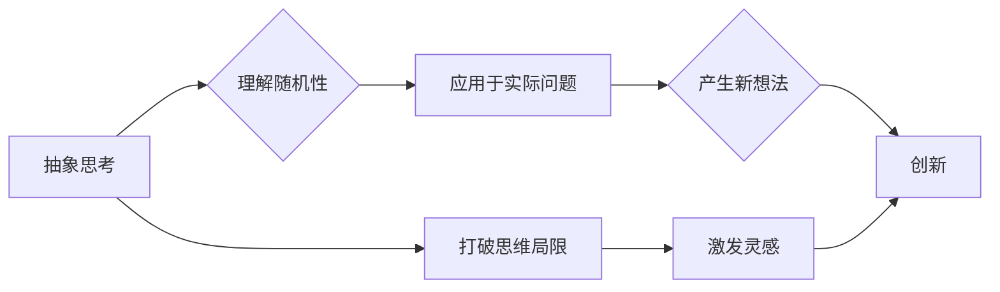

> 抽象思考, 随机性, 创见性, 算法, 数学模型, 项目实践, 应用场景, 未来趋势

## 1. 背景介绍

在当今科技日新月异的时代，创新已成为推动社会发展和进步的引擎。而抽象思考和随机性，作为两种重要的思维方式，在激发创见性、推动科技创新方面发挥着至关重要的作用。

抽象思考是指跳脱具体事物，抓住其本质特征和规律，进行概括和总结的能力。它能够帮助我们从不同的角度看待问题，发现隐藏的联系和模式，从而产生新的想法和解决方案。

随机性则指的是事物发展或变化的不确定性和不可预测性。它打破了固有的思维模式，为我们提供了一种全新的视角，激发灵感和创造力。

## 2. 核心概念与联系

抽象思考和随机性并非孤立存在的，它们之间存在着密切的联系。抽象思考能够帮助我们理解随机性的本质，并将其应用于实际问题中。而随机性则能够打破抽象思考的局限性，为我们提供新的灵感和方向。

**Mermaid 流程图**



## 3. 核心算法原理 & 具体操作步骤

### 3.1  算法原理概述

在计算机科学领域，许多算法都依赖于抽象思考和随机性。例如，遗传算法是一种模拟自然选择过程的算法，它利用随机性来产生不同的个体，并通过抽象思考来选择最优解。

### 3.2  算法步骤详解

1. **初始化种群:** 随机生成一个初始种群，每个个体代表一个可能的解决方案。
2. **评估适应度:** 对每个个体进行评估，计算其适应度，即其解决问题的优劣程度。
3. **选择个体:** 根据适应度选择部分个体进行繁殖。
4. **交叉操作:** 将选中的个体进行交叉操作，产生新的个体。
5. **变异操作:** 对新的个体进行变异操作，引入随机性，增加算法的探索能力。
6. **重复步骤2-5:** 重复上述步骤，直到达到预设的终止条件，例如找到最优解或迭代次数达到上限。

### 3.3  算法优缺点

**优点:**

* 能够解决复杂优化问题。
* 具有全局搜索能力，能够找到全局最优解。
* 适应性强，能够适应不同的问题类型。

**缺点:**

* 算法收敛速度较慢。
* 需要大量的计算资源。
* 难以确定最优参数设置。

### 3.4  算法应用领域

遗传算法广泛应用于各个领域，例如：

* **机器学习:** 用于特征选择、模型优化等。
* **工程设计:** 用于结构优化、参数设计等。
* **金融投资:** 用于投资组合优化、风险管理等。

## 4. 数学模型和公式 & 详细讲解 & 举例说明

### 4.1  数学模型构建

遗传算法可以抽象为一个数学模型，其中个体表示为一个向量，适应度函数表示为一个实数函数。

### 4.2  公式推导过程

* **适应度函数:** $f(x)$，其中 $x$ 为个体向量。
* **选择概率:** $p(x) = \frac{f(x)}{\sum_{i} f(i)}$，其中 $i$ 为所有个体。
* **交叉操作:** 将两个个体 $x_1$ 和 $x_2$ 进行交叉操作，产生两个新的个体 $x_3$ 和 $x_4$。
* **变异操作:** 对个体 $x$ 进行变异操作，改变其基因值。

### 4.3  案例分析与讲解

假设我们有一个优化问题，目标是找到一个最大化函数 $f(x)$ 的值。我们可以使用遗传算法来解决这个问题。

1. 初始化一个种群，每个个体是一个随机生成的向量。
2. 计算每个个体的适应度，即 $f(x)$ 的值。
3. 根据适应度选择部分个体进行繁殖。
4. 对选中的个体进行交叉和变异操作，产生新的个体。
5. 重复步骤2-4，直到找到一个满足条件的个体。

## 5. 项目实践：代码实例和详细解释说明

### 5.1  开发环境搭建

* 操作系统: Ubuntu 20.04
* 编程语言: Python 3.8
* 开发工具: PyCharm

### 5.2  源代码详细实现

```python
import random

# 定义适应度函数
def fitness_function(x):
    return x[0] * x[1]

# 定义种群
population = [[random.uniform(-10, 10) for _ in range(2)] for _ in range(100)]

# 迭代次数
num_iterations = 100

# 迭代
for i in range(num_iterations):
    # 计算适应度
    fitness_values = [fitness_function(x) for x in population]

    # 选择个体
    selected_individuals = random.choices(population, weights=fitness_values, k=50)

    # 交叉操作
    new_population = []
    for i in range(0, len(selected_individuals), 2):
        parent1 = selected_individuals[i]
        parent2 = selected_individuals[i + 1]
        child1 = [parent1[j] + random.uniform(-1, 1) for j in range(len(parent1))]
        child2 = [parent2[j] + random.uniform(-1, 1) for j in range(len(parent2))]
        new_population.extend([child1, child2])

    # 变异操作
    for individual in new_population:
        for j in range(len(individual)):
            if random.random() < 0.1:
                individual[j] += random.uniform(-1, 1)

    # 更新种群
    population = new_population

# 打印最优解
best_individual = max(population, key=fitness_function)
print(f"最优解: {best_individual}")
```

### 5.3  代码解读与分析

* **适应度函数:** `fitness_function(x)` 用于评估个体的适应度，在本例中，适应度函数为两个基因的乘积。
* **种群:** `population` 是一个包含多个个体的列表，每个个体是一个随机生成的向量。
* **迭代:** 算法通过迭代的方式不断更新种群，直到找到一个满足条件的个体。
* **选择:** 根据适应度选择部分个体进行繁殖。
* **交叉:** 将选中的个体进行交叉操作，产生新的个体。
* **变异:** 对新的个体进行变异操作，引入随机性。

### 5.4  运行结果展示

运行代码后，会输出一个最优解，即适应度最高的个体。

## 6. 实际应用场景

### 6.1  机器学习

遗传算法可以用于机器学习中的特征选择、模型优化等。例如，可以利用遗传算法来选择最优的特征子集，提高机器学习模型的性能。

### 6.2  工程设计

遗传算法可以用于工程设计中的结构优化、参数设计等。例如，可以利用遗传算法来优化桥梁的结构设计，使其更轻、更坚固。

### 6.3  金融投资

遗传算法可以用于金融投资中的投资组合优化、风险管理等。例如，可以利用遗传算法来构建一个风险收益平衡的投资组合。

### 6.4  未来应用展望

随着人工智能技术的不断发展，遗传算法和其他基于抽象思考和随机性的算法将有更广泛的应用场景。例如，它们可以用于药物研发、材料科学、生物信息学等领域。

## 7. 工具和资源推荐

### 7.1  学习资源推荐

* **书籍:**
    * 《Genetic Algorithms in Search, Optimization, and Machine Learning》 by David E. Goldberg
    * 《Evolutionary Computation》 by Melanie Mitchell
* **在线课程:**
    * Coursera: Evolutionary Algorithms
    * edX: Introduction to Genetic Algorithms

### 7.2  开发工具推荐

* **Python:** 广泛用于机器学习和人工智能领域，拥有丰富的库和工具支持遗传算法。
* **DEAP:** Python库，专门用于进化算法的开发。
* **PyGAD:** Python库，提供易于使用的遗传算法接口。

### 7.3  相关论文推荐

* **Genetic Algorithms: Search, Optimization, and Machine Learning** by David E. Goldberg
* **A Tutorial on Genetic Algorithms** by David E. Goldberg
* **Evolutionary Algorithms for Machine Learning** by Melanie Mitchell

## 8. 总结：未来发展趋势与挑战

### 8.1  研究成果总结

抽象思考和随机性是推动科技创新的重要驱动力。遗传算法等基于这些思维方式的算法已经取得了显著的成果，并在各个领域得到了广泛应用。

### 8.2  未来发展趋势

未来，抽象思考和随机性将继续推动科技创新的发展。例如，

* **深度学习与遗传算法的结合:** 将深度学习的强大能力与遗传算法的优化能力相结合，可以开发出更智能、更有效的算法。
* **量子计算与遗传算法的结合:** 量子计算的强大计算能力可以加速遗传算法的运行速度，并解决传统算法难以解决的复杂问题。
* **脑科学与遗传算法的结合:** 通过研究大脑的抽象思考和随机性机制，可以开发出更接近人类智能的算法。

### 8.3  面临的挑战

* **算法效率:** 许多基于抽象思考和随机性的算法计算复杂度较高，需要进一步提高算法效率。
* **参数设置:** 这些算法通常需要大量的参数设置，如何确定最优参数设置仍然是一个挑战。
* **解释性:** 这些算法的决策过程往往难以解释，缺乏透明度，这限制了它们的应用范围。

### 8.4  研究展望

未来，需要进一步研究抽象思考和随机性的本质，开发出更有效、更智能、更易解释的算法，推动科技创新和社会发展。

## 9. 附录：常见问题与解答

**问题:** 遗传算法的收敛速度较慢，如何提高收敛速度？

**解答:** 可以通过以下方法提高遗传算法的收敛速度:

* **缩短迭代次数:** 减少迭代次数，但需要保证找到足够好的解。
* **增加种群规模:** 增加种群规模，提高算法的探索能力。
* **调整交叉和变异概率:** 调整交叉和变异概率，平衡算法的探索和利用能力。
* **使用精英保留策略:** 保留最优个体，提高算法的收敛速度。

**问题:** 遗传算法的算法参数设置如何确定？

**解答:** 遗传算法的算法参数设置通常需要通过实验和经验来确定。一些常用的参数包括种群规模、交叉概率、变异概率、迭代次数等。可以根据具体问题和算法的特点进行调整。

**问题:** 遗传算法的解释性如何？

**解答:** 遗传算法的决策过程往往难以解释，缺乏透明度。这限制了它们的应用范围，特别是需要解释决策过程的领域。

**作者：禅与计算机程序设计艺术 / Zen and the Art of Computer Programming**


<end_of_turn>