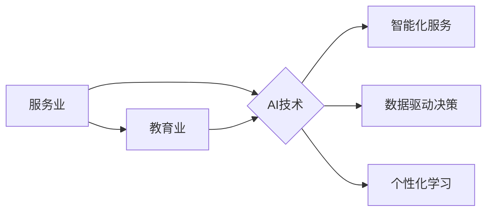

> 服务业、教育业、人工智能、机器学习、深度学习、自然语言处理、计算机视觉、个性化学习、智能推荐、未来趋势

## 1. 背景介绍

在当今科技飞速发展的时代，人工智能（AI）正在深刻地改变着我们生活的方方面面。从智能手机的语音助手到自动驾驶汽车，AI技术的应用日益广泛，并不断涌现出新的应用场景。

服务业和教育业作为国民经济的重要组成部分，也面临着巨大的变革机遇。随着AI技术的不断成熟，服务业和教育业将迎来前所未有的发展机遇，并呈现出以下几个显著的特点：

* **智能化服务:** AI技术可以帮助服务业企业自动化处理大量重复性任务，提高服务效率和客户体验。例如，智能客服机器人可以24小时在线解答客户疑问，智能推荐系统可以根据用户的需求推荐个性化的服务方案。
* **个性化学习:** AI技术可以根据学生的学习进度、兴趣和能力，提供个性化的学习内容和教学方式，提高学习效率和效果。例如，智能辅导系统可以针对学生的薄弱环节提供个性化的辅导，智能考试系统可以根据学生的答题情况动态调整考试难度。
* **数据驱动决策:** AI技术可以帮助服务业和教育业企业分析海量数据，洞察用户需求和市场趋势，从而做出更科学、更精准的决策。例如，智能营销系统可以根据用户的行为数据进行精准营销，智能教学平台可以根据学生的学习数据进行教学优化。

## 2. 核心概念与联系

**2.1 核心概念**

* **人工智能 (AI):** 人工智能是指模拟人类智能行为的计算机系统。它包括机器学习、深度学习、自然语言处理、计算机视觉等多个分支领域。
* **机器学习 (ML):** 机器学习是人工智能的一个重要分支，它通过算法训练模型，使模型能够从数据中学习并做出预测或决策。
* **深度学习 (DL):** 深度学习是机器学习的一个子领域，它使用多层神经网络来模拟人类大脑的学习过程，能够处理更复杂的数据和任务。
* **自然语言处理 (NLP):** 自然语言处理是指让计算机能够理解和处理人类语言的技术。它包括文本分类、情感分析、机器翻译等应用。
* **计算机视觉 (CV):** 计算机视觉是指让计算机能够“看”和理解图像的技术。它包括图像识别、物体检测、图像分割等应用。

**2.2 核心概念联系**

服务业和教育业的数字化转型离不开AI技术的支撑。AI技术可以帮助这两个行业实现智能化、个性化和数据驱动决策，从而提升效率、降低成本和提升用户体验。

**Mermaid 流程图**



## 3. 核心算法原理 & 具体操作步骤

**3.1 算法原理概述**

在服务业和教育业的应用中，常用的AI算法包括：

* **机器学习算法:** 
    * **监督学习:** 用于训练模型预测输出值，例如分类和回归问题。
    * **非监督学习:** 用于发现数据中的隐藏模式，例如聚类和降维。
    * **强化学习:** 用于训练模型在环境中学习最佳策略，例如游戏和机器人控制。
* **深度学习算法:** 
    * **卷积神经网络 (CNN):** 用于图像识别和处理。
    * **循环神经网络 (RNN):** 用于自然语言处理和序列数据分析。
    * **生成对抗网络 (GAN):** 用于生成新的数据，例如图像和文本。

**3.2 算法步骤详解**

以机器学习中的监督学习为例，其基本步骤如下：

1. **数据收集和预处理:** 收集相关数据并进行清洗、转换和特征工程等预处理操作。
2. **模型选择:** 根据具体任务选择合适的机器学习模型。
3. **模型训练:** 使用训练数据训练模型，调整模型参数以最小化预测误差。
4. **模型评估:** 使用测试数据评估模型的性能，例如准确率、召回率和F1-score。
5. **模型部署:** 将训练好的模型部署到实际应用场景中。

**3.3 算法优缺点**

不同的AI算法具有不同的优缺点，需要根据具体应用场景选择合适的算法。

* **机器学习算法:** 优点是易于理解和实现，缺点是需要大量的 labeled 数据进行训练。
* **深度学习算法:** 优点是能够处理更复杂的数据和任务，缺点是训练成本高，需要大量的计算资源和数据。

**3.4 算法应用领域**

AI算法在服务业和教育业的应用领域非常广泛，例如：

* **服务业:** 智能客服、智能推荐、客户关系管理、欺诈检测、风险评估。
* **教育业:** 个性化学习、智能辅导、智能考试、在线教育平台、教育资源推荐。

## 4. 数学模型和公式 & 详细讲解 & 举例说明

**4.1 数学模型构建**

在机器学习中，常用的数学模型包括线性回归、逻辑回归、支持向量机等。

**4.1.1 线性回归模型**

线性回归模型假设数据之间存在线性关系，可以用以下公式表示：

$$y = w_0 + w_1x_1 + w_2x_2 + ... + w_nx_n + \epsilon$$

其中：

* $y$ 是目标变量
* $x_1, x_2, ..., x_n$ 是输入特征
* $w_0, w_1, w_2, ..., w_n$ 是模型参数
* $\epsilon$ 是误差项

**4.1.2 逻辑回归模型**

逻辑回归模型用于二分类问题，将线性回归模型的输出映射到0到1之间的概率值，表示样本属于正类的概率。

$$P(y=1|x) = \frac{1}{1 + e^{-(w_0 + w_1x_1 + w_2x_2 + ... + w_nx_n)}}$$

**4.2 公式推导过程**

线性回归模型的参数可以通过最小二乘法进行估计，逻辑回归模型的参数可以通过最大似然估计进行估计。

**4.3 案例分析与讲解**

* **线性回归模型:** 可以用于预测房价、股票价格等连续变量。
* **逻辑回归模型:** 可以用于预测用户是否会点击广告、是否会购买商品等二分类问题。

## 5. 项目实践：代码实例和详细解释说明

**5.1 开发环境搭建**

* Python 3.x
* TensorFlow 或 PyTorch
* Jupyter Notebook

**5.2 源代码详细实现**

```python
# 线性回归模型示例代码

import tensorflow as tf

# 定义模型
model = tf.keras.Sequential([
    tf.keras.layers.Dense(units=1, input_shape=[1])
])

# 编译模型
model.compile(optimizer='sgd', loss='mean_squared_error')

# 训练模型
model.fit(x_train, y_train, epochs=100)

# 预测结果
predictions = model.predict(x_test)
```

**5.3 代码解读与分析**

* 使用 TensorFlow 库构建线性回归模型。
* 模型包含一个全连接层，输入特征维度为1，输出维度为1。
* 使用随机梯度下降 (SGD) 优化器和均方误差 (MSE) 损失函数进行模型训练。
* 训练模型100个 epochs。
* 使用训练好的模型预测测试数据。

**5.4 运行结果展示**

训练完成后，可以查看模型的训练损失和测试损失，以及模型预测结果与真实值的比较。

## 6. 实际应用场景

**6.1 服务业应用场景**

* **智能客服:** 使用自然语言处理技术，让机器人能够理解用户的自然语言问题，并提供准确的答案。
* **智能推荐:** 根据用户的历史行为和偏好，推荐个性化的产品或服务。
* **客户关系管理 (CRM):** 分析客户数据，识别潜在客户和高价值客户，并提供个性化的营销方案。

**6.2 教育业应用场景**

* **个性化学习:** 根据学生的学习进度、兴趣和能力，提供个性化的学习内容和教学方式。
* **智能辅导:** 使用机器学习算法，识别学生的薄弱环节，并提供针对性的辅导。
* **智能考试:** 根据学生的答题情况，动态调整考试难度，提高考试的公平性和准确性。

**6.3 未来应用展望**

随着AI技术的不断发展，服务业和教育业将迎来更多新的应用场景，例如：

* **虚拟现实 (VR) 和增强现实 (AR) 教育:** 使用VR和AR技术，创造沉浸式的学习体验。
* **人工智能辅助教学:** 使用AI技术辅助教师进行教学工作，例如自动批改作业、生成学习资源等。
* **个性化职业规划:** 使用AI技术分析学生的兴趣和能力，提供个性化的职业规划建议。

## 7. 工具和资源推荐

**7.1 学习资源推荐**

* **在线课程:** Coursera、edX、Udacity 等平台提供丰富的AI课程。
* **书籍:** 《深度学习》、《机器学习实战》等书籍是学习AI技术的经典教材。
* **开源项目:** TensorFlow、PyTorch 等开源项目提供了丰富的代码示例和学习资源。

**7.2 开发工具推荐**

* **Python:** 作为AI开发的主要编程语言，Python拥有丰富的库和工具。
* **Jupyter Notebook:** 用于编写和运行Python代码的交互式笔记本环境。
* **TensorFlow/PyTorch:** 用于深度学习模型训练和开发的开源框架。

**7.3 相关论文推荐**

* **《ImageNet Classification with Deep Convolutional Neural Networks》:** 介绍了AlexNet模型，标志着深度学习在图像识别领域的突破。
* **《Attention Is All You Need》:** 介绍了Transformer模型，在自然语言处理领域取得了突破性进展。

## 8. 总结：未来发展趋势与挑战

**8.1 研究成果总结**

近年来，AI技术取得了长足的进步，在服务业和教育业的应用也越来越广泛。

**8.2 未来发展趋势**

* **模型更加强大:** AI模型将更加强大，能够处理更复杂的数据和任务。
* **应用更加广泛:** AI技术将应用于更多领域，例如医疗、金融、交通等。
* **伦理问题更加突出:** AI技术的应用也带来了伦理问题，例如数据隐私、算法偏见等，需要引起重视和解决。

**8.3 面临的挑战**

* **数据获取和质量:** AI模型的训练需要大量高质量的数据，而获取和处理数据仍然是一个挑战。
* **算法解释性和可解释性:** 许多AI算法是黑箱模型，难以解释其决策过程，这限制了其在一些领域应用的推广。
* **安全性和可靠性:** AI系统的安全性和可靠性至关重要，需要加强研究和开发。

**8.4 研究展望**

未来，AI技术将继续发展，并对服务业和教育业产生更深远的影响。我们需要加强对AI技术的研究和应用，并积极应对其带来的挑战，以实现AI技术真正造福人类。

## 9. 附录：常见问题与解答

**9.1 如何选择合适的AI算法？**

选择合适的AI算法需要根据具体应用场景和数据特点进行考虑。例如，对于分类问题，可以考虑逻辑回归、支持向量机等算法；对于回归问题，可以考虑线性回归、决策树等算法。

**9.2 如何处理不平衡数据？**

不平衡数据是指数据集中正负样本数量不均衡的情况。处理不平衡数据的方法包括：

* **过采样:** 增加少数类样本的数量。
* **欠采样:** 减少多数类样本的数量。
* **合成少数类样本:** 使用生成模型合成新的少数类样本。

**9.3 如何评估AI模型的性能？**

常用的AI模型性能评估指标包括：

* **准确率:** 正确预测的样本数量占总样本数量的比例。
* **召回率:** 正确预测的正类样本数量