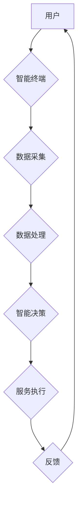

> 智能养老、老年机器人、智能辅具、人工智能、机器学习、自然语言处理、计算机视觉、远程医疗、健康监测

## 1. 背景介绍

随着全球人口老龄化进程的加速，养老服务需求日益增长。传统养老模式面临着人力资源短缺、服务质量参差不齐等挑战。智能养老作为一种新兴的养老模式，利用人工智能、物联网等先进技术，为老年人提供更加便捷、安全、舒适的养老服务，已成为未来养老发展的重要趋势。

## 2. 核心概念与联系

智能养老的核心概念包括：

* **老年机器人:** 能够感知环境、理解指令、执行任务的机器人，例如陪伴机器人、护理机器人、助行机器人等。
* **智能辅具:** 利用人工智能技术，能够辅助老年人日常生活、健康管理的智能设备，例如智能家居、智能医疗器械、智能穿戴设备等。
* **人工智能 (AI):**  模拟人类智能的计算机系统，包括机器学习、深度学习、自然语言处理、计算机视觉等技术。

**智能养老系统架构**



## 3. 核心算法原理 & 具体操作步骤

### 3.1  算法原理概述

智能养老系统中，核心算法主要包括：

* **机器学习算法:** 用于训练机器人识别语音、图像、行为等，并根据学习到的知识进行决策和行动。
* **自然语言处理 (NLP) 算法:** 用于理解和处理人类语言，使机器人能够与老年人进行自然流畅的对话。
* **计算机视觉算法:** 用于识别和分析图像和视频，例如识别老年人的情绪、动作、跌倒等。

### 3.2  算法步骤详解

以机器学习算法为例，其训练步骤如下：

1. **数据收集:** 收集大量与养老相关的图像、语音、文本等数据。
2. **数据预处理:** 对收集到的数据进行清洗、格式化、标注等处理，使其适合机器学习算法训练。
3. **模型选择:** 选择合适的机器学习算法模型，例如支持向量机、决策树、神经网络等。
4. **模型训练:** 使用预处理后的数据训练机器学习模型，使其能够学习到养老相关的知识和规律。
5. **模型评估:** 使用测试数据评估模型的性能，并根据评估结果进行模型调优。
6. **模型部署:** 将训练好的模型部署到智能养老系统中，使其能够实时处理用户请求。

### 3.3  算法优缺点

**优点:**

* 能够自动学习和适应环境变化。
* 能够处理大量复杂的数据。
* 能够提供个性化的服务。

**缺点:**

* 需要大量的数据进行训练。
* 训练过程复杂，需要专业的技术人员。
* 模型的准确性依赖于训练数据的质量。

### 3.4  算法应用领域

* **老年人陪伴:** 机器人能够陪伴老年人聊天、玩游戏、阅读等，缓解老年人孤独感。
* **老年人护理:** 机器人能够帮助老年人进行日常护理，例如喂食、穿衣、洗漱等。
* **老年人健康监测:** 智能辅具能够实时监测老年人的血压、血糖、心率等健康指标，并及时提醒医生或家人。
* **老年人安全保障:** 智能家居能够通过传感器监测老年人的活动轨迹，并及时报警，防止老年人意外发生。

## 4. 数学模型和公式 & 详细讲解 & 举例说明

### 4.1  数学模型构建

智能养老系统中，可以使用数学模型来描述老年人的健康状态、生活习惯、需求等。例如，可以使用线性回归模型来预测老年人的跌倒风险，可以使用决策树模型来判断老年人是否需要紧急医疗服务。

### 4.2  公式推导过程

以预测老年人跌倒风险为例，可以使用以下线性回归模型：

$$
Risk = \beta_0 + \beta_1 * Age + \beta_2 * Balance + \beta_3 * Vision
$$

其中：

* Risk: 跌倒风险
* Age: 年龄
* Balance: 平衡能力
* Vision: 视力
* $\beta_0$, $\beta_1$, $\beta_2$, $\beta_3$: 模型参数

通过训练数据，可以求解出模型参数的值。

### 4.3  案例分析与讲解

假设一个 80 岁的老人，其平衡能力为 70 分，视力为 60 分。根据模型，其跌倒风险为：

$$
Risk = \beta_0 + \beta_1 * 80 + \beta_2 * 70 + \beta_3 * 60
$$

如果模型参数已知，则可以计算出该老人的跌倒风险。

## 5. 项目实践：代码实例和详细解释说明

### 5.1  开发环境搭建

智能养老系统开发环境通常包括：

* 操作系统: Linux, Windows, macOS
* 编程语言: Python, C++, Java
* 机器学习框架: TensorFlow, PyTorch, scikit-learn
* 物联网平台: AWS IoT, Azure IoT, Google Cloud IoT

### 5.2  源代码详细实现

以下是一个使用 Python 和 TensorFlow 实现老年人跌倒风险预测模型的代码示例：

```python
import tensorflow as tf

# 定义模型结构
model = tf.keras.models.Sequential([
  tf.keras.layers.Dense(64, activation='relu', input_shape=(3,)),
  tf.keras.layers.Dense(32, activation='relu'),
  tf.keras.layers.Dense(1)
])

# 编译模型
model.compile(optimizer='adam', loss='mse')

# 训练模型
model.fit(X_train, y_train, epochs=10)

# 评估模型
loss = model.evaluate(X_test, y_test)
print('Loss:', loss)

# 预测跌倒风险
prediction = model.predict(X_new)
print('Prediction:', prediction)
```

### 5.3  代码解读与分析

* 代码首先定义了一个简单的深度学习模型，包含三个全连接层。
* 然后，使用 Adam 优化器和均方误差损失函数对模型进行训练。
* 训练完成后，使用测试数据评估模型的性能。
* 最后，使用新的数据预测跌倒风险。

### 5.4  运行结果展示

训练完成后，模型的损失值和预测结果将显示在控制台。

## 6. 实际应用场景

### 6.1  智能陪伴机器人

智能陪伴机器人能够与老年人进行对话、聊天、玩游戏，缓解老年人孤独感，提高生活质量。例如，一些机器人能够识别老年人的情绪，并根据情绪进行相应的陪伴和互动。

### 6.2  智能护理机器人

智能护理机器人能够帮助老年人进行日常护理，例如喂食、穿衣、洗漱等。例如，一些机器人能够识别老年人的身体状态，并根据需要提供相应的护理服务。

### 6.3  智能健康监测系统

智能健康监测系统能够实时监测老年人的健康指标，例如血压、血糖、心率等，并及时提醒医生或家人。例如，一些智能手表能够监测老年人的睡眠质量，并提供相应的建议。

### 6.4  未来应用展望

未来，智能养老将更加智能化、个性化、便捷化。例如，将更加广泛地应用人工智能、物联网、云计算等技术，实现更加精准的健康监测、更加智能的护理服务、更加丰富的陪伴服务。

## 7. 工具和资源推荐

### 7.1  学习资源推荐

* **在线课程:** Coursera, edX, Udacity
* **书籍:** 《深度学习》、《机器学习》、《人工智能》
* **网站:** TensorFlow 官网, PyTorch 官网, OpenAI

### 7.2  开发工具推荐

* **编程语言:** Python, C++, Java
* **机器学习框架:** TensorFlow, PyTorch, scikit-learn
* **物联网平台:** AWS IoT, Azure IoT, Google Cloud IoT

### 7.3  相关论文推荐

* **ACL:** Association for Computational Linguistics
* **ICML:** International Conference on Machine Learning
* **NeurIPS:** Neural Information Processing Systems

## 8. 总结：未来发展趋势与挑战

### 8.1  研究成果总结

智能养老技术取得了显著进展，例如，机器人技术、自然语言处理技术、计算机视觉技术等都取得了突破性进展。

### 8.2  未来发展趋势

* **更加智能化:** 利用更先进的人工智能技术，使智能养老系统更加智能化、自主化。
* **更加个性化:** 根据老年人的个性化需求，提供更加定制化的服务。
* **更加便捷化:** 通过智能家居、智能穿戴设备等，使老年人更加便捷地享受养老服务。

### 8.3  面临的挑战

* **技术挑战:** 如何开发更加安全、可靠、智能的养老机器人和智能辅具。
* **伦理挑战:** 如何保障老年人的隐私、安全和尊严。
* **社会挑战:** 如何普及智能养老技术，让更多老年人能够享受到智能养老服务。

### 8.4  研究展望

未来，智能养老将继续是一个重要的研究方向，需要多学科交叉融合，共同推动智能养老技术的发展，为老年人提供更加美好的生活。

## 9. 附录：常见问题与解答

### 9.1  智能养老机器人是否会取代人类护理人员？

智能养老机器人可以辅助人类护理人员，减轻他们的工作负担，但不会完全取代人类护理人员。人类护理人员仍然需要提供情感支持、陪伴服务等，这些是机器人无法替代的。

### 9.2  智能养老系统是否会泄露老年人的隐私？

智能养老系统的设计需要充分考虑隐私保护问题。数据加密、匿名化处理等技术可以有效保护老年人的隐私。

### 9.3  智能养老系统是否适合所有老年人？

智能养老系统可以为大多数老年人提供帮助，但对于一些身体状况较差、认知能力较弱的老年人，可能需要进行个性化的配置和调整。


作者：禅与计算机程序设计艺术 / Zen and the Art of Computer Programming 
<end_of_turn>