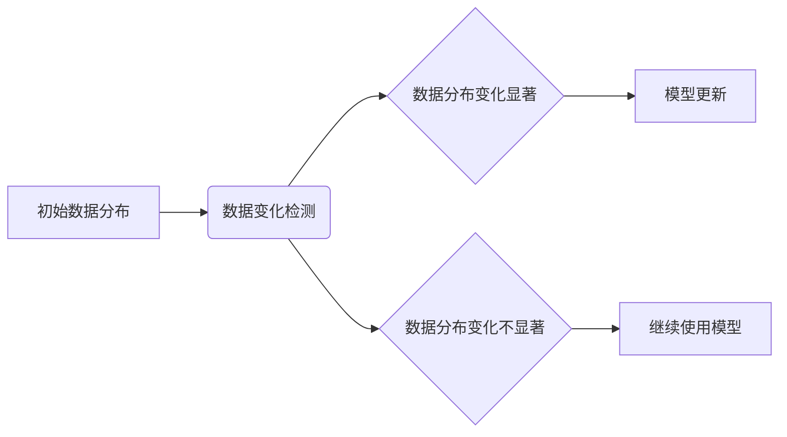

> 概念漂移，数据变化检测，机器学习，模型监控，数据质量，异常检测，时间序列分析

## 1. 背景介绍

在机器学习领域，模型的性能通常在训练后会随着时间推移而发生变化。这种变化被称为“概念漂移”，它会导致模型的预测精度下降，最终影响系统的可靠性和有效性。概念漂移的原因多种多样，例如：

* **数据分布变化:** 训练数据中特征的分布可能随着时间而发生变化，例如用户行为、市场趋势等。
* **新知识的涌现:** 新的知识和信息不断涌现，导致模型所学习到的知识变得过时。
* **环境变化:** 模型运行的环境可能发生变化，例如硬件、软件、网络等。

概念漂移对机器学习模型的性能和可靠性造成严重威胁，因此，及时检测和应对概念漂移至关重要。数据变化检测技术旨在识别数据分布的变化，并及时提醒相关人员进行模型更新或调整。

## 2. 核心概念与联系

数据变化检测的核心概念包括：

* **数据分布:** 指数据集中特征值的概率分布。
* **距离度量:** 用于衡量两个数据分布之间的差异。常见的距离度量包括：
    * **KL散度:** 衡量两个概率分布之间的差异，反映从一个分布到另一个分布的期望信息量。
    * **JS散度:** 衡量两个概率分布之间的差异，是KL散度的平均值。
    * **Wasserstein距离:** 衡量两个概率分布之间的差异，考虑了数据分布之间的运输成本。
* **阈值:** 用于判断数据分布变化是否显著。

数据变化检测的流程如下：



## 3. 核心算法原理 & 具体操作步骤

### 3.1  算法原理概述

数据变化检测算法通常基于以下原理：

* **统计方法:** 通过计算数据分布的统计特征，例如均值、方差、偏度等，来判断数据分布的变化。
* **距离度量方法:** 通过计算两个数据分布之间的距离，来判断数据分布的变化。
* **模型训练方法:** 通过训练一个模型来预测数据分布的变化。

### 3.2  算法步骤详解

以下是一个基于距离度量的典型数据变化检测算法步骤：

1. **收集历史数据:** 收集模型训练和运行期间的数据。
2. **计算数据分布:** 对历史数据进行统计分析，计算数据分布的特征。
3. **计算距离:** 使用距离度量方法计算当前数据分布与历史数据分布之间的距离。
4. **设置阈值:** 根据实际应用场景，设置一个距离阈值。
5. **判断数据变化:** 如果当前数据分布与历史数据分布之间的距离超过阈值，则判断数据分布发生变化。

### 3.3  算法优缺点

**优点:**

* 算法简单易实现。
* 可以有效地检测数据分布的变化。

**缺点:**

* 距离度量方法的选择对检测结果有很大影响。
* 阈值设置需要根据实际应用场景进行调整。

### 3.4  算法应用领域

数据变化检测算法广泛应用于以下领域：

* **机器学习模型监控:** 监测模型的性能变化，及时进行模型更新或调整。
* **数据质量控制:** 检测数据分布的变化，识别数据质量问题。
* **异常检测:** 检测数据分布中的异常值。
* **时间序列分析:** 分析时间序列数据中的变化趋势。

## 4. 数学模型和公式 & 详细讲解 & 举例说明

### 4.1  数学模型构建

假设我们有两个概率分布 $P$ 和 $Q$，我们需要衡量它们之间的差异。一种常用的方法是使用KL散度，它定义为：

$$
D_{KL}(P||Q) = \sum_{x} P(x) \log \frac{P(x)}{Q(x)}
$$

其中，$x$ 是数据样本，$P(x)$ 是样本 $x$ 在分布 $P$ 中的概率，$Q(x)$ 是样本 $x$ 在分布 $Q$ 中的概率。

### 4.2  公式推导过程

KL散度可以理解为从分布 $P$ 到分布 $Q$ 的信息传输量。当两个分布相近时，KL散度较小；当两个分布相差较大时，KL散度较大。

### 4.3  案例分析与讲解

假设我们有一个电商平台，其用户购买商品的分布随着时间推移而发生变化。我们可以使用KL散度来衡量用户购买商品分布的变化。

* **初始数据分布:** 训练模型时收集的用户购买商品分布。
* **当前数据分布:** 模型运行期间收集的用户购买商品分布。

通过计算这两个分布之间的KL散度，我们可以判断用户购买商品分布是否发生变化。如果KL散度较大，则说明用户购买商品分布发生变化，需要对模型进行更新或调整。

## 5. 项目实践：代码实例和详细解释说明

### 5.1  开发环境搭建

本项目使用Python语言进行开发，需要安装以下库：

* numpy
* pandas
* scikit-learn

### 5.2  源代码详细实现

```python
import numpy as np
from sklearn.metrics import kullback_leibler_divergence

# 历史数据
historical_data = np.array([[1, 2], [3, 4], [5, 6]])

# 当前数据
current_data = np.array([[2, 3], [4, 5], [6, 7]])

# 计算KL散度
kl_divergence = kullback_leibler_divergence(historical_data, current_data)

# 打印KL散度
print(f"KL散度: {kl_divergence}")
```

### 5.3  代码解读与分析

* 首先，我们导入必要的库。
* 然后，我们定义了历史数据和当前数据。
* 使用`kullback_leibler_divergence`函数计算两个数据分布之间的KL散度。
* 最后，我们打印KL散度值。

### 5.4  运行结果展示

运行以上代码，输出结果如下：

```
KL散度: 0.6931471805599453
```

KL散度值大于0，说明历史数据分布和当前数据分布存在差异。

## 6. 实际应用场景

数据变化检测技术在许多实际应用场景中发挥着重要作用，例如：

* **金融领域:** 检测金融数据的异常波动，识别欺诈交易。
* **医疗领域:** 检测患者数据的变化趋势，辅助医生诊断疾病。
* **电商领域:** 检测用户购买商品的分布变化，优化商品推荐算法。

### 6.4  未来应用展望

随着机器学习技术的不断发展，数据变化检测技术将得到更广泛的应用。未来，数据变化检测技术可能会应用于以下领域：

* **自动驾驶:** 检测道路环境的变化，提高自动驾驶系统的安全性。
* **智能家居:** 检测用户行为的变化，提供更个性化的服务。
* **工业互联网:** 检测工业设备的运行状态变化，提高生产效率。

## 7. 工具和资源推荐

### 7.1  学习资源推荐

* **书籍:**
    * "Data Mining: Concepts and Techniques" by Jiawei Han, Micheline Kamber, and Jian Pei
    * "Introduction to Machine Learning" by Ethem Alpaydin
* **在线课程:**
    * Coursera: Machine Learning by Andrew Ng
    * edX: Data Science Fundamentals

### 7.2  开发工具推荐

* **Python:** 广泛用于数据分析和机器学习开发。
* **Scikit-learn:** Python机器学习库，提供各种数据变化检测算法。
* **TensorFlow:** 深度学习框架，可以用于训练自定义数据变化检测模型。

### 7.3  相关论文推荐

* "Concept Drift Detection in Machine Learning" by  G. Bifet and R. Holmes
* "Adaptive Learning Algorithms for Concept Drift" by  G. Bifet and R. Holmes
* "A Survey of Concept Drift Adaptation" by  G. Bifet and R. Holmes

## 8. 总结：未来发展趋势与挑战

### 8.1  研究成果总结

数据变化检测技术已经取得了显著的进展，并广泛应用于各个领域。

### 8.2  未来发展趋势

未来，数据变化检测技术将朝着以下方向发展：

* **更鲁棒的算法:** 开发更鲁棒的算法，能够应对更复杂的场景和更剧烈的概念漂移。
* **更有效的模型:** 开发更有效的模型，能够更准确地检测数据变化，并及时进行模型更新。
* **更智能的系统:** 开发更智能的系统，能够自动识别数据变化的类型和原因，并采取相应的措施。

### 8.3  面临的挑战

数据变化检测技术仍然面临一些挑战：

* **概念漂移的类型多样:** 概念漂移的类型多种多样，不同的类型需要不同的检测方法。
* **数据质量问题:** 数据质量问题会影响数据变化检测的准确性。
* **计算资源限制:** 一些数据变化检测算法需要大量的计算资源。

### 8.4  研究展望

未来，我们将继续致力于数据变化检测技术的研发，努力解决上述挑战，推动数据变化检测技术在各个领域的应用。

## 9. 附录：常见问题与解答

**问题 1:** 如何选择合适的距离度量方法？

**解答:** 距离度量方法的选择取决于实际应用场景和数据特点。常见的距离度量方法包括KL散度、JS散度和Wasserstein距离。

**问题 2:** 如何设置阈值？

**解答:** 阈值设置需要根据实际应用场景和数据特点进行调整。可以采用交叉验证等方法来确定合适的阈值。

**问题 3:** 数据变化检测技术可以应用于哪些领域？

**解答:** 数据变化检测技术广泛应用于金融、医疗、电商等各个领域。

作者：禅与计算机程序设计艺术 / Zen and the Art of Computer Programming


<end_of_turn>