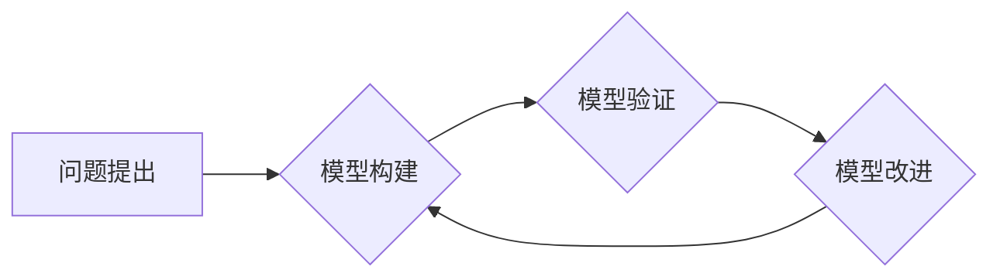

> 模型思维，知识掌握，学习方法，抽象思维，系统思考，问题解决，人工智能

## 1. 背景介绍

在当今信息爆炸的时代，我们每天都面临着海量的知识和信息。如何快速高效地掌握新知识，并将其应用于实际问题，成为了一个重要的挑战。传统的学习方法往往是碎片化、被动式的，难以帮助我们建立完整的知识体系，并进行深入的理解和应用。

模型思维是一种全新的学习方法，它强调通过构建模型来理解和掌握知识。模型思维的核心思想是将复杂的事物抽象成简单的模型，以便于我们进行分析、思考和预测。通过构建模型，我们可以更深入地理解事物之间的关系，并找到解决问题的关键。

## 2. 核心概念与联系

**2.1 模型思维的核心概念**

* **模型:** 模型是一种简化复杂事物的抽象表示，它可以是图形、文字、数学公式、代码等形式。模型的目的是为了更好地理解和解释事物，而不是为了完全复制现实世界。
* **抽象:** 抽象思维是模型思维的基础，它指的是将事物中的本质特征提取出来，并忽略不重要的细节。通过抽象，我们可以将复杂的事物简化成更容易理解的模型。
* **系统思考:** 系统思考强调事物之间的相互联系和整体性，它认为任何事物都是一个复杂的系统，其行为是由多个相互作用的要素共同决定的。模型思维可以帮助我们构建系统的模型，并理解系统之间的相互作用。

**2.2 模型思维与其他学习方法的联系**

模型思维与其他学习方法，例如批判性思维、创造性思维、问题解决思维等，有着密切的联系。

* **批判性思维:** 模型思维可以帮助我们批判性地分析信息，识别模型的局限性，并提出改进方案。
* **创造性思维:** 模型思维可以激发我们的创造力，帮助我们从不同的角度思考问题，并提出新的解决方案。
* **问题解决思维:** 模型思维可以帮助我们系统地分析问题，构建解决方案模型，并评估解决方案的有效性。

**2.3 模型思维的流程图**



## 3. 核心算法原理 & 具体操作步骤

**3.1 算法原理概述**

模型思维的核心算法是构建模型的过程。这个过程可以分为以下几个步骤：

1. **问题定义:** 明确要解决的问题是什么。
2. **信息收集:** 收集与问题相关的各种信息。
3. **模型构建:** 根据收集的信息，构建一个简化的模型来表示问题。
4. **模型验证:** 使用模型进行预测或模拟，并与实际情况进行比较，验证模型的有效性。
5. **模型改进:** 根据验证结果，对模型进行改进，使其更加准确和完善。

**3.2 算法步骤详解**

1. **问题定义:** 

   * 问题定义是模型思维的第一步，也是至关重要的步骤。
   * 需要清晰、准确地描述问题，并明确问题的目标和范围。
   * 例如，如果我们要构建一个模型来预测房价，那么问题就应该是“如何预测某个地区的房价？”，而不是“房价为什么这么贵？”。

2. **信息收集:** 

   * 收集与问题相关的各种信息，包括数据、文本、图片、视频等。
   * 信息收集的质量直接影响模型的准确性。
   * 需要从可靠的来源获取信息，并进行必要的筛选和整理。

3. **模型构建:** 

   * 根据收集的信息，构建一个简化的模型来表示问题。
   * 模型可以是图形、文字、数学公式、代码等形式。
   * 模型的构建需要根据问题的特点和信息的特点进行选择。

4. **模型验证:** 

   * 使用模型进行预测或模拟，并与实际情况进行比较，验证模型的有效性。
   * 模型验证可以采用多种方法，例如交叉验证、留一法等。
   * 模型验证的结果可以帮助我们判断模型的准确性和可靠性。

5. **模型改进:** 

   * 根据验证结果，对模型进行改进，使其更加准确和完善。
   * 模型改进可以包括调整模型参数、增加模型特征、修改模型结构等。
   * 模型改进是一个迭代的过程，需要不断地验证和改进。

**3.3 算法优缺点**

**优点:**

* 可以帮助我们快速理解和掌握新知识。
* 可以帮助我们解决复杂问题。
* 可以激发我们的创造力。

**缺点:**

* 模型的构建需要一定的经验和技巧。
* 模型的准确性取决于信息的质量和模型的复杂度。
* 模型思维不能解决所有问题。

**3.4 算法应用领域**

模型思维在各个领域都有广泛的应用，例如：

* **科学研究:** 模型思维可以帮助科学家构建科学模型，进行实验模拟和理论推导。
* **工程设计:** 模型思维可以帮助工程师设计和优化工程系统。
* **商业决策:** 模型思维可以帮助企业进行市场分析、风险评估和战略规划。
* **教育教学:** 模型思维可以帮助学生理解和掌握知识，提高学习效率。

## 4. 数学模型和公式 & 详细讲解 & 举例说明

**4.1 数学模型构建**

数学模型是利用数学语言和符号来描述客观事物或现象的一种抽象表示。它可以帮助我们理解事物之间的关系，并进行定量分析和预测。

构建数学模型的关键是选择合适的变量和函数，并根据实际情况建立数学关系。

**4.2 公式推导过程**

公式推导过程是指根据数学原理和逻辑关系，从已知条件出发，推导出未知量的表达式。

公式推导过程需要遵循一定的逻辑规则，例如：

* 逻辑推理: 利用已知条件和数学原理进行逻辑推理，得出新的结论。
* 代数运算: 利用代数运算规则，简化公式表达式。
* 微积分: 利用微积分知识，求解函数的导数、积分等。

**4.3 案例分析与讲解**

**案例:** 假设我们想要构建一个模型来预测房价。我们可以使用以下公式来描述房价与面积、位置等因素之间的关系：

$$
P = aS + bL + c
$$

其中：

* $P$ 表示房价
* $S$ 表示房屋面积
* $L$ 表示房屋位置的优劣程度
* $a$, $b$, $c$ 为模型参数

我们可以通过收集房价和房屋面积、位置等数据的样本，使用最小二乘法等方法来估计模型参数 $a$, $b$, $c$。

然后，我们可以使用这个模型来预测新的房价。

## 5. 项目实践：代码实例和详细解释说明

**5.1 开发环境搭建**

为了实现模型思维的应用，我们需要选择合适的开发环境。

* **编程语言:** Python 是一个非常适合进行模型思维实践的编程语言，因为它拥有丰富的科学计算库和机器学习库。
* **IDE:** PyCharm 是一个功能强大的 Python IDE，可以帮助我们编写、调试和运行代码。
* **数据处理工具:** Pandas 是一个用于数据分析和处理的 Python 库，可以帮助我们处理和分析数据。

**5.2 源代码详细实现**

```python
import pandas as pd
from sklearn.linear_model import LinearRegression

# 加载数据
data = pd.read_csv('house_data.csv')

# 准备数据
X = data[['面积', '位置']]
y = data['房价']

# 创建模型
model = LinearRegression()

# 训练模型
model.fit(X, y)

# 预测房价
new_house = pd.DataFrame({'面积': [100], '位置': [5]})
predicted_price = model.predict(new_house)

# 打印预测结果
print(f'预测房价: {predicted_price[0]}')
```

**5.3 代码解读与分析**

这段代码实现了房价预测模型的构建和应用。

* 首先，我们使用 Pandas 库加载房价数据。
* 然后，我们使用 Scikit-learn 库中的 LinearRegression 类创建线性回归模型。
* 接着，我们使用模型的 fit() 方法训练模型，将数据训练到模型中。
* 最后，我们使用模型的 predict() 方法预测新的房价。

**5.4 运行结果展示**

运行这段代码后，会输出预测的房价。

## 6. 实际应用场景

模型思维在各个领域都有广泛的应用，例如：

* **科学研究:** 模型思维可以帮助科学家构建科学模型，进行实验模拟和理论推导。
* **工程设计:** 模型思维可以帮助工程师设计和优化工程系统。
* **商业决策:** 模型思维可以帮助企业进行市场分析、风险评估和战略规划。
* **教育教学:** 模型思维可以帮助学生理解和掌握知识，提高学习效率。

**6.4 未来应用展望**

随着人工智能技术的不断发展，模型思维的应用场景将会更加广泛。

* **个性化学习:** 模型思维可以帮助我们构建个性化的学习模型，根据学生的学习特点和需求提供定制化的学习方案。
* **智能决策:** 模型思维可以帮助我们构建智能决策模型，根据数据分析和预测结果，做出更加科学和合理的决策。
* **自动驾驶:** 模型思维可以帮助我们构建自动驾驶模型，模拟驾驶场景，并进行路径规划和决策控制。

## 7. 工具和资源推荐

**7.1 学习资源推荐**

* **书籍:**
    * 《模型思维》
    * 《思考，快与慢》
    * 《复杂》
* **在线课程:**
    * Coursera: 
    * edX: 
    * Udacity: 

**7.2 开发工具推荐**

* **编程语言:** Python
* **IDE:** PyCharm
* **数据处理工具:** Pandas
* **机器学习库:** Scikit-learn

**7.3 相关论文推荐**

* **《模型思维》**
* **《复杂系统》**
* **《人工智能》**

## 8. 总结：未来发展趋势与挑战

**8.1 研究成果总结**

模型思维是一种全新的学习方法，它可以帮助我们快速理解和掌握新知识，并解决复杂问题。

**8.2 未来发展趋势**

随着人工智能技术的不断发展，模型思维的应用场景将会更加广泛。

* **个性化学习:** 模型思维可以帮助我们构建个性化的学习模型，根据学生的学习特点和需求提供定制化的学习方案。
* **智能决策:** 模型思维可以帮助我们构建智能决策模型，根据数据分析和预测结果，做出更加科学和合理的决策。
* **自动驾驶:** 模型思维可以帮助我们构建自动驾驶模型，模拟驾驶场景，并进行路径规划和决策控制。

**8.3 面临的挑战**

模型思维的应用也面临着一些挑战，例如：

* **模型的构建需要一定的经验和技巧。**
* **模型的准确性取决于信息的质量和模型的复杂度。**
* **模型思维不能解决所有问题。**

**8.4 研究展望**

未来，我们需要继续研究和完善模型思维的方法，使其更加高效、准确和易于应用。

## 9. 附录：常见问题与解答

**常见问题:**

* 如何构建一个好的模型？
* 如何评估模型的准确性？
* 如何改进模型的性能？

**解答:**

* 构建一个好的模型需要根据实际情况选择合适的变量和函数，并进行合理的假设和简化。
* 模型的准确性可以通过验证集的预测结果来评估。
* 可以通过调整模型参数、增加模型特征、修改模型结构等方法来改进模型的性能。


作者：禅与计算机程序设计艺术 / Zen and the Art of Computer Programming 
<end_of_turn>