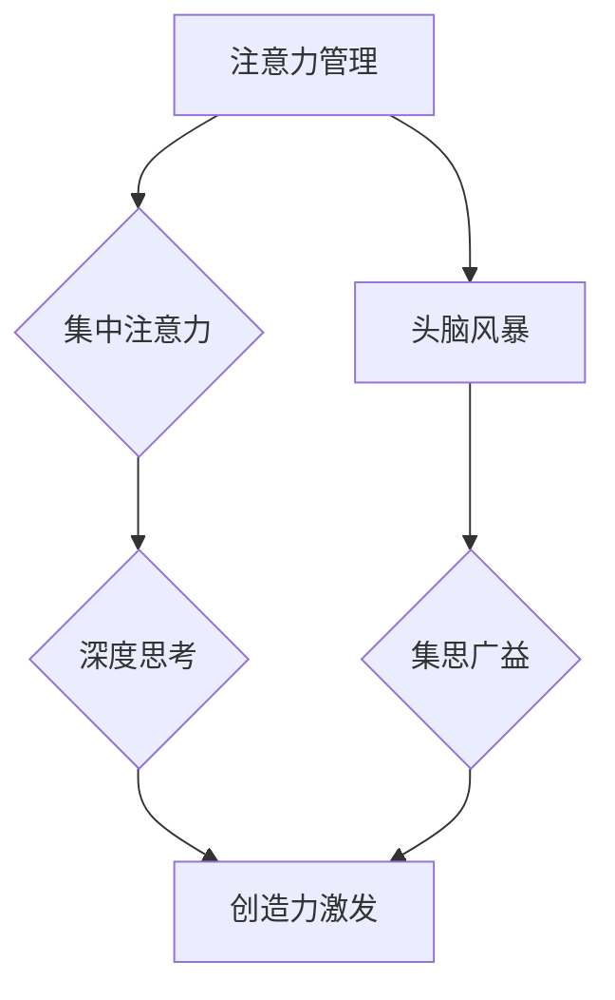

>  注意力管理, 创造力, 专注, 头脑风暴, 算法, 数学模型, 项目实践, 应用场景

## 1. 背景介绍

在当今信息爆炸的时代，我们面临着前所未有的信息冲击。来自邮件、社交媒体、新闻推送的各种信息不断涌入，使得我们的注意力难以集中，难以保持深度思考。同时，创造力是推动社会进步和个人成长的关键驱动力，然而，在纷繁复杂的现实环境中，激发和提升创造力也变得越来越困难。

注意力管理与创造力激发是当下许多人面临的共同挑战。如何有效地管理注意力，集中精力进行深度思考，如何激发创造力，产生新的想法和解决方案，成为了人们亟需解决的问题。

## 2. 核心概念与联系

**2.1 注意力管理**

注意力管理是指通过各种方法和技巧，控制和引导自己的注意力，使其集中在需要关注的事情上，避免被无关信息干扰。

**2.2 创造力**

创造力是指能够产生新颖、独特、有价值的思想、概念或作品的能力。

**2.3 专注与头脑风暴**

专注是注意力管理的一种重要表现形式，是指将注意力集中在一个特定任务或目标上，排除其他干扰。头脑风暴是一种集思广益的创造性思维方法，通过自由地表达想法，激发新的创意。

**2.4 核心概念联系**

注意力管理是创造力激发的基础。只有集中注意力，才能深入思考，产生新的想法。头脑风暴是一种有效的激发创造力的方法，而注意力管理可以帮助我们更好地进行头脑风暴，避免思维混乱，提高效率。



## 3. 核心算法原理 & 具体操作步骤

### 3.1 算法原理概述

注意力管理算法通常基于以下原理：

* **认知心理学:** 理解人类认知过程，例如注意力机制、记忆机制等。
* **神经科学:** 研究大脑神经网络的运作机制，例如注意力网络、记忆网络等。
* **机器学习:** 利用机器学习算法，分析用户行为数据，预测用户注意力分布，并提供个性化的注意力管理建议。

### 3.2 算法步骤详解

1. **数据收集:** 收集用户行为数据，例如浏览记录、点击记录、阅读时间等。
2. **数据预处理:** 对收集到的数据进行清洗、转换、特征提取等操作。
3. **模型训练:** 利用机器学习算法，训练注意力管理模型，例如深度神经网络、强化学习等。
4. **模型预测:** 将训练好的模型应用于新的用户数据，预测用户的注意力分布。
5. **个性化建议:** 根据预测结果，为用户提供个性化的注意力管理建议，例如提醒用户休息、屏蔽干扰信息等。

### 3.3 算法优缺点

**优点:**

* **个性化:** 可以根据用户的具体情况提供个性化的建议。
* **数据驱动:** 基于数据分析，更加科学、客观。
* **可迭代:** 可以不断根据用户反馈进行模型优化。

**缺点:**

* **数据依赖:** 需要大量的用户行为数据进行训练。
* **隐私问题:** 需要收集和处理用户的个人信息，需要妥善保护用户隐私。
* **算法复杂:** 需要专业的技术人员进行开发和维护。

### 3.4 算法应用领域

* **教育:** 帮助学生集中注意力，提高学习效率。
* **办公:** 帮助员工提高工作效率，减少信息干扰。
* **娱乐:** 帮助用户更好地享受娱乐体验，避免过度沉迷。
* **医疗:** 帮助患者集中注意力，进行康复训练。

## 4. 数学模型和公式 & 详细讲解 & 举例说明

### 4.1 数学模型构建

注意力机制可以看作是一个加权求和的过程，其中每个元素的权重代表其重要程度。

假设我们有一个输入序列 $x = (x_1, x_2, ..., x_n)$，我们想要学习一个注意力权重向量 $a = (a_1, a_2, ..., a_n)$，来对输入序列进行加权求和。

我们可以使用以下公式来计算注意力权重：

$$a_i = \frac{exp(e_i)}{\sum_{j=1}^{n} exp(e_j)}$$

其中，$e_i$ 是每个元素 $x_i$ 的注意力得分，可以由以下公式计算：

$$e_i = f(x_i, h)$$

其中，$f$ 是一个注意力函数，$h$ 是一个隐藏状态向量。

### 4.2 公式推导过程

注意力权重计算公式的推导过程如下：

1. 首先，我们需要计算每个元素的注意力得分。我们可以使用一个神经网络来计算注意力得分，例如一个多层感知机 (MLP)。
2. 然后，我们需要将注意力得分转换为注意力权重。我们可以使用 softmax 函数将注意力得分转换为概率分布，其中每个元素的概率代表其重要程度。

### 4.3 案例分析与讲解

例如，在机器翻译任务中，我们可以使用注意力机制来帮助模型关注输入句子中与输出句子相关的词语。

假设我们有一个输入句子 "The cat sat on the mat"，一个输出句子 "Le chat s'est assis sur le tapis"。

我们可以使用注意力机制来计算每个词语在输入句子中与输出句子相关的程度。

例如，"cat" 和 "chat" 相关性较高，"sat" 和 "s'est assis" 相关性较高，因此它们的注意力权重会较高。

## 5. 项目实践：代码实例和详细解释说明

### 5.1 开发环境搭建

* Python 3.x
* TensorFlow 或 PyTorch
* Jupyter Notebook

### 5.2 源代码详细实现

```python
import tensorflow as tf

# 定义注意力机制模型
class Attention(tf.keras.layers.Layer):
    def __init__(self, units):
        super(Attention, self).__init__()
        self.W1 = tf.keras.layers.Dense(units)
        self.W2 = tf.keras.layers.Dense(units)
        self.V = tf.keras.layers.Dense(1)

    def call(self, inputs):
        # inputs: (batch_size, seq_len, units)
        h = self.W1(inputs)
        a = tf.nn.tanh(self.W2(inputs) + h)
        scores = self.V(a)
        attention_weights = tf.nn.softmax(scores, axis=1)
        context_vector = tf.matmul(attention_weights, inputs)
        return context_vector, attention_weights

# 使用注意力机制
model = tf.keras.Sequential([
    tf.keras.layers.Embedding(vocab_size, embedding_dim),
    Attention(units=128),
    tf.keras.layers.Dense(vocab_size, activation='softmax')
])

# 训练模型
model.compile(optimizer='adam', loss='sparse_categorical_crossentropy', metrics=['accuracy'])
model.fit(x_train, y_train, epochs=10)
```

### 5.3 代码解读与分析

* `Attention` 类定义了一个注意力机制层，包含三个稠密层：`W1`、`W2` 和 `V`。
* `call` 方法计算注意力权重和上下文向量。
* `tf.nn.softmax` 函数将注意力得分转换为概率分布。
* `tf.matmul` 函数计算上下文向量。
* `tf.keras.Sequential` 创建一个顺序模型，包含嵌入层、注意力机制层和输出层。
* `model.compile` 配置模型的训练参数。
* `model.fit` 训练模型。

### 5.4 运行结果展示

训练完成后，我们可以使用模型进行预测，例如预测下一个词语。

## 6. 实际应用场景

### 6.1 教育领域

* **个性化学习:** 根据学生的学习进度和理解能力，提供个性化的学习内容和练习。
* **注意力训练:** 通过游戏化和互动的方式，帮助学生提高注意力集中能力。
* **智能辅导:** 利用人工智能技术，为学生提供个性化的学习辅导和答疑服务。

### 6.2 办公领域

* **信息过滤:** 自动过滤无关信息，帮助员工集中精力处理重要任务。
* **协同办公:** 通过注意力机制，帮助团队成员更好地协同工作，提高工作效率。
* **知识管理:** 利用注意力机制，帮助员工更好地记忆和理解知识，提高知识利用率。

### 6.3 娱乐领域

* **沉浸式体验:** 通过注意力机制，增强用户对游戏、电影等娱乐内容的沉浸感。
* **个性化推荐:** 根据用户的注意力偏好，推荐更符合用户兴趣的娱乐内容。
* **互动式体验:** 通过注意力机制，增强用户与娱乐内容的互动性。

### 6.4 未来应用展望

随着人工智能技术的不断发展，注意力管理与创造力激发将应用于更多领域，例如医疗、金融、艺术等。

## 7. 工具和资源推荐

### 7.1 学习资源推荐

* **书籍:**
    * 《深度学习》
    * 《注意力机制》
    * 《机器学习》
* **在线课程:**
    * Coursera
    * edX
    * Udacity

### 7.2 开发工具推荐

* **TensorFlow:** 开源深度学习框架
* **PyTorch:** 开源深度学习框架
* **Jupyter Notebook:** 交互式编程环境

### 7.3 相关论文推荐

* **Attention Is All You Need**
* **BERT: Pre-training of Deep Bidirectional Transformers for Language Understanding**
* **Transformer-XL: Attentive Language Models Beyond a Fixed-Length Context**

## 8. 总结：未来发展趋势与挑战

### 8.1 研究成果总结

注意力管理与创造力激发研究取得了显著进展，例如注意力机制的提出和应用，以及基于深度学习的注意力管理模型的开发。

### 8.2 未来发展趋势

* **更精准的注意力管理:** 利用更先进的算法和技术，实现更精准的注意力管理，例如针对不同类型任务和个体差异的个性化注意力管理。
* **更有效的创造力激发:** 开发更有效的创造力激发方法，例如结合注意力机制和头脑风暴等技术，提高创意的产生和转化率。
* **跨领域应用:** 将注意力管理与创造力激发技术应用于更多领域，例如医疗、教育、金融等。

### 8.3 面临的挑战

* **数据隐私:** 注意力管理算法需要收集和处理用户的个人信息，需要妥善保护用户隐私。
* **算法解释性:** 深度学习模型的解释性较差，难以理解模型的决策过程，这可能会影响用户对模型的信任。
* **伦理问题:** 注意力管理技术可能会被滥用，例如用于控制用户的行为或思想，需要认真考虑其伦理问题。

### 8.4 研究展望

未来，注意力管理与创造力激发研究将继续深入，探索更先进的算法、技术和应用场景，为人类社会带来更多福祉。

## 9. 附录：常见问题与解答

**Q1: 注意力管理与创造力激发有什么区别？**

**A1:** 注意力管理是指控制和引导自己的注意力，集中精力进行深度思考，而创造力激发是指产生新颖、独特、有价值的思想、概念或作品的能力。两者相互关联，注意力管理是创造力激发的基础。

**Q2: 如何提高注意力集中能力？**

**A2:** 可以通过以下方法提高注意力集中能力：

* **冥想:** 练习冥想可以帮助你训练专注力。
* **番茄工作法:** 将工作时间分成25分钟的间隔，中间休息5分钟，可以帮助你保持专注。
* **避免干扰:** 在工作或学习时，尽量避免外界干扰，例如关闭手机、关闭社交媒体等。

**Q3