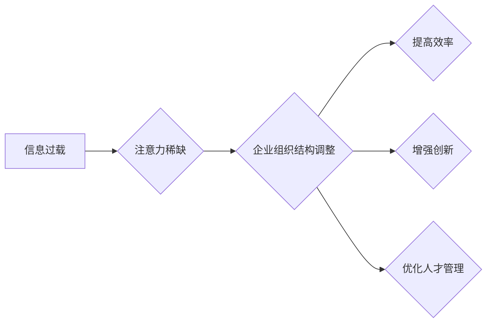

>  注意力经济、组织结构、企业效率、信息茧房、深度学习、认知科学

## 1. 背景介绍

在当今信息爆炸的时代，人们面临着前所未有的信息过载。注意力，作为人类认知的核心资源，变得越来越稀缺。这种“注意力经济”的到来，深刻地改变了人们获取信息、处理信息和做出决策的方式，也对企业组织结构提出了新的挑战和机遇。

传统企业组织结构往往以功能部门、产品线或地理区域为划分，强调垂直管理和层级结构。然而，在注意力经济时代，信息流动更加快速，跨部门协作和创新变得更加重要。传统的组织结构模式难以适应这种变化，企业需要重新思考组织结构的设计，以更好地应对注意力经济带来的挑战。

## 2. 核心概念与联系

**2.1 注意力经济**

注意力经济是指在信息过载的时代，注意力成为一种稀缺资源，并被商业化和货币化的经济现象。

**2.2 组织结构**

组织结构是指企业内部人员、部门、职能和资源的分配和协调方式，它决定了企业内部的信息流动、决策流程和工作效率。

**2.3 联系**

注意力经济对企业组织结构的影响主要体现在以下几个方面：

* **信息获取和处理:**  注意力经济使得信息获取更加碎片化和分散，企业需要更加高效地筛选和处理信息，才能做出正确的决策。
* **跨部门协作:**  注意力经济促进了跨部门协作和创新，企业需要打破部门壁垒，建立更加灵活和高效的协作机制。
* **人才管理:**  注意力经济对人才的需求发生了变化，企业需要更加注重人才的注意力能力、学习能力和适应能力。

**2.4  Mermaid 流程图**



## 3. 核心算法原理 & 具体操作步骤

**3.1 算法原理概述**

注意力机制是一种模仿人类注意力机制的算法，它能够帮助模型聚焦于输入数据中最重要的部分，从而提高模型的性能。

**3.2 算法步骤详解**

1. **计算注意力权重:**  注意力机制首先会计算每个输入数据元素的注意力权重，权重表示该元素对模型输出的重要性。
2. **加权求和:**  然后，模型会根据注意力权重对输入数据进行加权求和，得到一个新的表示。
3. **输出:**  最后，模型会使用这个新的表示进行预测或分类。

**3.3 算法优缺点**

**优点:**

* 能够提高模型的性能，尤其是在处理长序列数据时。
* 可以帮助模型理解输入数据的语义关系。
* 可以解释模型的决策过程。

**缺点:**

* 计算复杂度较高。
* 需要大量的训练数据。

**3.4 算法应用领域**

注意力机制在自然语言处理、计算机视觉、机器翻译等领域都有广泛的应用。

## 4. 数学模型和公式 & 详细讲解 & 举例说明

**4.1 数学模型构建**

注意力机制的数学模型可以表示为：

$$
\text{Attention}(Q, K, V) = \text{softmax}\left(\frac{Q K^T}{\sqrt{d_k}}\right) V
$$

其中：

* $Q$：查询矩阵
* $K$：键矩阵
* $V$：值矩阵
* $d_k$：键向量的维度
* $\text{softmax}$：softmax函数

**4.2 公式推导过程**

公式推导过程可以参考相关文献，例如：

* Vaswani, A., Shazeer, N., Parmar, N., Uszkoreit, J., Jones, L., Gomez, A. N., ... & Polosukhin, I. (2017). Attention is all you need. Advances in neural information processing systems, 30.

**4.3 案例分析与讲解**

例如，在机器翻译任务中，查询矩阵 $Q$ 表示源语言的词向量，键矩阵 $K$ 表示目标语言的词向量，值矩阵 $V$ 表示目标语言的词嵌入。注意力机制可以帮助模型找到源语言和目标语言之间最相关的词对，从而提高翻译质量。

## 5. 项目实践：代码实例和详细解释说明

**5.1 开发环境搭建**

使用 Python 3.x 环境，安装 TensorFlow 或 PyTorch 等深度学习框架。

**5.2 源代码详细实现**

```python
import tensorflow as tf

# 定义注意力机制层
class Attention(tf.keras.layers.Layer):
    def __init__(self, units):
        super(Attention, self).__init__()
        self.Wq = tf.keras.layers.Dense(units)
        self.Wk = tf.keras.layers.Dense(units)
        self.Wv = tf.keras.layers.Dense(units)
        self.fc = tf.keras.layers.Dense(units)

    def call(self, query, key, value, mask=None):
        # 计算注意力权重
        scores = tf.matmul(self.Wq(query), self.Wk(key), transpose_b=True)
        scores /= tf.math.sqrt(tf.cast(self.Wq.output_shape[-1], tf.float32))
        if mask is not None:
            scores += (mask * -1e9)
        attention_weights = tf.nn.softmax(scores, axis=-1)

        # 加权求和
        context_vector = tf.matmul(attention_weights, value)
        output = self.fc(context_vector)
        return output
```

**5.3 代码解读与分析**

该代码实现了一个简单的注意力机制层。

* `Wq`, `Wk`, `Wv`：权重矩阵，用于将查询、键和值向量映射到注意力空间。
* `fc`：全连接层，用于将加权求和后的上下文向量映射到输出空间。
* `call`：该方法接受查询、键、值向量和可选的掩码作为输入，并返回注意力输出。

**5.4 运行结果展示**

运行该代码，可以将注意力机制应用于各种深度学习任务，例如机器翻译、文本摘要等。

## 6. 实际应用场景

**6.1 企业组织结构调整**

注意力经济对企业组织结构的影响主要体现在以下几个方面：

* **扁平化组织:**  打破传统层级结构，建立更加扁平化的组织架构，提高信息流动效率。
* **跨部门协作:**  建立更加灵活的协作机制，打破部门壁垒，促进跨部门创新。
* **远程办公:**  利用远程办公技术，打破地域限制，吸引更多优秀人才。

**6.2 信息筛选与处理**

企业需要利用注意力机制等技术，提高信息筛选和处理效率，避免信息过载。

* **智能信息分类:**  利用机器学习算法，自动分类和标记重要信息。
* **个性化信息推送:**  根据用户的兴趣和需求，推送个性化的信息内容。

**6.3 人才管理与培养**

企业需要关注人才的注意力能力、学习能力和适应能力，并提供相应的培训和发展机会。

* **注意力训练:**  通过游戏、练习等方式，提高员工的注意力集中能力。
* **跨领域学习:**  鼓励员工学习跨领域知识，提升适应能力。

**6.4 未来应用展望**

随着注意力经济的深入发展，企业组织结构将更加灵活、高效和智能化。

* **人工智能驱动的组织结构:**  利用人工智能技术，自动优化组织结构，提高效率和协作能力。
* **个性化组织结构:**  根据员工的个性化需求，定制化组织结构，提高员工满意度和工作效率。

## 7. 工具和资源推荐

**7.1 学习资源推荐**

* **书籍:**
    * 《深度学习》
    * 《Attention Is All You Need》论文
* **在线课程:**
    * Coursera: 深度学习
    * Udacity: 自然语言处理

**7.2 开发工具推荐**

* **TensorFlow:**  开源深度学习框架
* **PyTorch:**  开源深度学习框架
* **Jupyter Notebook:**  交互式编程环境

**7.3 相关论文推荐**

* Vaswani, A., Shazeer, N., Parmar, N., Uszkoreit, J., Jones, L., Gomez, A. N., ... & Polosukhin, I. (2017). Attention is all you need. Advances in neural information processing systems, 30.
* Bahdanau, D., Cho, K., & Bengio, Y. (2014). Neural machine translation by jointly learning to align and translate. arXiv preprint arXiv:1409.0473.

## 8. 总结：未来发展趋势与挑战

**8.1 研究成果总结**

注意力机制在深度学习领域取得了显著的成果，并在自然语言处理、计算机视觉等领域得到了广泛应用。

**8.2 未来发展趋势**

* **更有效的注意力机制:**  研究更有效的注意力机制，提高模型的性能和效率。
* **自适应注意力机制:**  研究自适应注意力机制，能够根据不同的任务和数据自动调整注意力权重。
* **多模态注意力机制:**  研究多模态注意力机制，能够处理多种类型的输入数据，例如文本、图像、音频等。

**8.3 面临的挑战**

* **计算复杂度:**  注意力机制的计算复杂度较高，难以应用于大规模数据处理。
* **可解释性:**  注意力机制的决策过程难以解释，这限制了其在一些领域应用的推广。
* **数据依赖性:**  注意力机制需要大量的训练数据，这在一些领域难以获得。

**8.4 研究展望**

未来，注意力机制的研究将继续深入，并应用于更多领域，例如医疗、金融、教育等。


## 9. 附录：常见问题与解答

**9.1 如何选择合适的注意力机制？**

选择合适的注意力机制取决于具体的应用场景和数据特点。

* **简单注意力机制:**  适用于处理较短序列数据。
* **多头注意力机制:**  能够捕捉到不同层次的语义信息，适用于处理长序列数据。
* **自注意力机制:**  能够处理序列中的任意两个元素之间的关系，适用于处理复杂关系的数据。

**9.2 如何解释注意力机制的输出？**

可以通过可视化注意力权重来解释注意力机制的输出。

* **热力图:**  将注意力权重绘制成热力图，可以直观地看到模型关注哪些部分。
* **注意力图:**  将注意力权重绘制成图，可以直观地看到模型关注哪些元素之间的关系。

**9.3 注意力机制的训练方法是什么？**

注意力机制的训练方法与其他深度学习模型类似，通常使用反向传播算法进行训练。

* **损失函数:**  常用的损失函数包括交叉熵损失函数、均方误差损失函数等。
* **优化器:**  常用的优化器包括梯度下降算法、Adam算法等。


作者：禅与计算机程序设计艺术 / Zen and the Art of Computer Programming 
<end_of_turn>