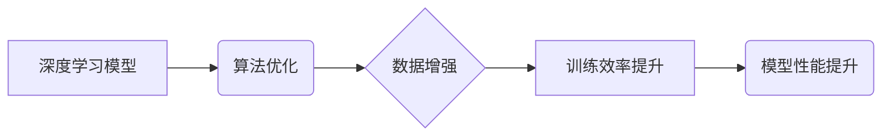

> 深度学习、神经网络、算法优化、模型训练、数据分析、机器学习、人工智能

## 1. 背景介绍

人工智能（AI）正以惊人的速度发展，深刻地改变着我们生活的方方面面。从自动驾驶汽车到智能语音助手，从医疗诊断到金融预测，AI技术的应用日益广泛。然而，在AI的蓬勃发展背后，我们也面临着一些挑战和机遇。

深度学习作为AI领域最前沿的技术之一，在图像识别、自然语言处理、语音识别等领域取得了突破性的进展。然而，深度学习模型的训练过程复杂、耗时且需要海量数据，这限制了其在某些领域应用的推广。

因此，如何提高深度学习模型的训练效率、降低训练成本、并使其能够更好地适应小样本数据场景，成为了当前研究的热点问题。

## 2. 核心概念与联系

### 2.1 深度学习模型

深度学习模型通常由多层神经网络组成，每层神经元之间存在着连接和权重。通过对大量数据的训练，模型能够学习到数据的特征和规律，从而实现对数据的预测和分类。

### 2.2 算法优化

算法优化是指通过调整模型参数，使得模型的性能达到最佳状态的过程。常用的算法优化方法包括梯度下降法、动量法、Adam优化器等。

### 2.3 数据增强

数据增强是指通过对现有数据进行一些变换，例如旋转、缩放、翻转等，生成新的数据样本，从而增加训练数据的规模和多样性。

**核心概念与联系流程图**



## 3. 核心算法原理 & 具体操作步骤

### 3.1 算法原理概述

本文将介绍一种名为**迁移学习**的算法，它可以有效地提高深度学习模型的训练效率和性能。

迁移学习的核心思想是利用预训练模型的知识，迁移到新的任务中。预训练模型通常是在大型数据集上训练的，已经学习到了一些通用的特征和规律。

通过将预训练模型的某些层冻结，并将其他层进行微调，可以快速地训练出新的模型，并达到较好的性能。

### 3.2 算法步骤详解

1. **选择预训练模型:** 选择一个在相关领域已经训练好的预训练模型，例如ImageNet上的ResNet、BERT等。

2. **冻结预训练模型的部分层:** 将预训练模型中的一些层冻结，防止其参数发生改变。通常冻结的是底层的特征提取层，因为这些层已经学习到了一些通用的特征。

3. **添加新的层:** 在预训练模型的基础上添加新的层，这些层用于学习新的任务相关的特征。

4. **微调模型参数:** 对冻结层的参数进行微调，并训练新的层。

5. **评估模型性能:** 在测试集上评估模型的性能，并根据需要进行进一步的调整。

### 3.3 算法优缺点

**优点:**

* 训练效率高: 可以利用预训练模型的知识，减少训练时间和数据量。
* 模型性能好: 预训练模型已经学习到了一些通用的特征，可以提高新模型的性能。
* 可解释性强: 可以通过分析预训练模型的特征提取过程，更好地理解模型的决策机制。

**缺点:**

* 需要选择合适的预训练模型: 预训练模型的选择对最终模型性能有很大影响。
* 迁移学习效果不总是理想: 对于一些任务，迁移学习的效果可能不如从头训练模型好。

### 3.4 算法应用领域

迁移学习在许多领域都有广泛的应用，例如:

* **图像识别:** 将预训练模型迁移到新的图像识别任务中，例如目标检测、图像分类等。
* **自然语言处理:** 将预训练模型迁移到新的自然语言处理任务中，例如文本分类、情感分析等。
* **语音识别:** 将预训练模型迁移到新的语音识别任务中，例如语音转文本、语音命令识别等。

## 4. 数学模型和公式 & 详细讲解 & 举例说明

### 4.1 数学模型构建

迁移学习的数学模型可以表示为：

$$
f(x; \theta) = g(h(x; \phi))
$$

其中：

* $f(x; \theta)$ 是目标任务的模型输出。
* $x$ 是输入数据。
* $\theta$ 是目标任务模型的参数。
* $g(\cdot)$ 是目标任务的分类器或回归器。
* $h(x; \phi)$ 是预训练模型的特征提取结果。
* $\phi$ 是预训练模型的参数。

### 4.2 公式推导过程

迁移学习的目标是学习目标任务的模型参数 $\theta$。由于预训练模型已经学习到了一些通用的特征，我们可以将预训练模型的特征提取结果 $h(x; \phi)$ 作为目标任务模型的输入，并对目标任务模型的参数 $\theta$ 进行微调。

微调过程可以使用梯度下降法等优化算法进行。

### 4.3 案例分析与讲解

假设我们想将预训练的图像分类模型迁移到新的图像识别任务中，例如识别不同种类的鸟类。

我们可以将预训练模型的特征提取层冻结，并在其基础上添加新的分类层，并对新的分类层进行微调。

通过训练新的分类层，模型可以学习到鸟类特有的特征，从而实现对不同种类的鸟类进行识别。

## 5. 项目实践：代码实例和详细解释说明

### 5.1 开发环境搭建

* Python 3.6+
* TensorFlow 2.0+
* PyTorch 1.0+
* CUDA 10.0+

### 5.2 源代码详细实现

```python
# 导入必要的库
import tensorflow as tf

# 加载预训练模型
model = tf.keras.applications.ResNet50(weights='imagenet', include_top=False)

# 冻结预训练模型的层
for layer in model.layers:
    layer.trainable = False

# 添加新的分类层
x = model.output
x = tf.keras.layers.GlobalAveragePooling2D()(x)
x = tf.keras.layers.Dense(1024, activation='relu')(x)
predictions = tf.keras.layers.Dense(num_classes, activation='softmax')(x)

# 创建新的模型
model = tf.keras.Model(inputs=model.input, outputs=predictions)

# 编译模型
model.compile(optimizer='adam',
              loss='categorical_crossentropy',
              metrics=['accuracy'])

# 训练模型
model.fit(train_data, train_labels, epochs=10)

# 评估模型
loss, accuracy = model.evaluate(test_data, test_labels)
print('Test Loss:', loss)
print('Test Accuracy:', accuracy)
```

### 5.3 代码解读与分析

* 代码首先加载预训练的ResNet50模型，并将其冻结。
* 然后，代码添加新的分类层，并将预训练模型的输出作为输入。
* 最后，代码编译模型并进行训练。

### 5.4 运行结果展示

训练完成后，可以评估模型的性能，例如准确率等。

## 6. 实际应用场景

迁移学习在许多实际应用场景中都有着广泛的应用，例如:

* **医疗诊断:** 利用预训练的图像识别模型，对医学影像进行诊断，例如识别肿瘤、骨折等。
* **金融风险评估:** 利用预训练的文本分类模型，对金融文本进行风险评估，例如识别欺诈交易、信用风险等。
* **个性化推荐:** 利用预训练的协同过滤模型，对用户进行个性化推荐，例如推荐商品、电影等。

### 6.4 未来应用展望

随着深度学习技术的不断发展，迁移学习的应用场景将会更加广泛。

例如，可以利用迁移学习技术，对小样本数据进行训练，从而解决深度学习模型对大规模数据的依赖问题。

## 7. 工具和资源推荐

### 7.1 学习资源推荐

* **书籍:**
    * Deep Learning by Ian Goodfellow, Yoshua Bengio, and Aaron Courville
    * Transfer Learning in Neural Networks by Jason Brownlee
* **在线课程:**
    * Coursera: Deep Learning Specialization
    * Udacity: Deep Learning Nanodegree

### 7.2 开发工具推荐

* **TensorFlow:** https://www.tensorflow.org/
* **PyTorch:** https://pytorch.org/
* **Keras:** https://keras.io/

### 7.3 相关论文推荐

* **ImageNet Classification with Deep Convolutional Neural Networks** by Alex Krizhevsky, Ilya Sutskever, and Geoffrey E. Hinton
* **Transfer Learning** by Pan, S. J., & Yang, Q.

## 8. 总结：未来发展趋势与挑战

### 8.1 研究成果总结

迁移学习技术取得了显著的进展，在许多领域取得了成功应用。

### 8.2 未来发展趋势

未来，迁移学习技术将朝着以下几个方向发展:

* **更有效的迁移学习算法:** 研究更有效的迁移学习算法，例如自适应迁移学习、联邦迁移学习等。
* **跨模态迁移学习:** 研究跨模态迁移学习，例如将图像识别模型迁移到语音识别任务中。
* **可解释性迁移学习:** 研究可解释性迁移学习，例如解释迁移学习模型的决策机制。

### 8.3 面临的挑战

迁移学习技术也面临着一些挑战:

* **数据偏差:** 预训练模型和目标任务数据可能存在偏差，导致迁移学习效果不理想。
* **任务相关性:** 预训练模型和目标任务的相关性越高，迁移学习效果越好。
* **计算资源:** 迁移学习训练过程可能需要大量的计算资源。

### 8.4 研究展望

未来，我们将继续致力于研究迁移学习技术，并将其应用于更多领域，以推动人工智能技术的进步。

## 9. 附录：常见问题与解答

**Q1: 迁移学习和微调有什么区别？**

**A1:** 迁移学习是一种更广泛的概念，它包括微调。微调是迁移学习的一种具体方法，即利用预训练模型的知识，对目标任务模型进行微调。

**Q2: 如何选择合适的预训练模型？**

**A2:** 选择预训练模型需要考虑以下因素:

* 预训练模型的领域
* 预训练模型的规模
* 预训练模型的性能

**Q3: 迁移学习的训练效率如何？**

**A3:** 迁移学习的训练效率比从头训练模型高，因为它可以利用预训练模型的知识，减少训练时间和数据量。

作者：禅与计算机程序设计艺术 / Zen and the Art of Computer Programming


<end_of_turn>