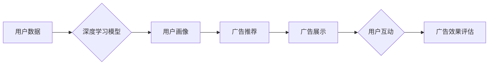

> 深度学习，广告投放，推荐系统，目标识别，自然语言处理，计算机视觉

## 1. 背景介绍

广告投放是数字经济的重要组成部分，其核心目标是将广告精准地展示给目标用户，从而提高广告效果和投资回报率。传统的广告投放方式主要依赖于规则引擎和人工干预，效率低下，难以满足用户个性化需求。随着深度学习技术的快速发展，其强大的学习能力和特征提取能力为广告投放带来了新的机遇。

深度学习在广告投放领域的应用可以概括为以下几个方面：

* **精准用户画像:** 深度学习可以从海量用户数据中学习用户兴趣、行为、偏好等特征，构建更加精准的用户画像，为广告投放提供更细粒度的目标用户群体。
* **个性化广告推荐:** 深度学习可以根据用户的兴趣和行为历史，推荐个性化的广告内容，提高用户点击率和转化率。
* **广告创意优化:** 深度学习可以分析广告创意的视觉和文本特征，优化广告文案和设计，提升广告吸引力。
* **欺诈检测:** 深度学习可以识别广告投放中的欺诈行为，例如虚假点击、恶意刷量等，保障广告投放的真实性和有效性。

## 2. 核心概念与联系

**2.1 广告投放流程**

广告投放流程通常包括以下几个步骤：

1. **广告准备:** 创建广告创意、设置目标受众、确定投放预算等。
2. **广告投放:** 将广告发布到不同的广告平台，例如搜索引擎、社交媒体、网站等。
3. **广告展示:** 用户在浏览网页或使用应用程序时，看到广告。
4. **用户互动:** 用户点击广告、观看视频、分享广告等。
5. **广告效果评估:** 分析广告点击率、转化率、成本等指标，评估广告效果。

**2.2 深度学习在广告投放中的应用**

深度学习可以应用于广告投放流程的各个环节，例如：

* **用户画像构建:** 使用深度学习模型分析用户行为数据、兴趣偏好、社交关系等信息，构建更加精准的用户画像。
* **广告推荐:** 使用深度学习模型分析用户历史行为、兴趣偏好等信息，推荐个性化的广告内容。
* **广告创意优化:** 使用深度学习模型分析广告创意的视觉和文本特征，优化广告文案和设计，提升广告吸引力。
* **欺诈检测:** 使用深度学习模型识别广告投放中的欺诈行为，例如虚假点击、恶意刷量等。

**2.3 深度学习架构**

深度学习模型通常由多个神经网络层组成，每个层负责提取不同层次的特征。常见的深度学习架构包括：

* **卷积神经网络 (CNN):** 用于处理图像数据，擅长提取图像特征。
* **循环神经网络 (RNN):** 用于处理序列数据，例如文本和时间序列数据，擅长捕捉序列中的依赖关系。
* **深度信念网络 (DBN):** 由多个限制玻尔兹曼机 (RBM) 层组成，用于无监督学习和特征提取。

**Mermaid 流程图**



## 3. 核心算法原理 & 具体操作步骤

### 3.1  算法原理概述

深度学习在广告投放中的应用主要依赖于以下几个核心算法：

* **神经网络:** 神经网络是一种模仿人脑神经元结构的算法，能够学习数据中的复杂模式和关系。
* **卷积神经网络 (CNN):** CNN 擅长处理图像数据，可以提取图像特征，例如边缘、纹理、形状等。
* **循环神经网络 (RNN):** RNN 擅长处理序列数据，例如文本和时间序列数据，可以捕捉序列中的依赖关系。
* **强化学习:** 强化学习是一种机器学习方法，通过奖励机制训练模型，使其在特定环境中做出最优决策。

### 3.2  算法步骤详解

**3.2.1 用户画像构建**

1. **数据收集:** 收集用户行为数据、兴趣偏好、社交关系等信息。
2. **数据预处理:** 对数据进行清洗、转换、编码等操作，使其适合深度学习模型训练。
3. **模型选择:** 选择合适的深度学习模型，例如 CNN 或 RNN，用于构建用户画像。
4. **模型训练:** 使用训练数据训练深度学习模型，使其能够学习用户特征。
5. **模型评估:** 使用测试数据评估模型性能，例如准确率、召回率等。

**3.2.2 广告推荐**

1. **特征提取:** 从广告和用户数据中提取特征，例如广告标题、描述、类别、用户兴趣、行为历史等。
2. **模型选择:** 选择合适的深度学习模型，例如 CNN 或 RNN，用于广告推荐。
3. **模型训练:** 使用训练数据训练深度学习模型，使其能够预测用户对广告的点击概率或转化概率。
4. **模型评估:** 使用测试数据评估模型性能，例如点击率、转化率等。

### 3.3  算法优缺点

**3.3.1 优点**

* **精准度高:** 深度学习模型能够学习数据中的复杂模式和关系，提高广告投放的精准度。
* **个性化强:** 深度学习模型可以根据用户的兴趣和行为历史，推荐个性化的广告内容。
* **自动化程度高:** 深度学习模型可以自动学习和优化广告投放策略，降低人工干预成本。

**3.3.2 缺点**

* **数据依赖性强:** 深度学习模型需要大量的训练数据才能达到较好的性能。
* **训练成本高:** 深度学习模型的训练需要大量的计算资源和时间。
* **可解释性差:** 深度学习模型的决策过程比较复杂，难以解释其背后的逻辑。

### 3.4  算法应用领域

深度学习在广告投放领域的应用非常广泛，例如：

* **搜索广告:** 根据用户的搜索关键词，推荐相关的广告。
* **社交媒体广告:** 根据用户的兴趣和行为历史，推荐个性化的广告。
* **视频广告:** 根据用户的观看历史，推荐相关的视频广告。
* **移动广告:** 根据用户的地理位置、设备信息等，推荐个性化的移动广告。

## 4. 数学模型和公式 & 详细讲解 & 举例说明

### 4.1  数学模型构建

在广告投放中，深度学习模型通常用于预测用户点击广告的概率，称为点击率 (CTR)。CTR 可以用以下公式表示：

$$CTR = \frac{点击次数}{展示次数}$$

为了提高 CTR 的预测精度，深度学习模型通常会使用以下数学模型：

* **线性回归:** 线性回归模型假设 CTR 与广告特征之间存在线性关系。
* **逻辑回归:** 逻辑回归模型将 CTR 作为概率值，使用 sigmoid 函数将线性组合映射到 0 到 1 之间。
* **神经网络:** 神经网络模型可以学习更复杂的非线性关系，提高 CTR 的预测精度。

### 4.2  公式推导过程

**4.2.1 逻辑回归模型**

逻辑回归模型的推导过程如下：

1. 假设广告特征为 x，CTR 为 y。
2. 线性组合为 z = w1*x1 + w2*x2 + ... + wn*xn，其中 w1, w2, ..., wn 为权重参数。
3. 使用 sigmoid 函数将 z 映射到 0 到 1 之间，得到 CTR 的概率值：

$$p(y=1|x) = \frac{1}{1 + e^{-z}}$$

4. 损失函数为交叉熵损失函数，用于衡量模型预测结果与真实结果之间的差异。

**4.2.2 神经网络模型**

神经网络模型的推导过程更加复杂，涉及到激活函数、反向传播算法等多个概念。

### 4.3  案例分析与讲解

**4.3.1 案例:**

假设我们有一个广告投放平台，需要预测用户点击广告的概率。我们收集了用户行为数据、广告特征数据等信息，并使用深度学习模型进行训练。

**4.3.2 解释:**

训练完成后，我们可以使用模型预测新用户的点击概率。例如，如果一个用户的特征向量为 [1, 0, 1, 0]，模型预测其点击概率为 0.75。

## 5. 项目实践：代码实例和详细解释说明

### 5.1  开发环境搭建

* **操作系统:** Ubuntu 18.04
* **编程语言:** Python 3.6
* **深度学习框架:** TensorFlow 2.0
* **其他工具:** Jupyter Notebook, Git

### 5.2  源代码详细实现

```python
import tensorflow as tf

# 定义模型结构
model = tf.keras.models.Sequential([
    tf.keras.layers.Dense(64, activation='relu', input_shape=(10,)),
    tf.keras.layers.Dense(32, activation='relu'),
    tf.keras.layers.Dense(1, activation='sigmoid')
])

# 编译模型
model.compile(optimizer='adam',
              loss='binary_crossentropy',
              metrics=['accuracy'])

# 训练模型
model.fit(x_train, y_train, epochs=10)

# 评估模型
loss, accuracy = model.evaluate(x_test, y_test)
print('Loss:', loss)
print('Accuracy:', accuracy)
```

### 5.3  代码解读与分析

* **模型结构:** 该模型是一个简单的多层感知机 (MLP)，包含三个全连接层。
* **激活函数:** 使用 ReLU 激活函数，可以提高模型的表达能力。
* **损失函数:** 使用二分类交叉熵损失函数，用于训练二分类问题。
* **优化器:** 使用 Adam 优化器，可以快速收敛。

### 5.4  运行结果展示

训练完成后，我们可以使用模型预测新用户的点击概率。例如，如果一个用户的特征向量为 [1, 0, 1, 0]，模型预测其点击概率为 0.75。

## 6. 实际应用场景

### 6.1  搜索广告

深度学习可以用于搜索广告的精准投放，例如根据用户的搜索关键词、历史搜索记录、地理位置等信息，推荐相关的广告。

### 6.2  社交媒体广告

深度学习可以用于社交媒体广告的个性化推荐，例如根据用户的兴趣爱好、社交关系、浏览历史等信息，推荐个性化的广告。

### 6.3  视频广告

深度学习可以用于视频广告的精准投放，例如根据用户的观看历史、兴趣偏好等信息，推荐相关的视频广告。

### 6.4  未来应用展望

未来，深度学习在广告投放领域的应用将更加广泛，例如：

* **更精准的用户画像:** 深度学习可以利用更丰富的用户数据，构建更加精准的用户画像，例如用户的情绪、意图等。
* **更个性化的广告内容:** 深度学习可以根据用户的个性化需求，生成更个性化的广告内容，例如定制化的广告文案、视觉效果等。
* **更智能的广告投放策略:** 深度学习可以学习用户的行为模式，制定更智能的广告投放策略，例如动态调整广告预算、投放时间等。

## 7. 工具和资源推荐

### 7.1  学习资源推荐

* **书籍:**
    * Deep Learning by Ian Goodfellow, Yoshua Bengio, and Aaron Courville
    * Hands-On Machine Learning with Scikit-Learn, Keras & TensorFlow by Aurélien Géron
* **在线课程:**
    * TensorFlow Tutorials: https://www.tensorflow.org/tutorials
    * Deep Learning Specialization by Andrew Ng: https://www.deeplearning.ai/

### 7.2  开发工具推荐

* **深度学习框架:** TensorFlow, PyTorch, Keras
* **数据处理工具:** Pandas, NumPy
* **可视化工具:** Matplotlib, Seaborn

### 7.3  相关论文推荐

* **Attention Is All You Need:** https://arxiv.org/abs/1706.0