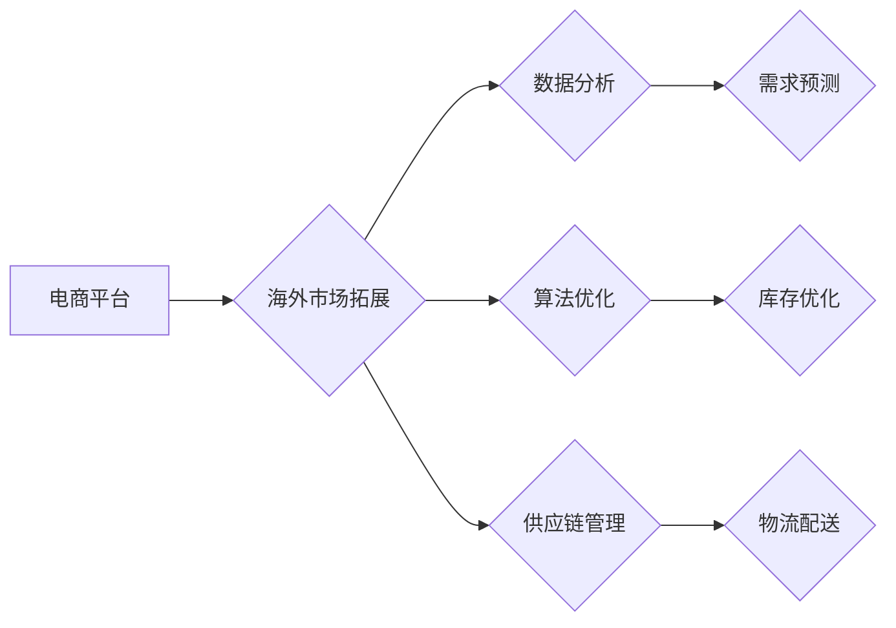

> 电商平台, 供给能力, 海外市场, 拓展, 算法优化, 数据分析, 供应链管理, 

## 1. 背景介绍

在全球化经济的推动下，电商平台的海外市场拓展已成为行业发展的重要趋势。然而，海外市场环境复杂多变，消费者需求差异化较大，如何提升电商平台的供给能力，满足海外用户的个性化需求，成为平台发展面临的重大挑战。

传统的电商平台供给模式主要依赖于线下仓库和物流网络，存在着成本高、效率低、服务体验差等问题。随着云计算、大数据、人工智能等技术的快速发展，电商平台可以借助这些技术手段，构建更加智能化、高效化的供给体系，提升海外市场拓展的竞争力。

## 2. 核心概念与联系

**2.1 电商平台供给能力**

电商平台供给能力是指平台能够提供商品、服务和物流等资源的能力，包括商品种类丰富度、库存充足度、配送速度、售后服务等方面。

**2.2 海外市场拓展**

海外市场拓展是指电商平台将业务范围扩展到海外市场，包括开拓新市场、拓展现有市场、建立海外仓储网络等。

**2.3 核心概念联系**

电商平台的供给能力是海外市场拓展的关键保障。只有拥有强大的供给能力，才能满足海外用户的需求，赢得市场竞争。

**2.4 架构图**



## 3. 核心算法原理 & 具体操作步骤

**3.1 算法原理概述**

为了提升电商平台的供给能力，可以采用多种算法进行优化，例如：

* **需求预测算法:** 利用历史数据、市场趋势等信息，预测未来商品需求，帮助平台优化库存管理。
* **库存优化算法:** 根据需求预测结果，优化库存水平，避免库存积压或缺货现象。
* **物流配送算法:** 根据订单信息、地理位置等因素，优化配送路线，提高配送效率。

**3.2 算法步骤详解**

以需求预测算法为例，其具体步骤如下：

1. **数据收集:** 收集历史销售数据、市场趋势数据、用户行为数据等相关信息。
2. **数据预处理:** 对收集到的数据进行清洗、转换、特征工程等处理，使其适合算法训练。
3. **模型选择:** 选择合适的机器学习模型，例如ARIMA、LSTM等，进行需求预测。
4. **模型训练:** 利用训练数据，训练选择的机器学习模型。
5. **模型评估:** 利用测试数据，评估模型的预测精度。
6. **模型部署:** 将训练好的模型部署到线上环境，进行实时需求预测。

**3.3 算法优缺点**

* **优点:** 能够准确预测未来需求，帮助平台优化库存管理，提高运营效率。
* **缺点:** 算法模型的准确性依赖于数据质量和模型选择，需要不断进行模型优化和调整。

**3.4 算法应用领域**

需求预测算法广泛应用于电商平台、零售行业、制造业等领域，用于预测商品需求、库存管理、生产计划等。

## 4. 数学模型和公式 & 详细讲解 & 举例说明

**4.1 数学模型构建**

需求预测模型可以采用ARIMA模型，其核心思想是利用时间序列数据中的自相关性和偏自相关性，预测未来时间点的需求值。

**4.2 公式推导过程**

ARIMA模型的数学公式如下：

$$
y_t = c + \phi_1 y_{t-1} + \phi_2 y_{t-2} + ... + \phi_p y_{t-p} + \theta_1 \epsilon_{t-1} + \theta_2 \epsilon_{t-2} + ... + \theta_q \epsilon_{t-q} + \epsilon_t
$$

其中：

* $y_t$ 表示时间t点的需求值
* $c$ 表示截距项
* $\phi_i$ 表示自回归系数
* $p$ 表示自回归阶数
* $\theta_i$ 表示移动平均系数
* $q$ 表示移动平均阶数
* $\epsilon_t$ 表示时间t点的随机误差项

**4.3 案例分析与讲解**

假设一个电商平台销售一款商品，其历史销售数据如下：

| 时间 | 需求量 |
|---|---|
| 1 | 100 |
| 2 | 120 |
| 3 | 130 |
| 4 | 110 |
| 5 | 140 |

可以使用ARIMA模型对该商品的需求进行预测。通过对历史数据进行分析，可以确定模型的参数，例如自回归阶数p、移动平均阶数q等。然后，利用训练好的模型，预测未来时间点的需求量。

## 5. 项目实践：代码实例和详细解释说明

**5.1 开发环境搭建**

* 操作系统：Linux
* Python版本：3.7+
* 依赖库：pandas, numpy, statsmodels, matplotlib

**5.2 源代码详细实现**

```python
import pandas as pd
from statsmodels.tsa.arima.model import ARIMA
from matplotlib import pyplot as plt

# 导入历史销售数据
data = pd.read_csv('sales_data.csv', index_col='时间')

# 训练ARIMA模型
model = ARIMA(data['需求量'], order=(5,1,0))
model_fit = model.fit()

# 预测未来5个时间点的需求量
forecast = model_fit.predict(start=len(data), end=len(data)+4)

# 绘制预测结果
plt.plot(data['需求量'], label='历史数据')
plt.plot(forecast, label='预测结果')
plt.legend()
plt.show()
```

**5.3 代码解读与分析**

* 首先，导入必要的库函数。
* 然后，导入历史销售数据，并将其转换为时间序列数据。
* 接下来，使用ARIMA模型训练模型，并进行模型拟合。
* 接着，利用训练好的模型，预测未来5个时间点的需求量。
* 最后，绘制历史数据和预测结果的图表，进行可视化展示。

**5.4 运行结果展示**

运行代码后，会生成一个图表，展示历史销售数据和预测结果。

## 6. 实际应用场景

**6.1 海外市场拓展**

电商平台可以利用需求预测算法，预测海外市场的商品需求，并根据预测结果优化库存管理，提高海外市场拓展的效率。

**6.2 个性化推荐**

电商平台可以利用用户行为数据，预测用户的个性化需求，并进行个性化商品推荐，提升用户体验。

**6.3 库存优化**

电商平台可以利用库存优化算法，优化库存水平，避免库存积压或缺货现象，降低运营成本。

**6.4 物流配送**

电商平台可以利用物流配送算法，优化配送路线，提高配送效率，缩短配送时间。

**6.5 未来应用展望**

随着人工智能技术的不断发展，电商平台的供给能力将得到进一步提升，应用场景也将更加广泛。例如，可以利用机器学习算法，预测商品的退货率，优化退货流程；可以利用自然语言处理技术，理解用户的需求，提供更加精准的商品推荐。

## 7. 工具和资源推荐

**7.1 学习资源推荐**

* **书籍:**
    * 《Python机器学习实战》
    * 《时间序列分析》
* **在线课程:**
    * Coursera: Machine Learning
    * edX: Introduction to Artificial Intelligence

**7.2 开发工具推荐**

* **Python:** 
    * pandas
    * numpy
    * statsmodels
    * scikit-learn
* **云平台:**
    * AWS
    * Azure
    * Google Cloud

**7.3 相关论文推荐**

* **ARIMA模型:**
    * Box, G. E. P., & Jenkins, G. M. (1976). Time series analysis: Forecasting and control. Holden-Day.
* **机器学习算法:**
    * Bishop, C. M. (2006). Pattern recognition and machine learning. Springer.

## 8. 总结：未来发展趋势与挑战

**8.1 研究成果总结**

本文介绍了电商平台供给能力提升的策略，重点探讨了需求预测算法、库存优化算法、物流配送算法等方面的技术原理和应用场景。

**8.2 未来发展趋势**

* **人工智能技术:** 人工智能技术将进一步提升电商平台的供给能力，例如，利用深度学习算法，进行更精准的需求预测和个性化推荐。
* **大数据分析:** 大数据分析技术将帮助电商平台更好地了解用户需求和市场趋势，从而优化供给策略。
* **云计算技术:** 云计算技术将为电商平台提供更加灵活、高效的计算资源，支持大规模数据处理和模型训练。

**8.3 面临的挑战**

* **数据质量:** 算法模型的准确性依赖于数据质量，如何获取高质量的数据，并进行有效的数据清洗和预处理，是需要解决的关键问题。
* **模型复杂度:** 随着算法模型的复杂度不断提高，模型训练和部署的难度也随之增加，需要不断探索新的算法和技术手段。
* **隐私保护:** 数据分析和模型训练过程中，需要保护用户隐私信息，确保数据安全和合规性。

**8.4 研究展望**

未来，将继续深入研究电商平台供给能力提升的技术，探索更先进的算法模型和技术手段，为电商平台的海外市场拓展提供更加强大的技术支持。

## 9. 附录：常见问题与解答

**9.1 如何选择合适的ARIMA模型参数？**

可以使用AIC、BIC等信息准则，选择模型参数。

**9.2 如何处理缺失数据？**

可以使用插值法、平均法等方法，处理缺失数据。

**9.3 如何评估模型的预测精度？**

可以使用均方误差、平均绝对误差等指标，评估模型的预测精度。


作者：禅与计算机程序设计艺术 / Zen and the Art of Computer Programming 
<end_of_turn>