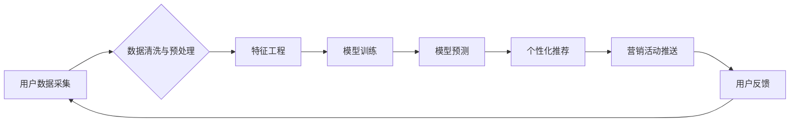

> 电商平台,供给能力,精准营销,数据分析,机器学习,推荐系统,个性化

## 1. 背景介绍

在当今激烈的电商市场竞争中，供给能力的提升至关重要。电商平台需要不断优化商品推荐、库存管理、物流配送等环节，以满足用户多样化的需求，提高用户体验，最终实现商业目标。精准营销作为提升供给能力的重要手段，通过对用户行为、偏好等数据的深度挖掘和分析，实现精准的商品推荐和营销活动推送，从而提高转化率和用户粘性。

## 2. 核心概念与联系

**2.1 精准营销的核心概念**

精准营销是指通过对用户进行细分，根据用户的个性化需求和行为特征，提供定制化的商品推荐、营销信息和服务。其核心目标是提高营销活动的效率和效果，降低营销成本。

**2.2 精准营销与供给能力提升的联系**

精准营销能够有效提升电商平台的供给能力，主要体现在以下几个方面：

* **提高商品推荐精准度:** 通过对用户行为、偏好等数据的分析，精准推荐用户感兴趣的商品，提高用户点击率和转化率。
* **优化库存管理:** 根据用户需求预测，优化商品库存，避免库存积压和缺货现象，提高资源利用效率。
* **提升物流配送效率:** 根据用户地理位置和配送需求，优化物流配送路线，缩短配送时间，提高用户满意度。

**2.3 精准营销技术架构**



## 3. 核心算法原理 & 具体操作步骤

**3.1 算法原理概述**

精准营销的核心算法主要包括协同过滤、内容过滤、基于知识的推荐等。

* **协同过滤:** 基于用户对商品的评分或购买行为，预测用户对其他商品的兴趣。
* **内容过滤:** 基于商品的属性和描述，预测用户对商品的兴趣。
* **基于知识的推荐:** 基于用户和商品之间的知识关系，预测用户对商品的兴趣。

**3.2 算法步骤详解**

以协同过滤算法为例，其具体步骤如下：

1. **数据收集:** 收集用户对商品的评分或购买行为数据。
2. **数据预处理:** 对数据进行清洗、去噪、缺失值处理等操作。
3. **用户和商品相似度计算:** 使用余弦相似度等算法计算用户之间的相似度和商品之间的相似度。
4. **推荐算法:** 根据用户和商品的相似度，推荐用户可能感兴趣的商品。

**3.3 算法优缺点**

* **优点:** 能够推荐用户潜在的兴趣，提高推荐的准确性。
* **缺点:** 数据稀疏性问题，冷启动问题。

**3.4 算法应用领域**

协同过滤算法广泛应用于电商平台、音乐平台、视频平台等领域，用于商品推荐、音乐推荐、视频推荐等。

## 4. 数学模型和公式 & 详细讲解 & 举例说明

**4.1 数学模型构建**

协同过滤算法的数学模型可以表示为用户-商品评分矩阵，其中每个元素表示用户对商品的评分。

**4.2 公式推导过程**

用户-商品评分矩阵的相似度可以使用余弦相似度公式计算：

$$
similarity(u,v) = \frac{u \cdot v}{||u|| ||v||}
$$

其中：

* $u$ 和 $v$ 分别表示两个用户的评分向量。
* $u \cdot v$ 表示两个向量之间的点积。
* $||u||$ 和 $||v||$ 分别表示两个向量的模长。

**4.3 案例分析与讲解**

假设有两个用户 A 和 B，他们的评分向量分别为：

* $u_A = [1, 2, 3, 4]$
* $u_B = [2, 3, 4, 5]$

则他们的余弦相似度为：

$$
similarity(A,B) = \frac{1 \cdot 2 + 2 \cdot 3 + 3 \cdot 4 + 4 \cdot 5}{\sqrt{1^2 + 2^2 + 3^2 + 4^2} \sqrt{2^2 + 3^2 + 4^2 + 5^2}} = \frac{30}{\sqrt{30} \sqrt{54}} = \frac{30}{3\sqrt{180}} = \frac{10}{\sqrt{180}}
$$

## 5. 项目实践：代码实例和详细解释说明

**5.1 开发环境搭建**

* Python 3.x
* Pandas
* Scikit-learn
* TensorFlow/PyTorch

**5.2 源代码详细实现**

```python
import pandas as pd
from sklearn.metrics.pairwise import cosine_similarity

# 加载用户-商品评分数据
data = pd.read_csv('ratings.csv')

# 数据预处理
# ...

# 计算用户-用户相似度矩阵
user_similarity = cosine_similarity(data.pivot_table(index='user_id', columns='item_id', values='rating').fillna(0))

# 推荐算法
def recommend_items(user_id, top_n=5):
    # 获取用户相似用户
    similar_users = user_similarity[user_id].argsort()[:-top_n-1:-1]
    # 获取相似用户喜欢的商品
    recommended_items = data[data['user_id'].isin(similar_users)].groupby('item_id')['rating'].mean().sort_values(ascending=False).index[:top_n]
    return recommended_items

# 获取用户推荐商品
user_id = 1
recommended_items = recommend_items(user_id)
print(f'用户 {user_id} 的推荐商品: {recommended_items}')
```

**5.3 代码解读与分析**

* 代码首先加载用户-商品评分数据，并进行数据预处理。
* 然后使用余弦相似度算法计算用户-用户相似度矩阵。
* 推荐算法根据用户相似度，推荐用户可能感兴趣的商品。

**5.4 运行结果展示**

运行代码后，将输出用户 1 的推荐商品列表。

## 6. 实际应用场景

精准营销在电商平台的实际应用场景非常广泛，例如：

* **商品推荐:** 根据用户的浏览历史、购买记录等数据，推荐用户可能感兴趣的商品。
* **个性化广告:** 根据用户的兴趣爱好、消费习惯等数据，推送个性化的广告信息。
* **促销活动:** 根据用户的消费行为和偏好，推送个性化的促销活动信息。

**6.4 未来应用展望**

随着人工智能技术的不断发展，精准营销将在以下方面得到进一步提升：

* **更精准的推荐:** 利用深度学习等先进算法，实现更精准的商品推荐。
* **更个性化的营销:** 利用用户画像、行为分析等技术，实现更个性化的营销活动推送。
* **更智能的交互:** 利用自然语言处理、语音识别等技术，实现更智能的营销交互。

## 7. 工具和资源推荐

**7.1 学习资源推荐**

* **书籍:**
    * 《推荐系统实践》
    * 《机器学习》
* **在线课程:**
    * Coursera: Machine Learning
    * edX: Artificial Intelligence

**7.2 开发工具推荐**

* **Python:** 
    * Pandas
    * Scikit-learn
    * TensorFlow/PyTorch
* **Spark:** 
    * Apache Spark

**7.3 相关论文推荐**

* **协同过滤算法:**
    * "Collaborative Filtering for Implicit Feedback Datasets"
    * "Matrix Factorization Techniques for Recommender Systems"
* **深度学习推荐系统:**
    * "Deep Learning for Recommender Systems"
    * "Neural Collaborative Filtering"

## 8. 总结：未来发展趋势与挑战

**8.1 研究成果总结**

精准营销技术在电商平台的应用取得了显著的成果，提高了用户体验、提升了商业效益。

**8.2 未来发展趋势**

精准营销技术将朝着更精准、更个性化、更智能的方向发展。

**8.3 面临的挑战**

* 数据隐私保护
* 模型解释性
* 冷启动问题

**8.4 研究展望**

未来研究将重点关注数据隐私保护、模型解释性、冷启动问题等方面的研究，以推动精准营销技术的健康发展。

## 9. 附录：常见问题与解答

**9.1 如何解决数据稀疏性问题？**

可以使用矩阵分解、协同过滤等算法，对稀疏数据进行填充和预测。

**9.2 如何解决冷启动问题？**

可以使用基于内容的推荐、基于知识的推荐等算法，对新用户和新商品进行推荐。

**9.3 如何评估精准营销的效果？**

可以使用点击率、转化率、用户满意度等指标来评估精准营销的效果。


作者：禅与计算机程序设计艺术 / Zen and the Art of Computer Programming 
<end_of_turn>