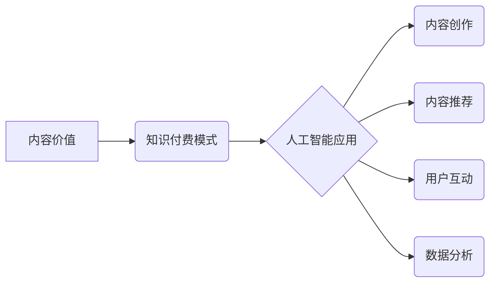

> 内容价值、知识付费、人工智能、算法、数据分析、用户体验、商业模式

## 1. 背景介绍

知识付费行业近年来蓬勃发展，成为新兴的经济增长点。随着互联网技术的普及和人们对知识的需求不断增长，越来越多的创作者和企业涌入这个领域，提供各种形式的付费课程、咨询服务和知识产品。然而，在激烈的市场竞争中，如何提升内容价值，吸引用户付费，成为知识付费创业者面临的共同挑战。

传统知识付费模式往往依赖于内容创作者的个人影响力和品牌效应，但这种模式存在着局限性。随着市场竞争的加剧，单纯依靠个人魅力难以持续吸引用户。因此，需要探索新的方法和技术，提升内容价值，打造更具吸引力和竞争力的知识付费产品。

## 2. 核心概念与联系

**2.1 内容价值的定义**

内容价值是指知识付费产品能够为用户带来的实际价值，包括知识、技能、经验、灵感等方面的提升。

**2.2 知识付费模式的演变**

传统的知识付费模式主要包括：

* **付费课程:** 提供线上或线下课程，用户通过付费学习知识和技能。
* **咨询服务:** 提供一对一或小班咨询服务，帮助用户解决特定问题。
* **知识产品:** 提供电子书、音频、视频等知识产品，用户通过购买获取知识。

随着技术的进步，知识付费模式不断演变，出现了新的模式，例如：

* **会员制:** 用户通过付费成为会员，可以获得持续更新的内容和服务。
* **订阅制:** 用户通过订阅服务，可以定期获得新的内容和更新。
* **社区化:** 建立知识付费社区，用户可以互相交流学习，分享经验。

**2.3 人工智能在知识付费中的应用**

人工智能技术可以应用于各个环节，提升知识付费内容的价值：

* **内容创作:** 利用人工智能生成文本、图像、音频等内容，辅助创作者创作更高质量的内容。
* **内容推荐:** 基于用户行为和偏好，推荐个性化的知识付费产品。
* **用户互动:** 利用人工智能聊天机器人，提供更智能化的用户服务和互动体验。
* **数据分析:** 分析用户行为数据，了解用户需求，优化内容和服务。

**2.4 核心概念关系图**



## 3. 核心算法原理 & 具体操作步骤

**3.1 算法原理概述**

在知识付费领域，人工智能算法可以应用于内容推荐、用户画像、个性化学习路径等方面。其中，协同过滤算法是一种常用的推荐算法，它基于用户的历史行为数据，预测用户对特定内容的兴趣。

**3.2 算法步骤详解**

协同过滤算法的具体步骤如下：

1. **数据收集:** 收集用户对内容的评分、浏览、购买等行为数据。
2. **用户相似度计算:** 计算用户之间的相似度，例如使用余弦相似度或皮尔逊相关系数。
3. **物品相似度计算:** 计算内容之间的相似度，例如使用余弦相似度或Jaccard系数。
4. **推荐生成:** 根据用户的相似用户或相似内容，推荐用户可能感兴趣的内容。

**3.3 算法优缺点**

**优点:**

* 能够推荐用户可能感兴趣的内容，提高用户体验。
* 不需要明确的特征描述，可以从用户的行为数据中学习。

**缺点:**

* 数据稀疏性问题: 当用户行为数据不足时，算法效果会下降。
* 冷启动问题: 新用户或新内容难以获得推荐。
* 算法复杂度较高，需要大量的计算资源。

**3.4 算法应用领域**

协同过滤算法广泛应用于以下领域:

* 电子商务: 商品推荐
* 流媒体: 视频和音乐推荐
* 社交网络: 朋友推荐
* 知识付费: 内容推荐

## 4. 数学模型和公式 & 详细讲解 & 举例说明

**4.1 数学模型构建**

协同过滤算法的核心是用户-物品交互矩阵，该矩阵表示用户对不同内容的评分或行为。

假设有N个用户和M个内容，则用户-物品交互矩阵可以表示为一个N x M的矩阵，其中每个元素代表用户对特定内容的评分或行为。

**4.2 公式推导过程**

协同过滤算法常用的相似度计算方法包括余弦相似度和皮尔逊相关系数。

**余弦相似度:**

$$
\text{相似度} = \frac{\mathbf{u} \cdot \mathbf{v}}{\|\mathbf{u}\| \|\mathbf{v}\|}
$$

其中，$\mathbf{u}$和$\mathbf{v}$分别代表两个用户的向量表示，$\cdot$表示点积，$\|\mathbf{u}\|$和$\|\mathbf{v}\|$分别代表两个向量的模长。

**皮尔逊相关系数:**

$$
\text{相似度} = \frac{\sum_{i=1}^{M}(u_{i} - \bar{u})(v_{i} - \bar{v})}{\sqrt{\sum_{i=1}^{M}(u_{i} - \bar{u})^2} \sqrt{\sum_{i=1}^{M}(v_{i} - \bar{v})^2}}
$$

其中，$u_{i}$和$v_{i}$分别代表两个用户对第i个内容的评分，$\bar{u}$和$\bar{v}$分别代表两个用户的平均评分。

**4.3 案例分析与讲解**

假设有两个用户A和B，他们对三个内容的评分如下：

| 内容 | 用户A | 用户B |
|---|---|---|
| 内容1 | 5 | 4 |
| 内容2 | 3 | 5 |
| 内容3 | 4 | 3 |

我们可以使用余弦相似度或皮尔逊相关系数计算用户A和B之间的相似度。

## 5. 项目实践：代码实例和详细解释说明

**5.1 开发环境搭建**

* Python 3.x
* scikit-learn 库

**5.2 源代码详细实现**

```python
from sklearn.metrics.pairwise import cosine_similarity

# 用户-物品交互矩阵
ratings_matrix = [[5, 3, 4],
                  [4, 5, 3]]

# 计算用户相似度
user_similarity = cosine_similarity(ratings_matrix)

# 打印用户相似度矩阵
print(user_similarity)
```

**5.3 代码解读与分析**

* `cosine_similarity()` 函数计算两个向量的余弦相似度。
* `ratings_matrix` 是用户-物品交互矩阵，其中每个元素代表用户对特定内容的评分。
* `user_similarity` 是用户相似度矩阵，其中每个元素代表两个用户之间的相似度。

**5.4 运行结果展示**

运行代码后，会输出用户相似度矩阵，例如：

```
[[1.         0.8660254 ]
 [0.8660254 1.        ]]
```

其中，1.0代表两个用户完全相似，0.0代表两个用户完全不相似。

## 6. 实际应用场景

**6.1 内容推荐系统**

知识付费平台可以利用协同过滤算法构建内容推荐系统，根据用户的历史行为数据，推荐用户可能感兴趣的内容。

**6.2 个性化学习路径**

根据用户的学习进度和兴趣，推荐个性化的学习路径，帮助用户更高效地学习知识。

**6.3 用户画像分析**

分析用户的行为数据，构建用户画像，了解用户的学习习惯、兴趣偏好等信息，为内容创作和营销提供参考。

**6.4 未来应用展望**

随着人工智能技术的不断发展，协同过滤算法在知识付费领域的应用将更加广泛和深入。例如，可以利用深度学习算法，构建更精准的推荐模型，提供更个性化的学习体验。

## 7. 工具和资源推荐

**7.1 学习资源推荐**

* **书籍:**
    * 《推荐系统实践》
    * 《机器学习》
* **在线课程:**
    * Coursera: 机器学习
    * edX: 数据科学

**7.2 开发工具推荐**

* **Python:** 
    * scikit-learn
    * TensorFlow
    * PyTorch

**7.3 相关论文推荐**

* 《Collaborative Filtering for Implicit Feedback Datasets》
* 《Matrix Factorization Techniques for Recommender Systems》

## 8. 总结：未来发展趋势与挑战

**8.1 研究成果总结**

人工智能技术在知识付费领域具有巨大的应用潜力，可以提升内容价值，优化用户体验，促进知识传播。协同过滤算法是其中一种重要的技术，可以应用于内容推荐、个性化学习路径等方面。

**8.2 未来发展趋势**

* **深度学习:** 利用深度学习算法，构建更精准的推荐模型，提供更个性化的学习体验。
* **多模态学习:** 融合文本、图像、音频等多模态数据，构建更全面的用户画像，提供更精准的推荐。
* **解释性AI:** 使推荐算法更加透明可解释，帮助用户理解推荐结果背后的逻辑。

**8.3 面临的挑战**

* **数据稀疏性:** 知识付费平台的用户行为数据往往稀疏，需要采用有效的处理方法。
* **冷启动问题:** 新用户或新内容难以获得推荐，需要探索新的解决方法。
* **算法公平性:** 算法需要保证公平性，避免出现歧视或偏见。

**8.4 研究展望**

未来，需要继续探索人工智能技术在知识付费领域的应用，开发更智能、更精准、更公平的推荐算法，为用户提供更优质的学习体验。

## 9. 附录：常见问题与解答

**9.1 如何解决数据稀疏性问题？**

* **数据增强:** 利用文本生成模型等技术，生成虚拟的用户行为数据。
* **迁移学习:** 利用其他领域的数据，训练预训练模型，迁移到知识付费领域。
* **混合推荐:** 结合协同过滤算法和其他推荐算法，例如基于内容的推荐算法。

**9.2 如何解决冷启动问题？**

* **用户画像:** 利用用户基本信息和行为数据，构建用户画像，进行初步推荐。
* **内容相似度:** 利用内容之间的语义相似度或主题相似度，进行推荐。
* **专家推荐:** 邀请专家进行内容推荐，为新用户提供初始推荐。


作者：禅与计算机程序设计艺术 / Zen and the Art of Computer Programming 
<end_of_turn>