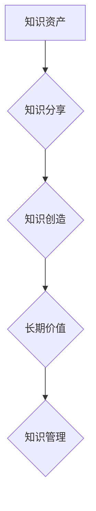

> 知识资产、知识分享、知识创造、长期价值、知识管理、知识经济、创新驱动

## 1. 背景介绍

在当今知识经济时代，知识已成为企业和个人的核心竞争力。知识资产是指企业或个人所拥有的知识、技能、经验、技术等资源，是推动创新、提升效率、创造价值的关键要素。然而，知识资产的价值并非静态的，它需要不断地被创造、分享和应用，才能发挥其最大效用。

传统的知识管理模式往往侧重于知识的存储和检索，而忽视了知识的分享和传播。随着互联网和数字化技术的快速发展，知识分享已成为一种新的趋势和模式。知识分享平台、在线学习平台、社交媒体等工具为知识的传播提供了新的渠道和方式。

## 2. 核心概念与联系

**2.1 知识资产**

知识资产是指企业或个人所拥有的知识、技能、经验、技术等资源，可以分为以下几类：

* **显性知识:** 可以被明确表达和记录的知识，例如文档、数据、代码等。
* **隐性知识:** 难以被明确表达和记录的知识，例如经验、技能、直觉等。

**2.2 知识分享**

知识分享是指个人或团队之间交换、传播和协作知识的过程。它可以采用多种形式，例如：

* **一对一交流:** 通过面对面交流、邮件、电话等方式进行知识分享。
* **小组讨论:** 在团队会议、工作坊等场合进行知识分享。
* **在线平台:** 利用知识管理平台、在线论坛、社交媒体等平台进行知识分享。

**2.3 知识创造**

知识创造是指通过对现有知识的整合、创新和应用，产生新的知识的过程。它需要以下几个要素：

* **知识积累:** 拥有丰富的知识储备。
* **创新思维:** 能够提出新的观点和想法。
* **协作能力:** 能够与他人合作，共同创造知识。

**2.4 长期价值**

知识资产的长期价值是指知识资产能够持续为企业或个人创造价值的能力。它取决于以下几个因素：

* **知识的有效性:** 知识必须是准确、可靠、有用的。
* **知识的适用性:** 知识必须能够应用于实际工作中。
* **知识的更新性:** 知识必须能够随着时代的发展而更新迭代。

**2.5 知识管理**

知识管理是指企业或个人系统地收集、整理、存储、共享和利用知识的过程。它可以帮助企业或个人更好地管理知识资产，提高知识的利用效率。

**Mermaid 流程图**



## 3. 核心算法原理 & 具体操作步骤

**3.1 算法原理概述**

知识分享算法旨在通过分析用户行为、知识内容和网络关系，推荐相关知识和用户，促进知识的传播和利用。常见的知识分享算法包括：

* **协同过滤算法:** 基于用户之间的相似性或物品之间的相似性，推荐相关知识或用户。
* **内容过滤算法:** 基于知识内容的主题、关键词等特征，推荐相关知识。
* **混合推荐算法:** 将协同过滤算法和内容过滤算法相结合，提高推荐的准确性和个性化程度。

**3.2 算法步骤详解**

以协同过滤算法为例，其具体步骤如下：

1. **数据收集:** 收集用户行为数据、知识内容数据和用户关系数据。
2. **数据预处理:** 对数据进行清洗、转换和特征提取。
3. **相似度计算:** 计算用户之间的相似度或物品之间的相似度。
4. **推荐生成:** 根据用户相似度或物品相似度，推荐相关知识或用户。
5. **结果评估:** 使用评价指标评估推荐结果的准确性和有效性。

**3.3 算法优缺点**

**优点:**

* 能够推荐个性化和相关的知识。
* 能够发现用户和知识之间的隐性关系。

**缺点:**

* 数据稀疏性问题: 当用户行为数据或知识内容数据不足时，算法的准确性会降低。
* 冷启动问题: 新用户或新知识难以获得推荐。

**3.4 算法应用领域**

知识分享算法广泛应用于以下领域:

* **在线学习平台:** 推荐学习资源和学习伙伴。
* **知识管理平台:** 推荐相关知识文档和专家。
* **社交媒体:** 推荐相关内容和用户。

## 4. 数学模型和公式 & 详细讲解 & 举例说明

**4.1 数学模型构建**

协同过滤算法通常使用矩阵分解模型来计算用户和物品之间的相似度。假设用户集合为U，物品集合为I，用户-物品交互矩阵为R，其中R(u,i)表示用户u对物品i的评分。

**4.2 公式推导过程**

矩阵分解模型将用户-物品交互矩阵分解成两个低维矩阵：用户特征矩阵P和物品特征矩阵Q。

$$R \approx P Q^T$$

其中，P(u,k)表示用户u在第k个特征上的评分，Q(i,k)表示物品i在第k个特征上的评分。

**4.3 案例分析与讲解**

假设有一个用户-物品交互矩阵R，其中R(u,i)表示用户u对物品i的评分。

```
R = [
    [5, 3, 4],
    [4, 5, 2],
    [3, 2, 5]
]
```

可以使用矩阵分解模型将R分解成两个低维矩阵P和Q，例如：

```
P = [
    [0.8, 0.6],
    [0.5, 0.9],
    [0.3, 0.7]
]
Q = [
    [0.6, 0.4],
    [0.5, 0.7],
    [0.3, 0.9]
]
```

通过计算P和Q的点积，可以得到近似的用户-物品交互矩阵R'。

```
R' = P Q^T
```

## 5. 项目实践：代码实例和详细解释说明

**5.1 开发环境搭建**

* Python 3.x
* scikit-learn 库

**5.2 源代码详细实现**

```python
from sklearn.decomposition import NMF

# 用户-物品交互矩阵
R = [
    [5, 3, 4],
    [4, 5, 2],
    [3, 2, 5]
]

# 使用 NMF 算法进行矩阵分解
n_components = 2  # 特征维度
model = NMF(n_components=n_components, init='random', random_state=0)
P = model.fit_transform(R)
Q = model.components_

# 计算近似的用户-物品交互矩阵
R_approx = P @ Q.T

# 打印结果
print("用户特征矩阵 P:")
print(P)
print("物品特征矩阵 Q:")
print(Q)
print("近似用户-物品交互矩阵 R_approx:")
print(R_approx)
```

**5.3 代码解读与分析**

* 使用 scikit-learn 库中的 NMF 算法进行矩阵分解。
* 设置特征维度 n_components。
* 使用 fit_transform 方法训练模型，得到用户特征矩阵 P 和物品特征矩阵 Q。
* 使用点积运算计算近似的用户-物品交互矩阵 R_approx。

**5.4 运行结果展示**

运行代码后，会输出用户特征矩阵 P、物品特征矩阵 Q 和近似用户-物品交互矩阵 R_approx。

## 6. 实际应用场景

**6.1 在线学习平台**

* 推荐学习资源和学习伙伴。
* 个性化学习路径推荐。
* 知识社区建设和互动。

**6.2 知识管理平台**

* 推荐相关知识文档和专家。
* 知识库构建和管理。
* 知识发现和创新。

**6.3 社交媒体**

* 推荐相关内容和用户。
* 社群构建和互动。
* 信息传播和扩散。

**6.4 未来应用展望**

* 人工智能驱动的知识分享平台。
* 基于深度学习的知识推荐算法。
* 虚拟现实和增强现实技术在知识分享中的应用。

## 7. 工具和资源推荐

**7.1 学习资源推荐**

* **书籍:**
    * 《推荐系统》
    * 《机器学习》
* **在线课程:**
    * Coursera: Recommender Systems
    * edX: Machine Learning

**7.2 开发工具推荐**

* **Python:** 
    * scikit-learn
    * TensorFlow
    * PyTorch

**7.3 相关论文推荐**

* **协同过滤算法:**
    * "Collaborative Filtering: A User-Based Approach"
    * "Memory-Based Collaborative Filtering"
* **矩阵分解模型:**
    * "Singular Value Decomposition for Collaborative Filtering"
    * "Non-negative Matrix Factorization for Collaborative Filtering"

## 8. 总结：未来发展趋势与挑战

**8.1 研究成果总结**

知识分享算法在知识发现、推荐系统、社交网络分析等领域取得了显著成果。

**8.2 未来发展趋势**

* 人工智能驱动的知识分享平台。
* 基于深度学习的知识推荐算法。
* 虚拟现实和增强现实技术在知识分享中的应用。

**8.3 面临的挑战**

* 数据稀疏性问题。
* 冷启动问题。
* 知识的动态性和复杂性。

**8.4 研究展望**

* 研究更有效的知识分享算法。
* 开发更智能的知识分享平台。
* 探索知识分享在不同领域的应用。

## 9. 附录：常见问题与解答

**9.1 如何解决数据稀疏性问题？**

可以使用以下方法解决数据稀疏性问题：

* 数据增强: 通过人工标注或其他方法增加数据量。
* 迁移学习: 利用其他领域的数据进行预训练，提高算法的泛化能力。
* 混合推荐算法: 将协同过滤算法和内容过滤算法相结合，提高推荐的准确性和有效性。

**9.2 如何解决冷启动问题？**

可以使用以下方法解决冷启动问题：

* 基于内容的推荐: 利用新用户的兴趣爱好或新知识的主题特征进行推荐。
* 社交关系推荐: 利用新用户的社交关系进行推荐。
* 专家推荐: 由专家进行推荐。


作者：禅与计算机程序设计艺术 / Zen and the Art of Computer Programming 
<end_of_turn>