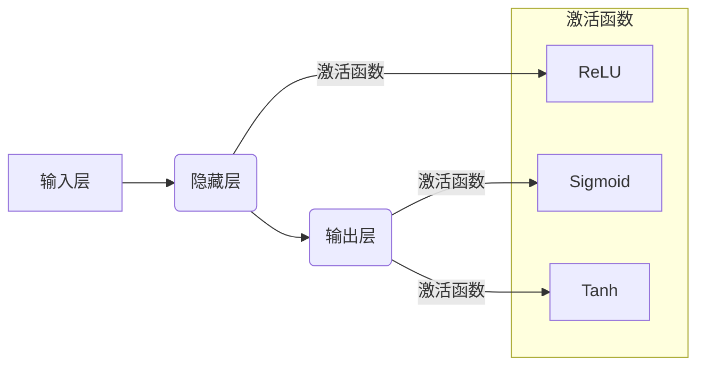

> 深度学习, 神经网络, 架构优化, 性能提升, 效率提升

## 1. 背景介绍

深度学习近年来取得了令人瞩目的成就，在图像识别、自然语言处理、语音识别等领域展现出强大的能力。然而，随着模型规模的不断扩大，训练和部署深度学习模型面临着越来越大的挑战。其中，神经网络架构的优化尤为重要。

神经网络架构的优化是指通过调整网络结构、激活函数、正则化方法等参数，以提高模型的性能和效率。优化目标通常包括：

* **提高准确率:** 使模型在目标任务上的预测精度更高。
* **减少参数量:** 降低模型的存储和计算成本。
* **加速训练速度:** 缩短模型训练的时间。
* **降低推理延迟:** 提高模型在实际应用中的实时性。

## 2. 核心概念与联系

神经网络架构优化涉及多个核心概念，包括：

* **层数和宽度:** 网络的层数和每层神经元的数量决定了模型的复杂度和容量。
* **激活函数:** 激活函数决定了神经元的输出特性，影响模型的非线性表达能力。
* **连接方式:** 神经元之间的连接方式，如全连接、卷积、池化等，决定了模型对输入数据的处理方式。
* **正则化:** 正则化方法，如Dropout、L1正则化、L2正则化等，用于防止模型过拟合，提高泛化能力。

这些概念相互关联，共同影响着神经网络的性能和效率。

**Mermaid 流程图:**



## 3. 核心算法原理 & 具体操作步骤

### 3.1  算法原理概述

神经网络架构优化算法通常基于梯度下降原理，通过调整网络参数，最小化模型的损失函数。常见的优化算法包括：

* **随机梯度下降 (SGD):** 使用单个样本的梯度更新模型参数。
* **动量梯度下降 (Momentum):** 在更新参数时考虑之前梯度的累积，加速收敛速度。
* **自适应学习率算法 (Adam, RMSprop):** 根据每个参数的梯度历史信息自适应调整学习率，提高收敛效率。

### 3.2  算法步骤详解

1. **初始化网络参数:** 随机初始化网络权重和偏置。
2. **前向传播:** 将输入数据通过网络传递，计算输出结果。
3. **计算损失函数:** 比较模型输出与真实标签之间的差异，计算损失值。
4. **反向传播:** 计算损失函数对网络参数的梯度。
5. **参数更新:** 使用优化算法更新网络参数，朝着最小化损失函数的方向前进。
6. **重复步骤 2-5:** 迭代训练，直到模型性能达到目标。

### 3.3  算法优缺点

| 算法 | 优点 | 缺点 |
|---|---|---|
| SGD | 简单易实现 | 收敛速度慢，容易陷入局部最优 |
| Momentum | 加速收敛速度 | 需要调整动量参数 |
| Adam | 自适应学习率，收敛速度快 | 计算量较大 |

### 3.4  算法应用领域

神经网络架构优化算法广泛应用于各种深度学习任务，例如：

* **图像分类:** 优化卷积神经网络 (CNN) 架构，提高图像识别准确率。
* **自然语言处理:** 优化循环神经网络 (RNN) 和 Transformer 架构，提升文本理解和生成能力。
* **语音识别:** 优化循环神经网络和卷积神经网络的结合，提高语音识别准确率。

## 4. 数学模型和公式 & 详细讲解 & 举例说明

### 4.1  数学模型构建

神经网络的数学模型可以表示为一个多层感知机 (MLP)，其中每个层包含多个神经元。每个神经元接收来自上一层的输入信号，经过激活函数处理后输出信号。

**公式:**

$$
y = f(W^L x^L + b^L)
$$

其中：

* $y$ 是输出信号
* $f$ 是激活函数
* $W^L$ 是第 $L$ 层的权重矩阵
* $x^L$ 是第 $L$ 层的输入信号
* $b^L$ 是第 $L$ 层的偏置向量

### 4.2  公式推导过程

损失函数通常是模型预测结果与真实标签之间的差异。常见的损失函数包括均方误差 (MSE) 和交叉熵损失 (Cross-Entropy Loss)。

**均方误差 (MSE):**

$$
L = \frac{1}{N} \sum_{i=1}^{N} (y_i - \hat{y}_i)^2
$$

其中：

* $L$ 是损失函数值
* $N$ 是样本数量
* $y_i$ 是第 $i$ 个样本的真实标签
* $\hat{y}_i$ 是第 $i$ 个样本的预测结果

**交叉熵损失 (Cross-Entropy Loss):**

$$
L = -\frac{1}{N} \sum_{i=1}^{N} \sum_{j=1}^{C} y_{ij} \log(\hat{y}_{ij})
$$

其中：

* $C$ 是类别数量
* $y_{ij}$ 是第 $i$ 个样本的第 $j$ 类标签
* $\hat{y}_{ij}$ 是第 $i$ 个样本预测为第 $j$ 类的概率

通过梯度下降算法，可以计算损失函数对网络参数的梯度，并根据梯度更新参数，最终最小化损失函数值。

### 4.3  案例分析与讲解

假设我们训练一个图像分类模型，目标是识别猫和狗的图片。我们可以使用卷积神经网络 (CNN) 作为模型架构，并使用交叉熵损失函数来衡量模型性能。

在训练过程中，我们会将猫和狗的图片作为输入数据，并使用梯度下降算法更新网络参数。通过不断迭代训练，模型的预测准确率会逐渐提高。

## 5. 项目实践：代码实例和详细解释说明

### 5.1  开发环境搭建

为了实现神经网络架构优化，我们需要搭建一个深度学习开发环境。常用的开发环境包括：

* **TensorFlow:** Google 开发的开源深度学习框架。
* **PyTorch:** Facebook 开发的开源深度学习框架。
* **Keras:** 构建和训练深度学习模型的简洁高层API。

### 5.2  源代码详细实现

以下是一个使用 TensorFlow 实现神经网络架构优化的简单代码示例：

```python
import tensorflow as tf

# 定义模型架构
model = tf.keras.models.Sequential([
    tf.keras.layers.Conv2D(32, (3, 3), activation='relu', input_shape=(28, 28, 1)),
    tf.keras.layers.MaxPooling2D((2, 2)),
    tf.keras.layers.Conv2D(64, (3, 3), activation='relu'),
    tf.keras.layers.MaxPooling2D((2, 2)),
    tf.keras.layers.Flatten(),
    tf.keras.layers.Dense(10, activation='softmax')
])

# 定义损失函数和优化器
model.compile(loss='sparse_categorical_crossentropy',
              optimizer='adam',
              metrics=['accuracy'])

# 训练模型
model.fit(x_train, y_train, epochs=10)

# 评估模型
loss, accuracy = model.evaluate(x_test, y_test)
print('Test loss:', loss)
print('Test accuracy:', accuracy)
```

### 5.3  代码解读与分析

这段代码定义了一个简单的卷积神经网络 (CNN) 模型，用于识别手写数字。

* `tf.keras.models.Sequential` 创建了一个顺序模型，其中层级依次连接。
* `tf.keras.layers.Conv2D` 定义了一个卷积层，用于提取图像特征。
* `tf.keras.layers.MaxPooling2D` 定义了一个最大池化层，用于降低特征图尺寸。
* `tf.keras.layers.Flatten` 将多维特征图转换为一维向量。
* `tf.keras.layers.Dense` 定义了一个全连接层，用于分类。
* `model.compile` 配置模型的损失函数、优化器和评估指标。
* `model.fit` 训练模型，使用训练数据进行迭代训练。
* `model.evaluate` 评估模型，使用测试数据计算损失和准确率。

### 5.4  运行结果展示

训练完成后，我们可以使用测试数据评估模型的性能。输出结果会显示测试集上的损失值和准确率。

## 6. 实际应用场景

神经网络架构优化在各个领域都有广泛的应用场景：

* **图像识别:** 优化 CNN 架构，提高图像分类、目标检测、图像分割等任务的准确率。
* **自然语言处理:** 优化 RNN 和 Transformer 架构，提升文本分类、情感分析、机器翻译等任务的性能。
* **语音识别:** 优化 CNN 和 RNN 的结合，提高语音识别准确率和实时性。
* **药物发现:** 优化神经网络架构，预测药物的活性，加速药物研发过程。
* **金融预测:** 优化神经网络架构，预测股票价格、风险评估等，辅助金融决策。

### 6.4  未来应用展望

随着深度学习技术的不断发展，神经网络架构优化将发挥越来越重要的作用。未来，我们可能会看到以下趋势：

* **自动架构搜索:** 使用机器学习算法自动搜索最佳神经网络架构。
* **可解释性增强:** 开发更可解释的神经网络架构，帮助我们理解模型的决策过程。
* **高效计算:** 设计更具效率的神经网络架构，降低计算成本和能耗。

## 7. 工具和资源推荐

### 7.1  学习资源推荐

* **深度学习书籍:**
    * 《深度学习》 (Deep Learning) - Ian Goodfellow, Yoshua Bengio, Aaron Courville
    * 《神经网络与深度学习》 (Neural Networks and Deep Learning) - Michael Nielsen
* **在线课程:**
    * Coursera: 深度学习 Specialization
    * Udacity: Deep Learning Nanodegree
* **博客和网站:**
    * TensorFlow Blog: https://blog.tensorflow.org/
    * PyTorch Blog: https://pytorch.org/blog/

### 7.2  开发工具推荐

* **TensorFlow:** https://www.tensorflow.org/
* **PyTorch:** https://pytorch.org/
* **Keras:** https://keras.io/

### 7.3  相关论文推荐

* **《ImageNet Classification with Deep Convolutional Neural Networks》:** Alex Krizhevsky, Ilya Sutskever, Geoffrey E. Hinton
* **《Attention Is All You Need》:** Ashish Vaswani, Noam Shazeer, Niki Parmar, Jakob Uszkoreit, Llion Jones, Aidan N. Gomez, Łukasz Kaiser, Illia Polosukhin
* **《EfficientNet: Rethinking Model Scaling for Convolutional Neural Networks》:** Mingxing Tan, Quoc V. Le

## 8. 总结：未来发展趋势与挑战

### 8.1  研究成果总结

神经网络架构优化研究取得了显著进展，开发出许多高效的优化算法和架构设计方法。这些方法提高了深度学习模型的性能和效率，推动了深度学习技术的广泛应用。

### 8.2  未来发展趋势

未来，神经网络架构优化研究将朝着以下方向发展：

* **自动架构搜索:** 利用机器学习算法自动搜索最佳神经网络架构，提高效率和创新性。
* **可解释性增强:** 开发更可解释的神经网络架构，帮助我们理解模型的决策过程，提高模型的信任度。
* **高效计算:** 设计更具效率的神经网络架构，降低计算成本和能耗，推动深度学习在移动设备和边缘计算等场景的