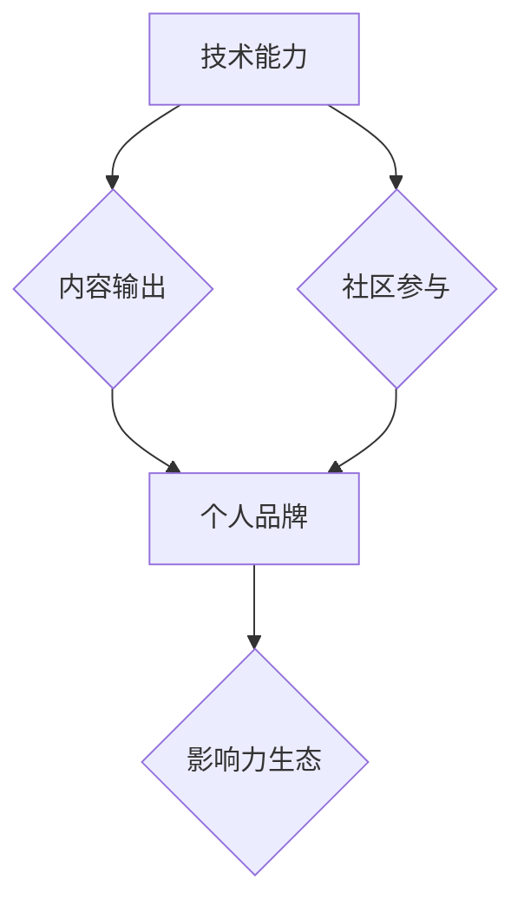

> 个人影响力、程序员、技术博客、开源贡献、社区参与、品牌建设、内容营销、社交媒体

## 1. 背景介绍

在当今科技日新月异的时代，程序员作为数字世界的核心力量，拥有着巨大的影响力。然而，如何将个人技术能力转化为可观的个人影响力，并将其融入到个人职业发展和社会价值创造中，成为了许多程序员共同面临的挑战。

个人影响力生态的构建，并非一蹴而就，它需要程序员们在技术能力、内容输出、社区参与、品牌建设等多个维度进行综合努力。本文将从多个角度探讨程序员如何打造个人影响力生态，并提供一些实用的建议和方法。

## 2. 核心概念与联系

**2.1 个人影响力生态**

个人影响力生态是指一个程序员通过自身的技术能力、内容输出、社区参与、品牌建设等多方面努力，构建起来的个人品牌和影响力网络。它是一个动态、多维度的系统，包含以下核心要素：

* **技术能力:** 这是个人影响力的基础，需要不断学习和提升技术技能，保持行业前沿的认知。
* **内容输出:** 通过博客、文章、视频、开源项目等方式，分享自己的技术经验和见解，建立个人知识体系和品牌形象。
* **社区参与:** 积极参与技术社区，与其他程序员交流学习，贡献自己的力量，提升个人知名度和影响力。
* **品牌建设:** 打造个人品牌，形成独特的个人风格和价值观，提升个人辨识度和信赖度。

**2.2 影响力生态的构建**

个人影响力生态的构建是一个循序渐进的过程，需要程序员们不断积累和沉淀。



## 3. 核心算法原理 & 具体操作步骤

**3.1 算法原理概述**

个人影响力生态的构建，可以看作是一个算法优化过程。通过不断调整和优化各个要素的权重，最终达到最大化个人影响力的目标。

**3.2 算法步骤详解**

1. **数据收集:** 收集自身的技术技能、兴趣爱好、个人经历等数据，并分析自身优势和劣势。
2. **目标设定:** 明确个人影响力的目标，例如成为某个领域的专家、建立个人品牌、获得职业发展机会等。
3. **策略制定:** 根据目标设定，制定相应的策略，例如专注于某个技术领域、定期发布高质量内容、积极参与社区活动等。
4. **资源整合:** 寻找和整合相关的资源，例如学习资料、写作工具、社区平台等。
5. **执行与评估:** 按照制定策略执行，并定期评估效果，根据实际情况进行调整和优化。

**3.3 算法优缺点**

* **优点:** 
    * 能够帮助程序员系统地构建个人影响力生态。
    * 能够根据自身情况进行个性化调整。
    * 能够不断优化和提升个人影响力。
* **缺点:** 
    * 需要程序员投入一定的时间和精力。
    * 需要不断学习和适应变化的市场环境。

**3.4 算法应用领域**

* **个人品牌建设:** 帮助程序员打造个人品牌，提升个人知名度和影响力。
* **职业发展:** 帮助程序员获得更好的职业发展机会，例如晋升、转岗、创业等。
* **社会价值创造:** 帮助程序员将自身的技术能力转化为社会价值，例如开源贡献、技术普及等。

## 4. 数学模型和公式 & 详细讲解 & 举例说明

**4.1 数学模型构建**

个人影响力可以看作是一个多维度的向量，每个维度代表一个影响力要素，例如技术能力、内容输出、社区参与、品牌建设等。

**4.2 公式推导过程**

个人影响力 (I) 可以通过以下公式计算:

$$I = \alpha * T + \beta * C + \gamma * S + \delta * B$$

其中:

* T: 技术能力
* C: 内容输出
* S: 社区参与
* B: 品牌建设
* α, β, γ, δ: 各个要素的权重

**4.3 案例分析与讲解**

假设一个程序员想要提升其个人影响力，其技术能力 (T) 为 80 分，内容输出 (C) 为 70 分，社区参与 (S) 为 60 分，品牌建设 (B) 为 50 分。

如果设定各个要素的权重为 α = 0.3, β = 0.2, γ = 0.2, δ = 0.3，则其个人影响力 (I) 为:

$$I = 0.3 * 80 + 0.2 * 70 + 0.2 * 60 + 0.3 * 50 = 24 + 14 + 12 + 15 = 65$$

## 5. 项目实践：代码实例和详细解释说明

**5.1 开发环境搭建**

* 操作系统: Ubuntu 20.04 LTS
* 编程语言: Python 3.8
* 开发工具: VS Code

**5.2 源代码详细实现**

```python
# 这是一个简单的个人博客网站的代码示例

from flask import Flask, render_template

app = Flask(__name__)

@app.route('/')
def index():
    return render_template('index.html')

if __name__ == '__main__':
    app.run(debug=True)
```

**5.3 代码解读与分析**

* 该代码使用 Flask 框架构建了一个简单的博客网站。
* `index()` 函数定义了网站首页的路由，并渲染 `index.html` 模板文件。
* `app.run(debug=True)` 启动开发服务器，并开启调试模式。

**5.4 运行结果展示**

运行该代码后，可以在浏览器中访问 `http://127.0.0.1:5000/`，查看博客网站首页。

## 6. 实际应用场景

**6.1 技术博客**

程序员可以通过技术博客分享自己的技术经验、学习心得、项目案例等，建立个人品牌，提升个人影响力。

**6.2 开源贡献**

参与开源项目，贡献自己的代码和文档，可以帮助程序员积累经验，提升技术能力，并获得社区认可。

**6.3 社区参与**

积极参与技术社区，例如 Stack Overflow、GitHub、微信群等，与其他程序员交流学习，分享经验，建立人脉关系。

**6.4 未来应用展望**

随着人工智能、大数据等技术的不断发展，个人影响力生态将更加多元化、智能化。程序员可以利用这些技术，打造更加个性化、高效的个人影响力生态。

## 7. 工具和资源推荐

**7.1 学习资源推荐**

* **书籍:** 《程序员如何打造个人影响力生态》、《技术博客写作指南》、《开源项目开发实践》
* **网站:** CSDN、博客园、GitHub、Stack Overflow
* **课程:** Udemy、Coursera、Udacity

**7.2 开发工具推荐**

* **代码编辑器:** VS Code、Sublime Text、Atom
* **版本控制系统:** Git
* **博客平台:** WordPress、Hexo、Ghost

**7.3 相关论文推荐**

* 《个人品牌建设与影响力传播研究》
* 《社交媒体平台对个人影响力生态的影响》
* 《人工智能技术对个人影响力生态的应用》

## 8. 总结：未来发展趋势与挑战

**8.1 研究成果总结**

本文探讨了程序员如何打造个人影响力生态，并提出了相应的算法模型、实践步骤和工具推荐。

**8.2 未来发展趋势**

* **个性化定制:** 个人影响力生态将更加个性化，根据用户的兴趣爱好、职业目标等进行定制化构建。
* **智能化运营:** 人工智能技术将被应用于个人影响力生态的运营，例如内容推荐、社交关系分析、数据监控等。
* **多元化平台:** 个人影响力生态将不再局限于单一平台，而是跨平台融合，形成更加丰富的生态系统。

**8.3 面临的挑战**

* **信息爆炸:** 信息量不断增加，如何筛选优质信息，并将其转化为个人价值，是一个挑战。
* **竞争加剧:** 个人影响力生态的竞争日益激烈，如何脱颖而出，建立独特的个人品牌，是一个难题。
* **技术迭代:** 科技发展日新月异，程序员需要不断学习和适应新的技术，才能保持个人影响力的竞争力。

**8.4 研究展望**

未来，我们将继续深入研究个人影响力生态的构建机制，探索人工智能技术在个人影响力生态中的应用，并为程序员提供更加实用、有效的指导和支持。

## 9. 附录：常见问题与解答

**9.1 如何提升个人技术能力？**

* 参加技术培训课程
* 阅读技术书籍和文章
* 参与开源项目
* 积极实践和应用技术

**9.2 如何打造个人品牌？**

* 确定个人定位和价值观
* 创作高质量的内容
* 积极参与社区活动
* 建立个人网站或博客

**9.3 如何获得更多关注和影响力？**

* 持续输出优质内容
* 积极与他人互动
* 利用社交媒体平台推广
* 参加行业活动和演讲

作者：禅与计算机程序设计艺术 / Zen and the Art of Computer Programming


<end_of_turn>