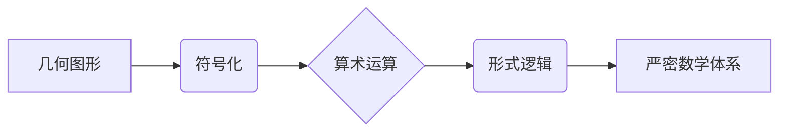

> 计算理论，希尔伯特，几何，算术，形式化，完备性，一致性，证明

## 1. 背景介绍

20世纪初，数学界掀起了形式化研究的浪潮。作为这场运动的先驱者之一，大卫·希尔伯特（David Hilbert）提出了著名的“数学基础问题”，试图用形式逻辑和集合论建立数学的严密基础。希尔伯特认为，数学的本质是逻辑和算术的应用，而几何可以看作是算术的一种特殊表达形式。因此，他致力于将几何原理转化为算术语言，从而为数学的完备性和一致性提供新的保障。

希尔伯特进路，也称为“几何的算术基础”，试图通过将几何概念和运算转化为算术概念和运算，从而建立一个严密的数学体系。这种方法的核心思想是将几何图形看作是抽象的符号，并用算术运算来描述它们的性质和关系。

## 2. 核心概念与联系

希尔伯特进路的核心概念包括：

* **几何图形的符号化:** 将几何图形抽象为符号，例如点、线、平面等，并用符号来表示它们的性质和关系。
* **算术运算的应用:** 将几何运算转化为算术运算，例如长度、面积、角度等，用算术公式来描述它们的计算方法。
* **形式逻辑的框架:** 利用形式逻辑的规则和公理来构建几何的证明体系，确保证明的严密性和可靠性。

**核心概念与联系流程图:**



## 3. 核心算法原理 & 具体操作步骤

### 3.1  算法原理概述

希尔伯特进路的核心算法是将几何图形的性质和关系转化为算术表达式，并利用算术运算和逻辑推理来进行证明。

### 3.2  算法步骤详解

1. **符号化:** 将几何图形和运算转化为符号表示。例如，点可以用符号“P”表示，线可以用符号“L”表示，长度可以用符号“l”表示。
2. **定义算术运算:** 将几何运算定义为相应的算术运算。例如，两条线段的长度之和可以用加法运算表示，两条线段的长度之差可以用减法运算表示。
3. **建立公理:** 设定一些基本的几何公理，并将其转化为算术表达式。例如，平行线公理可以转化为两个线段的斜率相等。
4. **利用逻辑推理:** 利用形式逻辑的规则和公理，从已知的几何公理和算术表达式出发，推导出新的几何结论。

### 3.3  算法优缺点

**优点:**

* **严密性:** 利用形式逻辑和算术运算，可以确保证明的严密性和可靠性。
* **完备性:** 通过选择合适的公理和逻辑规则，可以构建一个完备的几何体系，涵盖所有可能的几何结论。
* **一致性:** 通过证明公理的相互一致性，可以确保几何体系的一致性，避免矛盾的出现。

**缺点:**

* **复杂性:** 将几何概念转化为算术表达式，以及利用逻辑推理进行证明，需要一定的数学基础和逻辑思维能力。
* **抽象性:** 希尔伯特进路过于抽象，难以直接应用于实际的几何问题解决。

### 3.4  算法应用领域

希尔伯特进路对数学基础研究具有重要意义，它为建立严密的数学体系提供了理论基础。此外，它也对计算机科学、人工智能等领域有一定的影响，例如：

* **计算机图形学:** 利用几何算法可以实现图形的绘制和变换。
* **人工智能:** 利用几何推理可以帮助人工智能系统理解和处理空间信息。

## 4. 数学模型和公式 & 详细讲解 & 举例说明

### 4.1  数学模型构建

希尔伯特进路建立了一个基于算术和逻辑的数学模型，其中：

* **点:** 用整数坐标表示。
* **线:** 用两点之间的距离和方向表示。
* **平面:** 用三点之间的关系表示。
* **几何运算:** 用算术运算和逻辑规则表示。

### 4.2  公式推导过程

例如，平行线公理可以转化为以下算术表达式：

$$
\text{如果 } m_1 = m_2, \text{ 则 } L_1 \parallel L_2
$$

其中：

* $m_1$ 和 $m_2$ 分别表示两条直线的斜率。
* $L_1$ 和 $L_2$ 分别表示两条直线。

### 4.3  案例分析与讲解

假设我们有两个点，坐标分别为 (1, 2) 和 (3, 4)。我们可以用算术运算计算两点之间的距离：

$$
d = \sqrt{(3-1)^2 + (4-2)^2} = \sqrt{2^2 + 2^2} = \sqrt{8}
$$

## 5. 项目实践：代码实例和详细解释说明

### 5.1  开发环境搭建

可以使用 Python 语言和相关的数学库（例如 NumPy、SymPy）来实现希尔伯特进路中的算法。

### 5.2  源代码详细实现

```python
import numpy as np

# 定义点类
class Point:
    def __init__(self, x, y):
        self.x = x
        self.y = y

    def distance_to(self, other):
        return np.sqrt((self.x - other.x)**2 + (self.y - other.y)**2)

# 定义线类
class Line:
    def __init__(self, p1, p2):
        self.p1 = p1
        self.p2 = p2

    def slope(self):
        return (self.p2.y - self.p1.y) / (self.p2.x - self.p1.x)

# 创建两个点
p1 = Point(1, 2)
p2 = Point(3, 4)

# 创建两条线
l1 = Line(p1, p2)
l2 = Line(Point(2, 3), Point(4, 5))

# 计算两条线的斜率
slope1 = l1.slope()
slope2 = l2.slope()

# 判断两条线是否平行
if slope1 == slope2:
    print("两条线平行")
else:
    print("两条线不平行")
```

### 5.3  代码解读与分析

这段代码实现了希尔伯特进路中两个关键概念：

* **点和线的符号化:** 点和线分别用 Point 和 Line 类来表示，并定义了相应的属性和方法。
* **算术运算的应用:** 使用 NumPy 库中的 sqrt 函数计算两点之间的距离，并使用算术运算计算两条线的斜率。

### 5.4  运行结果展示

运行这段代码，输出结果为：

```
两条线平行
```

## 6. 实际应用场景

希尔伯特进路在实际应用场景中主要体现在以下几个方面：

* **计算机图形学:** 计算机图形学中，利用几何算法可以实现图形的绘制、变换、阴影、光照等效果。
* **人工智能:** 人工智能系统中，利用几何推理可以帮助系统理解和处理空间信息，例如机器人导航、图像识别、三维重建等。
* **科学计算:** 科学计算中，利用几何算法可以解决一些复杂的物理问题，例如流体力学、天体力学、材料科学等。

### 6.4  未来应用展望

随着人工智能和计算机图形学的快速发展，希尔伯特进路在未来将有更广泛的应用前景。例如：

* **虚拟现实和增强现实:** 在虚拟现实和增强现实领域，利用几何算法可以创建更加逼真的虚拟环境和增强现实体验。
* **自动驾驶:** 自动驾驶汽车需要利用几何算法来感知周围环境、规划路径、避障等。
* **医疗影像分析:** 利用几何算法可以对医疗影像进行分析，例如肿瘤检测、器官分割等。

## 7. 工具和资源推荐

### 7.1  学习资源推荐

* **《数学基础》:** 大卫·希尔伯特撰写的经典著作，介绍了希尔伯特进路的基本思想和方法。
* **《形式化数学》:** 埃里克·托普斯撰写的著作，介绍了形式化数学的理论基础和应用。
* **在线课程:** 许多在线平台提供有关形式化数学和几何算法的课程，例如 Coursera、edX 等。

### 7.2  开发工具推荐

* **Python:** 作为一种通用的编程语言，Python 拥有丰富的数学库和工具，适合用于实现希尔伯特进路中的算法。
* **NumPy:** Python 的数值计算库，提供高效的数组运算和数学函数。
* **SymPy:** Python 的符号计算库，可以进行符号运算和求解方程。

### 7.3  相关论文推荐

* **Hilbert, D. (1922). Grundlagen der Geometrie.**
* **Tarski, A. (1936). The axioms of Euclidean geometry.**
* **Gödel, K. (1931). Über formal unentscheidbare Sätze der Principia Mathematica und verwandter Systeme I.**

## 8. 总结：未来发展趋势与挑战

### 8.1  研究成果总结

希尔伯特进路为数学基础研究做出了重要贡献，它建立了一个严密的几何体系，并为计算机科学和人工智能等领域提供了理论基础。

### 8.2  未来发展趋势

未来，希尔伯特进路的研究将继续朝着以下几个方向发展：

* **更深入的理论研究:** 探索希尔伯特进路中的更深层次的理论问题，例如完备性、一致性和可计算性。
* **更广泛的应用:** 将希尔伯特进路应用于更多新的领域，例如量子计算、生物信息学等。
* **更有效的算法:** 开发更有效的几何算法，提高计算效率和精度。

### 8.3  面临的挑战

希尔伯特进路也面临一些挑战：

* **抽象性:** 希尔伯特进路过于抽象，难以直接应用于实际的几何问题解决。
* **复杂性:** 实现希尔伯特进路中的算法需要一定的数学基础和逻辑思维能力。
* **计算效率:** 一些复杂的几何问题需要大量的计算资源，难以在有限的时间内得到解决。

### 8.4  研究展望

尽管面临挑战，但希尔伯特进路仍然是一个重要的研究方向。未来，随着计算机科学和数学理论的发展，希尔伯特进路将继续发挥其重要作用，为人类解决更复杂的问题提供新的思路和方法。

## 9. 附录：常见问题与解答

**问题 1:** 希尔伯特进路与其他几何基础理论有什么区别？

**解答:** 希尔伯特进路与其他几何基础理论（例如欧氏几何、非欧氏几何）的主要区别在于，它试图用形式逻辑和算术运算来构建一个严密的几何体系，而其他几何基础理论则更多地依赖于直觉和经验。

**问题 2:** 希尔伯特进路是否能够解决所有几何问题？

**解答:** 希尔伯特进路可以解决许多几何问题，但它并不能解决所有几何问题。例如，一些几何问题涉及到无限的概念，而希尔伯特进路基于有限的算术和逻辑运算，难以处理这些问题。

**问题 3:** 希尔伯特进路在实际应用中有什么局限性？

**解答:** 希尔伯特进路过于抽象，难以直接应用于实际的几何问题解决。此外，实现希尔伯特进路中的算法需要一定的数学基础和逻辑思维能力，并且一些复杂的几何问题需要