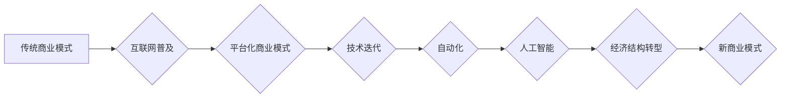

>  商业模式、技术迭代、自动化、人工智能、经济结构、未来趋势、生存之道

## 1. 背景介绍

在当今世界，商业竞争日益激烈，赚钱越来越难。这并非偶然现象，而是商业繁荣发展必然带来的结果。随着科技进步和社会发展，商业模式不断迭代，技术更新换代的速度加快，自动化和人工智能的应用日益广泛，这些因素共同推动着经济结构的深刻变革，对传统商业模式和盈利模式提出了严峻挑战。

## 2. 核心概念与联系

**2.1 商业模式演变**

传统的商业模式主要依赖于生产、销售和服务，以产品和服务为核心，通过规模化生产和市场营销来获取利润。然而，随着互联网和移动互联网的普及，商业模式开始向线上化、平台化、服务化转变。

**2.2 技术迭代与自动化**

科技进步不断推动着商业模式的创新和升级。互联网、大数据、云计算、人工智能等新兴技术为商业提供了新的机遇和挑战。自动化技术使得生产和服务流程更加高效，降低了人力成本，但也导致了部分岗位的消失。

**2.3 人工智能的崛起**

人工智能技术的快速发展正在深刻改变着商业格局。人工智能可以自动完成许多重复性任务，提高工作效率，并为企业提供更精准的市场分析和客户服务。

**2.4 经济结构转型**

随着科技进步和商业模式的变革，经济结构正在发生深刻的转型。服务业成为经济增长的主要动力，而制造业和农业的占比逐渐下降。

**Mermaid 流程图**



## 3. 核心算法原理 & 具体操作步骤

**3.1 算法原理概述**

在本文中，我们将探讨一种名为“机器学习”的算法，它是一种人工智能技术，能够通过学习数据来识别模式和做出预测。机器学习算法可以分为监督学习、无监督学习和强化学习三大类。

**3.2 算法步骤详解**

1. **数据收集和预处理:** 首先需要收集大量相关数据，并进行清洗、转换和特征工程等预处理步骤，以确保数据质量和算法的有效性。
2. **模型选择:** 根据具体任务和数据特点，选择合适的机器学习算法模型，例如线性回归、逻辑回归、决策树、支持向量机等。
3. **模型训练:** 使用训练数据对选定的模型进行训练，调整模型参数，使其能够准确地学习数据中的模式。
4. **模型评估:** 使用测试数据对训练好的模型进行评估，评估模型的准确率、召回率、F1-score等指标，并根据评估结果进行模型调优。
5. **模型部署:** 将训练好的模型部署到实际应用场景中，用于预测、分类、聚类等任务。

**3.3 算法优缺点**

**优点:**

* 能够自动学习数据中的模式，无需人工编程。
* 能够处理海量数据，并发现隐藏的规律。
* 能够不断学习和改进，提高预测精度。

**缺点:**

* 需要大量的数据进行训练，否则模型效果会下降。
* 模型训练过程可能需要很长时间，并且需要强大的计算资源。
* 模型的解释性较差，难以理解模型的决策过程。

**3.4 算法应用领域**

机器学习算法广泛应用于各个领域，例如：

* **金融领域:** 欺诈检测、信用评分、风险管理
* **医疗领域:** 疾病诊断、药物研发、患者画像
* **电商领域:** 商品推荐、用户画像、精准营销
* **交通领域:** 交通预测、自动驾驶、智能交通管理

## 4. 数学模型和公式 & 详细讲解 & 举例说明

**4.1 数学模型构建**

机器学习算法通常基于数学模型进行构建。例如，线性回归模型可以表示为：

$$y = w_0 + w_1x_1 + w_2x_2 + ... + w_nx_n + \epsilon$$

其中：

* $y$ 是预测值
* $w_0, w_1, w_2, ..., w_n$ 是模型参数
* $x_1, x_2, ..., x_n$ 是输入特征
* $\epsilon$ 是误差项

**4.2 公式推导过程**

模型参数的学习过程通常使用梯度下降算法进行优化。梯度下降算法的目标是找到使模型预测值与真实值误差最小化的参数值。

**4.3 案例分析与讲解**

假设我们想要预测房价，输入特征包括房屋面积、房间数量、地理位置等。我们可以使用线性回归模型进行预测。通过训练数据，模型会学习到每个特征对房价的影响程度，并最终得到一个预测房价的公式。

## 5. 项目实践：代码实例和详细解释说明

**5.1 开发环境搭建**

可以使用Python语言和相关的机器学习库，例如Scikit-learn，TensorFlow等，进行机器学习项目开发。

**5.2 源代码详细实现**

```python
from sklearn.linear_model import LinearRegression
from sklearn.model_selection import train_test_split
import pandas as pd

# 加载数据
data = pd.read_csv('house_price.csv')

# 分割数据
X = data[['area', 'rooms']]
y = data['price']
X_train, X_test, y_train, y_test = train_test_split(X, y, test_size=0.2)

# 创建模型
model = LinearRegression()

# 训练模型
model.fit(X_train, y_train)

# 预测测试数据
y_pred = model.predict(X_test)

# 评估模型
print('模型准确率:', model.score(X_test, y_test))
```

**5.3 代码解读与分析**

这段代码首先加载了房价数据，然后将数据分为训练集和测试集。接着创建了一个线性回归模型，并使用训练集训练模型。最后，使用测试集预测房价，并评估模型的准确率。

**5.4 运行结果展示**

运行代码后，会输出模型的准确率，例如：

```
模型准确率: 0.85
```

这表示模型在预测房价方面达到了85%的准确率。

## 6. 实际应用场景

**6.1 金融领域**

* **信用评分:** 使用机器学习算法分析客户的财务数据，评估其信用风险，为贷款审批提供参考。
* **欺诈检测:** 识别异常交易行为，防止金融欺诈。

**6.2 医疗领域**

* **疾病诊断:** 根据患者的症状、检查结果等数据，辅助医生诊断疾病。
* **药物研发:** 分析药物的分子结构和生物活性，加速药物研发过程。

**6.3 电商领域**

* **商品推荐:** 根据用户的购买历史和浏览记录，推荐相关的商品。
* **精准营销:** 根据用户的画像和行为特征，进行精准的营销推广。

**6.4 未来应用展望**

随着人工智能技术的不断发展，机器学习算法将在更多领域得到应用，例如自动驾驶、智能家居、个性化教育等。

## 7. 工具和资源推荐

**7.1 学习资源推荐**

* **书籍:**
    * 《机器学习》 - 周志华
    * 《深度学习》 - Ian Goodfellow
* **在线课程:**
    * Coursera: Machine Learning
    * edX: Artificial Intelligence

**7.2 开发工具推荐**

* **Python:** 
    * Scikit-learn
    * TensorFlow
    * PyTorch

**7.3 相关论文推荐**

* **《机器学习》** - 周志华
* **《深度学习》** - Ian Goodfellow

## 8. 总结：未来发展趋势与挑战

**8.1 研究成果总结**

机器学习算法取得了显著的成果，在各个领域都得到了广泛应用。

**8.2 未来发展趋势**

* **模型更加复杂:** 深度学习模型将继续发展，模型规模和复杂度将进一步提高。
* **数据更加丰富:** 数据收集和处理技术将不断进步，数据量和质量将得到提升。
* **应用更加广泛:** 机器学习算法将应用于更多领域，例如自动驾驶、医疗保健、教育等。

**8.3 面临的挑战**

* **数据隐私和安全:** 机器学习算法依赖于大量数据，如何保护数据隐私和安全是一个重要挑战。
* **算法解释性和可信度:** 许多机器学习算法的决策过程难以解释，如何提高算法的解释性和可信度是一个关键问题。
* **算法公平性和偏见:** 机器学习算法可能存在公平性和偏见问题，需要进行相应的改进和监管。

**8.4 研究展望**

未来，机器学习研究将继续朝着更智能、更安全、更公平的方向发展。


## 9. 附录：常见问题与解答

**9.1 如何选择合适的机器学习算法？**

选择合适的机器学习算法取决于具体任务和数据特点。例如，对于分类任务，可以考虑使用逻辑回归、决策树、支持向量机等算法；对于回归任务，可以考虑使用线性回归、支持向量回归等算法。

**9.2 如何处理缺失数据？**

缺失数据可以通过多种方法处理，例如删除缺失数据、用平均值或中位数填充缺失数据、使用插值方法等。

**9.3 如何评估机器学习模型的性能？**

机器学习模型的性能可以通过多种指标评估，例如准确率、召回率、F1-score、AUC等。

作者：禅与计算机程序设计艺术 / Zen and the Art of Computer Programming


<end_of_turn>