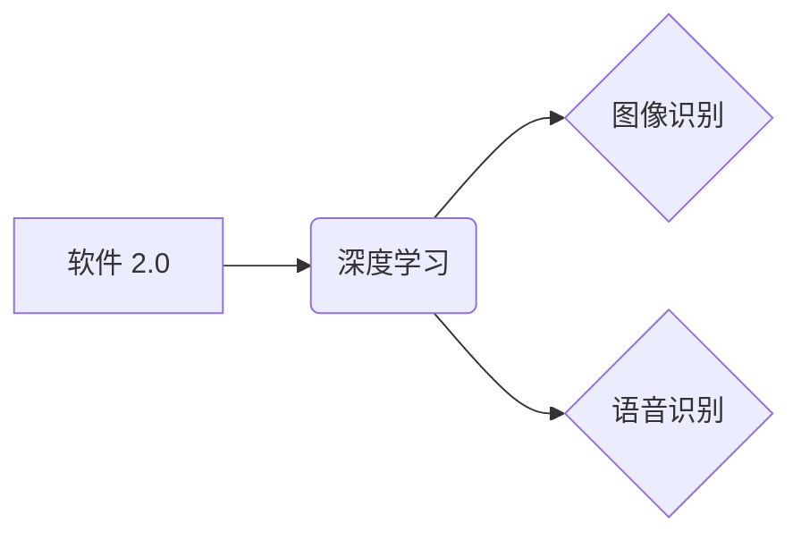

> 软件 2.0, 图像识别, 语音识别, 深度学习, 神经网络, 计算机视觉, 自然语言处理, 算法原理, 应用场景

## 1. 背景介绍

软件 2.0 时代正在到来，它标志着软件开发从传统的代码编写转向更智能、更自动化、更接近人类思维的方式。深度学习作为人工智能的核心技术，正在推动软件 2.0 的发展，并为图像识别和语音识别等领域带来了革命性的变革。

传统的软件开发依赖于人工编写规则和逻辑，而深度学习则通过大量的训练数据，让机器自动学习特征和模式。这使得软件能够更灵活地适应复杂环境，并实现更精准、更智能的应用。

图像识别和语音识别是软件 2.0 的典型应用领域，它们在各个行业都发挥着越来越重要的作用。例如，在医疗领域，图像识别技术可以辅助医生诊断疾病；在金融领域，语音识别技术可以提高客户服务效率；在智能家居领域，图像识别和语音识别技术可以实现更智能的交互体验。

## 2. 核心概念与联系

**2.1 图像识别**

图像识别是指计算机能够理解和解释图像内容的技术。它涉及到图像的特征提取、分类、识别和理解等多个环节。

**2.2 语音识别**

语音识别是指计算机能够将语音信号转换为文本的技术。它涉及到语音信号的采集、预处理、特征提取、模型训练和解码等多个环节。

**2.3 深度学习**

深度学习是一种机器学习的子领域，它利用多层神经网络来模拟人类大脑的学习过程。深度学习算法能够自动学习图像和语音的复杂特征，从而实现更精准的识别和理解。

**2.4 软件 2.0**

软件 2.0 是一种基于人工智能和深度学习的新一代软件开发模式。它强调智能化、自动化和可扩展性，能够更灵活地适应复杂环境和用户需求。

**2.5 核心概念关系图**



## 3. 核心算法原理 & 具体操作步骤

### 3.1  算法原理概述

图像识别和语音识别算法的核心原理都是基于深度学习，特别是卷积神经网络（CNN）和循环神经网络（RNN）。

* **卷积神经网络（CNN）**：CNN 擅长处理图像数据，它通过卷积操作提取图像的特征，并利用池化操作降低特征维度，最终实现图像分类、识别和理解。

* **循环神经网络（RNN）**：RNN 擅长处理序列数据，例如语音信号。它通过循环结构记忆过去的输入信息，从而能够理解语音信号的上下文信息，并实现语音识别。

### 3.2  算法步骤详解

**3.2.1 图像识别算法步骤**

1. **数据预处理**: 对图像进行尺寸调整、归一化等预处理操作，以提高算法的性能。
2. **特征提取**: 使用 CNN 提取图像的特征，例如边缘、纹理、形状等。
3. **分类**: 将提取的特征输入分类器，例如支持向量机（SVM）或随机森林，实现图像的分类。
4. **识别**: 对分类结果进行进一步的识别，例如识别物体、场景或人物。

**3.2.2 语音识别算法步骤**

1. **语音信号采集**: 使用麦克风采集语音信号。
2. **语音信号预处理**: 对语音信号进行降噪、增益调整等预处理操作，以提高算法的性能。
3. **特征提取**: 使用 MFCC 等方法提取语音信号的特征，例如音调、音色、语音能量等。
4. **模型训练**: 使用 RNN 或其他深度学习模型训练语音识别模型。
5. **语音解码**: 将模型输出的特征序列解码成文本。

### 3.3  算法优缺点

**3.3.1 图像识别算法**

* **优点**: 识别精度高，能够处理复杂图像场景。
* **缺点**: 需要大量的训练数据，训练时间长，计算资源消耗大。

**3.3.2 语音识别算法**

* **优点**: 能够实现实时语音识别，用户体验良好。
* **缺点**: 识别精度受环境噪声影响较大，对方言和口音识别能力有限。

### 3.4  算法应用领域

* **图像识别**: 医疗诊断、自动驾驶、人脸识别、物体检测、图像检索等。
* **语音识别**: 语音助手、语音搜索、语音翻译、自动字幕生成、语音控制等。

## 4. 数学模型和公式 & 详细讲解 & 举例说明

### 4.1  数学模型构建

**4.1.1 卷积神经网络模型**

CNN 模型由多个卷积层、池化层和全连接层组成。

* **卷积层**: 使用卷积核对图像进行卷积操作，提取图像特征。
* **池化层**: 对卷积层的输出进行池化操作，降低特征维度，提高模型的鲁棒性。
* **全连接层**: 将池化层的输出连接到全连接层，实现图像分类或识别。

**4.1.2 循环神经网络模型**

RNN 模型由多个循环单元组成，每个循环单元接收当前输入和过去的隐藏状态，并输出新的隐藏状态和输出。

* **隐藏状态**: 存储了RNN模型过去的输入信息，用于理解语音信号的上下文信息。
* **输出**: RNN模型对当前输入的预测结果，例如语音信号的下一个音素。

**4.1.3 数学模型公式**

* **卷积操作**: $y(i,j) = \sum_{m=0}^{M-1} \sum_{n=0}^{N-1} x(i+m,j+n) * w(m,n)$

* **池化操作**: $y(i,j) = max(x(i,j), x(i+1,j), x(i,j+1), x(i+1,j+1))$

* **循环单元**: $h_t = f(W_{hh}h_{t-1} + W_{xh}x_t + b_h)$

### 4.2  公式推导过程

* **卷积操作**: 卷积操作通过卷积核对图像进行滑动计算，提取图像局部特征。卷积核的权重参数可以通过训练学习得到。

* **池化操作**: 池化操作通过取最大值或平均值等方式降低特征维度，提高模型的鲁棒性。

* **循环单元**: 循环单元通过门控机制控制信息的流动，实现对语音信号的上下文信息记忆。

### 4.3  案例分析与讲解

* **图像识别**: 使用 CNN 模型识别猫狗图像，训练数据包含大量猫狗图像，模型能够学习到猫狗的特征，并实现准确的识别。

* **语音识别**: 使用 RNN 模型识别语音信号，训练数据包含大量语音数据，模型能够学习到语音信号的上下文信息，并实现准确的语音识别。

## 5. 项目实践：代码实例和详细解释说明

### 5.1  开发环境搭建

* **操作系统**: Ubuntu 18.04
* **编程语言**: Python 3.6
* **深度学习框架**: TensorFlow 2.0

### 5.2  源代码详细实现

```python
# 图像识别代码示例

import tensorflow as tf

# 定义 CNN 模型
model = tf.keras.models.Sequential([
    tf.keras.layers.Conv2D(32, (3, 3), activation='relu', input_shape=(28, 28, 1)),
    tf.keras.layers.MaxPooling2D((2, 2)),
    tf.keras.layers.Conv2D(64, (3, 3), activation='relu'),
    tf.keras.layers.MaxPooling2D((2, 2)),
    tf.keras.layers.Flatten(),
    tf.keras.layers.Dense(10, activation='softmax')
])

# 编译模型
model.compile(optimizer='adam',
              loss='sparse_categorical_crossentropy',
              metrics=['accuracy'])

# 训练模型
model.fit(x_train, y_train, epochs=5)

# 语音识别代码示例

import tensorflow as tf

# 定义 RNN 模型
model = tf.keras.models.Sequential([
    tf.keras.layers.Embedding(input_dim=vocab_size, output_dim=embedding_dim),
    tf.keras.layers.LSTM(units=128),
    tf.keras.layers.Dense(units=vocab_size, activation='softmax')
])

# 编译模型
model.compile(optimizer='adam',
              loss='sparse_categorical_crossentropy',
              metrics=['accuracy'])

# 训练模型
model.fit(x_train, y_train, epochs=10)
```

### 5.3  代码解读与分析

* **图像识别代码**: 使用 TensorFlow 框架构建了一个简单的 CNN 模型，用于识别 MNIST 手写数字数据集。模型包含卷积层、池化层和全连接层，并使用 Adam 优化器和交叉熵损失函数进行训练。

* **语音识别代码**: 使用 TensorFlow 框架构建了一个简单的 RNN 模型，用于识别文本序列。模型包含嵌入层、LSTM 层和全连接层，并使用 Adam 优化器和交叉熵损失函数进行训练。

### 5.4  运行结果展示

* **图像识别**: 模型训练完成后，可以对测试数据进行预测，并计算模型的准确率。

* **语音识别**: 模型训练完成后，可以对语音信号进行识别，并输出识别结果。

## 6. 实际应用场景

### 6.1  医疗领域

* **疾病诊断**: 使用图像识别技术辅助医生诊断疾病，例如癌症、心血管疾病等。
* **病灶定位**: 使用图像识别技术定位病灶，提高手术的精准度。
* **语音助手**: 使用语音识别技术开发医疗语音助手，帮助医生记录病历、查询患者信息等。

### 6.2  金融领域

* **欺诈检测**: 使用图像识别技术识别伪造的银行卡、身份证等。
* **风险评估**: 使用语音识别技术分析客户的语音特征，评估客户的信用风险。
* **语音客服**: 使用语音识别技术开发语音客服系统，提高客户服务效率。

### 6.3  智能家居领域

* **人脸识别**: 使用图像识别技术实现智能门锁、智能家居设备的控制。
* **语音控制**: 使用语音识别技术控制智能家居设备，例如灯光、空调、电视等。
* **场景识别**: 使用图像识别技术识别家居场景，例如客厅、卧室、厨房等，并提供相应的服务。

### 6.4  未来应用展望

* **更精准的图像识别**: 随着深度学习算法的不断发展，图像识别技术将更加精准，能够识别更复杂、更细微的图像特征。
* **更自然的语音识别**: 随着语音识别技术的不断发展，语音识别将更加自然流畅，能够理解更复杂的语音表达。
* **更智能的应用场景**: 随着图像识别和语音识别技术的不断发展，它们将应用于更多更智能的场景，例如自动驾驶、机器人、虚拟现实等。

## 7. 工具和资源推荐

### 7.1  学习资源推荐

* **书籍**:
    * 深度学习
    * 构建深度学习模型
    * 自然语言处理
* **在线课程**:
    * Coursera 深度学习课程
    * Udacity 深度学习工程师课程
    * fast.ai 深度学习课程

### 7.2  开发工具推荐

* **深度学习框架**: TensorFlow, PyTorch, Keras
* **编程语言**: Python
* **云平台**: Google Cloud Platform, Amazon Web Services, Microsoft Azure

### 7.3  相关论文推荐

* **图像识别**:
    * AlexNet: ImageNet Classification with Deep Convolutional Neural Networks
    * VGGNet: Very Deep Convolutional Networks for Large-Scale Image Recognition
    * ResNet: Deep Residual Learning for Image Recognition
* **