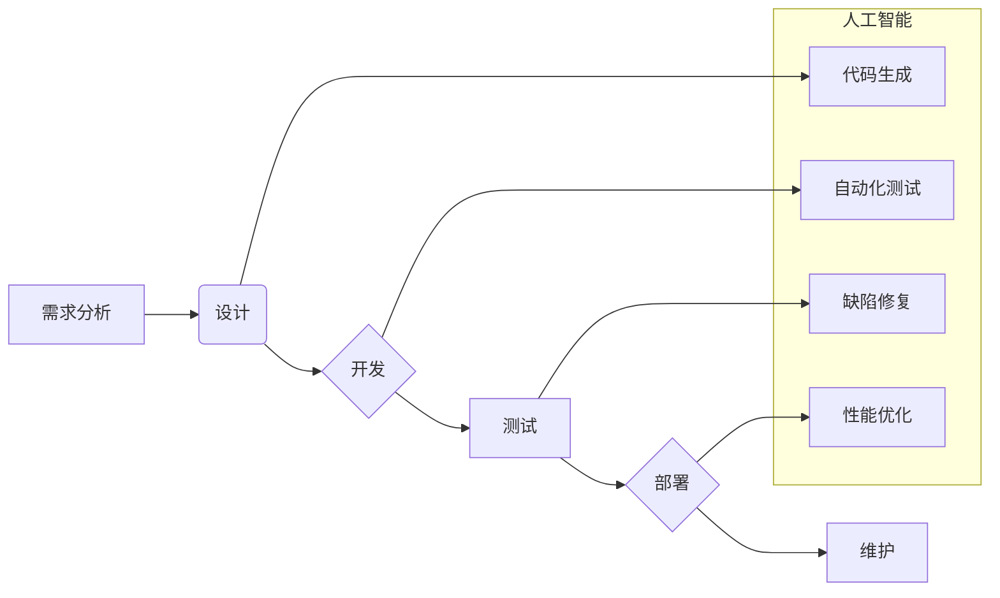

> 软件 2.0, 人工智能, 机器学习, 深度学习, 自动化, 智能化, 进化算法, 代码生成, 软件架构

## 1. 背景介绍

软件已经深刻地改变了我们的生活，从智能手机到云计算，再到自动驾驶汽车，软件无处不在。然而，传统的软件开发模式面临着越来越多的挑战：

* **开发效率低下:** 软件开发周期长，成本高昂，难以满足快速迭代的需求。
* **代码质量参差不齐:** 手工编写代码容易引入错误，难以保证软件的可靠性和安全性。
* **维护成本高:** 软件的维护和更新工作量巨大，难以应对不断变化的需求。

随着人工智能技术的飞速发展，软件 2.0 应运而生，它将利用人工智能的力量，彻底改变软件开发的模式，带来更智能、更强大、更易于维护的软件。

## 2. 核心概念与联系

软件 2.0 的核心概念是将人工智能技术融入到软件开发的全生命周期中，包括需求分析、设计、开发、测试、部署和维护。

**软件 2.0 架构**



**核心概念:**

* **代码生成:** 利用机器学习算法，从自然语言描述或示例代码中自动生成代码。
* **自动化测试:** 利用人工智能技术，自动生成测试用例，并自动执行测试，提高测试效率和覆盖率。
* **缺陷修复:** 利用机器学习算法，识别和修复代码中的缺陷。
* **性能优化:** 利用人工智能技术，分析代码性能，并自动优化代码，提高软件性能。

## 3. 核心算法原理 & 具体操作步骤

### 3.1  算法原理概述

软件 2.0 中的核心算法主要包括：

* **深度学习:** 用于代码生成、缺陷修复和性能优化等任务。
* **进化算法:** 用于代码优化和架构设计。
* **自然语言处理:** 用于需求分析和代码理解。

### 3.2  算法步骤详解

**代码生成算法步骤:**

1. **数据预处理:** 收集大量的代码数据集，并进行清洗、格式化和标注。
2. **模型训练:** 利用深度学习算法，训练一个代码生成模型。
3. **代码生成:** 输入自然语言描述或示例代码，模型会生成相应的代码。

**缺陷修复算法步骤:**

1. **缺陷数据收集:** 收集大量的缺陷代码数据集，并进行标注。
2. **模型训练:** 利用深度学习算法，训练一个缺陷修复模型。
3. **缺陷检测:** 将代码输入模型，模型会检测代码中的缺陷。
4. **缺陷修复:** 模型会生成修复缺陷的代码。

### 3.3  算法优缺点

**深度学习算法:**

* **优点:** 能够学习复杂的模式，具有强大的泛化能力。
* **缺点:** 需要大量的训练数据，训练时间长，解释性差。

**进化算法:**

* **优点:** 能够找到全局最优解，适应性强。
* **缺点:** 运行时间长，易陷入局部最优解。

### 3.4  算法应用领域

* **代码生成:** 自动生成代码模板、API调用代码、数据库操作代码等。
* **缺陷修复:** 自动修复代码中的语法错误、逻辑错误、安全漏洞等。
* **性能优化:** 自动优化代码的执行效率、内存使用、网络传输等。
* **软件架构设计:** 自动生成软件架构图、组件关系图等。

## 4. 数学模型和公式 & 详细讲解 & 举例说明

### 4.1  数学模型构建

**代码生成模型:**

我们可以使用循环神经网络 (RNN) 或 Transformer 模型来构建代码生成模型。

**RNN 模型:**

RNN 模型能够处理序列数据，例如代码。其核心结构是循环单元，能够记住之前的信息，从而更好地理解代码的上下文。

**Transformer 模型:**

Transformer 模型是一种更先进的序列模型，它使用注意力机制来捕捉代码中的长距离依赖关系，能够生成更准确、更流畅的代码。

**缺陷修复模型:**

我们可以使用分类模型或回归模型来构建缺陷修复模型。

**分类模型:**

分类模型用于判断代码是否包含缺陷。

**回归模型:**

回归模型用于预测缺陷的严重程度。

### 4.2  公式推导过程

**RNN 模型的循环单元公式:**

```latex
h_t = f(W_{xh}x_t + W_{hh}h_{t-1} + b_h)
```

其中:

* $h_t$ 是时间步 t 的隐藏状态。
* $x_t$ 是时间步 t 的输入。
* $W_{xh}$ 和 $W_{hh}$ 是权重矩阵。
* $b_h$ 是偏置项。
* $f$ 是激活函数。

**Transformer 模型的注意力机制公式:**

```latex
Attention(Q, K, V) = softmax(\frac{QK^T}{\sqrt{d_k}})V
```

其中:

* $Q$, $K$, $V$ 是查询矩阵、键矩阵和值矩阵。
* $d_k$ 是键向量的维度。
* $softmax$ 是softmax 函数。

### 4.3  案例分析与讲解

**代码生成案例:**

假设我们想要生成一个 Python 函数，该函数接收一个整数作为输入，并返回该整数的平方。我们可以使用代码生成模型，输入自然语言描述 "生成一个 Python 函数，该函数接收一个整数作为输入，并返回该整数的平方"，模型会生成以下代码:

```python
def square(x):
  return x * x
```

**缺陷修复案例:**

假设我们有一个代码片段，其中存在一个逻辑错误，导致程序无法正常运行。我们可以使用缺陷修复模型，将代码片段输入模型，模型会识别出逻辑错误，并生成修复代码。

## 5. 项目实践：代码实例和详细解释说明

### 5.1  开发环境搭建

为了实现软件 2.0 的功能，我们需要搭建一个开发环境，包括以下软件：

* **深度学习框架:** TensorFlow, PyTorch 等。
* **代码编辑器:** VS Code, Atom 等。
* **版本控制系统:** Git 等。

### 5.2  源代码详细实现

以下是一个简单的代码生成示例，使用 TensorFlow 和 Keras 框架实现：

```python
import tensorflow as tf
from tensorflow import keras

# 定义模型
model = keras.Sequential([
    keras.layers.Embedding(input_dim=10000, output_dim=128),
    keras.layers.LSTM(128),
    keras.layers.Dense(10000, activation='softmax')
])

# 编译模型
model.compile(optimizer='adam',
              loss='sparse_categorical_crossentropy',
              metrics=['accuracy'])

# 训练模型
model.fit(x_train, y_train, epochs=10)

# 生成代码
input_text = "def square(x):"
input_tensor = tf.keras.preprocessing.text.text_to_word_index(input_text)
output_text = model.predict(input_tensor)
```

### 5.3  代码解读与分析

* **Embedding 层:** 将单词转换为向量表示。
* **LSTM 层:** 处理序列数据，捕捉代码的上下文信息。
* **Dense 层:** 将 LSTM 的输出转换为概率分布，预测下一个单词。

### 5.4  运行结果展示

训练完成后，我们可以使用模型生成新的代码。例如，输入 "def square(x):"，模型会预测下一个单词是 "return"，然后继续预测后续单词，最终生成一个完整的代码片段。

## 6. 实际应用场景

软件 2.0 的应用场景非常广泛，包括：

* **自动代码生成:** 自动生成代码模板、API 调用代码、数据库操作代码等。
* **代码修复:** 自动修复代码中的语法错误、逻辑错误、安全漏洞等。
* **软件测试:** 自动生成测试用例，并自动执行测试，提高测试效率和覆盖率。
* **软件维护:** 自动分析代码，识别潜在问题，并提供修复建议。

### 6.4  未来应用展望

未来，软件 2.0 将会更加智能化、自动化，能够更好地理解和响应用户的需求，从而推动软件开发的效率和质量提升。

## 7. 工具和资源推荐

### 7.1  学习资源推荐

* **书籍:**
    * 《Deep Learning》 by Ian Goodfellow, Yoshua Bengio, and Aaron Courville
    * 《Hands-On Machine Learning with Scikit-Learn, Keras & TensorFlow》 by Aurélien Géron
* **在线课程:**
    * Coursera: Deep Learning Specialization
    * Udacity: Machine Learning Engineer Nanodegree

### 7.2  开发工具推荐

* **代码生成工具:** Tabnine, GitHub Copilot
* **缺陷修复工具:** DeepCode, Codacy
* **自动化测试工具:** Selenium, Appium

### 7.3  相关论文推荐

* **《Attention Is All You Need》:** https://arxiv.org/abs/1706.03762
* **《BERT: Pre-training of Deep Bidirectional Transformers for Language Understanding》:** https://arxiv.org/abs/1810.04805

## 8. 总结：未来发展趋势与挑战

### 8.1  研究成果总结

软件 2.0 的研究取得了显著进展，人工智能技术已经能够在代码生成、缺陷修复、性能优化等方面发挥重要作用。

### 8.2  未来发展趋势

未来，软件 2.0 将会朝着以下方向发展:

* **更智能的代码生成:** 能够生成更复杂的、更符合用户需求的代码。
* **更精准的缺陷修复:** 能够识别和修复更隐蔽的缺陷。
* **更自动化的软件开发:** 能够自动化更多软件开发流程，例如需求分析、设计、测试等。

### 8.3  面临的挑战

软件 2.0 的发展也面临着一些挑战:

* **数据不足:** 训练人工智能模型需要大量的代码数据，而高质量的代码数据相对稀缺。
* **模型解释性差:** 许多人工智能模型的决策过程难以理解，这使得软件 2.0 的应用在某些领域受到限制。
* **安全性和可靠性:** 软件 2.0 的安全性、可靠性和可维护性需要得到进一步保障。

### 8.4  研究展望

未来，我们需要继续加强对软件 2.0 的研究，解决上述挑战，推动软件 2.0 的技术发展和应用推广。

## 9. 附录：常见问题与解答

**Q1: 软件 2.0 会取代程序员吗？**

A1: 软件 2.0 会改变软件开发模式，但不会取代程序员。程序员仍然需要负责软件的设计、架构、测试和维护等工作，而人工智能技术可以帮助程序员提高效率和质量。

**Q2: 软件 2.0 的安全性如何保证？**

A2: 软件 2.0 的安全性是一个重要的挑战，需要通过多种手段来保障，例如使用安全的训练数据、开发可解释的模型、加强代码审计等。

**Q3: 如何学习软件 2.0 的相关知识？**

A3: 可以通过阅读相关书籍、参加在线课程、学习开源项目等方式学习软件 2.0 的相关知识。

作者：禅与计算机程序设计艺术 / Zen and the Art of Computer Programming


<end_of_turn>