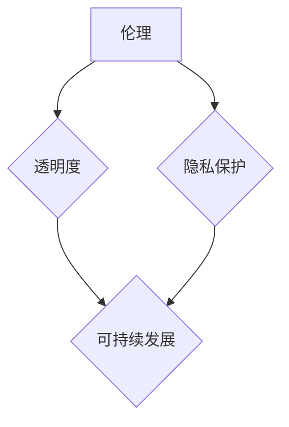

> 软件 2.0, 社会责任, 科技向善, 人工智能, 伦理, 可持续发展, 透明度, 隐私保护

## 1. 背景介绍

软件已经深刻地改变了我们的生活，从智能手机到自动驾驶汽车，再到医疗诊断和金融交易，软件无处不在。随着人工智能、大数据和云计算等技术的飞速发展，软件正进入一个新的时代——软件 2.0。

软件 2.0 具有以下特点：

* **智能化:** 软件能够学习、适应和自主决策，具备更强的智能能力。
* **连接性:** 软件能够连接各种设备和系统，形成一个庞大的网络生态系统。
* **个性化:** 软件能够根据用户的需求和喜好进行定制化，提供更个性化的服务。
* **数据驱动:** 软件能够利用海量数据进行分析和预测，提供更精准的决策支持。

然而，软件 2.0 的发展也带来了新的挑战和风险。例如，人工智能算法的偏见问题、数据隐私泄露、网络安全威胁等。因此，我们需要认真思考软件 2.0 的社会责任，确保科技向善，造福人类。

## 2. 核心概念与联系

软件 2.0 的社会责任的核心概念包括：

* **伦理:** 软件的开发和应用必须遵循伦理原则，避免造成伤害或不公平。
* **透明度:** 软件的决策过程应该透明可解释，用户能够了解软件是如何工作的。
* **隐私保护:** 软件应该保护用户的隐私数据，避免滥用或泄露。
* **可持续发展:** 软件的开发和应用应该考虑环境和社会的影响，促进可持续发展。

这些概念相互关联，共同构成了软件 2.0 的社会责任框架。



## 3. 核心算法原理 & 具体操作步骤

### 3.1  算法原理概述

在软件 2.0 中，人工智能算法扮演着至关重要的角色。其中，深度学习算法是目前最先进的人工智能算法之一。深度学习算法通过多层神经网络来模拟人类大脑的学习过程，能够从海量数据中学习复杂的模式和特征。

### 3.2  算法步骤详解

深度学习算法的训练过程可以概括为以下步骤：

1. **数据预处理:** 将原始数据进行清洗、转换和格式化，使其适合深度学习算法的训练。
2. **网络结构设计:** 根据具体任务需求，设计深度神经网络的结构，包括神经元数量、层数和激活函数等。
3. **参数初始化:** 为神经网络中的参数进行随机初始化。
4. **前向传播:** 将输入数据通过神经网络进行前向传播，得到输出结果。
5. **损失函数计算:** 计算输出结果与真实值的差异，即损失函数值。
6. **反向传播:** 利用梯度下降算法，反向传播损失函数值，更新神经网络的参数。
7. **迭代训练:** 重复步骤 4-6，直到损失函数值达到预设的阈值。

### 3.3  算法优缺点

**优点:**

* 能够学习复杂的模式和特征。
* 性能优于传统机器学习算法。
* 应用范围广泛，包括图像识别、自然语言处理、语音识别等。

**缺点:**

* 训练数据量大，计算资源消耗高。
* 训练过程复杂，需要专业知识和经验。
* 模型解释性差，难以理解模型的决策过程。

### 3.4  算法应用领域

深度学习算法在各个领域都有广泛的应用，例如：

* **医疗诊断:** 利用深度学习算法分析医学图像，辅助医生诊断疾病。
* **金融风险控制:** 利用深度学习算法分析金融数据，识别和预测金融风险。
* **自动驾驶:** 利用深度学习算法识别道路场景，控制车辆行驶。
* **个性化推荐:** 利用深度学习算法分析用户行为，推荐个性化商品和服务。

## 4. 数学模型和公式 & 详细讲解 & 举例说明

### 4.1  数学模型构建

深度学习算法的核心是神经网络模型。神经网络模型可以看作是一个由多个层组成的图结构，每个层包含多个神经元。神经元之间通过连接进行信息传递，每个连接都有一个权重。

### 4.2  公式推导过程

神经网络的输出结果可以通过以下公式计算：

$$
y = f(W_L x_L + b_L)
$$

其中：

* $y$ 是神经网络的输出结果。
* $f$ 是激活函数。
* $W_L$ 是最后一层的权重矩阵。
* $x_L$ 是最后一层的输入向量。
* $b_L$ 是最后一层的偏置向量。

### 4.3  案例分析与讲解

例如，在图像识别任务中，深度学习算法可以将图像像素值作为输入，经过多层神经网络的处理，最终输出图像类别。

## 5. 项目实践：代码实例和详细解释说明

### 5.1  开发环境搭建

为了实现深度学习算法的训练和应用，需要搭建相应的开发环境。常用的开发环境包括：

* **Python:** 深度学习算法的编程语言。
* **TensorFlow/PyTorch:** 深度学习框架。
* **GPU:** 加速深度学习算法训练的硬件。

### 5.2  源代码详细实现

以下是一个使用 TensorFlow 实现图像分类的简单代码示例：

```python
import tensorflow as tf

# 定义模型结构
model = tf.keras.models.Sequential([
    tf.keras.layers.Conv2D(32, (3, 3), activation='relu', input_shape=(28, 28, 1)),
    tf.keras.layers.MaxPooling2D((2, 2)),
    tf.keras.layers.Conv2D(64, (3, 3), activation='relu'),
    tf.keras.layers.MaxPooling2D((2, 2)),
    tf.keras.layers.Flatten(),
    tf.keras.layers.Dense(10, activation='softmax')
])

# 编译模型
model.compile(optimizer='adam',
              loss='sparse_categorical_crossentropy',
              metrics=['accuracy'])

# 训练模型
model.fit(x_train, y_train, epochs=5)

# 评估模型
loss, accuracy = model.evaluate(x_test, y_test)
print('Test loss:', loss)
print('Test accuracy:', accuracy)
```

### 5.3  代码解读与分析

这段代码定义了一个简单的卷积神经网络模型，用于图像分类任务。模型包含两层卷积层、两层最大池化层、一层全连接层和一层输出层。

### 5.4  运行结果展示

训练完成后，可以将模型应用于新的图像数据进行分类。

## 6. 实际应用场景

软件 2.0 的社会责任在各个实际应用场景中都体现出来。例如：

* **医疗保健:** 利用人工智能算法辅助医生诊断疾病、个性化治疗方案。
* **教育:** 利用人工智能算法提供个性化学习辅导、智能评估系统。
* **环境保护:** 利用人工智能算法监测环境污染、预测自然灾害。
* **社会治理:** 利用人工智能算法提高公共服务效率、预防和打击犯罪。

### 6.4  未来应用展望

未来，软件 2.0 的社会责任将更加重要。随着人工智能技术的不断发展，软件将更加智能化、个性化和连接性。我们需要更加重视软件的伦理、透明度、隐私保护和可持续发展，确保软件造福人类。

## 7. 工具和资源推荐

### 7.1  学习资源推荐

* **在线课程:** Coursera、edX、Udacity 等平台提供丰富的深度学习课程。
* **书籍:** 《深度学习》、《人工智能：一种现代方法》等书籍。
* **开源项目:** TensorFlow、PyTorch 等开源深度学习框架。

### 7.2  开发工具推荐

* **Python:** 深度学习编程语言。
* **TensorFlow/PyTorch:** 深度学习框架。
* **Jupyter Notebook:** 深度学习代码开发和调试工具。

### 7.3  相关论文推荐

* **《ImageNet Classification with Deep Convolutional Neural Networks》**
* **《Attention Is All You Need》**
* **《BERT: Pre-training of Deep Bidirectional Transformers for Language Understanding》**

## 8. 总结：未来发展趋势与挑战

### 8.1  研究成果总结

软件 2.0 的社会责任是一个重要的研究课题，已经取得了一些成果。例如，开发了多种伦理审查工具、隐私保护技术和可持续发展评估方法。

### 8.2  未来发展趋势

未来，软件 2.0 的社会责任研究将朝着以下方向发展：

* **更加注重伦理规范的制定和实施。**
* **更加重视数据隐私保护和安全。**
* **更加关注软件的社会影响和可持续发展。**
* **更加强调软件透明度和可解释性。**

### 8.3  面临的挑战

软件 2.0 的社会责任研究还面临着一些挑战：

* **技术复杂性:** 深度学习算法等新技术复杂，需要不断深入研究。
* **伦理困境:** 软件的伦理问题往往没有明确的答案，需要多方合作解决。
* **社会认知:** 大多数人对软件 2.0 的社会责任还缺乏了解，需要加强宣传和教育。

### 8.4  研究展望

我们相信，通过不断的努力，软件 2.0 将能够更好地服务于人类，造福社会。


## 9. 附录：常见问题与解答

**Q1: 软件 2.0 的伦理问题有哪些？**

**A1:** 软件 2.0 的伦理问题包括：

* **算法偏见:** 算法可能因为训练数据的原因，导致对某些群体产生偏见。
* **隐私侵犯:** 软件可能收集和使用用户的个人数据，侵犯用户的隐私。
* **责任归属:** 当软件导致负面后果时，责任应该归属谁？

**Q2: 如何确保软件 2.0 的透明度？**

**A2:** 

* 使用可解释的机器学习算法。
* 提供软件决策过程的解释文档。
* 建立公开透明的软件开发和监管机制。

**Q3: 如何促进软件 2.0 的可持续发展？**

**A3:** 

* 采用节能环保的软件开发和运行方式。
* 鼓励软件开发人员考虑软件的社会影响。
* 推广软件的可持续发展评估方法。


作者：禅与计算机程序设计艺术 / Zen and the Art of Computer Programming 
<end_of_turn>