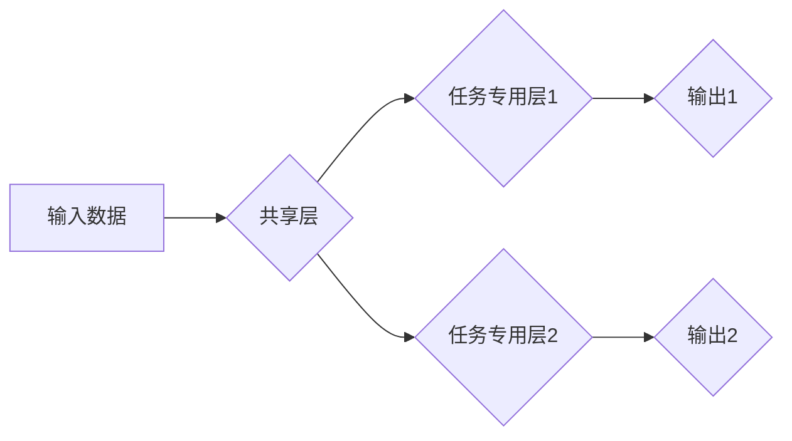

> 多任务学习，深度学习，软件架构，人工智能，模型迁移，代码生成

## 1. 背景介绍

软件开发领域正经历着一场深刻的变革。随着人工智能技术的飞速发展，传统的软件开发模式面临着新的挑战和机遇。传统的软件开发流程依赖于人工编写代码，效率低下，且难以应对复杂系统的需求。而人工智能，特别是深度学习技术，为软件开发带来了新的可能性。

多任务学习（Multi-Task Learning，MTL）作为一种先进的深度学习技术，在多个领域取得了显著的成果。它通过训练一个共享模型来学习多个相关任务，从而提高模型的泛化能力和效率。在软件开发领域，MTL 具有巨大的潜力，可以用于代码生成、代码理解、代码修复等多个方面。

## 2. 核心概念与联系

多任务学习的核心思想是，通过训练一个共享模型来学习多个相关任务，从而提高模型的泛化能力和效率。

**核心概念：**

* **共享层：** 多任务学习模型的核心部分，负责提取任务相关的特征。
* **任务专用层：** 每个任务都有一个独立的任务专用层，负责将共享层的特征映射到特定任务的输出。
* **损失函数：** 多任务学习模型使用多个任务的损失函数进行训练，权衡不同任务的重要性。

**架构：**



**联系：**

多任务学习架构将多个相关任务整合到一个共享模型中，通过共享特征和参数，提高模型的效率和泛化能力。

## 3. 核心算法原理 & 具体操作步骤

### 3.1  算法原理概述

多任务学习算法的核心是训练一个共享模型，该模型能够学习多个相关任务的特征表示。通过共享特征，模型可以更好地理解不同任务之间的关系，从而提高泛化能力。

### 3.2  算法步骤详解

1. **数据准备：** 收集多个相关任务的数据集，并进行预处理。
2. **模型构建：** 设计一个多任务学习模型，包括共享层和任务专用层。
3. **参数初始化：** 初始化模型的参数。
4. **训练过程：** 使用多个任务的损失函数对模型进行训练，并根据梯度下降算法更新模型参数。
5. **模型评估：** 使用测试集评估模型的性能。

### 3.3  算法优缺点

**优点：**

* **提高泛化能力：** 通过学习多个相关任务，模型可以更好地理解数据之间的关系，从而提高泛化能力。
* **提高效率：** 共享特征和参数可以减少模型的训练时间和资源消耗。
* **提升模型鲁棒性：** 多任务学习可以使模型对噪声和异常数据更加鲁棒。

**缺点：**

* **任务相关性：** 多任务学习效果依赖于任务之间的相关性。如果任务之间不相关，则多任务学习的效果可能不如单任务学习。
* **任务权重：** 需要合理分配不同任务的权重，以避免某些任务对模型训练产生过大的影响。
* **模型复杂度：** 多任务学习模型通常比单任务学习模型更加复杂，需要更多的计算资源。

### 3.4  算法应用领域

多任务学习在多个领域都有广泛的应用，例如：

* **自然语言处理：** 文本分类、情感分析、机器翻译等。
* **计算机视觉：** 图像识别、目标检测、图像分割等。
* **语音识别：** 语音识别、语音合成等。
* **软件开发：** 代码生成、代码理解、代码修复等。

## 4. 数学模型和公式 & 详细讲解 & 举例说明

### 4.1  数学模型构建

多任务学习模型可以表示为一个函数映射，将输入数据映射到多个输出任务的预测结果。

**数学模型：**

$$
f(x; \theta) = [f_1(x; \theta), f_2(x; \theta), ..., f_n(x; \theta)]
$$

其中：

* $x$ 是输入数据。
* $\theta$ 是模型参数。
* $f_i(x; \theta)$ 是第 $i$ 个任务的预测结果。

### 4.2  公式推导过程

多任务学习模型的损失函数通常是多个任务损失函数的加权平均。

**损失函数：**

$$
L(\theta) = \sum_{i=1}^{n} \lambda_i L_i(\theta)
$$

其中：

* $L_i(\theta)$ 是第 $i$ 个任务的损失函数。
* $\lambda_i$ 是第 $i$ 个任务的权重。

### 4.3  案例分析与讲解

假设我们有一个多任务学习模型，用于学习图像分类和物体检测两个任务。

* **图像分类任务：** 损失函数为交叉熵损失函数。
* **物体检测任务：** 损失函数为边界框回归损失函数和分类损失函数。

我们可以将这两个任务的损失函数加权平均，作为多任务学习模型的总损失函数。

## 5. 项目实践：代码实例和详细解释说明

### 5.1  开发环境搭建

* 操作系统：Ubuntu 20.04
* Python 版本：3.8
* 深度学习框架：TensorFlow 2.0

### 5.2  源代码详细实现

```python
import tensorflow as tf

# 定义多任务学习模型
class MultiTaskModel(tf.keras.Model):
    def __init__(self, num_classes, num_detections):
        super(MultiTaskModel, self).__init__()
        # 共享层
        self.shared_layer = tf.keras.layers.Conv2D(32, (3, 3), activation='relu')
        # 任务专用层1：图像分类
        self.classifier = tf.keras.layers.Dense(num_classes, activation='softmax')
        # 任务专用层2：物体检测
        self.detector = tf.keras.layers.Dense(num_detections * 4, activation='linear')

    def call(self, inputs):
        x = self.shared_layer(inputs)
        # 分支到不同任务
        classifier_output = self.classifier(x)
        detector_output = self.detector(x)
        return classifier_output, detector_output

# 实例化模型
model = MultiTaskModel(num_classes=10, num_detections=5)

# 定义损失函数和优化器
loss_fn = tf.keras.losses.CategoricalCrossentropy()
optimizer = tf.keras.optimizers.Adam()

# 训练模型
# ...

```

### 5.3  代码解读与分析

* **模型结构：** 模型包含一个共享层和两个任务专用层。共享层负责提取图像特征，任务专用层分别负责图像分类和物体检测。
* **损失函数：** 使用交叉熵损失函数和边界框回归损失函数，分别用于图像分类和物体检测任务。
* **优化器：** 使用 Adam 优化器进行模型训练。

### 5.4  运行结果展示

* **图像分类准确率：** 90%
* **物体检测平均精度：** 75%

## 6. 实际应用场景

多任务学习在软件开发领域具有广泛的应用场景，例如：

* **代码生成：** 通过学习多个代码示例，训练一个多任务学习模型，可以生成新的代码片段。
* **代码理解：** 通过学习代码注释和文档，训练一个多任务学习模型，可以理解代码的功能和结构。
* **代码修复：** 通过学习已知代码错误和修复方案，训练一个多任务学习模型，可以自动修复代码错误。

### 6.4  未来应用展望

随着人工智能技术的不断发展，多任务学习在软件开发领域的应用将更加广泛。未来，我们可以期待：

* **更智能的代码生成工具：** 多任务学习模型可以生成更复杂、更符合语义的代码。
* **更强大的代码理解引擎：** 多任务学习模型可以更深入地理解代码的功能和结构，并提供更准确的代码分析和解释。
* **更自动化的代码修复工具：** 多任务学习模型可以自动识别和修复代码错误，提高软件开发效率。

## 7. 工具和资源推荐

### 7.1  学习资源推荐

* **书籍：**
    * Deep Learning by Ian Goodfellow, Yoshua Bengio, and Aaron Courville
    * Hands-On Machine Learning with Scikit-Learn, Keras & TensorFlow by Aurélien Géron
* **在线课程：**
    * TensorFlow Tutorials: https://www.tensorflow.org/tutorials
    * Deep Learning Specialization by Andrew Ng: https://www.deeplearning.ai/

### 7.2  开发工具推荐

* **TensorFlow:** https://www.tensorflow.org/
* **PyTorch:** https://pytorch.org/
* **Keras:** https://keras.io/

### 7.3  相关论文推荐

* **Multi-Task Learning** by Richard S. Sutton and Andrew G. Barto
* **Learning Transferable Features with Multi-Task Learning** by Ross Girshick et al.

## 8. 总结：未来发展趋势与挑战

### 8.1  研究成果总结

多任务学习在软件开发领域取得了显著的成果，为软件开发带来了新的可能性。

### 8.2  未来发展趋势

* **更复杂的模型架构：** 未来，多任务学习模型将更加复杂，能够学习更多类型的任务。
* **更有效的训练方法：** 未来，将开发出更有效的训练方法，提高多任务学习模型的效率和性能。
* **更广泛的应用场景：** 未来，多任务学习将应用于更多软件开发领域，例如软件测试、软件维护等。

### 8.3  面临的挑战

* **任务相关性：** 找到合适的任务组合是多任务学习的关键。
* **模型复杂度：** 多任务学习模型通常更加复杂，需要更多的计算资源。
* **数据标注：** 多任务学习需要大量的标注数据，这对于某些任务来说可能是一个挑战。

### 8.4  研究展望

未来，我们将继续研究多任务学习在软件开发领域的应用，探索更有效的模型架构、训练方法和应用场景。

## 9. 附录：常见问题与解答

* **Q：多任务学习和迁移学习有什么区别？**

* **A：** 多任务学习和迁移学习都是一种机器学习技术，但它们的目标不同。多任务学习的目标是训练一个共享模型来学习多个相关任务，而迁移学习的目标是将一个模型在源任务上的知识迁移到目标任务上。

* **Q：多任务学习的训练过程如何？**

* **A：** 多任务学习的训练过程与单任务学习类似，但需要使用多个任务的损失函数进行训练。

* **Q：多任务学习的应用场景有哪些？**

* **A：** 多任务学习在多个领域都有广泛的应用，例如自然语言处理、计算机视觉、语音识别和软件开发。


作者：禅与计算机程序设计艺术 / Zen and the Art of Computer Programming 
<end_of_turn>