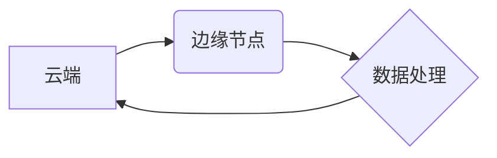

> 边缘计算、云计算、物联网、数据处理、网络延迟、数据安全、人工智能

## 1. 背景介绍

随着物联网 (IoT) 的快速发展，海量传感器和设备不断涌现，产生了大量的实时数据。传统的云计算架构面临着数据传输延迟、网络带宽压力和数据安全等挑战。为了解决这些问题，边缘计算 (Edge Computing) 应运而生。

边缘计算是一种将数据处理和分析能力部署到靠近数据源的边缘节点，例如传感器、设备、网关等，从而实现低延迟、高可靠性和数据本地化处理。它将云计算的强大处理能力与物联网设备的实时响应能力相结合，为各种应用场景提供新的解决方案。

## 2. 核心概念与联系

### 2.1  核心概念

* **云计算 (Cloud Computing):** 将计算资源、存储资源和软件服务提供给用户，以按需付费的方式使用。
* **物联网 (IoT):** 指的是各种设备、传感器和物体通过网络互联，并能够收集、交换和分析数据。
* **边缘节点 (Edge Node):** 指的是靠近数据源的计算和存储设备，例如传感器、网关、路由器等。

### 2.2  联系

云计算和边缘计算是互补的，它们共同构成了一个完整的计算架构。云计算提供强大的计算能力和存储资源，而边缘计算则负责处理靠近数据源的实时数据，减轻云端的负担。

**边缘计算与云计算的关系**



## 3. 核心算法原理 & 具体操作步骤

### 3.1  算法原理概述

边缘计算的核心算法原理是将数据处理和分析能力分散到边缘节点，通过本地化处理来降低数据传输延迟和网络带宽压力。常见的边缘计算算法包括：

* **数据过滤:** 在边缘节点过滤掉不必要的数据，只将关键数据传输到云端。
* **数据聚合:** 在边缘节点对数据进行聚合，例如将多个传感器的数据汇总成一个整体。
* **数据分析:** 在边缘节点对数据进行简单的分析，例如识别模式、预测趋势等。
* **机器学习:** 在边缘节点部署机器学习模型，对数据进行实时预测和决策。

### 3.2  算法步骤详解

以数据过滤为例，其具体操作步骤如下：

1. **数据采集:** 传感器收集数据并发送到边缘节点。
2. **数据预处理:** 边缘节点对数据进行预处理，例如格式转换、噪声去除等。
3. **数据过滤:** 边缘节点根据预设的规则过滤掉不必要的数据，保留关键数据。
4. **数据传输:** 边缘节点将过滤后的数据传输到云端。

### 3.3  算法优缺点

**优点:**

* **低延迟:** 数据在边缘节点进行处理，无需传输到云端，从而降低了数据处理延迟。
* **高可靠性:** 边缘节点可以独立运行，即使网络连接中断，也能继续处理数据。
* **数据本地化:** 数据在边缘节点进行处理，可以保护敏感数据不被泄露。

**缺点:**

* **计算资源有限:** 边缘节点的计算资源有限，无法处理复杂的计算任务。
* **数据同步问题:** 边缘节点的数据需要与云端数据同步，否则会导致数据不一致。
* **安全风险:** 边缘节点更容易受到攻击，需要加强安全防护。

### 3.4  算法应用领域

边缘计算算法广泛应用于以下领域:

* **智能制造:** 实时监控设备状态，进行故障诊断和预测维护。
* **智能交通:** 实时处理交通流量数据，优化交通信号灯控制和导航服务。
* **智能医疗:** 实时监测患者健康数据，进行远程诊断和治疗。
* **智能家居:** 控制家电设备，实现场景化自动化。

## 4. 数学模型和公式 & 详细讲解 & 举例说明

### 4.1  数学模型构建

边缘计算的性能可以根据以下数学模型进行评估:

* **延迟:**  $D = T_{p} + T_{t}$

其中:

* $D$ 表示数据处理延迟
* $T_{p}$ 表示数据处理时间
* $T_{t}$ 表示数据传输时间

* **带宽:** $B = \frac{S}{T}$

其中:

* $B$ 表示数据传输带宽
* $S$ 表示数据传输量
* $T$ 表示数据传输时间

### 4.2  公式推导过程

**延迟公式推导:**

数据处理延迟由数据处理时间和数据传输时间两部分组成。数据处理时间取决于边缘节点的计算能力和数据处理复杂度。数据传输时间取决于网络带宽和数据传输距离。

**带宽公式推导:**

数据传输带宽是指单位时间内能够传输的数据量。可以根据数据传输量和数据传输时间计算出带宽。

### 4.3  案例分析与讲解

**案例:**

假设一个边缘节点需要处理100KB的数据，数据处理时间为10毫秒，数据传输距离为1公里，网络带宽为1Mbps。

**计算:**

* 数据传输时间: $T_{t} = \frac{S}{B} = \frac{100KB}{1Mbps} = 0.1ms$
* 数据处理延迟: $D = T_{p} + T_{t} = 10ms + 0.1ms = 10.1ms$

**分析:**

在这个案例中，数据处理延迟主要由数据处理时间决定，数据传输时间相对较短。

## 5. 项目实践：代码实例和详细解释说明

### 5.1  开发环境搭建

* 操作系统: Ubuntu 20.04
* 编程语言: Python 3.8
* 工具: Docker, Kubernetes

### 5.2  源代码详细实现

```python
# 数据过滤示例代码

import pandas as pd

def filter_data(data):
  """
  过滤数据

  Args:
    data: 数据集

  Returns:
    过滤后的数据集
  """
  # 根据预设规则过滤数据
  filtered_data = data[data['temperature'] > 25]
  return filtered_data

# 示例数据
data = pd.DataFrame({
  'temperature': [20, 22, 28, 30, 23],
  'humidity': [60, 65, 70, 75, 68]
})

# 过滤数据
filtered_data = filter_data(data)

# 打印过滤后的数据
print(filtered_data)
```

### 5.3  代码解读与分析

* 该代码定义了一个 `filter_data` 函数，用于过滤数据。
* 函数接收一个数据框作为输入，并根据 `temperature` 列的值大于 25 的条件过滤数据。
* 示例数据是一个包含温度和湿度信息的 DataFrame。
* 代码调用 `filter_data` 函数对数据进行过滤，并将过滤后的数据打印出来。

### 5.4  运行结果展示

```
   temperature  humidity
2         28        70
3         30        75
```

## 6. 实际应用场景

### 6.1  智能制造

在智能制造中，边缘计算可以用于实时监控设备状态，进行故障诊断和预测维护。例如，可以部署边缘节点在生产线上的机器上，实时采集机器运行数据，并使用机器学习算法进行故障预测。

### 6.2  智能交通

在智能交通领域，边缘计算可以用于优化交通信号灯控制和导航服务。例如，可以部署边缘节点在交通信号灯和车辆上，实时采集交通流量数据，并使用边缘计算算法进行信号灯控制优化。

### 6.3  智能医疗

在智能医疗领域，边缘计算可以用于远程诊断和治疗。例如，可以部署边缘节点在患者的智能手表或医疗设备上，实时采集患者的健康数据，并使用边缘计算算法进行远程诊断和治疗。

### 6.4  未来应用展望

随着物联网技术的不断发展，边缘计算的应用场景将更加广泛。未来，边缘计算将被应用于更多领域，例如：

* **无人驾驶:** 边缘计算可以用于处理无人驾驶车辆的实时数据，例如摄像头图像、雷达数据等，实现自动驾驶功能。
* **增强现实 (AR) 和虚拟现实 (VR):** 边缘计算可以用于处理 AR 和 VR 应用的实时数据，例如用户手势、环境信息等，提供更沉浸式的体验。
* **工业互联网:** 边缘计算可以用于连接工业设备，实现设备互联互通，提高生产效率。

## 7. 工具和资源推荐

### 7.1  学习资源推荐

* **书籍:**
    * 《边缘计算：架构、部署和应用》
    * 《云计算与边缘计算》
* **在线课程:**
    * Coursera: 边缘计算
    * edX: 云计算与边缘计算

### 7.2  开发工具推荐

* **Docker:** 用于容器化应用程序
* **Kubernetes:** 用于容器编排和管理
* **Apache Kafka:** 用于消息队列
* **TensorFlow Lite:** 用于部署机器学习模型

### 7.3  相关论文推荐

* **边缘计算: 概念、架构和应用**
* **边缘计算的挑战和机遇**
* **边缘人工智能: 现状和未来**

## 8. 总结：未来发展趋势与挑战

### 8.1  研究成果总结

边缘计算技术近年来取得了显著进展，在物联网、智能制造、智能交通等领域得到了广泛应用。

### 8.2  未来发展趋势

* **边缘计算与人工智能的融合:** 将人工智能算法部署到边缘节点，实现更智能的边缘计算应用。
* **边缘计算与区块链技术的结合:** 利用区块链技术保障边缘计算数据安全和隐私。
* **边缘计算的标准化和规范化:** 推动边缘计算技术的标准化和规范化，促进产业发展。

### 8.3  面临的挑战

* **边缘计算资源的有限性:** 边缘节点的计算资源和存储资源有限，需要开发更有效的资源管理算法。
* **数据安全和隐私保护:** 边缘节点的数据需要得到安全保护，防止数据泄露和滥用。
* **边缘计算的网络连接性:** 边缘节点需要与云端和其它设备保持稳定的网络连接，确保数据传输的可靠性。

### 8.4  研究展望

未来，边缘计算技术将继续发展，并与人工智能、区块链等新兴技术融合，为我们带来更多创新应用。


## 9. 附录：常见问题与解答

### 9.1  边缘计算与云计算的区别是什么？

边缘计算将数据处理能力部署到靠近数据源的边缘节点，而云计算则将数据处理能力集中在远程数据中心。

### 9.2  边缘计算有哪些应用场景？

边缘计算广泛应用于智能制造、智能交通、智能医疗、智能家居等领域。

### 9.3  边缘计算有哪些挑战？

边缘计算面临着边缘计算资源的有限性、数据安全和隐私保护、边缘计算的网络连接性等挑战。


作者：禅与计算机程序设计艺术 / Zen and the Art of Computer Programming 
<end_of_turn>