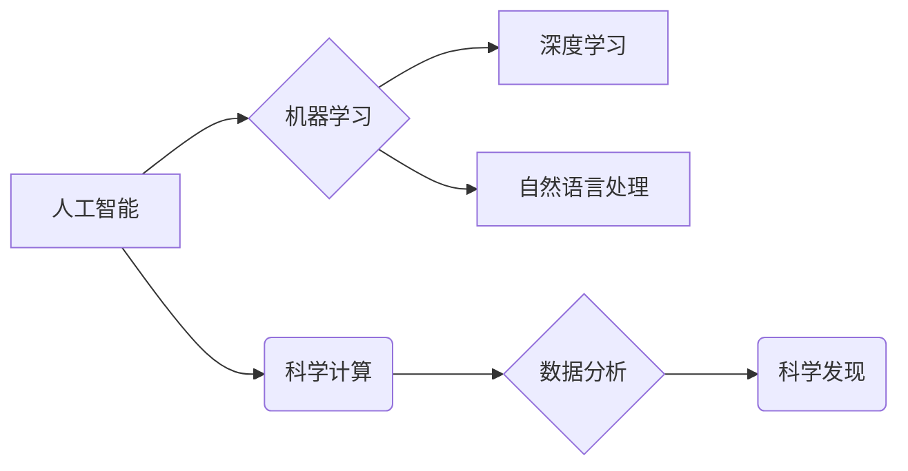

>人工智能，科学计算，机器学习，深度学习，自然语言处理，数据分析，科学发现

## 1. 背景介绍

人工智能（AI）正在迅速改变科学研究的格局，为科学家们提供强大的工具，加速科学发现和创新。AI for Science，即人工智能助力科学，是指利用人工智能技术解决科学问题，推动科学研究和发展。

传统科学研究往往依赖于人类的经验和直觉，需要耗费大量时间和资源进行实验和数据分析。而AI技术可以自动处理海量数据，发现隐藏的模式和规律，并提出新的假设和理论，极大地提高了科学研究的效率和准确性。

## 2. 核心概念与联系

**2.1  人工智能（AI）**

人工智能是指模拟人类智能行为的计算机系统。AI技术涵盖了多个领域，包括机器学习、深度学习、自然语言处理、计算机视觉等。

**2.2  科学计算**

科学计算是指利用计算机进行科学研究和解决科学问题。科学计算涉及到大量的数学模型、算法和数据处理，需要强大的计算能力和高效的算法。

**2.3  机器学习（ML）**

机器学习是人工智能的一个重要分支，它使计算机能够从数据中学习，并根据学习到的知识进行预测或决策。机器学习算法可以分为监督学习、无监督学习和强化学习等类型。

**2.4  深度学习（DL）**

深度学习是机器学习的一个子领域，它使用多层神经网络来模拟人类大脑的学习过程。深度学习算法能够处理复杂的数据，并取得了在图像识别、语音识别、自然语言处理等领域的突破性进展。

**2.5  自然语言处理（NLP）**

自然语言处理是指使计算机能够理解和处理人类语言。NLP技术可以用于文本分类、情感分析、机器翻译等应用。

**2.6  数据分析**

数据分析是指从数据中提取有价值的信息，并用于决策和分析。数据分析技术可以用于发现数据中的模式、趋势和异常值。

**2.7  科学发现**

科学发现是指通过科学研究获得新的知识和理解。AI技术可以帮助科学家们加速科学发现，并探索新的科学领域。

**核心概念与联系流程图**



## 3. 核心算法原理 & 具体操作步骤

### 3.1  算法原理概述

机器学习算法的核心原理是通过学习数据中的模式和规律，建立数学模型，并利用模型进行预测或决策。

常见的机器学习算法包括：

* **线性回归:** 用于预测连续数值。
* **逻辑回归:** 用于预测分类结果。
* **决策树:** 用于分类和回归。
* **支持向量机:** 用于分类。
* **k近邻:** 用于分类和回归。
* **随机森林:** 用于分类和回归。
* **神经网络:** 用于复杂模式的学习。

### 3.2  算法步骤详解

机器学习算法的具体操作步骤通常包括以下几个阶段：

1. **数据收集和预处理:** 收集相关数据，并进行清洗、转换和特征工程等预处理操作。
2. **模型选择:** 根据具体问题选择合适的机器学习算法。
3. **模型训练:** 使用训练数据训练模型，调整模型参数，使模型能够准确地预测或决策。
4. **模型评估:** 使用测试数据评估模型的性能，并进行模型调优。
5. **模型部署:** 将训练好的模型部署到实际应用场景中。

### 3.3  算法优缺点

不同的机器学习算法具有不同的优缺点，需要根据具体问题选择合适的算法。

* **线性回归:** 优点：简单易懂，计算速度快。缺点：对数据线性关系依赖性强，难以处理非线性关系。
* **逻辑回归:** 优点：简单易懂，计算速度快。缺点：对数据线性关系依赖性强，难以处理复杂数据。
* **决策树:** 优点：易于理解和解释，可以处理非线性关系。缺点：容易过拟合，性能不如其他算法。
* **支持向量机:** 优点：性能优异，可以处理高维数据。缺点：训练时间长，参数设置复杂。
* **k近邻:** 优点：简单易懂，无需训练模型。缺点：计算速度慢，对数据规模敏感。
* **随机森林:** 优点：性能优异，鲁棒性强。缺点：训练时间长，难以解释模型决策过程。
* **神经网络:** 优点：可以处理复杂数据，性能优异。缺点：训练时间长，参数设置复杂，难以解释模型决策过程。

### 3.4  算法应用领域

机器学习算法广泛应用于各个领域，例如：

* **医疗保健:** 疾病诊断、药物研发、患者风险评估。
* **金融:** 欺诈检测、信用评分、投资预测。
* **电商:** 商品推荐、用户画像、价格预测。
* **制造业:** 质量控制、设备故障预测、生产优化。
* **交通:** 自驾车、交通流量预测、路线规划。

## 4. 数学模型和公式 & 详细讲解 & 举例说明

### 4.1  数学模型构建

机器学习算法通常基于数学模型，这些模型描述了数据之间的关系和规律。常见的数学模型包括线性模型、非线性模型、概率模型等。

**线性模型:**

线性模型假设数据之间存在线性关系，可以用线性方程来描述。例如，线性回归模型的数学表达式为：

$$y = mx + c$$

其中，$y$ 是预测值，$x$ 是输入特征，$m$ 是斜率，$c$ 是截距。

**非线性模型:**

非线性模型假设数据之间存在非线性关系，可以用非线性方程来描述。例如，神经网络模型使用多层神经元和激活函数来学习非线性关系。

**概率模型:**

概率模型将数据视为随机变量，并使用概率分布来描述数据的分布规律。例如，朴素贝叶斯分类器使用贝叶斯定理来计算类别的概率。

### 4.2  公式推导过程

机器学习算法的训练过程通常涉及到公式推导和优化过程。例如，线性回归模型的训练过程涉及到最小二乘法，其目标是找到最佳的$m$和$c$值，使预测值与真实值之间的误差最小化。

最小二乘法的公式为：

$$J(m, c) = \sum_{i=1}^{n}(y_i - mx_i - c)^2$$

其中，$J(m, c)$ 是损失函数，$n$ 是样本数量，$y_i$ 是真实值，$x_i$ 是输入特征。

通过求解损失函数的梯度，可以得到$m$和$c$的更新公式，并迭代更新参数，直到损失函数最小化。

### 4.3  案例分析与讲解

**案例:** 使用线性回归模型预测房价

假设我们有一组房价数据，包括房屋面积和房价信息。我们可以使用线性回归模型来预测房屋价格。

**数据:**

| 房屋面积 (平方米) | 房价 (万元) |
|---|---|
| 60 | 100 |
| 80 | 150 |
| 100 | 200 |
| 120 | 250 |

**模型训练:**

使用上述数据训练线性回归模型，得到模型参数$m$和$c$。

**预测:**

使用训练好的模型，可以预测新房屋价格。例如，如果新房屋面积为 90 平方米，则可以使用以下公式预测房价：

$$y = mx + c$$

其中，$x = 90$，$m$和$c$是模型参数。

## 5. 项目实践：代码实例和详细解释说明

### 5.1  开发环境搭建

本项目使用 Python 语言进行开发，需要安装以下软件：

* Python 3.x
* Jupyter Notebook
* scikit-learn

### 5.2  源代码详细实现

```python
import pandas as pd
from sklearn.linear_model import LinearRegression
from sklearn.model_selection import train_test_split

# 加载数据
data = pd.read_csv('house_price.csv')

# 分割数据
X = data[['面积']]
y = data['价格']
X_train, X_test, y_train, y_test = train_test_split(X, y, test_size=0.2, random_state=42)

# 创建线性回归模型
model = LinearRegression()

# 训练模型
model.fit(X_train, y_train)

# 预测测试数据
y_pred = model.predict(X_test)

# 评估模型性能
from sklearn.metrics import mean_squared_error
mse = mean_squared_error(y_test, y_pred)
print('均方误差:', mse)
```

### 5.3  代码解读与分析

* **数据加载:** 使用 pandas 库加载房价数据。
* **数据分割:** 将数据分为训练集和测试集。
* **模型创建:** 创建线性回归模型。
* **模型训练:** 使用训练数据训练模型。
* **模型预测:** 使用训练好的模型预测测试数据。
* **模型评估:** 使用均方误差 (MSE) 评估模型性能。

### 5.4  运行结果展示

运行代码后，会输出模型的均方误差值。均方误差值越小，模型的预测性能越好。

## 6. 实际应用场景

AI for Science 的应用场景非常广泛，例如：

* **药物研发:** 利用机器学习算法分析药物分子结构和生物活性，加速药物发现和开发。
* **材料科学:** 利用深度学习算法预测材料的性能和结构，设计新型材料。
* **天文学:** 利用机器学习算法分析天文数据，发现新的天体和宇宙现象。
* **气候科学:** 利用机器学习算法模拟气候变化，预测未来气候趋势。
* **生物信息学:** 利用自然语言处理算法分析生物学文献，提取生物学知识。

### 6.4  未来应用展望

随着人工智能技术的不断发展，AI for Science 将在未来发挥更加重要的作用，推动科学研究和创新。

* **更强大的计算能力:** 量子计算和分布式计算等新兴技术将为 AI for Science 提供更强大的计算能力，支持更复杂科学问题的解决。
* **更丰富的算法和模型:** 新的机器学习算法和深度学习模型将不断涌现，为 AI for Science 提供更强大的工具。
* **更海量的科学数据:** 科学数据正在以指数级增长，为 AI for Science 提供更丰富的训练数据。
* **更深入的科学理解:** AI for Science 将帮助科学家们更深入地理解自然世界，并提出新的科学理论。

## 7. 工具和资源推荐

### 7.1  学习资源推荐

* **在线课程:** Coursera, edX, Udacity 等平台提供丰富的 AI for Science 课程。
* **书籍:** 《Deep Learning》、《Hands-On Machine Learning with Scikit-Learn, Keras & TensorFlow》等书籍介绍了 AI for Science 的基础知识和应用。
* **博客和论坛:** AI for Science 的博客和论坛可以帮助你了解最新的研究进展和技术趋势。

### 7.2  开发工具推荐

* **Python:** Python 是 AI for Science 的主流编程语言，拥有丰富的机器学习和深度学习库。
* **Jupyter Notebook:** Jupyter Notebook 是一个交互式编程环境，方便进行 AI for Science 的开发和实验。
* **TensorFlow:** TensorFlow 是一个开源的深度学习框架，支持各种深度学习模型的开发和训练。
* **PyTorch:** PyTorch 是另一个开源的深度学习框架，以其灵活性和易用性而闻名。

### 7.3  相关论文推荐

* **AlphaFold:** https://deepmind.com/blog/alphafold-a-solution-to-a-50-year-old-grand-challenge-in-biology
* **Generative