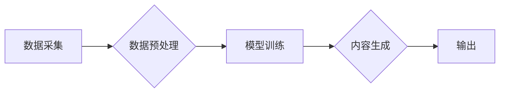

> AIGC, 图像识别, 语音合成, 自然语言处理, 深度学习, 计算机视觉, 人工智能

## 1. 背景介绍

近年来，人工智能（AI）技术飞速发展，特别是深度学习的突破，使得人工智能在各个领域都展现出强大的应用潜力。其中，AIGC（AI Generated Content，人工智能生成内容）作为人工智能发展的重要方向之一，正在深刻地改变着我们获取和创作内容的方式。

AIGC技术能够利用人工智能算法，从文本、图像、音频等多种数据源中生成新的内容，例如文本、图像、音频、视频等。它打破了传统内容创作的壁垒，赋予每个人成为内容创作者的可能性。

在AIGC领域，图像识别、语音合成、自然语言处理等技术发挥着关键作用。通过图像识别技术，我们可以从图像中提取关键信息，例如人物、场景、物体等。然后，利用自然语言处理技术，我们可以将这些信息转化为文本描述，并通过语音合成技术将其转换为语音。

## 2. 核心概念与联系

AIGC的核心概念是利用人工智能算法，从现有数据中学习模式，并根据这些模式生成新的内容。

**AIGC的流程可以概括为以下几个步骤：**

1. 数据采集：收集大量文本、图像、音频等数据。
2. 数据预处理：对收集到的数据进行清洗、格式化等处理，使其能够被模型所理解。
3. 模型训练：利用深度学习算法，训练模型，使其能够从数据中学习模式。
4. 内容生成：输入新的数据或指令，模型根据训练得到的知识生成新的内容。

**AIGC核心概念与联系的Mermaid流程图：**



## 3. 核心算法原理 & 具体操作步骤

### 3.1  算法原理概述

AIGC的核心算法主要包括：

* **卷积神经网络（CNN）:** 用于图像识别和理解，可以提取图像中的特征，例如边缘、纹理、物体等。
* **循环神经网络（RNN）:** 用于处理序列数据，例如文本和语音，可以捕捉序列中的依赖关系和上下文信息。
* **生成对抗网络（GAN）:** 由两个网络组成，一个是生成器，一个是鉴别器，通过对抗训练，生成器可以生成逼真的合成数据。

### 3.2  算法步骤详解

**以文本生成为例，详细说明AIGC算法的步骤：**

1. **数据预处理:** 将文本数据进行分词、词性标注、词向量化等处理，转化为模型可以理解的格式。
2. **模型训练:** 使用RNN或Transformer等模型，训练模型，使其能够从文本数据中学习语言模式和语法规则。
3. **内容生成:** 输入新的文本提示或种子词，模型根据训练得到的知识，生成新的文本内容。

### 3.3  算法优缺点

**优点:**

* 可以自动生成大量内容，提高效率。
* 可以突破语言和文化障碍，实现跨语言内容创作。
* 可以根据用户需求定制内容，满足个性化需求。

**缺点:**

* 生成的内容可能缺乏原创性和深度。
* 模型训练需要大量数据，且数据质量对模型性能有重要影响。
* 存在伦理和安全问题，例如内容虚假、版权侵权等。

### 3.4  算法应用领域

AIGC技术在各个领域都有广泛的应用，例如：

* **内容创作:** 自动生成新闻报道、广告文案、小说、诗歌等。
* **教育培训:** 自动生成学习材料、练习题、个性化辅导等。
* **客服服务:** 自动回复客户咨询、提供个性化服务等。
* **娱乐休闲:** 自动生成游戏剧本、虚拟角色对话等。

## 4. 数学模型和公式 & 详细讲解 & 举例说明

### 4.1  数学模型构建

AIGC算法通常基于深度学习模型，例如RNN、Transformer等。这些模型的数学基础是神经网络，其核心是**激活函数**和**权重参数**。

**激活函数**的作用是将神经元的输入映射到输出，常用的激活函数包括ReLU、Sigmoid、Tanh等。

**权重参数**决定了神经网络的学习能力，通过训练过程不断调整权重参数，使模型能够更好地拟合数据。

### 4.2  公式推导过程

**举例说明Transformer模型中的注意力机制：**

注意力机制可以帮助模型关注输入序列中重要的信息，并根据其重要性分配不同的权重。

**注意力机制的公式如下：**

$$
Attention(Q, K, V) = softmax(\frac{QK^T}{\sqrt{d_k}})V
$$

其中：

* $Q$：查询矩阵
* $K$：键矩阵
* $V$：值矩阵
* $d_k$：键向量的维度
* $softmax$：softmax函数

### 4.3  案例分析与讲解

**举例说明AIGC在文本生成领域的应用：**

使用GPT-3等Transformer模型进行文本生成，可以根据用户输入的提示或种子词，生成流畅、连贯的文本内容。例如，用户输入“今天天气真好”，模型可以生成“今天阳光明媚，万里无云，真是个适合外出踏青的好日子”。

## 5. 项目实践：代码实例和详细解释说明

### 5.1  开发环境搭建

AIGC项目开发环境通常需要以下软件：

* Python编程语言
* TensorFlow或PyTorch深度学习框架
* CUDA和cuDNN加速库（用于GPU加速）
* Git版本控制系统

### 5.2  源代码详细实现

**以使用HuggingFace Transformers库进行文本生成的代码为例：**

```python
from transformers import pipeline

# 加载预训练模型
generator = pipeline("text-generation", model="gpt2")

# 输入文本提示
prompt = "今天天气真好"

# 生成文本内容
output = generator(prompt, max_length=50, num_return_sequences=3)

# 打印生成结果
for text in output:
    print(text["generated_text"])
```

### 5.3  代码解读与分析

* `pipeline("text-generation", model="gpt2")`：使用HuggingFace Transformers库加载预训练的GPT-2模型，用于文本生成任务。
* `generator(prompt, max_length=50, num_return_sequences=3)`：调用模型生成文本内容，`prompt`为输入提示，`max_length`为生成文本的最大长度，`num_return_sequences`为生成多个文本序列的数量。
* `print(text["generated_text"])`：打印生成的文本内容。

### 5.4  运行结果展示

运行上述代码，可以生成类似以下的文本内容：

```
今天阳光明媚，万里无云，真是个适合外出踏青的好日子。
今天天气真好，心情也格外舒畅。
今天天气晴朗，蓝天白云，让人心情愉悦。
```

## 6. 实际应用场景

### 6.1  新闻报道自动生成

利用AIGC技术，可以自动生成新闻报道，例如从新闻稿件中提取关键信息，并自动生成新闻标题、摘要和正文。

### 6.2  广告文案自动创作

AIGC可以根据目标客户群体和产品特点，自动生成吸引人的广告文案，提高广告转化率。

### 6.3  聊天机器人对话生成

AIGC可以训练聊天机器人，使其能够进行更自然、更流畅的对话，提供更人性化的服务体验。

### 6.4  未来应用展望

AIGC技术的发展前景广阔，未来将应用于更多领域，例如：

* **个性化教育:** 根据学生的学习进度和需求，自动生成个性化的学习材料和练习题。
* **虚拟助手:** 更智能、更便捷的虚拟助手，可以帮助用户完成各种任务，例如日程安排、信息查询、购物等。
* **创意内容创作:** 帮助艺术家、设计师等创意工作者，快速生成创意灵感和作品草稿。

## 7. 工具和资源推荐

### 7.1  学习资源推荐

* **书籍:**
    * 《深度学习》
    * 《自然语言处理》
    * 《机器学习》
* **在线课程:**
    * Coursera
    * edX
    * Udacity

### 7.2  开发工具推荐

* **Python编程语言:** https://www.python.org/
* **TensorFlow深度学习框架:** https://www.tensorflow.org/
* **PyTorch深度学习框架:** https://pytorch.org/
* **HuggingFace Transformers库:** https://huggingface.co/transformers/

### 7.3  相关论文推荐

* **Attention Is All You Need:** https://arxiv.org/abs/1706.03762
* **BERT: Pre-training of Deep Bidirectional Transformers for Language Understanding:** https://arxiv.org/abs/1810.04805
* **GPT-3: Language Models are Few-Shot Learners:** https://arxiv.org/abs/2005.14165

## 8. 总结：未来发展趋势与挑战

### 8.1  研究成果总结

AIGC技术取得了显著的进展，能够生成高质量的文本、图像、音频等内容，并在多个领域得到应用。

### 8.2  未来发展趋势

* **模型规模和能力提升:** 未来AIGC模型将更加强大，能够处理更复杂的任务，生成更逼真的内容。
* **多模态生成:** AIGC将融合多种模态数据，例如文本、图像、音频、视频等，实现多模态内容的生成。
* **个性化定制:** AIGC将更加注重用户个性化需求，能够根据用户的喜好和需求生成定制化的内容。

### 8.3  面临的挑战

* **数据质量和安全:** AIGC模型的训练需要大量高质量数据，数据安全和隐私保护也是需要关注的问题。
* **伦理和社会影响:** AIGC技术可能带来一些伦理和社会问题，例如内容虚假、版权侵权、就业影响等，需要进行深入的探讨和研究。
* **可解释性和可控性:** AIGC模型的决策过程往往是复杂的，难以解释和控制，需要提高模型的可解释性和可控性。

### 8.4  研究展望

未来AIGC研究将继续深入，探索更强大的模型架构、更有效的训练方法、更广泛的应用场景，并积极应对技术带来的挑战，推动AIGC技术朝着更加安全、可控、可解释的方向发展。

## 9. 附录：常见问题与解答

**Q1: AIGC技术与传统内容创作有什么区别？**

**A1:** AIGC技术利用人工智能算法自动生成内容，而传统内容创作则需要人工进行创作。AIGC可以提高内容创作效率，但生成的內容可能缺乏原创性和深度。

**Q2: AIGC技术有哪些应用场景？**

**A2:** AIGC技术应用场景广泛，例如新闻报道自动生成、广告文案自动创作、聊天机器人对话生成等。

**Q3: AIGC技术有哪些伦理和社会问题？**

**A3:** AIGC技术可能带来一些伦理和社会问题，例如内容虚假、版权侵权、就业影响等。

**Q4: 如何学习AIGC技术？**

**A4:** 可以学习深度学习、自然语言处理等相关知识，并使用开源工具和平台进行实践。

**Q5: AIGC技术未来发展趋势如何？**

**A5:** 未来AIGC技术将更加强大，能够处理更复杂的任务，生成更逼真的内容，并融合多种模态数据，实现多模态内容的生成。


作者：禅与计算机程序设计艺术 / Zen and the Art of Computer Programming 
<end_of_turn>