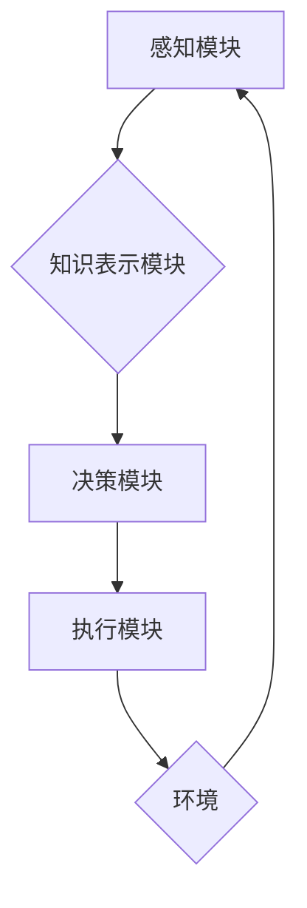

> AI Agent, 大数据处理, 强化学习, 深度学习, 自然语言处理, 机器学习, 决策优化

## 1. 背景介绍

随着互联网和物联网的快速发展，海量数据呈爆炸式增长，传统的数据库和数据处理方法已难以满足需求。人工智能（AI）作为一种新兴技术，凭借其强大的学习和推理能力，在处理大数据方面展现出巨大的潜力。其中，AI智能代理（Agent）作为AI的核心应用之一，在数据分析、决策优化、自动化执行等领域发挥着越来越重要的作用。

智能代理是指能够感知环境、做出决策并执行行动的软件实体。它具有自主性、学习能力和目标导向性，能够根据环境变化和自身目标，不断调整策略，实现预期的目标。在处理大数据时，智能代理可以有效地：

* **提取关键信息：** 从海量数据中识别出有价值的信息，例如用户行为模式、市场趋势等。
* **发现隐藏模式：** 利用机器学习算法，发现数据中潜在的关联和规律，为决策提供支持。
* **自动化执行任务：** 根据预先定义的目标和规则，自动执行数据处理、分析和决策等任务，提高效率和准确性。

## 2. 核心概念与联系

**2.1 智能代理的构成**

智能代理通常由以下几个核心组件组成：

* **感知模块：**负责收集环境信息，例如传感器数据、网络流量、用户行为等。
* **知识表示模块：** 将感知到的信息转化为可理解的知识表示，例如规则、模型、图谱等。
* **决策模块：** 根据知识表示和目标，选择最优的行动策略。
* **执行模块：** 将决策转化为实际行动，例如控制设备、发送指令、更新数据库等。

**2.2 智能代理与大数据处理的关系**

智能代理和大数据处理之间存在着密切的联系。大数据提供了丰富的训练数据，可以用于训练智能代理的机器学习模型，提高其决策能力。同时，智能代理可以帮助人们有效地处理和分析大数据，从中提取有价值的信息，并做出更明智的决策。

**2.3  Mermaid 流程图**



## 3. 核心算法原理 & 具体操作步骤

**3.1 算法原理概述**

在处理大数据时，常用的智能代理算法包括：

* **强化学习：** 通过奖励机制，训练代理在环境中学习最优策略。
* **深度学习：** 利用多层神经网络，学习复杂的数据模式和关系。
* **自然语言处理：** 处理和理解自然语言文本，例如文本分类、情感分析等。

**3.2 算法步骤详解**

以强化学习为例，其核心步骤包括：

1. **环境建模：** 建立一个模拟真实世界的环境模型，包括状态空间、动作空间和奖励函数。
2. **代理初始化：** 初始化代理的策略，例如随机策略或贪婪策略。
3. **交互学习：** 代理与环境交互，根据当前状态选择动作，并获得相应的奖励。
4. **策略更新：** 根据获得的奖励，更新代理的策略，使其在未来能够获得更高的奖励。
5. **重复步骤3-4：** 重复上述步骤，直到代理的策略收敛，达到预期的目标。

**3.3 算法优缺点**

* **优点：** 能够学习复杂的环境和任务，并不断优化策略。
* **缺点：** 训练过程可能需要大量的时间和数据，并且容易陷入局部最优解。

**3.4 算法应用领域**

* **推荐系统：** 根据用户的历史行为，推荐感兴趣的内容。
* **游戏 AI：** 训练智能代理，使其能够在游戏中做出智能决策。
* **机器人控制：** 控制机器人完成复杂的任务，例如导航、抓取等。

## 4. 数学模型和公式 & 详细讲解 & 举例说明

**4.1 数学模型构建**

强化学习的数学模型通常包括以下几个关键要素：

* **状态空间 S：** 环境可能存在的全部状态。
* **动作空间 A：** 代理可以执行的所有动作。
* **奖励函数 R(s, a)：** 给定状态 s 和动作 a，奖励函数 R(s, a) 返回代理获得的奖励值。
* **价值函数 V(s)：** 给定状态 s，价值函数 V(s) 表示从该状态开始执行最优策略的期望累积奖励。

**4.2 公式推导过程**

价值函数的更新公式通常采用动态规划方法，例如 Bellman 方程：

$$V(s) = \max_a \sum_{s'} P(s' | s, a) [R(s, a) + \gamma V(s')]$$

其中：

* $\gamma$ 是折扣因子，控制未来奖励的权重。
* $P(s' | s, a)$ 是从状态 s 执行动作 a 到状态 s' 的转移概率。

**4.3 案例分析与讲解**

例如，在一个简单的迷宫环境中，代理的目标是找到通往出口的状态。状态空间 S 包含迷宫中的所有位置，动作空间 A 包含“上”、“下”、“左”、“右”四个方向。奖励函数 R(s, a) 在到达出口时给予最大奖励，在撞墙时给予负奖励。通过 Bellman 方程迭代更新价值函数，代理可以学习出最优的路径，最终到达出口。

## 5. 项目实践：代码实例和详细解释说明

**5.1 开发环境搭建**

* Python 3.x
* TensorFlow 或 PyTorch 深度学习框架
* NumPy 科学计算库
* Matplotlib 数据可视化库

**5.2 源代码详细实现**

```python
import tensorflow as tf

# 定义神经网络模型
model = tf.keras.models.Sequential([
    tf.keras.layers.Dense(128, activation='relu', input_shape=(input_dim,)),
    tf.keras.layers.Dense(64, activation='relu'),
    tf.keras.layers.Dense(num_actions)
])

# 定义损失函数和优化器
loss_fn = tf.keras.losses.CategoricalCrossentropy()
optimizer = tf.keras.optimizers.Adam()

# 训练模型
for epoch in range(num_epochs):
    for batch in data_generator:
        with tf.GradientTape() as tape:
            predictions = model(batch['state'])
            loss = loss_fn(batch['action'], predictions)
        gradients = tape.gradient(loss, model.trainable_variables)
        optimizer.apply_gradients(zip(gradients, model.trainable_variables))

# 保存模型
model.save('trained_model.h5')
```

**5.3 代码解读与分析**

* 代码定义了一个简单的深度学习模型，用于预测代理在给定状态下执行的动作。
* 模型使用 ReLU 激活函数，并包含两层全连接层。
* 损失函数为交叉熵损失，优化器为 Adam 优化器。
* 模型使用批处理训练，并迭代训练多个 epochs。
* 训练完成后，模型将被保存为一个文件。

**5.4 运行结果展示**

训练好的模型可以用于控制代理在环境中执行动作，并观察代理的行为。例如，在迷宫环境中，代理可以学习出最优的路径，最终到达出口。

## 6. 实际应用场景

**6.1 智能客服系统**

AI 智能代理可以用于构建智能客服系统，自动处理客户咨询和投诉，提高服务效率和客户满意度。

**6.2 自动化决策系统**

在金融、医疗等领域，AI 智能代理可以用于自动化决策，例如风险评估、疾病诊断等，提高决策效率和准确性。

**6.3 个性化推荐系统**

AI 智能代理可以根据用户的行为和偏好，提供个性化的商品、服务和内容推荐，提升用户体验。

**6.4 未来应用展望**

随着人工智能技术的不断发展，AI 智能代理在未来将有更广泛的应用场景，例如：

* **智慧城市：** 智能交通管理、环境监测、公共安全等。
* **工业自动化：** 智能制造、设备维护、生产优化等。
* **医疗保健：** 智能诊断、个性化治疗、远程医疗等。

## 7. 工具和资源推荐

**7.1 学习资源推荐**

* **书籍：**
    * 《Reinforcement Learning: An Introduction》 by Richard S. Sutton and Andrew G. Barto
    * 《Deep Learning》 by Ian Goodfellow, Yoshua Bengio, and Aaron Courville
* **在线课程：**
    * Coursera: Reinforcement Learning Specialization
    * Udacity: Deep Learning Nanodegree

**7.2 开发工具推荐**

* **TensorFlow:** https://www.tensorflow.org/
* **PyTorch:** https://pytorch.org/
* **OpenAI Gym:** https://gym.openai.com/

**7.3 相关论文推荐**

* **Deep Q-Network (DQN):** https://arxiv.org/abs/1312.5602
* **Proximal Policy Optimization (PPO):** https://arxiv.org/abs/1707.06347
* **AlphaGo:** https://deepmind.com/blog/alphago-zero-at-the-game-of-go/

## 8. 总结：未来发展趋势与挑战

**8.1 研究成果总结**

近年来，AI 智能代理在处理大数据方面取得了显著的进展，例如：

* 强化学习算法的不断发展，使得代理能够学习更复杂的环境和任务。
* 深度学习技术的应用，提高了代理对数据模式和关系的理解能力。
* 自然语言处理技术的进步，使得代理能够理解和处理人类语言。

**8.2 未来发展趋势**

* **更强大的学习能力：** 研究更先进的学习算法，使代理能够学习更复杂的任务和环境。
* **更强的解释性：** 研究更可解释的 AI 模型，使代理的行为更加透明和可理解。
* **更广泛的应用场景：** 将 AI 智能代理应用于更多领域，例如医疗保健、教育、金融等。

**8.3 面临的挑战**

* **数据安全和隐私：** 处理大数据时，需要确保数据安全和隐私。
* **算法偏见：** AI 模型可能存在偏见，需要进行公平性和可解释性研究。
* **伦理问题：** AI 智能代理的应用可能引发伦理问题，需要进行深入探讨和规范。

**8.4 研究展望**

未来，AI 智能代理将继续朝着更智能、更安全、更可解释的方向发展，并在处理大数据方面发挥越来越重要的作用。


## 9. 附录：常见问题与解答

**9.1 如何选择合适的智能代理算法？**

选择合适的智能代理算法取决于具体的应用场景和任务需求。例如，对于离散动作空间和有限状态空间的任务，强化学习算法可能是一个不错的选择。对于连续动作空间和复杂环境的任务，深度学习算法可能更合适。

**9.2 如何评估智能代理的性能？**

智能代理的性能可以根据不同的指标进行评估，例如奖励累积、成功率、决策效率等。

**9.3 如何解决智能代理的过拟合问题？**

过拟合是指智能代理在训练数据上表现良好，但在测试数据上表现较差。解决过拟合问题的方法包括：

* 使用更小的模型
* 使用正则化技术
* 使用交叉验证

**9.4 如何确保智能代理的安全性？**

确保智能代理的安全性需要从多个方面考虑，例如：

* 数据安全和隐私保护
* 算法的鲁棒性和可解释性
* 人机交互的安全机制


作者：禅与计算机程序设计艺术 / Zen and the Art of Computer Programming 
<end_of_turn>