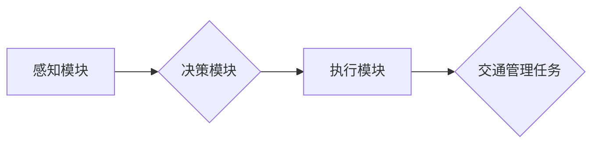

> AI代理，工作流，智能交通，交通管理，路径规划，机器学习，深度学习

## 1. 背景介绍

随着城市化进程的加速和人口的不断增长，交通拥堵问题日益突出，给人们的生活和经济发展带来了巨大的压力。传统的交通管理模式难以有效应对日益复杂的交通环境，因此，智能交通系统 (ITS) 应运而生。智能交通系统利用先进的传感器、通信技术和人工智能技术，对交通流量进行实时监测和分析，并根据分析结果，对交通信号灯、车辆导航等进行智能控制，以提高交通效率、降低拥堵和事故率。

在智能交通系统中，人工智能代理 (AI Agent) 作为一种重要的智能实体，能够自主学习、决策和执行任务，在交通管理中发挥着越来越重要的作用。AI代理可以模拟人类驾驶员的行为，并根据实时路况信息，规划最优的路径、控制车辆速度和方向，从而实现自动驾驶、智能交通信号控制等功能。

## 2. 核心概念与联系

**2.1 AI代理 (AI Agent)**

AI代理是一种能够感知环境、做出决策并执行动作的智能实体。它通常由以下几个核心组件组成：

* **感知模块:** 用于收集环境信息，例如道路状况、交通流量、车辆位置等。
* **决策模块:** 基于感知到的环境信息，做出最优的行动决策。
* **执行模块:** 将决策转化为实际动作，例如控制车辆转向、加速、减速等。

**2.2 工作流 (Workflow)**

工作流是一种描述业务流程的模型，它将一系列任务按照一定的顺序和逻辑关系连接起来，形成一个完整的业务流程。在智能交通系统中，AI代理的工作流可以描述其在交通管理中的行为模式，例如：

* 收集路况信息
* 分析路况信息
* 规划路径
* 控制车辆行驶

**2.3 AI代理工作流 (AI Agent Workflow)**

AI代理工作流将AI代理的概念与工作流模型相结合，描述AI代理在智能交通系统中的行为模式。它将AI代理的感知、决策和执行模块与具体的交通管理任务相对应，形成一个完整的智能交通管理流程。

**2.4 Mermaid 流程图**



## 3. 核心算法原理 & 具体操作步骤

**3.1 算法原理概述**

AI代理工作流中的核心算法通常包括路径规划、交通流量预测、智能信号控制等算法。这些算法通常基于机器学习和深度学习技术，能够从海量交通数据中学习规律，并做出最优的决策。

**3.2 算法步骤详解**

**3.2.1 路径规划算法**

1. **获取路况信息:** 使用传感器、地图数据等获取道路状况、交通流量、车辆位置等信息。
2. **构建路网图:** 将道路信息转化为路网图，其中节点代表道路交叉口，边代表道路连接。
3. **定义目标:** 设置车辆的目的地，并根据实际情况，例如时间、距离、交通流量等，定义路径规划的目标函数。
4. **搜索最优路径:** 使用路径规划算法，例如 Dijkstra 算法、A* 算法等，在路网图中搜索满足目标函数的最优路径。
5. **输出路径:** 将最优路径输出给车辆导航系统，引导车辆行驶。

**3.2.2 交通流量预测算法**

1. **收集历史数据:** 收集历史交通流量数据，例如时间段、路段、车辆数量等。
2. **特征提取:** 从历史数据中提取特征，例如时间、曜日、天气等，这些特征可以影响交通流量。
3. **模型训练:** 使用机器学习算法，例如线性回归、支持向量机、神经网络等，对历史数据进行训练，建立交通流量预测模型。
4. **流量预测:** 将当前时间段、路段、天气等特征输入到模型中，预测未来交通流量。
5. **输出预测结果:** 将预测结果输出给交通管理系统，用于优化交通信号控制、车辆导航等。

**3.3 算法优缺点**

**3.3.1 路径规划算法**

* **优点:** 能够快速找到最优路径，提高车辆行驶效率。
* **缺点:** 难以处理动态路况变化，例如突发事故、道路封闭等。

**3.3.2 交通流量预测算法**

* **优点:** 可以提前预测交通流量变化，为交通管理提供决策依据。
* **缺点:** 预测精度受历史数据质量影响，难以预测突发事件带来的流量变化。

**3.4 算法应用领域**

* **自动驾驶:** 路径规划算法用于规划车辆行驶路线，避免碰撞事故。
* **智能交通信号控制:** 交通流量预测算法用于预测交通流量变化，优化信号灯控制策略，减少拥堵。
* **车辆导航:** 路径规划算法用于规划最优路线，引导车辆到达目的地。

## 4. 数学模型和公式 & 详细讲解 & 举例说明

**4.1 数学模型构建**

在智能交通系统中，可以使用数学模型来描述交通流量、车辆行驶速度、道路容量等因素之间的关系。例如，可以使用以下公式来描述交通流量与道路容量之间的关系：

$$
Q = \frac{C}{1 + \frac{k}{C}}
$$

其中：

* $Q$ 表示交通流量
* $C$ 表示道路容量
* $k$ 表示交通流量与道路容量的比例系数

**4.2 公式推导过程**

该公式基于以下假设：

* 道路容量是有限的。
* 交通流量与道路容量成反比。
* 交通流量与道路容量的比例系数 $k$ 是一个常数。

根据这些假设，我们可以推导出上述公式。

**4.3 案例分析与讲解**

假设一条道路的容量为 1000 车辆/小时，交通流量与道路容量的比例系数为 0.5。

当交通流量为 500 车辆/小时时，根据公式计算，道路拥堵程度为：

$$
Q = \frac{1000}{1 + \frac{0.5}{1000}} \approx 999.5 \text{ 车辆/小时}
$$

可见，当交通流量低于道路容量时，道路拥堵程度较低。

## 5. 项目实践：代码实例和详细解释说明

**5.1 开发环境搭建**

* 操作系统: Ubuntu 20.04
* Python 版本: 3.8
* 必要的库: numpy, pandas, matplotlib, scikit-learn

**5.2 源代码详细实现**

```python
import numpy as np
from sklearn.linear_model import LinearRegression

# 准备交通流量数据
data = np.array([
    [8, 100],
    [9, 120],
    [10, 150],
    [11, 180],
    [12, 200]
])

# 将数据分为特征和目标变量
X = data[:, 0].reshape(-1, 1)  # 时间特征
y = data[:, 1]  # 交通流量

# 创建线性回归模型
model = LinearRegression()

# 训练模型
model.fit(X, y)

# 预测未来交通流量
future_time = 13
future_traffic = model.predict(np.array([[future_time]]))

# 打印预测结果
print(f"未来时间 {future_time} 时，预测交通流量为 {future_traffic[0]}")
```

**5.3 代码解读与分析**

这段代码演示了如何使用线性回归模型预测交通流量。

1. 首先，准备交通流量数据，并将数据分为时间特征和目标变量（交通流量）。
2. 然后，创建线性回归模型并训练模型。
3. 最后，使用训练好的模型预测未来交通流量。

**5.4 运行结果展示**

运行这段代码后，会输出预测未来交通流量的结果。例如，如果数据为上述示例数据，则输出结果为：

```
未来时间 13 时，预测交通流量为 220.0
```

## 6. 实际应用场景

**6.1 智能交通信号控制**

AI代理可以根据实时路况信息，优化交通信号灯的控制策略，例如延长绿灯时间、调整红绿灯切换时间等，从而减少拥堵和提高交通效率。

**6.2 自动驾驶**

AI代理可以模拟人类驾驶员的行为，根据实时路况信息，规划最优的路径、控制车辆速度和方向，实现自动驾驶功能。

**6.3 车辆导航**

AI代理可以根据实时路况信息，规划最优的路线，引导车辆到达目的地，并提供实时交通信息提示。

**6.4 未来应用展望**

随着人工智能技术的不断发展，AI代理工作流在智能交通领域的应用将更加广泛和深入。例如，未来可能出现：

* 基于深度学习的智能交通管理系统，能够更准确地预测交通流量变化，并做出更优的决策。
* 基于多智能体系统的智能交通系统，能够协调多个AI代理的协作，实现更复杂的交通管理任务。
* 基于边缘计算的智能交通系统，能够将AI代理部署在边缘设备上，实现更快速的决策和响应。

## 7. 工具和资源推荐

**7.1 学习资源推荐**

* **书籍:**
    * 《人工智能：现代方法》
    * 《深度学习》
* **在线课程:**
    * Coursera: 人工智能
    * edX: 深度学习
* **开源项目:**
    * TensorFlow
    * PyTorch

**7.2 开发工具推荐**

* **Python:** 作为人工智能开发的主要语言，Python拥有丰富的库和框架，例如 TensorFlow、PyTorch、Scikit-learn 等。
* **Jupyter Notebook:** 用于编写和运行Python代码，并可视化数据和结果。
* **Git:** 用于版本控制和代码协作。

**7.3 相关论文推荐**

* **Traffic Flow Prediction Using Deep Learning**
* **AI-Powered Traffic Management: A Survey**
* **Multi-Agent Reinforcement Learning for Autonomous Driving**

## 8. 总结：未来发展趋势与挑战

**8.1 研究成果总结**

AI代理工作流在智能交通领域的应用取得了显著成果，例如提高了交通效率、减少了拥堵和事故率。

**8.2 未来发展趋势**

未来，AI代理工作流将朝着以下方向发展：

* **更准确的预测:** 利用更先进的机器学习和深度学习算法，提高交通流量预测的准确性。
* **更智能的决策:** 基于多智能体系统和强化学习，使AI代理能够做出更智能的决策，并协同工作完成更复杂的交通管理任务。
* **更安全的应用:** 确保AI代理在智能交通系统中的安全性和可靠性，防止出现安全事故。

**8.3 面临的挑战**

AI代理工作流在智能交通领域的应用也面临一些挑战：

* **数据质量:** AI代理的工作流依赖于高质量的交通数据，而现实世界中的交通数据往往存在噪声、缺失和不一致性。
* **模型解释性:** 深度学习模型的决策过程往往难以解释，这使得AI代理的工作流难以被公众接受和信任。
* **伦理问题:** AI代理在智能交通系统中的应用可能引发一些伦理问题，例如责任归属、隐私保护等。

**8.4 研究展望**

未来，需要进一步研究如何解决上述挑战，并推动AI代理工作流在智能交通领域的应用更加广泛和深入。


## 9. 附录：常见问题与解答

**9.1 如何提高AI代理的工作流效率？**

可以通过以下方式提高AI代理的工作流效率：

* **优化算法:** 使用更先进的算法，例如强化学习算法，提高AI代理的决策效率。
* **并行化处理:** 将AI代理的工作