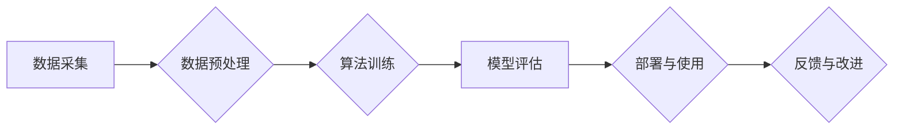

> AI, 人工智能, 算法偏见, 机器学习, 深度学习, 数据科学, 算法公平性

## 1. 背景介绍

人工智能（AI）技术近年来发展迅速，在各个领域取得了令人瞩目的成就。从自动驾驶汽车到医疗诊断，从个性化推荐到金融风险评估，AI正在深刻地改变着我们的生活。然而，随着AI技术的广泛应用，一个不容忽视的问题逐渐浮出水面：算法偏见。

算法偏见是指AI算法在训练过程中由于数据本身的偏差而导致的歧视性结果。这种偏差可能源于数据采集、处理、标注等各个环节，最终导致AI系统对不同群体产生不公平的对待。例如，在招聘领域，如果训练数据中男性占据主导地位，那么AI系统可能会倾向于选择男性候选人，从而加剧性别歧视。

算法偏见不仅会损害个人的公平权益，还会加剧社会的不平等现象，甚至引发社会冲突。因此，解决算法偏见问题是AI技术可持续发展的重要课题。

## 2. 核心概念与联系

**2.1 算法偏见产生的原因**

算法偏见是多方面因素共同作用的结果，主要包括：

* **数据偏差:** 训练数据本身可能存在偏见，例如种族、性别、地域等方面的代表性不足，或者数据采集方式存在偏差。
* **算法设计缺陷:** 算法的设计本身可能存在缺陷，例如过度依赖某些特征，或者忽略了某些重要特征，从而导致算法对不同群体产生不同的对待。
* **环境因素:** 算法运行的环境也可能影响其结果，例如社会文化背景、法律法规等。

**2.2 算法偏见的影响**

算法偏见可能会导致以下一系列负面影响：

* **歧视:** 对不同群体产生不公平的对待，例如种族歧视、性别歧视、年龄歧视等。
* **不公平:** 导致某些群体获得更多的资源和机会，而另一些群体则被剥夺了公平的待遇。
* **社会不稳定:** 加剧社会分化和矛盾，甚至引发社会冲突。

**2.3 算法公平性**

算法公平性是指AI算法在对待不同群体时，能够做到公正、平等、不歧视。实现算法公平性是AI技术可持续发展的重要目标。

**Mermaid 流程图**



## 3. 核心算法原理 & 具体操作步骤

### 3.1  算法原理概述

算法偏见问题可以通过多种方法来解决，其中一种常见的方法是使用公平性约束来引导算法训练。公平性约束是指在算法训练过程中，加入一些规则或限制，以确保算法对不同群体产生公平的对待。

例如，可以使用差分隐私技术来保护敏感信息，避免算法在训练过程中泄露个人隐私，从而导致偏见。也可以使用正则化技术来惩罚算法对某些特征的过度依赖，从而减少算法的偏见。

### 3.2  算法步骤详解

1. **数据收集和预处理:** 收集包含不同群体的数据，并进行预处理，例如数据清洗、特征工程等。
2. **公平性约束设计:** 根据具体的应用场景，设计相应的公平性约束，例如最大化不同群体的预测准确率，或者最小化不同群体的预测差异。
3. **算法训练:** 使用公平性约束来引导算法训练，例如在损失函数中加入公平性惩罚项。
4. **模型评估:** 对训练好的模型进行评估，例如使用公平性指标来衡量模型的公平性。
5. **部署与使用:** 将训练好的模型部署到实际应用场景中，并进行监控和维护。

### 3.3  算法优缺点

**优点:**

* 可以有效地减少算法的偏见。
* 可以提高算法的公平性。

**缺点:**

* 需要设计和实现相应的公平性约束，这有一定的技术难度。
* 不同的公平性约束可能会有不同的效果，需要根据具体的应用场景进行选择。

### 3.4  算法应用领域

* **招聘:** 避免性别、种族等方面的歧视。
* **金融:** 避免对不同群体进行不公平的贷款审批。
* **医疗:** 避免对不同群体进行不公平的医疗诊断和治疗。
* **司法:** 避免对不同群体进行不公平的判决。

## 4. 数学模型和公式 & 详细讲解 & 举例说明

### 4.1  数学模型构建

假设我们有一个分类问题，目标是预测一个样本属于某个类别。我们可以使用一个二分类模型，例如逻辑回归模型。

逻辑回归模型的输出是一个概率值，表示样本属于某个类别的概率。我们可以使用交叉熵损失函数来衡量模型的预测准确率。

### 4.2  公式推导过程

交叉熵损失函数的公式如下：

$$
L = -\frac{1}{N} \sum_{i=1}^{N} y_i \log(p_i) + (1-y_i) \log(1-p_i)
$$

其中：

* $N$ 是样本数量。
* $y_i$ 是第 $i$ 个样本的真实标签，取值为 0 或 1。
* $p_i$ 是模型预测第 $i$ 个样本属于某个类别的概率。

### 4.3  案例分析与讲解

假设我们有一个包含 100 个样本的分类问题，其中 60 个样本属于类别 1，40 个样本属于类别 0。我们使用逻辑回归模型训练这个分类问题，模型的预测准确率为 80%。

我们可以使用交叉熵损失函数来衡量模型的性能。假设模型预测的概率分布为：

* 类别 1 的概率分布为：0.7, 0.6, 0.8, ..., 0.9
* 类别 0 的概率分布为：0.3, 0.4, 0.2, ..., 0.1

我们可以计算出模型的交叉熵损失值，并将其与其他模型的损失值进行比较，从而选择性能最好的模型。

## 5. 项目实践：代码实例和详细解释说明

### 5.1  开发环境搭建

* Python 3.6+
* TensorFlow 2.0+
* scikit-learn

### 5.2  源代码详细实现

```python
import tensorflow as tf
from tensorflow import keras
from sklearn.datasets import make_classification
from sklearn.model_selection import train_test_split

# 生成包含偏见的分类数据集
X, y = make_classification(n_samples=1000, n_features=20, random_state=42)

# 将数据分成训练集和测试集
X_train, X_test, y_train, y_test = train_test_split(X, y, test_size=0.2, random_state=42)

# 定义一个逻辑回归模型
model = keras.Sequential([
    keras.layers.Dense(10, activation='relu', input_shape=(X_train.shape[1],)),
    keras.layers.Dense(1, activation='sigmoid')
])

# 定义交叉熵损失函数和优化器
model.compile(loss='binary_crossentropy', optimizer='adam', metrics=['accuracy'])

# 使用公平性约束训练模型
# 例如，使用差分隐私技术来保护敏感信息
# 或者使用正则化技术来惩罚算法对某些特征的过度依赖

# 训练模型
model.fit(X_train, y_train, epochs=10, batch_size=32)

# 评估模型性能
loss, accuracy = model.evaluate(X_test, y_test)
print('Loss:', loss)
print('Accuracy:', accuracy)
```

### 5.3  代码解读与分析

* 代码首先使用 scikit-learn 库生成一个包含偏见的分类数据集。
* 然后，代码将数据分成训练集和测试集。
* 接着，代码定义了一个逻辑回归模型，并使用交叉熵损失函数和 Adam 优化器进行训练。
* 为了解决算法偏见问题，代码可以加入公平性约束，例如使用差分隐私技术或正则化技术。
* 最后，代码评估模型的性能，并打印出损失值和准确率。

### 5.4  运行结果展示

运行代码后，会输出模型的损失值和准确率。

## 6. 实际应用场景

### 6.1  医疗诊断

在医疗诊断领域，算法偏见可能会导致对不同种族或性别患者进行不公平的诊断和治疗。例如，如果训练数据中白人患者的比例更高，那么AI系统可能会对黑人患者的疾病诊断产生偏误。

### 6.2  金融风险评估

在金融风险评估领域，算法偏见可能会导致对不同收入水平或种族背景的客户进行不公平的贷款审批。例如，如果训练数据中高收入客户的比例更高，那么AI系统可能会对低收入客户的贷款申请进行拒绝。

### 6.3  刑事司法

在刑事司法领域，算法偏见可能会导致对不同种族或社会阶层的被告进行不公平的判决。例如，如果训练数据中黑人被告的比例更高，那么AI系统可能会对黑人被告的罪行判罚更严厉。

### 6.4  未来应用展望

随着AI技术的不断发展，算法偏见问题将会更加突出。因此，我们需要更加重视算法公平性，并开发出更加公平、公正的AI算法。

## 7. 工具和资源推荐

### 7.1  学习资源推荐

* **书籍:**
    * "Fairness and Machine Learning" by  Virginia Eubanks
    * "Weapons of Math Destruction" by Cathy O'Neil
* **论文:**
    * "On the Dangers of Stochastic Parrots: Can Language Models Be Too Big?" by Emily M. Bender et al.
    * "Mitigating Bias in Machine Learning" by  Timnit Gebru et al.
* **在线课程:**
    * Coursera: "Machine Learning Fairness" by  Stanford University
    * edX: "AI Ethics" by  University of California, Berkeley

### 7.2  开发工具推荐

* **TensorFlow Fairness:** TensorFlow 的一个开源库，用于开发公平的机器学习模型。
* **AIF360:** 一个开源工具包，用于评估和缓解机器学习模型中的偏见。
* **Fairlearn:** 一个 Python 库，用于评估和缓解机器学习模型中的偏见。

### 7.3  相关论文推荐

* "Fairness through Awareness" by  Zafar et al.
* "Adversarial Debiasing" by  Zhao et al.
* "Learning Fair Representations" by  Kamiran et al.

## 8. 总结：未来发展趋势与挑战

### 8.1  研究成果总结

近年来，在解决算法偏见问题方面取得了一些进展，例如开发出新的公平性约束方法、设计出更加公平的算法模型、建立起更加公平的数据集。

### 8.2  未来发展趋势

未来，解决算法偏见问题将继续是一个重要的研究方向。一些未来的发展趋势包括：

* **更加深入的理论研究:** 探索算法偏见产生的根本原因，并开发出更加有效的解决方法。
* **更加广泛的应用场景:** 将公平性约束应用到更多领域，例如医疗、金融、司法等。
* **更加注重用户参与:** 鼓励用户参与到算法开发和评估过程中，以确保算法更加公平、公正。

### 8.3  面临的挑战

解决算法偏见问题仍然面临着一些挑战，例如：

* **数据偏差:** 很难收集到完全公平、代表性的数据。
* **算法复杂性:** 许多算法模型非常复杂，难以理解其内部机制，从而难以设计出有效的公平性约束。
* **伦理问题:** 如何定义和衡量算法的公平性是一个复杂的伦理问题。

### 8.4  研究展望

尽管面临着挑战，但解决算法偏见问题仍然是一个值得努力的方向。通过不断的研究