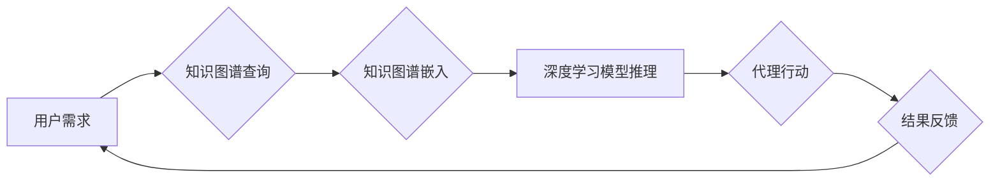

> 深度学习、知识图谱、代理、推理、推荐系统、自然语言处理

## 1. 背景介绍

随着人工智能技术的飞速发展，深度学习算法在图像识别、自然语言处理等领域取得了显著成就。然而，深度学习模型通常缺乏对知识的理解和推理能力，难以处理复杂、多层次的知识关系。知识图谱作为一种结构化的知识表示形式，能够有效地存储和组织知识，为深度学习模型提供丰富的语义信息。

知识图谱在深度学习代理中的应用，旨在结合深度学习的学习能力和知识图谱的知识表示能力，构建更智能、更具推理能力的代理系统。深度学习代理能够利用知识图谱中的知识进行推理、决策和行动，从而更好地理解用户需求、提供更精准的服务和完成更复杂的任务。

## 2. 核心概念与联系

**2.1 深度学习**

深度学习是一种机器学习的子领域，它利用多层神经网络来模拟人类大脑的学习过程。深度学习模型能够从海量数据中自动学习特征和模式，并进行预测或分类。

**2.2 知识图谱**

知识图谱是一种结构化的知识表示形式，它以实体和关系为基本单元，将知识表示为图结构。知识图谱能够存储和组织大量的知识，并支持知识推理和查询。

**2.3 深度学习代理**

深度学习代理是一种利用深度学习算法和知识图谱进行推理和决策的智能代理系统。深度学习代理能够根据用户需求和知识图谱中的知识，进行规划、执行和评估行动。

**2.4 知识图谱嵌入**

知识图谱嵌入是一种将知识图谱中的实体和关系映射到低维向量空间的技术。知识图谱嵌入能够将知识图谱中的结构化知识转化为深度学习模型能够理解的数值表示，从而为深度学习代理提供语义信息。

**2.5  推理机制**

推理机制是深度学习代理利用知识图谱进行推理和决策的关键组件。常见的推理机制包括基于规则的推理、基于概率的推理和基于图神经网络的推理。

**Mermaid 流程图**



## 3. 核心算法原理 & 具体操作步骤

### 3.1  算法原理概述

知识图谱在深度学习代理中的应用主要基于以下核心算法原理：

* **知识图谱嵌入:** 将知识图谱中的实体和关系映射到低维向量空间，以便深度学习模型能够理解和处理。
* **图神经网络:** 利用图结构的特性，对知识图谱进行表示学习和推理。
* **强化学习:** 训练代理模型，使其能够在知识图谱的指导下，做出最优的决策和行动。

### 3.2  算法步骤详解

1. **知识图谱构建和预处理:** 收集和整合来自不同来源的知识，构建知识图谱，并进行预处理，例如实体识别、关系抽取和数据清洗。
2. **知识图谱嵌入:** 使用知识图谱嵌入算法，将知识图谱中的实体和关系映射到低维向量空间。常见的知识图谱嵌入算法包括TransE、TransR、RotatE等。
3. **深度学习模型训练:** 使用深度学习模型，例如图神经网络或强化学习模型，对嵌入后的知识图谱进行训练。
4. **代理推理和决策:** 在训练好的深度学习模型的指导下，代理系统能够根据用户需求和知识图谱中的知识，进行推理和决策，并生成相应的行动计划。
5. **代理行动执行和结果反馈:** 代理系统执行行动计划，并根据执行结果进行反馈，用于模型的进一步训练和优化。

### 3.3  算法优缺点

**优点:**

* **增强知识理解:** 深度学习代理能够利用知识图谱中的知识进行推理和决策，从而更好地理解用户需求和上下文信息。
* **提高决策准确性:** 基于知识图谱的推理能够帮助代理系统做出更准确和合理的决策。
* **支持复杂任务:** 深度学习代理能够处理复杂、多层次的任务，例如问答、对话和规划。

**缺点:**

* **知识图谱构建和维护成本高:** 构建和维护高质量的知识图谱需要大量的资源和人力投入。
* **推理效率问题:** 对于大型知识图谱，推理过程可能比较耗时。
* **数据稀疏性问题:** 知识图谱中的数据可能存在稀疏性问题，影响模型的训练效果。

### 3.4  算法应用领域

* **推荐系统:** 基于用户兴趣和商品属性的知识图谱，构建个性化推荐系统。
* **问答系统:** 利用知识图谱中的知识，回答用户提出的问题。
* **对话系统:** 基于知识图谱，构建更智能、更自然的对话系统。
* **搜索引擎:** 利用知识图谱，提高搜索结果的准确性和相关性。
* **医疗诊断:** 基于医学知识图谱，辅助医生进行诊断和治疗。

## 4. 数学模型和公式 & 详细讲解 & 举例说明

### 4.1  数学模型构建

知识图谱嵌入通常使用以下数学模型进行构建：

* **TransE:** TransE模型假设实体和关系可以表示为向量，并通过以下公式进行预测：

$$h + r \approx t$$

其中，h、r、t分别表示实体h、关系r和实体t的向量表示。

* **TransR:** TransR模型扩展了TransE模型，引入了关系特定的嵌入矩阵，使得关系可以更好地表示实体之间的映射关系。

$$h' + r' \approx t'$$

其中，h'、r'、t'分别表示实体h、关系r和实体t在关系特定嵌入空间中的向量表示。

### 4.2  公式推导过程

TransE模型的损失函数通常使用基于距离的损失函数，例如L1损失或L2损失：

$$L = \sum_{h,r,t \in D} \ell(f(h,r) - t)$$

其中，D表示知识图谱中的训练数据，f(h,r)表示实体h和关系r的向量和，ℓ表示损失函数。

### 4.3  案例分析与讲解

假设我们有一个知识图谱，其中包含以下三条知识：

* 实体A是人
* 实体B是动物
* 实体A是B的主人

我们可以使用TransE模型将这些实体和关系嵌入到向量空间中。例如，实体A的向量表示为[0.2, 0.5, 0.1]，实体B的向量表示为[0.1, 0.3, 0.4]，关系“是主人”的向量表示为[0.1, 0.2, -0.1]。

根据TransE模型的公式，我们可以计算出实体A和关系“是主人”的向量和，并与实体B的向量进行比较。如果向量和与实体B的向量相近，则表示该知识三元组是正确的。

## 5. 项目实践：代码实例和详细解释说明

### 5.1  开发环境搭建

* Python 3.6+
* TensorFlow 2.0+
* PyTorch 1.0+
* NetworkX

### 5.2  源代码详细实现

```python
import tensorflow as tf

# 定义TransE模型
class TransE(tf.keras.Model):
    def __init__(self, embedding_dim):
        super(TransE, self).__init__()
        self.embedding_dim = embedding_dim
        self.entity_embeddings = tf.keras.layers.Embedding(input_dim=num_entities, output_dim=embedding_dim)
        self.relation_embeddings = tf.keras.layers.Embedding(input_dim=num_relations, output_dim=embedding_dim)

    def call(self, inputs):
        h = self.entity_embeddings(inputs[:, 0])
        r = self.relation_embeddings(inputs[:, 1])
        t = self.entity_embeddings(inputs[:, 2])
        return h + r - t

# 训练TransE模型
model = TransE(embedding_dim=128)
optimizer = tf.keras.optimizers.Adam(learning_rate=0.001)
loss_fn = tf.keras.losses.MeanSquaredError()

for epoch in range(num_epochs):
    for batch in train_data:
        with tf.GradientTape() as tape:
            predictions = model(batch)
            loss = loss_fn(predictions, target_values)
        gradients = tape.gradient(loss, model.trainable_variables)
        optimizer.apply_gradients(zip(gradients, model.trainable_variables))

# 保存模型
model.save("transE_model.h5")
```

### 5.3  代码解读与分析

* **模型定义:** 定义了TransE模型，包含实体嵌入层和关系嵌入层。
* **模型训练:** 使用Adam优化器和MeanSquaredError损失函数训练模型。
* **模型保存:** 保存训练好的模型。

### 5.4  运行结果展示

训练完成后，可以使用测试数据评估模型的性能，例如计算准确率、召回率和F1-score。

## 6. 实际应用场景

### 6.1  推荐系统

基于知识图谱的推荐系统能够提供更个性化、更精准的推荐结果。例如，可以根据用户的兴趣爱好、购买历史和社交关系，推荐相关的商品、服务或内容。

### 6.2  问答系统

知识图谱可以帮助问答系统更好地理解用户的问题，并从知识库中找到最相关的答案。例如，可以利用知识图谱中的实体和关系，回答用户关于人物、事件或概念的问题。

### 6.3  对话系统

知识图谱可以为对话系统提供背景知识和语义理解能力，使对话系统能够进行更自然、更流畅的对话。例如，可以利用知识图谱中的知识，帮助对话系统理解用户意图，并提供更准确的回复。

### 6.4  未来应用展望

随着知识图谱和深度学习技术的不断发展，其在代理系统中的应用将更加广泛和深入。例如，可以利用知识图谱构建更智能的虚拟助手、自动驾驶系统和医疗诊断系统。

## 7. 工具和资源推荐

### 7.1  学习资源推荐

* **书籍:**
    * 《深度学习》 by Ian Goodfellow, Yoshua Bengio, and Aaron Courville
    * 《知识图谱》 by  张晓东
* **在线课程:**
    * Coursera: Deep Learning Specialization
    * Udacity: Deep Learning Nanodegree
* **博客和网站:**
    * Towards Data Science
    * Machine Learning Mastery

### 7.2  开发工具推荐

* **知识图谱构建工具:**
    * Neo4j
    * RDF4J
* **深度学习框架:**
    * TensorFlow
    * PyTorch
* **图神经网络库:**
    * DGL
    * Graph-TSNE

### 7.3  相关论文推荐

* **TransE:** Bordes, A., Nickel, M., & Vinyals, O. (2013). Translating embeddings for modeling multi-relational data. In Advances in neural information processing systems (pp. 2777-2785).
* **TransR:** Lin, Y., Liu, R., & He, X. (2015). Learning entity and relation representations with a relation-specific embedding space. In Proceedings of the 2015 conference on empirical methods in natural language processing (pp. 218-227).
* **RotatE:** Sun, Z., Wang, Y., & Yan, J. (2019). RotatE: Knowledge graph embedding by relational rotation in complex space. In Proceedings of the AAAI Conference on Artificial Intelligence (Vol. 33, No. 01).

##