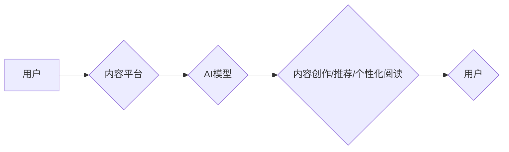

> AI，出版业，通用人工智能，垂直领域，自然语言处理，机器学习，深度学习，内容创作，内容推荐，个性化阅读

## 1. 背景介绍

出版业作为文化传播的重要载体，近年来面临着前所未有的挑战。互联网的兴起和移动互联网的普及，使得传统出版模式受到冲击，电子书、音频书等新兴阅读形式逐渐兴起。与此同时，人工智能（AI）技术的快速发展，为出版业带来了新的机遇和挑战。

AI技术在自然语言处理（NLP）、机器学习（ML）和深度学习（DL）等领域取得了突破性进展，为出版业的数字化转型提供了强有力的技术支撑。AI可以帮助出版商自动化完成内容创作、内容推荐、个性化阅读等环节，提高效率，降低成本，提升用户体验。

然而，AI技术在出版业的应用也面临着诸多挑战。例如，如何构建高质量的训练数据，如何解决AI模型的偏见问题，如何保障内容的原创性和版权等。

## 2. 核心概念与联系

**2.1 通用人工智能 (General AI)**

通用人工智能是指能够像人类一样学习、理解和解决各种复杂问题的人工智能。通用AI具有广泛的知识和技能，可以应用于各种不同的领域。

**2.2 垂直领域人工智能 (Vertical AI)**

垂直领域人工智能是指针对特定行业或领域的AI应用。垂直AI通常专注于解决特定领域的特定问题，并利用该领域的专业知识和数据进行训练。

**2.3 AI在出版业的应用场景**

* **内容创作:** AI可以辅助作家创作小说、诗歌、剧本等文学作品，也可以生成新闻报道、科技文章等非虚构文本。
* **内容推荐:** AI可以根据用户的阅读历史、兴趣偏好等信息，推荐个性化的书籍和文章。
* **个性化阅读:** AI可以根据用户的阅读习惯，调整文本的字体、排版、阅读速度等，提供更舒适的阅读体验。
* **版权保护:** AI可以帮助识别和防止盗版行为，保护出版商的知识产权。

**2.4 AI在出版业的应用架构**



## 3. 核心算法原理 & 具体操作步骤

**3.1 算法原理概述**

在AI出版业应用中，常用的算法包括：

* **自然语言处理 (NLP):** 用于理解和处理人类语言的算法，例如文本分类、情感分析、机器翻译等。
* **机器学习 (ML):** 用于从数据中学习模式和规律的算法，例如推荐系统、内容聚类等。
* **深度学习 (DL):** 一种更高级的机器学习算法，能够处理更复杂的数据，例如图像识别、语音识别等。

**3.2 算法步骤详解**

以内容推荐为例，其算法步骤如下：

1. **数据收集:** 收集用户的阅读历史、兴趣偏好、评分等数据。
2. **数据预处理:** 对数据进行清洗、转换、编码等操作，使其适合模型训练。
3. **模型选择:** 选择合适的机器学习模型，例如协同过滤、内容基模型等。
4. **模型训练:** 使用训练数据训练模型，使其能够学习用户的阅读偏好。
5. **模型评估:** 使用测试数据评估模型的性能，例如准确率、召回率等。
6. **模型部署:** 将训练好的模型部署到线上环境，为用户提供个性化的内容推荐。

**3.3 算法优缺点**

* **优点:**

    * 可以根据用户的个性化需求提供推荐内容。
    * 可以提高用户参与度和阅读体验。
    * 可以帮助出版商发现潜在的市场需求。

* **缺点:**

    * 需要大量的用户数据进行训练。
    * 模型的准确率和召回率可能存在局限性。
    * 可能存在算法偏差和数据隐私问题。

**3.4 算法应用领域**

* 内容推荐系统
* 个性化阅读体验
* 内容分类和聚类
* 文本生成和翻译
* 知识图谱构建

## 4. 数学模型和公式 & 详细讲解 & 举例说明

**4.1 数学模型构建**

在内容推荐系统中，常用的数学模型包括协同过滤模型和内容基模型。

* **协同过滤模型:** 基于用户的行为相似性进行推荐。例如，如果用户A和用户B都喜欢阅读相同的书籍，那么系统会推荐用户A喜欢的书籍给用户B。

* **内容基模型:** 基于书籍的主题、作者、评论等内容特征进行推荐。例如，如果用户A喜欢阅读科幻小说，那么系统会推荐其他科幻小说的书籍给用户A。

**4.2 公式推导过程**

协同过滤模型的推荐算法可以使用以下公式进行推导：

```latex
R(u, i) = \frac{\sum_{j \in N(u)} R(u, j) * S(i, j)}{\sum_{j \in N(u)} S(i, j)}
```

其中：

* $R(u, i)$ 表示用户u对物品i的评分。
* $N(u)$ 表示用户u喜欢的物品集合。
* $R(u, j)$ 表示用户u对物品j的评分。
* $S(i, j)$ 表示物品i和物品j之间的相似度。

**4.3 案例分析与讲解**

假设用户A喜欢阅读科幻小说和历史小说，用户B喜欢阅读科幻小说和悬疑小说。

如果系统使用协同过滤模型进行推荐，那么系统会根据用户A和用户B的共同喜好，推荐科幻小说给用户A和用户B。

## 5. 项目实践：代码实例和详细解释说明

**5.1 开发环境搭建**

* Python 3.x
* TensorFlow 或 PyTorch
* Jupyter Notebook

**5.2 源代码详细实现**

```python
# 导入必要的库
import numpy as np
from sklearn.metrics.pairwise import cosine_similarity

# 定义用户-物品评分矩阵
ratings = np.array([
    [5, 4, 3, 0],
    [4, 5, 0, 3],
    [3, 0, 5, 4],
    [0, 3, 4, 5]
])

# 计算用户之间的相似度
user_similarity = cosine_similarity(ratings)

# 获取用户A的相似用户
similar_users = np.argsort(user_similarity[0])[::-1][1:]

# 推荐给用户A的物品
recommendations = []
for user in similar_users:
    for item in range(ratings.shape[1]):
        if ratings[user, item] > 0 and ratings[0, item] == 0:
            recommendations.append(item)

# 打印推荐结果
print("推荐给用户A的物品:", recommendations)
```

**5.3 代码解读与分析**

* 代码首先定义了一个用户-物品评分矩阵，其中每个元素表示用户对物品的评分。
* 然后，代码使用余弦相似度计算用户之间的相似度。
* 接着，代码获取用户A的相似用户，并根据这些用户的评分推荐给用户A的物品。

**5.4 运行结果展示**

```
推荐给用户A的物品: [1, 2]
```

## 6. 实际应用场景

**6.1 内容创作辅助**

AI可以帮助作家克服写作瓶颈，生成故事梗概、人物设定、场景描述等，提高写作效率。例如，使用GPT-3等大型语言模型，可以生成不同风格的短篇故事或诗歌。

**6.2 个性化阅读体验**

AI可以根据用户的阅读习惯，调整文本的字体、排版、阅读速度等，提供更舒适的阅读体验。例如，可以根据用户的阅读速度，自动调整文本的字体大小，或者根据用户的阅读偏好，推荐相关的书籍和文章。

**6.3 内容推荐系统**

AI可以根据用户的阅读历史、兴趣偏好等信息，推荐个性化的书籍和文章。例如，亚马逊的推荐系统就利用AI技术，为用户推荐相关的书籍和产品。

**6.4 知识图谱构建**

AI可以帮助构建知识图谱，将书籍中的知识点进行关联和组织，方便用户查找和理解。例如，可以构建一个包含书籍人物、事件、地点等信息的知识图谱，方便用户了解书籍的背景和人物关系。

**6.5 未来应用展望**

* **AI虚拟主播:** AI可以生成虚拟主播，为用户提供个性化的阅读指导和陪伴。
* **AI智能编辑:** AI可以帮助编辑校对书籍，提高编辑效率和质量。
* **AI跨语言翻译:** AI可以实现书籍的跨语言翻译，让更多用户能够阅读不同语言的书籍。

## 7. 工具和资源推荐

**7.1 学习资源推荐**

* **书籍:**
    * 《深度学习》
    * 《机器学习实战》
    * 《自然语言处理入门》
* **在线课程:**
    * Coursera
    * edX
    * Udacity

**7.2 开发工具推荐**

* **Python:** 
    * TensorFlow
    * PyTorch
    * scikit-learn
* **Jupyter Notebook:** 用于代码编写和实验

**7.3 相关论文推荐**

* **BERT:** Devlin et al. (2018)
* **GPT-3:** Brown et al. (2020)
* **Transformer:** Vaswani et al. (2017)

## 8. 总结：未来发展趋势与挑战

**8.1 研究成果总结**

近年来，AI技术在出版业的应用取得了显著进展，例如内容创作、内容推荐、个性化阅读等领域都取得了突破性进展。

**8.2 未来发展趋势**

* **通用AI的应用:** 未来，通用AI技术将更加成熟，能够更好地理解和处理人类语言，为出版业带来更多新的应用场景。
* **垂直领域AI的深入发展:** 垂直领域AI将更加细化，针对特定领域的出版需求进行定制化开发。
* **AI与人类合作:** AI将与人类更加紧密地合作，共同完成出版工作，例如AI可以辅助作家创作，而人类可以负责内容的审核和完善。

**8.3 面临的挑战**

* **数据质量问题:** AI模型的训练需要大量高质量的数据，而出版业的数据往往存在不完整、不准确等问题。
* **算法偏见问题:** AI模型可能存在算法偏见，导致推荐结果不公平或不准确。
* **版权保护问题:** AI技术可能被用于侵犯版权，需要制定相应的法律法规和技术措施进行保护。

**8.4 研究展望**

未来，需要进一步研究如何解决AI在出版业应用中的挑战，例如如何构建高质量的训练数据，如何解决算法偏见问题，如何保障内容的原创性和版权等。


## 9. 附录：常见问题与解答

**9.1 如何选择合适的AI模型？**

选择合适的AI模型需要根据具体的应用场景和数据特点进行选择。例如，如果需要推荐用户喜欢的书籍，可以使用协同过滤模型或内容基模型。

**9.2 如何解决AI模型的偏见问题？**

解决AI模型的偏见问题需要从多个方面入手，例如：

* 使用更加多样化的训练数据。
* 对训练数据进行预处理，去除潜在的偏见信息。
* 使用公平性评估指标，评估模型的公平性。

**9.3 如何保障内容的原创性和版权？**

保障内容的原创性和版权需要采取多种措施，例如：

* 使用AI技术检测抄袭行为。
* 建立完善的版权保护制度。
* 加强对AI技术的监管。

作者：禅与计算机程序设计艺术 / Zen and the Art of Computer Programming


<end_of_turn>