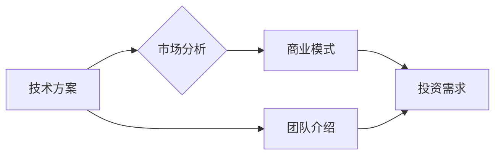

> AI创业公司,技术白皮书,结构安排,内容组织,语言表达,投资人,技术方案,市场分析,竞争对手分析

## 1. 背景介绍

在人工智能（AI）技术蓬勃发展的时代，AI创业公司层出不穷。为了吸引投资，获得合作伙伴，并有效地向市场推广自己的技术方案，撰写一份高质量的技术白皮书至关重要。技术白皮书是AI创业公司向潜在投资者、合作伙伴和客户展示其技术实力、市场潜力和商业模式的权威文件。

然而，许多AI创业公司在撰写技术白皮书时存在一些常见问题，例如结构混乱、内容冗长、语言表达生硬等。这些问题会导致白皮书难以阅读，无法有效地传达信息，从而影响投资和合作机会。

## 2. 核心概念与联系

**2.1 AI创业公司技术白皮书的核心概念**

* **技术方案:**  详细阐述AI创业公司的核心技术，包括算法原理、模型架构、数据处理方法等。
* **市场分析:**  分析目标市场规模、用户需求、竞争格局等，证明AI创业公司的技术方案具有市场价值。
* **商业模式:**  阐述AI创业公司如何盈利，包括收入来源、成本结构、定价策略等。
* **团队介绍:**  介绍AI创业公司的核心团队成员，包括他们的专业背景、经验和成就。
* **投资需求:**  明确AI创业公司需要筹集的资金规模、用途和预期回报。

**2.2 AI创业公司技术白皮书的联系**

技术方案、市场分析、商业模式、团队介绍和投资需求是AI创业公司技术白皮书的核心要素，它们相互关联，共同构成了AI创业公司的整体价值主张。

**2.3  AI创业公司技术白皮书的流程图**



## 3. 核心算法原理 & 具体操作步骤

**3.1 算法原理概述**

深度学习算法是AI创业公司技术白皮书中经常出现的核心技术之一。深度学习算法是一种基于多层神经网络的机器学习算法，能够从海量数据中自动学习特征，并进行复杂的模式识别和预测。

**3.2 算法步骤详解**

1. **数据预处理:**  收集和清洗数据，将其转换为深度学习算法可以理解的格式。
2. **网络结构设计:**  根据任务需求设计多层神经网络的结构，包括神经元数量、连接方式和激活函数等。
3. **模型训练:**  使用训练数据训练深度学习模型，调整网络参数，使其能够准确地进行预测。
4. **模型评估:**  使用测试数据评估模型的性能，例如准确率、召回率和F1-score等。
5. **模型部署:**  将训练好的模型部署到实际应用场景中，用于进行预测或决策。

**3.3 算法优缺点**

**优点:**

* 能够自动学习特征，无需人工特征工程。
* 能够处理海量数据，学习复杂模式。
* 在图像识别、自然语言处理等领域取得了突破性进展。

**缺点:**

* 训练数据量要求高，需要大量的计算资源。
* 模型解释性差，难以理解模型的决策过程。
* 容易受到过拟合的影响，需要进行正则化和交叉验证等技术手段。

**3.4 算法应用领域**

深度学习算法广泛应用于各个领域，例如：

* **计算机视觉:**  图像识别、目标检测、图像分割等。
* **自然语言处理:**  文本分类、情感分析、机器翻译等。
* **语音识别:**  语音转文本、语音合成等。
* **推荐系统:**  商品推荐、内容推荐等。
* **医疗诊断:**  疾病诊断、影像分析等。

## 4. 数学模型和公式 & 详细讲解 & 举例说明

**4.1 数学模型构建**

深度学习算法的核心是神经网络模型，其数学模型可以表示为多层感知机（MLP）。

**4.2 公式推导过程**

MLP的输出层神经元激活函数通常使用sigmoid函数，其公式如下：

$$
\sigma(x) = \frac{1}{1 + e^{-x}}
$$

其中，x是输入信号。

**4.3 案例分析与讲解**

假设我们有一个二分类问题，需要判断图像是否包含猫。我们可以使用MLP模型进行训练，输入图像特征，输出猫的概率。

训练过程中，使用梯度下降算法更新模型参数，使得模型输出的概率与真实标签尽可能接近。

## 5. 项目实践：代码实例和详细解释说明

**5.1 开发环境搭建**

使用Python语言和深度学习框架TensorFlow或PyTorch搭建开发环境。

**5.2 源代码详细实现**

```python
import tensorflow as tf

# 定义模型结构
model = tf.keras.models.Sequential([
    tf.keras.layers.Dense(128, activation='relu', input_shape=(784,)),
    tf.keras.layers.Dense(10, activation='softmax')
])

# 编译模型
model.compile(optimizer='adam',
              loss='sparse_categorical_crossentropy',
              metrics=['accuracy'])

# 训练模型
model.fit(x_train, y_train, epochs=10)

# 评估模型
loss, accuracy = model.evaluate(x_test, y_test)
print('Test loss:', loss)
print('Test accuracy:', accuracy)
```

**5.3 代码解读与分析**

这段代码定义了一个简单的MLP模型，并使用MNIST数据集进行训练。

* `tf.keras.models.Sequential`定义了一个顺序模型，神经层按顺序连接。
* `tf.keras.layers.Dense`定义了一个全连接层，每个神经元都连接到上一层的每个神经元。
* `activation='relu'`指定了ReLU激活函数，用于引入非线性。
* `input_shape=(784,)`指定了输入数据的形状，MNIST数据集的图像数据被展平成784维向量。
* `optimizer='adam'`指定了Adam优化器，用于更新模型参数。
* `loss='sparse_categorical_crossentropy'`指定了分类交叉熵损失函数，用于衡量模型预测结果与真实标签之间的差异。
* `metrics=['accuracy']`指定了准确率作为评估指标。

**5.4 运行结果展示**

训练完成后，模型可以用于预测新的图像数据是否包含猫。

## 6. 实际应用场景

**6.1  图像识别**

AI创业公司可以利用深度学习算法开发图像识别系统，用于自动识别物体、场景、人物等。

**6.2 自然语言处理**

AI创业公司可以利用深度学习算法开发自然语言处理系统，用于文本分类、情感分析、机器翻译等。

**6.3  语音识别**

AI创业公司可以利用深度学习算法开发语音识别系统，用于语音转文本、语音合成等。

**6.4 未来应用展望**

随着AI技术的不断发展，深度学习算法将在更多领域得到应用，例如医疗诊断、金融风险控制、自动驾驶等。

## 7. 工具和资源推荐

**7.1 学习资源推荐**

* **书籍:**
    * 深度学习
    * 构建深度学习模型
* **在线课程:**
    * Coursera深度学习课程
    * Udacity深度学习工程师课程

**7.2 开发工具推荐**

* **深度学习框架:**
    * TensorFlow
    * PyTorch
* **数据处理工具:**
    * Pandas
    * NumPy

**7.3 相关论文推荐**

* **AlexNet: ImageNet Classification with Deep Convolutional Neural Networks**
* **Deep Residual Learning for Image Recognition**
* **Attention Is All You Need**

## 8. 总结：未来发展趋势与挑战

**8.1 研究成果总结**

深度学习算法取得了显著的成果，在图像识别、自然语言处理等领域取得了突破性进展。

**8.2 未来发展趋势**

* **模型规模和复杂度提升:**  未来深度学习模型将更加庞大，包含更多层和参数。
* **数据效率提升:**  研究人员将探索更有效地利用数据，提高模型的训练效率。
* **模型解释性增强:**  研究人员将致力于提高深度学习模型的解释性，使其决策过程更加透明。

**8.3 面临的挑战**

* **计算资源需求:**  训练大型深度学习模型需要大量的计算资源，成本较高。
* **数据标注问题:**  深度学习算法需要大量的标注数据，标注成本高昂。
* **模型安全性和可靠性:**  深度学习模型容易受到攻击，其安全性需要进一步提高。

**8.4 研究展望**

未来研究将集中在解决上述挑战，提高深度学习算法的效率、安全性、可靠性和解释性。


## 9. 附录：常见问题与解答

**9.1  深度学习算法需要多少数据才能训练？**

深度学习算法对数据的需求量很大，一般来说，需要至少几千到几百万个样本才能训练出一个有效的模型。

**9.2  如何选择合适的深度学习框架？**

选择深度学习框架需要根据具体项目需求和个人经验进行选择。TensorFlow和PyTorch是目前最流行的深度学习框架，各有优缺点。

**9.3  如何评估深度学习模型的性能？**

常用的评估指标包括准确率、召回率、F1-score等。

**9.4  如何防止深度学习模型过拟合？**

常用的防止过拟合的方法包括正则化、交叉验证、数据增强等。

**9.5  深度学习算法的未来发展趋势是什么？**

深度学习算法的未来发展趋势包括模型规模和复杂度提升、数据效率提升、模型解释性增强等。


作者：禅与计算机程序设计艺术 / Zen and the Art of Computer Programming 
<end_of_turn>