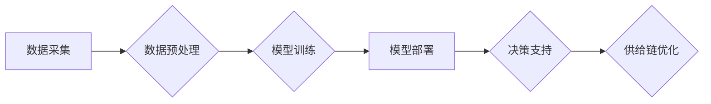

> AI,电商平台,供给链管理,机器学习,预测模型,优化算法,深度学习,自然语言处理

## 1. 背景介绍

随着电商平台的蓬勃发展，供给链管理已成为电商平台的核心竞争力之一。传统的供给链管理模式往往依赖于经验和人工干预，难以应对日益复杂的市场需求和供应链环境。人工智能（AI）技术的快速发展为电商平台供给链管理带来了新的机遇。AI算法能够分析海量数据，识别模式和趋势，并提供智能化的决策支持，从而提高供给链的效率、透明度和可预测性。

## 2. 核心概念与联系

**2.1  电商平台供给链管理**

电商平台供给链管理是指从原材料采购到最终产品交付，整个商品流通过程中的管理和控制。它涉及到多个环节，包括：

* **采购:** 采购原材料和半成品。
* **生产:** 生产商品。
* **仓储:** 储存商品。
* **配送:** 将商品配送到消费者手中。
* **退货:** 处理退货和换货。

**2.2  人工智能（AI）**

人工智能（AI）是指模拟人类智能行为的计算机系统。AI技术涵盖了多个领域，包括机器学习、深度学习、自然语言处理等。

**2.3  AI在电商平台供给链管理中的应用**

AI技术可以应用于电商平台供给链管理的各个环节，例如：

* **需求预测:** 利用机器学习算法分析历史销售数据、市场趋势等信息，预测未来商品需求。
* **库存优化:** 根据需求预测和库存水平，优化库存策略，避免库存积压或缺货。
* **物流优化:** 利用AI算法规划最优配送路线，提高配送效率和降低成本。
* **风险管理:** 利用AI算法识别潜在的供应链风险，并采取措施进行风险控制。

**2.4  AI供给链管理架构**



## 3. 核心算法原理 & 具体操作步骤

**3.1  算法原理概述**

在电商平台供给链管理中，常用的AI算法包括：

* **机器学习算法:** 
    * **回归算法:** 用于预测连续型变量，例如商品需求量。
    * **分类算法:** 用于分类数据，例如商品类别或风险等级。
    * **聚类算法:** 用于将数据分组，例如客户群体或供应商类型。
* **深度学习算法:** 
    * **卷积神经网络 (CNN):** 用于图像识别和分析，例如商品图像识别和质量检测。
    * **循环神经网络 (RNN):** 用于处理序列数据，例如商品评论分析和需求趋势预测。

**3.2  算法步骤详解**

以需求预测为例，使用机器学习算法进行需求预测的步骤如下：

1. **数据采集:** 收集历史销售数据、市场趋势数据、季节性数据等相关信息。
2. **数据预处理:** 清洗数据、处理缺失值、特征工程等。
3. **模型选择:** 根据数据特点和预测目标选择合适的机器学习算法。
4. **模型训练:** 使用训练数据训练模型，调整模型参数。
5. **模型评估:** 使用测试数据评估模型性能，例如准确率、均方误差等。
6. **模型部署:** 将训练好的模型部署到生产环境中，用于预测未来商品需求。

**3.3  算法优缺点**

* **机器学习算法:**
    * **优点:** 能够从数据中学习规律，预测未来趋势。
    * **缺点:** 需要大量的数据进行训练，对数据质量要求高。
* **深度学习算法:**
    * **优点:** 能够处理复杂的数据，学习更深层次的特征。
    * **缺点:** 需要更多的计算资源和数据进行训练，模型解释性较差。

**3.4  算法应用领域**

* **需求预测:** 预测未来商品需求量。
* **库存优化:** 优化库存水平，避免库存积压或缺货。
* **物流优化:** 规划最优配送路线，提高配送效率。
* **风险管理:** 识别潜在的供应链风险，并采取措施进行风险控制。

## 4. 数学模型和公式 & 详细讲解 & 举例说明

**4.1  数学模型构建**

需求预测模型可以构建为一个回归模型，例如线性回归模型或支持向量机回归模型。

**4.2  公式推导过程**

以线性回归模型为例，其目标是找到一条直线，使得预测值与实际值之间的误差最小。

线性回归模型的公式如下：

$$y = \beta_0 + \beta_1x_1 + \beta_2x_2 + ... + \beta_nx_n + \epsilon$$

其中：

* $y$ 是预测值
* $x_1, x_2, ..., x_n$ 是输入特征
* $\beta_0, \beta_1, \beta_2, ..., \beta_n$ 是模型参数
* $\epsilon$ 是误差项

模型参数可以通过最小二乘法进行估计。

**4.3  案例分析与讲解**

假设我们要预测某商品的未来销量，输入特征包括：

* 历史销量
* 市场趋势
* 季节性因素

我们可以使用线性回归模型进行预测。通过训练模型，得到模型参数，然后将未来月份的输入特征代入模型公式，即可得到预测销量。

## 5. 项目实践：代码实例和详细解释说明

**5.1  开发环境搭建**

* Python 3.x
* Jupyter Notebook
* scikit-learn

**5.2  源代码详细实现**

```python
from sklearn.linear_model import LinearRegression
from sklearn.model_selection import train_test_split
import pandas as pd

# 加载数据
data = pd.read_csv('sales_data.csv')

# 选择特征和目标变量
X = data[['历史销量', '市场趋势', '季节性因素']]
y = data['销量']

# 将数据分为训练集和测试集
X_train, X_test, y_train, y_test = train_test_split(X, y, test_size=0.2, random_state=42)

# 创建线性回归模型
model = LinearRegression()

# 训练模型
model.fit(X_train, y_train)

# 预测测试集数据
y_pred = model.predict(X_test)

# 评估模型性能
from sklearn.metrics import mean_squared_error
mse = mean_squared_error(y_test, y_pred)
print('均方误差:', mse)
```

**5.3  代码解读与分析**

* 首先，加载数据并选择特征和目标变量。
* 然后，将数据分为训练集和测试集。
* 创建线性回归模型并训练模型。
* 使用训练好的模型预测测试集数据。
* 最后，评估模型性能，例如使用均方误差来衡量预测误差。

**5.4  运行结果展示**

运行代码后，会输出模型的均方误差值。均方误差值越小，模型的预测性能越好。

## 6. 实际应用场景

**6.1  需求预测**

电商平台可以利用AI算法预测未来商品需求，从而优化库存水平，避免库存积压或缺货。例如，根据历史销售数据、市场趋势等信息，预测未来一个月内某商品的需求量，并根据预测结果调整库存水平。

**6.2  库存优化**

AI算法可以帮助电商平台优化库存策略，例如使用ABC分析法将商品分类，对不同类别的商品制定不同的库存管理策略。

**6.3  物流优化**

AI算法可以帮助电商平台优化物流配送路线，提高配送效率和降低成本。例如，使用车辆路径规划算法规划最优配送路线，并根据实时路况信息进行动态调整。

**6.4  风险管理**

AI算法可以帮助电商平台识别潜在的供应链风险，例如供应商风险、物流风险等。例如，使用机器学习算法分析供应商的历史数据，识别潜在的信用风险。

## 7. 工具和资源推荐

**7.1  学习资源推荐**

* **书籍:**
    * 《深度学习》
    * 《机器学习实战》
* **在线课程:**
    * Coursera: 机器学习
    * edX: 深度学习
* **博客:**
    * Towards Data Science
    * Machine Learning Mastery

**7.2  开发工具推荐**

* **Python:** 
    * scikit-learn
    * TensorFlow
    * PyTorch
* **数据可视化工具:**
    * Matplotlib
    * Seaborn

**7.3  相关论文推荐**

* **需求预测:**
    * "A Survey of Time Series Forecasting Methods for E-commerce"
* **库存优化:**
    * "Inventory Control Using Machine Learning"
* **物流优化:**
    * "Vehicle Routing Problem: A Review"

## 8. 总结：未来发展趋势与挑战

**8.1  研究成果总结**

AI技术在电商平台供给链管理中的应用取得了显著的成果，例如提高了需求预测精度、优化了库存水平、提高了物流效率等。

**8.2  未来发展趋势**

* **更精准的预测:** 利用更先进的机器学习算法和深度学习算法，提高需求预测的精度。
* **更智能的决策:** 利用AI算法进行智能化决策，例如自动调整库存水平、优化配送路线等。
* **更可持续的供应链:** 利用AI算法提高供应链的透明度和可追溯性，实现更可持续的供应链管理。

**8.3  面临的挑战**

* **数据质量:** AI算法对数据质量要求高，需要确保数据的准确性和完整性。
* **模型解释性:** 深度学习模型的解释性较差，难以理解模型的决策过程。
* **伦理问题:** AI算法在供给链管理中的应用可能引发一些伦理问题，例如算法偏见、数据隐私等。

**8.4  研究展望**

未来，需要进一步研究更精准的预测模型、更智能的决策算法和更可持续的供应链管理方法，以更好地利用AI技术提升电商平台供给链管理的效率和效益。

## 9. 附录：常见问题与解答

**9.1  Q: AI算法是否能够完全替代人工干预？**

**A:** 目前，AI算法仍然无法完全替代人工干预。AI算法可以提供智能化的决策支持，但最终决策还需要人工进行判断和决策。

**9.2  Q: 如何保证AI算法的公平性和透明度？**

**A:** 为了保证AI算法的公平性和透明度，需要采取以下措施：

* 使用公平的训练数据。
* 对算法进行解释性分析，使得决策过程更加透明。
* 建立相应的伦理规范和监管机制。


作者：禅与计算机程序设计艺术 / Zen and the Art of Computer Programming 
<end_of_turn>