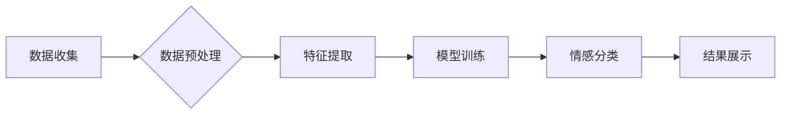

> 情感分析，自然语言处理，机器学习，深度学习，文本分类，情感识别，情绪分析，应用场景

## 1. 背景介绍

在当今数据爆炸的时代，人们通过网络平台表达情感和观点的方式日益增多。从社交媒体上的评论到在线论坛的讨论，从客户反馈到市场调研，海量的文本数据蕴藏着丰富的用户情感信息。如何有效地理解和分析这些情感信息，对于企业决策、市场营销、用户体验优化等方面都具有重要意义。

情感分析技术，也称为情绪分析或情感识别，正是为了解决这一问题而诞生的。它利用自然语言处理（NLP）和机器学习（ML）等技术，从文本数据中识别、分类和理解用户的情感倾向，例如积极、消极、中性、愤怒、快乐等。

## 2. 核心概念与联系

情感分析技术的核心是将文本数据映射到情感标签。这需要对语言的结构、语义和情感表达方式进行深入理解。

**2.1 情感分析的类型**

情感分析可以分为以下几种类型：

* **文档级情感分析:** 对整个文档的情感倾向进行分类，例如判断一篇新闻评论是正面、负面还是中性。
* **句子级情感分析:** 对每个句子进行情感分类，识别句子中表达的情感。
* **词语级情感分析:** 对每个词语的情感倾向进行分析，例如判断“好”和“坏”这两个词语的情感色彩。

**2.2 情感分析的流程**

情感分析的流程通常包括以下几个步骤：

1. **数据收集:** 收集包含情感信息的文本数据，例如社交媒体评论、用户反馈、新闻文章等。
2. **数据预处理:** 对文本数据进行清洗、去噪、分词、词干提取等预处理操作，以便于后续的分析。
3. **特征提取:** 从预处理后的文本数据中提取情感相关的特征，例如词语、短语、情感词典等。
4. **模型训练:** 利用机器学习算法对提取的特征进行训练，建立情感分析模型。
5. **情感分类:** 将新的文本数据输入到训练好的模型中，预测其情感倾向。

**2.3  情感分析的架构**



## 3. 核心算法原理 & 具体操作步骤

### 3.1  算法原理概述

情感分析算法主要分为以下几种类型：

* **基于规则的算法:** 基于人工定义的规则和情感词典，对文本进行情感分类。
* **基于机器学习的算法:** 利用机器学习算法，从训练数据中学习情感分类模型。常见的机器学习算法包括支持向量机（SVM）、朴素贝叶斯（NB）、决策树（DT）、随机森林（RF）等。
* **基于深度学习的算法:** 利用深度神经网络，例如循环神经网络（RNN）、长短期记忆网络（LSTM）、Transformer等，对文本进行情感分析。

### 3.2  算法步骤详解

以基于机器学习的文本分类算法为例，详细说明其步骤：

1. **数据准备:** 收集并清洗情感标注数据，例如电影评论数据，每个评论都标注了其情感类别（正面、负面、中性）。
2. **特征工程:** 从文本数据中提取特征，例如词频、词向量、情感词典得分等。
3. **模型选择:** 选择合适的机器学习算法，例如SVM、NB、DT等。
4. **模型训练:** 利用训练数据训练模型，学习情感分类规则。
5. **模型评估:** 使用测试数据评估模型的性能，例如准确率、召回率、F1-score等。
6. **模型调参:** 根据评估结果，调整模型参数，提高模型性能。
7. **模型部署:** 将训练好的模型部署到实际应用场景中，用于对新的文本数据进行情感分类。

### 3.3  算法优缺点

**基于规则的算法:**

* **优点:** 简单易实现，解释性强。
* **缺点:** 规则难以覆盖所有情况，容易受到语言变化的影响。

**基于机器学习的算法:**

* **优点:** 可以学习到更复杂的模式，性能通常优于基于规则的算法。
* **缺点:** 需要大量的训练数据，训练过程复杂，解释性较弱。

**基于深度学习的算法:**

* **优点:** 可以学习到更深层次的语义特征，性能通常优于其他算法。
* **缺点:** 需要更强大的计算资源，训练过程更复杂，解释性更弱。

### 3.4  算法应用领域

情感分析技术广泛应用于以下领域：

* **市场营销:** 分析客户对产品和服务的评价，了解市场趋势，改进营销策略。
* **社交媒体监控:** 监测社交媒体平台上的舆情，及时发现潜在风险，进行危机公关。
* **客户服务:** 自动识别客户的意图和情感，提供更精准的客服服务。
* **用户体验优化:** 分析用户对产品和服务的反馈，改进用户体验。
* **金融领域:** 分析市场情绪，预测股票价格走势。

## 4. 数学模型和公式 & 详细讲解 & 举例说明

### 4.1  数学模型构建

情感分析模型通常基于概率论和统计学原理，将文本数据映射到情感标签。

**4.1.1  朴素贝叶斯模型**

朴素贝叶斯模型是一种基于贝叶斯定理的分类算法，假设特征之间相互独立。

**贝叶斯定理:**

$$P(A|B) = \frac{P(B|A)P(A)}{P(B)}$$

其中：

* $P(A|B)$ 是在已知事件 B 发生的情况下，事件 A 发生的概率。
* $P(B|A)$ 是在已知事件 A 发生的情况下，事件 B 发生的概率。
* $P(A)$ 是事件 A 发生的概率。
* $P(B)$ 是事件 B 发生的概率。

**朴素贝叶斯模型的假设:**

* 每个特征对分类结果的影响是独立的。

**朴素贝叶斯模型的计算公式:**

$$P(C_i|x) = \frac{P(x|C_i)P(C_i)}{P(x)}$$

其中：

* $C_i$ 是情感类别。
* $x$ 是文本数据。
* $P(C_i)$ 是情感类别 $C_i$ 的先验概率。
* $P(x|C_i)$ 是在情感类别 $C_i$ 下，文本数据 $x$ 的条件概率。
* $P(x)$ 是文本数据 $x$ 的边缘概率。

**4.1.2  支持向量机模型**

支持向量机 (SVM) 是一种基于几何间隔最大化的分类算法。

**SVM 的目标:**

找到一个超平面，将不同类别的样本点分开，并且最大化超平面到最近样本点的距离。

**SVM 的数学公式:**

$$w^Tx + b = 0$$

其中：

* $w$ 是超平面的法向量。
* $x$ 是样本点。
* $b$ 是超平面的截距。

### 4.2  公式推导过程

SVM 的公式推导过程比较复杂，涉及到拉格朗日乘子法、凸优化等数学知识。

### 4.3  案例分析与讲解

以电影评论数据为例，使用朴素贝叶斯模型进行情感分类。

**数据:**

* 训练数据包含 1000 条电影评论，每个评论都标注了其情感类别（正面、负面、中性）。
* 测试数据包含 100 条电影评论。

**模型训练:**

使用训练数据训练朴素贝叶斯模型，学习情感分类规则。

**模型评估:**

使用测试数据评估模型的性能，例如准确率、召回率、F1-score等。

**结果分析:**

根据评估结果，可以判断模型的分类效果，并进行进一步的调参和优化。

## 5. 项目实践：代码实例和详细解释说明

### 5.1  开发环境搭建

* 操作系统: Ubuntu 20.04
* Python 版本: 3.8
* 必要的库: NLTK, Scikit-learn, TensorFlow

### 5.2  源代码详细实现

```python
# 导入必要的库
import nltk
from nltk.corpus import stopwords
from sklearn.feature_extraction.text import TfidfVectorizer
from sklearn.model_selection import train_test_split
from sklearn.naive_bayes import MultinomialNB
from sklearn.metrics import accuracy_score

# 下载 NLTK 数据
nltk.download('stopwords')
nltk.download('punkt')

# 加载数据
# ...

# 数据预处理
def preprocess_text(text):
    # 分词
    tokens = nltk.word_tokenize(text)
    # 去除停用词
    stop_words = set(stopwords.words('english'))
    tokens = [word for word in tokens if word.lower() not in stop_words]
    # ... 其他预处理操作

# 特征提取
vectorizer = TfidfVectorizer()
X = vectorizer.fit_transform(data['text'])

# 数据划分
X_train, X_test, y_train, y_test = train_test_split(X, data['label'], test_size=0.2, random_state=42)

# 模型训练
model = MultinomialNB()
model.fit(X_train, y_train)

# 模型预测
y_pred = model.predict(X_test)

# 模型评估
accuracy = accuracy_score(y_test, y_pred)
print(f'Accuracy: {accuracy}')

```

### 5.3  代码解读与分析

* 代码首先导入必要的库，并下载 NLTK 数据。
* 然后定义一个 `preprocess_text` 函数，对文本数据进行预处理，包括分词、去除停用词等操作。
* 使用 `TfidfVectorizer` 将文本数据转换为 TF-IDF 向量，作为模型的输入特征。
* 将数据划分为训练集和测试集。
* 使用 `MultinomialNB` 训练情感分类模型。
* 使用训练好的模型对测试数据进行预测，并计算模型的准确率。

### 5.4  运行结果展示

运行代码后，会输出模型的准确率。

## 6. 实际应用场景

### 6.1  市场营销

* **产品评价分析:** 分析用户对产品评论的情感倾向，了解用户对产品的满意度和潜在问题。
* **广告效果评估:** 监测广告文案和广告投放效果，分析用户对广告的反应。
* **品牌形象监测:** 监控社交媒体平台上的品牌相关话题，了解用户对品牌的感知和态度。

### 6.2  社交媒体监控

* **舆情分析:** 监测社交媒体平台上的舆情，及时发现潜在风险和危机。
* **品牌危机公关:** 对负面舆情进行分析和应对，维护品牌形象。
* **用户情绪分析:** 分析用户对特定事件或话题的情绪倾向，了解用户需求和痛点。

### 6.3  客户服务

* **自动客服:** 利用情感分析技术，识别用户的问题和意图，提供更精准的客服服务。
* **客户满意度调查:** 分析客户反馈的情感倾向，了解客户对服务的满意度。
* **客户关系管理:** 分析客户的情感变化，及时提供个性化服务，提升客户忠诚度。

### 6.4  未来应用展望

随着人工智能技术的不断发展，情感分析技术将有更广泛的应用场景：

* **医疗领域:** 分析患者的病历和症状，预测患者的情绪状态，提供更精准的医疗服务。
* **教育领域:** 分析学生的学习情绪和反馈，提供个性化的学习建议。
* **金融领域:** 分析投资者的情绪倾向，预测市场走势。

## 7. 工具和资源推荐

### 7.1  学习资源推荐

