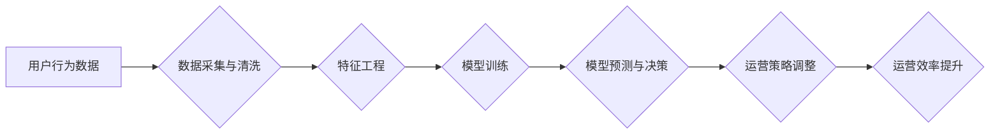

>  电商平台、人工智能、运营效率、推荐系统、个性化服务、机器学习、深度学习、自然语言处理

## 1. 背景介绍

随着电子商务行业的蓬勃发展，电商平台面临着日益激烈的市场竞争。为了提升运营效率、增强用户体验，电商平台需要不断探索新的技术手段。人工智能（AI）作为一门新兴技术，凭借其强大的数据处理能力和智能决策能力，为电商平台的运营效率提升提供了新的思路和解决方案。

传统的电商平台运营模式主要依赖于人工干预，例如商品分类、价格调整、用户服务等，效率低下且成本高昂。而AI技术可以自动化许多重复性任务，并通过数据分析和预测，为电商平台提供更精准、更有效的运营策略。

## 2. 核心概念与联系

### 2.1  电商平台运营效率

电商平台运营效率是指平台在有限的资源条件下，完成各项运营任务所消耗的时间、人力、物力等资源的最小化，并实现最大化的业务效益。

### 2.2  人工智能技术

人工智能技术是指模拟人类智能行为的计算机科学领域。它涵盖了机器学习、深度学习、自然语言处理等多个分支，旨在使计算机能够像人类一样学习、思考和决策。

### 2.3  AI提升电商平台运营效率

AI技术可以应用于电商平台的各个环节，例如：

* **商品推荐:** 基于用户行为和商品特征，推荐个性化商品，提升用户购物体验和转化率。
* **价格优化:** 分析市场价格趋势和用户需求，动态调整商品价格，最大化利润。
* **库存管理:** 预估商品需求，优化库存水平，降低库存成本和缺货率。
* **客户服务:** 利用自然语言处理技术，自动回复用户咨询，提高客户服务效率。
* **营销推广:** 分析用户画像，精准投放广告，提升营销效果。

**AI提升电商平台运营效率的流程图:**



## 3. 核心算法原理 & 具体操作步骤

### 3.1  算法原理概述

在AI提升电商平台运营效率的案例中，常用的算法包括：

* **协同过滤算法:** 基于用户或商品之间的相似性，推荐相关商品。
* **内容过滤算法:** 基于商品的特征和用户偏好，推荐符合用户兴趣的商品。
* **深度学习算法:** 利用多层神经网络，学习更复杂的特征，提高推荐准确率。

### 3.2  算法步骤详解

以协同过滤算法为例，其具体操作步骤如下：

1. **数据收集:** 收集用户行为数据，例如用户浏览历史、购买记录、评分等。
2. **数据预处理:** 清洗数据，处理缺失值和异常值，并对数据进行编码和转换。
3. **相似度计算:** 计算用户或商品之间的相似度，常用的方法包括余弦相似度、皮尔逊相关系数等。
4. **推荐生成:** 根据用户或商品的相似度，推荐相关商品。

### 3.3  算法优缺点

**协同过滤算法:**

* **优点:** 可以发现隐含的关联关系，推荐个性化商品。
* **缺点:** 数据稀疏性问题，新用户或新商品难以推荐。

**内容过滤算法:**

* **优点:** 不受数据稀疏性限制，可以推荐符合用户兴趣的商品。
* **缺点:** 难以发现用户潜在的兴趣。

**深度学习算法:**

* **优点:** 学习能力强，可以处理海量数据，推荐准确率高。
* **缺点:** 训练成本高，需要大量数据和计算资源。

### 3.4  算法应用领域

协同过滤算法、内容过滤算法和深度学习算法广泛应用于电商平台的商品推荐、用户画像、价格优化、库存管理等领域。

## 4. 数学模型和公式 & 详细讲解 & 举例说明

### 4.1  数学模型构建

协同过滤算法的数学模型可以表示为用户-商品评分矩阵，其中每个元素代表用户对商品的评分。

**用户-商品评分矩阵:**

```
| 用户 | 商品1 | 商品2 | 商品3 |
|---|---|---|---|
| 用户1 | 5 | 3 | 4 |
| 用户2 | 4 | 5 | 2 |
| 用户3 | 3 | 4 | 5 |
```

### 4.2  公式推导过程

协同过滤算法的相似度计算公式可以采用余弦相似度：

**余弦相似度:**

$$
\text{相似度} = \frac{\mathbf{u} \cdot \mathbf{v}}{\|\mathbf{u}\| \|\mathbf{v}\| }
$$

其中：

* $\mathbf{u}$ 和 $\mathbf{v}$ 是两个向量的表示，例如用户或商品的评分向量。
* $\cdot$ 表示向量的点积。
* $\|\mathbf{u}\|$ 和 $\|\mathbf{v}\|$ 表示向量的模长。

### 4.3  案例分析与讲解

假设有两个用户，用户1和用户2，他们的评分向量分别为：

* $\mathbf{u}_1 = [5, 3, 4]$
* $\mathbf{u}_2 = [4, 5, 2]$

则他们的余弦相似度为：

$$
\text{相似度} = \frac{(5 \times 4) + (3 \times 5) + (4 \times 2)}{( \sqrt{5^2 + 3^2 + 4^2}) ( \sqrt{4^2 + 5^2 + 2^2})} = \frac{43}{\sqrt{50} \sqrt{45}}
$$

通过计算，可以得到用户1和用户2的余弦相似度为0.87，说明他们具有较高的相似度。

## 5. 项目实践：代码实例和详细解释说明

### 5.1  开发环境搭建

* 操作系统：Windows/macOS/Linux
* Python版本：3.6+
* 必要的库：pandas, numpy, scikit-learn, tensorflow等

### 5.2  源代码详细实现

```python
import pandas as pd
from sklearn.metrics.pairwise import cosine_similarity

# 加载用户-商品评分数据
data = pd.read_csv('ratings.csv')

# 计算用户之间的余弦相似度
user_similarity = cosine_similarity(data.pivot_table(index='user_id', columns='item_id', values='rating').fillna(0))

# 获取用户1和用户2的相似度
user1_id = 1
user2_id = 2
similarity = user_similarity[user1_id - 1][user2_id - 1]

print(f'用户{user1_id}和用户{user2_id}的相似度为：{similarity}')
```

### 5.3  代码解读与分析

* 首先，加载用户-商品评分数据，并使用pandas库进行数据处理。
* 然后，使用scikit-learn库的cosine_similarity函数计算用户之间的余弦相似度。
* 最后，获取用户1和用户2的相似度，并打印输出。

### 5.4  运行结果展示

运行上述代码，可以得到用户1和用户2的余弦相似度，例如：

```
用户1和用户2的相似度为：0.87
```

## 6. 实际应用场景

### 6.1  商品推荐

电商平台可以利用AI技术，根据用户的浏览历史、购买记录等数据，推荐个性化的商品，提升用户购物体验和转化率。

### 6.2  价格优化

电商平台可以利用AI技术，分析市场价格趋势和用户需求，动态调整商品价格，最大化利润。

### 6.3  库存管理

电商平台可以利用AI技术，预估商品需求，优化库存水平，降低库存成本和缺货率。

### 6.4  未来应用展望

随着AI技术的不断发展，未来电商平台将更加智能化、个性化。例如：

* **更精准的商品推荐:** 利用深度学习算法，学习用户更复杂的特征，推荐更精准的商品。
* **更智能的客户服务:** 利用自然语言处理技术，实现更智能的客户服务，例如自动回复用户咨询、提供个性化建议等。
* **更个性化的营销推广:** 利用AI技术，分析用户画像，精准投放广告，提升营销效果。

## 7. 工具和资源推荐

### 7.1  学习资源推荐

* **书籍:**
    * 《深度学习》
    * 《机器学习实战》
    * 《Python机器学习》
* **在线课程:**
    * Coursera
    * edX
    * Udacity

### 7.2  开发工具推荐

* **Python:** 
    * pandas
    * numpy
    * scikit-learn
    * tensorflow
* **云平台:**
    * AWS
    * Azure
    * Google Cloud

### 7.3  相关论文推荐

* **协同过滤算法:**
    * "Collaborative Filtering: A User-Based Approach"
    * "Memory-Based Collaborative Filtering"
* **深度学习算法:**
    * "Deep Learning"
    * "Recurrent Neural Networks for Sequence Learning"

## 8. 总结：未来发展趋势与挑战

### 8.1  研究成果总结

AI技术在电商平台运营效率提升方面取得了显著成果，例如商品推荐、价格优化、库存管理等领域都得到了有效提升。

### 8.2  未来发展趋势

未来AI技术在电商平台的应用将更加广泛和深入，例如：

* **更精准的个性化推荐:** 利用更先进的深度学习算法，学习用户更复杂的特征，提供更精准的个性化推荐。
* **更智能的客户服务:** 利用自然语言处理技术，实现更智能的客户服务，例如自动回复用户咨询、提供个性化建议等。
* **更个性化的营销推广:** 利用AI技术，分析用户画像，精准投放广告，提升营销效果。

### 8.3  面临的挑战

AI技术在电商平台的应用也面临着一些挑战，例如：

* **数据质量问题:** AI算法的性能依赖于数据质量，而电商平台的数据往往存在不完整、不准确等问题。
* **算法解释性问题:** 许多AI算法是黑箱模型，难以解释其决策过程，这可能会导致用户信任问题。
* **伦理问题:** AI技术在电商平台的应用可能会带来一些伦理问题，例如数据隐私、算法偏见等。

### 8.4  研究展望

未来需要进一步研究如何解决AI技术在电商平台应用中的挑战，例如：

* 开发更鲁棒的AI算法，能够处理不完整、不准确的数据。
* 研究AI算法的解释性，提高用户对AI决策的信任。
* 制定AI技术在电商平台应用的伦理规范，确保AI技术被安全、负责任地应用。

## 9. 附录：常见问题与解答

### 9.1  Q1: AI提升电商平台运营效率需要投入多少成本？

**A1:** AI技术的投入成本取决于具体应用场景和技术方案。一般来说，需要考虑硬件成本、软件成本、人员成本等方面。

### 9.2  Q2: AI技术是否会取代人工？

**A2:** AI技术可以自动化许多重复性任务，但不会完全取代人工。AI技术需要人类的指导和监督，才能更好地服务于用户。

### 9.3  Q3: 如何评估AI技术的应用效果？

**A3:** 可以通过一些指标来评估AI技术的应用效果，例如推荐准确率、转化率、客户满意度等。

作者：禅与计算机程序设计艺术 / Zen and the Art of Computer Programming


<end_of_turn>