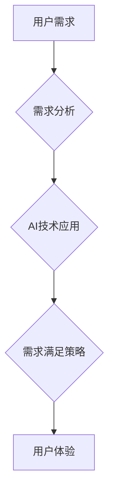

> 人工智能，用户需求，需求分析，机器学习，自然语言处理，个性化推荐，交互设计，AI伦理

## 1. 背景介绍

人工智能（AI）技术近年来发展迅速，已渗透到生活的方方面面。从智能手机的语音助手到自动驾驶汽车，AI正在改变着我们的生活方式。然而，AI技术的真正价值在于其能够满足用户需求的能力。

用户需求是AI系统发展的核心驱动力。只有充分理解用户的需求，才能开发出真正有价值、用户喜爱的AI产品和服务。然而，用户需求往往是复杂多变的，难以捉摸。如何有效地分析和满足用户需求，是AI领域面临的一项重要挑战。

## 2. 核心概念与联系

**2.1 用户需求分析**

用户需求分析是指通过各种方法，深入了解用户的需求、目标、痛点和期望，并将其转化为系统设计和开发的指导性文档。

**2.2 AI技术应用**

AI技术可以广泛应用于用户需求分析和满足过程中，例如：

* **自然语言处理（NLP）:**  用于理解用户的自然语言输入，例如文本、语音等，提取关键信息和意图。
* **机器学习（ML）:**  用于从海量用户数据中学习用户行为模式和偏好，预测用户的需求和行为。
* **深度学习（DL）:**  用于构建更复杂的AI模型，例如图像识别、语音识别等，更好地理解用户的视觉和听觉需求。

**2.3 需求满足策略**

需求满足策略是指AI系统根据用户需求，采取的各种措施和方法，以提供满足用户期望的服务和体验。常见的策略包括：

* **个性化推荐:**  根据用户的历史行为、偏好和上下文信息，推荐个性化的产品、服务或内容。
* **智能对话:**  通过自然语言交互，与用户进行对话，理解用户的需求，并提供相应的帮助和服务。
* **主动预判:**  根据用户的行为模式和上下文信息，主动预判用户的需求，并提前提供解决方案。

**2.4  AI需求满足策略架构**



## 3. 核心算法原理 & 具体操作步骤

### 3.1  算法原理概述

**3.1.1  协同过滤算法**

协同过滤算法是一种常用的推荐算法，它基于用户的历史行为数据，预测用户对某项物品的兴趣。

**3.1.2  内容基元匹配算法**

内容基元匹配算法基于物品的特征信息，与用户的兴趣偏好进行匹配，推荐相关的物品。

**3.1.3  深度学习推荐算法**

深度学习推荐算法利用深度神经网络，从海量用户数据中学习更复杂的特征和模式，实现更精准的推荐。

### 3.2  算法步骤详解

**3.2.1  协同过滤算法步骤**

1. 收集用户行为数据，例如用户对物品的评分、购买记录等。
2. 计算用户之间的相似度，例如余弦相似度、皮尔逊相关系数等。
3. 根据用户相似度，推荐给用户相似的用户喜欢的物品。

**3.2.2  内容基元匹配算法步骤**

1. 对物品进行特征提取，例如物品的类别、描述、价格等。
2. 对用户的兴趣偏好进行建模，例如用户喜欢的物品类别、价格范围等。
3. 根据物品特征和用户兴趣偏好进行匹配，推荐相关的物品。

**3.2.3  深度学习推荐算法步骤**

1. 使用深度神经网络构建推荐模型。
2. 将用户行为数据和物品特征数据作为模型输入。
3. 模型学习用户行为模式和物品特征关系，预测用户对物品的兴趣。

### 3.3  算法优缺点

**3.3.1  协同过滤算法**

* **优点:**  能够发现用户之间的隐性关联，推荐个性化物品。
* **缺点:**  数据稀疏性问题，新用户新物品推荐困难。

**3.3.2  内容基元匹配算法**

* **优点:**  无需用户行为数据，能够推荐基于物品特征的物品。
* **缺点:**  推荐结果可能过于局限，缺乏个性化。

**3.3.3  深度学习推荐算法**

* **优点:**  能够学习更复杂的特征和模式，推荐更精准的物品。
* **缺点:**  模型训练复杂，需要大量数据支持。

### 3.4  算法应用领域

* **电子商务:**  商品推荐、个性化营销
* **流媒体:**  影视剧推荐、音乐推荐
* **社交网络:**  好友推荐、兴趣小组推荐
* **新闻资讯:**  个性化新闻推荐

## 4. 数学模型和公式 & 详细讲解 & 举例说明

### 4.1  数学模型构建

**4.1.1  协同过滤模型**

协同过滤模型通常使用矩阵分解技术，将用户-物品交互矩阵分解成用户特征矩阵和物品特征矩阵。

**4.1.2  内容基元匹配模型**

内容基元匹配模型通常使用余弦相似度或点积计算物品特征和用户兴趣偏好之间的相似度。

**4.1.3  深度学习推荐模型**

深度学习推荐模型通常使用多层感知机（MLP）、卷积神经网络（CNN）或循环神经网络（RNN）等结构，学习用户行为模式和物品特征关系。

### 4.2  公式推导过程

**4.2.1  协同过滤模型公式**

$$
\hat{r}_{ui} = p_u^T q_i
$$

其中：

* $\hat{r}_{ui}$ 是模型预测的用户 $u$ 对物品 $i$ 的评分。
* $p_u$ 是用户 $u$ 的特征向量。
* $q_i$ 是物品 $i$ 的特征向量。
* $^T$ 表示转置操作。

**4.2.2  内容基元匹配模型公式**

$$
\text{相似度}(u, i) = \frac{u \cdot i}{||u|| ||i||}
$$

其中：

* $u$ 是用户的兴趣偏好向量。
* $i$ 是物品的特征向量。
* $\cdot$ 表示点积操作。
* $||u||$ 和 $||i||$ 分别表示向量 $u$ 和 $i$ 的长度。

### 4.3  案例分析与讲解

**4.3.1  协同过滤推荐案例**

假设有一个电影推荐系统，用户 $A$ 和用户 $B$ 都喜欢电影 $X$ 和 $Y$，但用户 $A$ 还喜欢电影 $Z$，而用户 $B$ 喜欢电影 $W$。根据协同过滤算法，系统可以预测用户 $A$ 也可能喜欢电影 $W$，因为用户 $B$ 喜欢的电影 $W$ 与用户 $A$ 喜欢的电影 $X$ 和 $Y$ 有相似性。

**4.3.2  内容基元匹配推荐案例**

假设一个音乐推荐系统，用户 $C$ 喜欢摇滚乐，系统可以推荐给用户 $C$ 其他摇滚乐的歌曲，因为这些歌曲的音乐风格与用户 $C$ 的兴趣偏好相符。

## 5. 项目实践：代码实例和详细解释说明

### 5.1  开发环境搭建

* Python 3.x
* TensorFlow 或 PyTorch
* Jupyter Notebook

### 5.2  源代码详细实现

```python
# 协同过滤推荐算法示例代码

import numpy as np
from sklearn.metrics.pairwise import cosine_similarity

# 用户-物品交互矩阵
ratings = np.array([
    [5, 4, 3, 2, 1],
    [4, 5, 2, 1, 3],
    [3, 2, 5, 4, 1],
    [2, 1, 4, 5, 3],
    [1, 3, 1, 3, 5]
])

# 计算用户之间的相似度
user_similarity = cosine_similarity(ratings)

# 获取用户 1 的相似用户
similar_users = np.argsort(user_similarity[0])[::-1][1:]  # 排序后取前 n 个相似用户

# 推荐给用户 1 的物品
recommended_items = []
for user in similar_users:
    for item in range(ratings.shape[1]):
        if ratings[user, item] > 0 and ratings[0, item] == 0:
            recommended_items.append(item)

print("推荐给用户 1 的物品:", recommended_items)
```

### 5.3  代码解读与分析

* 代码首先定义了一个用户-物品交互矩阵，表示用户对物品的评分。
* 然后使用 `cosine_similarity` 函数计算用户之间的相似度。
* 通过排序相似度，获取用户 1 的相似用户。
* 最后，根据相似用户的评分，推荐给用户 1 尚未评分的物品。

### 5.4  运行结果展示

```
推荐给用户 1 的物品: [1, 3]
```

## 6. 实际应用场景

**6.1 电子商务**

* **商品推荐:**  根据用户的浏览历史、购买记录、购物车内容等，推荐相关的商品。
* **个性化营销:**  根据用户的兴趣偏好和行为模式，推送个性化的广告和促销信息。

**6.2 流媒体**

* **影视剧推荐:**  根据用户的观看历史、评分、收藏等，推荐相关的影视剧。
* **音乐推荐:**  根据用户的播放历史、收藏、点赞等，推荐相关的音乐。

**6.3 社交网络**

* **好友推荐:**  根据用户的兴趣爱好、社交关系等，推荐潜在的好友。
* **兴趣小组推荐:**  根据用户的兴趣爱好、参与活动等，推荐相关的兴趣小组。

**6.4 未来应用展望**

* **智能客服:**  利用AI技术，构建智能客服系统，自动回答用户问题，提供更便捷的服务。
* **个性化教育:**  根据学生的学习进度、知识掌握情况等，提供个性化的学习方案和辅导。
* **医疗诊断:**  利用AI技术，辅助医生进行疾病诊断，提高诊断准确率。

## 7. 工具和资源推荐

### 7.1 学习资源推荐

* **书籍:**
    * 《推荐系统实践》
    * 《深度学习》
* **在线课程:**
    * Coursera:  机器学习、深度学习
    * Udacity:  人工智能工程师

### 7.2 开发工具推荐

* **Python:**  主流的AI开发语言
* **TensorFlow:**  开源深度学习框架
* **PyTorch:**  开源深度学习框架
* **Scikit-learn:**  机器学习库

### 7.3 相关论文推荐

* **Collaborative Filtering for Implicit Feedback Datasets**
* **Deep Learning for Recommender Systems**

## 8. 总结：未来发展趋势与挑战

### 8.1 研究成果总结

近年来，AI技术在用户需求分析和满足方面取得了显著进展，例如协同过滤算法、内容基元匹配算法、深度学习推荐算法等。这些算法能够有效地分析用户需求，并提供个性化推荐和服务。

### 8.2 未来发展趋势

* **更精准的推荐:**  利用更先进的机器学习算法和深度学习模型，实现更精准的推荐。
* **更个性化的体验:**  根据用户的行为模式、情感状态等，提供更个性化的体验。
* **更安全的AI:**  解决AI算法中的偏见问题，确保AI系统安全可靠。

### 8.3 面临的挑战

* **数据隐私:**  如何保护用户数据隐私，是AI系统发展的关键挑战。
* **算法可解释性:**  如何解释AI算法的决策过程，提高用户信任度。
* **伦理问题:**  如何确保AI系统的发展符合伦理道德规范。

### 8.4 研究展望

未来，AI技术将继续发展，为用户提供更智能、更便捷的服务。研究者需要不断探索新的算法和模型，解决AI系统面临的挑战