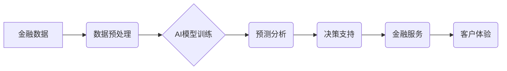

> 人工智能，金融科技，机器学习，深度学习，自然语言处理，风险管理，预测分析，自动化

## 1. 背景介绍

金融行业一直是科技创新的前沿阵地，而人工智能（AI）的兴起为金融领域带来了前所未有的机遇。AI技术的快速发展，特别是深度学习和自然语言处理等领域的突破，为金融机构提供了强大的工具，可以帮助他们提高效率、降低成本、提升客户体验和应对新的挑战。

近年来，金融科技（FinTech）蓬勃发展，AI技术在金融领域的应用日益广泛。从传统的风险管理和欺诈检测到更前沿的个性化金融服务和投资决策，AI正在深刻地改变着金融行业的运作模式。

## 2. 核心概念与联系

**2.1 人工智能（AI）**

人工智能是指模拟人类智能行为的计算机系统。它涵盖了多种技术，包括机器学习、深度学习、自然语言处理、计算机视觉等。

**2.2 金融科技（FinTech）**

金融科技是指利用科技创新来改进和优化金融服务的行业。它涵盖了广泛的领域，包括支付、借贷、投资、保险等。

**2.3 人类计算**

人类计算是指利用人类的智慧和判断力来辅助人工智能系统进行决策和分析。它强调人机协作，将人工智能的计算能力与人类的创造力和洞察力相结合。

**2.4 AI驱动的金融创新**

AI驱动的金融创新是指利用人工智能技术来创造新的金融产品、服务和商业模式。它可以帮助金融机构提高效率、降低成本、提升客户体验和应对新的挑战。

**2.5 架构图**



## 3. 核心算法原理 & 具体操作步骤

**3.1 算法原理概述**

在金融领域，常用的AI算法包括：

* **机器学习算法:** 
    * **监督学习:** 用于预测连续值或分类标签，例如信用评分、欺诈检测。
    * **非监督学习:** 用于发现数据中的隐藏模式和结构，例如客户画像、市场细分。
    * **强化学习:** 用于训练智能体在特定环境中做出最优决策，例如投资策略优化。

* **深度学习算法:** 
    * **卷积神经网络 (CNN):** 用于图像识别和分析，例如身份验证、文档处理。
    * **循环神经网络 (RNN):** 用于处理序列数据，例如文本分析、语音识别。
    * **生成对抗网络 (GAN):** 用于生成新的数据，例如合成图像、文本。

**3.2 算法步骤详解**

以机器学习算法为例，其基本步骤包括：

1. **数据收集和预处理:** 收集相关金融数据，并进行清洗、转换和特征工程等预处理操作。
2. **模型选择:** 根据具体任务选择合适的机器学习算法模型。
3. **模型训练:** 使用训练数据训练模型，调整模型参数以达到最佳性能。
4. **模型评估:** 使用测试数据评估模型的性能，例如准确率、召回率、F1-score等。
5. **模型部署:** 将训练好的模型部署到生产环境中，用于实际应用。

**3.3 算法优缺点**

不同的AI算法具有不同的优缺点，需要根据具体应用场景进行选择。

* **机器学习算法:** 优点是易于理解和实现，缺点是需要大量的 labeled 数据进行训练。
* **深度学习算法:** 优点是能够学习更复杂的特征，缺点是训练成本高，需要大量的计算资源和数据。

**3.4 算法应用领域**

AI算法在金融领域的应用非常广泛，包括：

* **风险管理:** 识别和评估金融风险，例如信用风险、市场风险、操作风险。
* **欺诈检测:** 识别和预防金融欺诈行为，例如信用卡欺诈、网络钓鱼。
* **客户服务:** 提供个性化客户服务，例如智能客服、客户关系管理。
* **投资决策:** 辅助投资决策，例如股票预测、资产配置。
* **交易自动化:** 自动化交易流程，例如高频交易、量化投资。

## 4. 数学模型和公式 & 详细讲解 & 举例说明

**4.1 数学模型构建**

在金融领域，常用的数学模型包括：

* **线性回归模型:** 用于预测连续值，例如房价、股票价格。
* **逻辑回归模型:** 用于分类问题，例如信用评分、欺诈检测。
* **支持向量机 (SVM):** 用于分类和回归问题，例如文本分类、图像识别。

**4.2 公式推导过程**

以线性回归模型为例，其目标是找到一条直线，使得预测值与实际值之间的误差最小。

* **损失函数:** 均方误差 (MSE)

$$MSE = \frac{1}{n} \sum_{i=1}^{n} (y_i - \hat{y}_i)^2$$

其中：

* $y_i$ 是实际值
* $\hat{y}_i$ 是预测值
* $n$ 是样本数量

* **梯度下降算法:** 用于优化模型参数，使得损失函数最小化。

**4.3 案例分析与讲解**

假设我们想要预测房价，可以使用线性回归模型。

* **输入特征:** 房屋面积、房间数量、地理位置等。
* **输出目标:** 房屋价格。

我们可以收集房价数据，并使用线性回归模型进行训练。训练完成后，我们可以使用模型预测新房子的价格。

## 5. 项目实践：代码实例和详细解释说明

**5.1 开发环境搭建**

* Python 3.x
* Jupyter Notebook
* TensorFlow 或 PyTorch

**5.2 源代码详细实现**

```python
import tensorflow as tf

# 定义模型
model = tf.keras.models.Sequential([
    tf.keras.layers.Dense(64, activation='relu', input_shape=(4,)),
    tf.keras.layers.Dense(1)
])

# 编译模型
model.compile(optimizer='adam', loss='mse')

# 训练模型
model.fit(X_train, y_train, epochs=100)

# 预测
predictions = model.predict(X_test)
```

**5.3 代码解读与分析**

* `tf.keras.models.Sequential`: 创建一个顺序模型，即层级结构。
* `tf.keras.layers.Dense`: 创建一个全连接层，连接所有输入节点和输出节点。
* `activation='relu'`: 使用ReLU激活函数。
* `input_shape=(4,)`: 输入特征维度为4。
* `optimizer='adam'`: 使用Adam优化器。
* `loss='mse'`: 使用均方误差作为损失函数。
* `epochs=100`: 训练100个epoch。

**5.4 运行结果展示**

训练完成后，我们可以使用模型预测新房子的价格，并与实际价格进行比较，评估模型的性能。

## 6. 实际应用场景

**6.1 风险管理**

* **信用风险评估:** 使用机器学习算法分析客户的信用历史、收入、资产等信息，预测客户违约的可能性。
* **市场风险管理:** 使用深度学习算法分析市场数据，预测股票价格、汇率等金融资产的波动。
* **操作风险控制:** 使用自然语言处理算法分析交易记录、邮件等文本数据，识别潜在的操作风险。

**6.2 欺诈检测**

* **信用卡欺诈检测:** 使用机器学习算法分析信用卡交易数据，识别异常交易行为。
* **网络钓鱼攻击检测:** 使用自然语言处理算法分析邮件内容，识别钓鱼邮件。
* **身份盗窃检测:** 使用生物识别技术和机器学习算法识别身份盗窃行为。

**6.3 客户服务**

* **智能客服:** 使用自然语言处理算法开发智能客服系统，自动回答客户常见问题。
* **个性化金融服务:** 使用机器学习算法分析客户的财务状况和需求，提供个性化的金融产品和服务建议。
* **客户关系管理:** 使用机器学习算法分析客户行为数据，预测客户流失风险，并采取措施挽留客户。

**6.4 未来应用展望**

* **自动交易:** 使用强化学习算法开发自动交易系统，根据市场变化自动进行交易决策。
* **个性化投资:** 使用机器学习算法分析客户的风险偏好和投资目标，提供个性化的投资建议。
* **金融监管:** 使用AI技术辅助金融监管机构识别和预防金融犯罪。

## 7. 工具和资源推荐

**7.1 学习资源推荐**

* **在线课程:** Coursera, edX, Udacity
* **书籍:**
    * 深度学习
    * 人工智能：一种现代方法
    * 机器学习实战

**7.2 开发工具推荐**

* **Python:** 
    * TensorFlow
    * PyTorch
    * scikit-learn
* **Jupyter Notebook:** 用于代码编写和可视化。
* **云计算平台:** AWS, Azure, GCP

**7.3 相关论文推荐**

* **Attention Is All You Need**
* **Generative Adversarial Networks**
* **Deep Learning for Financial Risk Management**

## 8. 总结：未来发展趋势与挑战

**8.1 研究成果总结**

AI技术在金融领域的应用取得了显著成果，例如风险管理、欺诈检测、客户服务等方面都取得了突破。

**8.2 未来发展趋势**

* **更强大的AI模型:** 随着计算能力和数据量的增加，AI模型将变得更加强大，能够处理更复杂的任务。
* **更广泛的应用场景:** AI技术将应用于更多金融领域，例如自动交易、个性化投资等。
* **更注重伦理和可解释性:** 随着AI技术的应用越来越广泛，伦理和可解释性将成为越来越重要的研究方向。

**8.3 面临的挑战**

* **数据质量和隐私问题:** AI模型的训练需要大量高质量的数据，而金融数据往往存在隐私问题。
* **算法偏见和公平性:** AI算法可能会存在偏见，导致不公平的结果。
* **监管和合规性:** AI技术的应用需要遵守相关的监管和合规规定。

**8.4 研究展望**

未来，AI技术在金融领域的应用将继续发展，需要进一步研究以下问题：

* 如何提高AI模型的准确性和鲁棒性。
* 如何解决数据质量和隐私问题。
* 如何确保AI算法的公平性和可解释性。
* 如何制定相应的监管和合规框架。

## 9. 附录：常见问题与解答

**9.1 如何选择合适的AI算法？**

选择合适的AI算法需要根据具体应用场景和数据特点进行考虑。

**9.2 如何解决数据质量和隐私问题？**

可以采用数据清洗、匿名化、加密等技术来解决数据质量和隐私问题。

**9.3 如何确保AI算法的公平性和可解释性？**

可以采用算法调优、数据平衡、可解释模型等技术来提高AI算法的公平性和可解释性。


作者：禅与计算机程序设计艺术 / Zen and the Art of Computer Programming 
<end_of_turn>