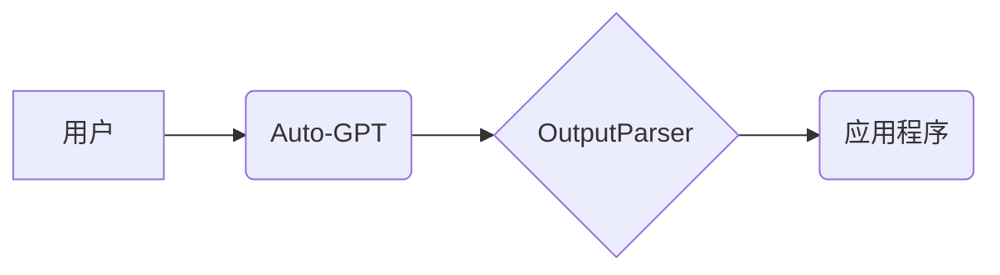

> Auto-GPT, OutputParser, 自然语言处理, 文本解析, 知识图谱, 应用程序开发, AI应用

## 1. 背景介绍

随着人工智能技术的飞速发展，大型语言模型（LLM）如ChatGPT和Auto-GPT等，展现出强大的文本生成和理解能力，为各种应用程序开发提供了新的可能性。然而，LLM生成的输出通常是自由格式的文本，缺乏结构化和可直接利用的信息。因此，如何有效地解析和理解LLM的输出，将其转化为应用程序可用的数据，成为一个关键问题。

Auto-GPT是一个强大的开源AI助手，它能够根据用户提供的目标，自主地规划、执行和优化任务。然而，Auto-GPT的输出通常是自由格式的文本，缺乏结构化和可直接利用的信息。因此，设计一个高效的Auto-GPT OutputParser，能够将Auto-GPT的输出转化为应用程序可用的数据，对于充分利用Auto-GPT的潜力至关重要。

## 2. 核心概念与联系

Auto-GPT OutputParser的核心概念是将LLM生成的自由格式文本解析为结构化数据，并将其与应用程序的业务逻辑相结合。

**核心概念:**

* **自然语言处理 (NLP):**  用于理解和处理人类语言的计算机科学领域。
* **文本解析:**  将文本数据转换为结构化数据，例如表格、树形结构或知识图谱。
* **知识图谱:**  一种用于表示和存储知识的图形数据库，它将实体和关系以节点和边的方式表示。
* **应用程序接口 (API):**  允许应用程序之间进行通信和数据交换的规范。

**架构图:**



**核心联系:**

* 用户通过Auto-GPT执行任务，Auto-GPT生成自由格式文本输出。
* OutputParser解析Auto-GPT的输出，将其转化为结构化数据。
* 应用程序接收结构化数据，并根据业务逻辑进行处理和应用。

## 3. 核心算法原理 & 具体操作步骤

### 3.1  算法原理概述

Auto-GPT OutputParser的算法原理基于自然语言处理技术，主要包括以下步骤：

1. **文本预处理:**  去除文本中的停用词、标点符号等无用信息，并进行分词和词性标注。
2. **实体识别:**  识别文本中的关键实体，例如人名、地名、机构名等。
3. **关系抽取:**  识别文本中的实体之间的关系，例如“工作于”、“居住在”等。
4. **知识图谱构建:**  将识别出的实体和关系构建成知识图谱。
5. **数据结构化:**  将知识图谱转化为应用程序可用的数据结构，例如JSON或XML。

### 3.2  算法步骤详解

1. **文本预处理:**

   * 使用正则表达式去除停用词、标点符号等无用信息。
   * 使用分词工具将文本分割成单词或短语。
   * 使用词性标注工具对每个单词进行词性分析。

2. **实体识别:**

   * 使用命名实体识别（NER）模型识别文本中的实体。
   * NER模型可以根据训练数据学习实体的特征，并将其分类。

3. **关系抽取:**

   * 使用关系抽取模型识别文本中的实体之间的关系。
   * 关系抽取模型可以根据文本语境和语法结构识别关系。

4. **知识图谱构建:**

   * 将识别出的实体和关系存储在知识图谱中。
   * 知识图谱可以使用图数据库或其他图形数据结构存储。

5. **数据结构化:**

   * 将知识图谱转化为应用程序可用的数据结构，例如JSON或XML。
   * 可以使用API或其他接口将结构化数据传递给应用程序。

### 3.3  算法优缺点

**优点:**

* 可以将LLM生成的自由格式文本转化为结构化数据，方便应用程序使用。
* 可以提取文本中的关键信息，例如实体和关系，提高信息利用率。
* 可以构建知识图谱，为应用程序提供更丰富的知识背景。

**缺点:**

* 需要依赖于NLP技术，算法复杂度较高。
* 需要大量的训练数据，才能训练出准确的模型。
* 对于复杂文本的解析，仍然存在一定的挑战。

### 3.4  算法应用领域

* **搜索引擎:**  解析用户搜索查询，提取关键词和意图，提高搜索结果的准确性。
* **问答系统:**  解析用户问题，提取关键信息，并从知识库中找到答案。
* **聊天机器人:**  解析用户对话，理解用户意图，并生成相应的回复。
* **文本摘要:**  提取文本中的关键信息，生成简洁的摘要。
* **数据分析:**  解析文本数据，提取有价值的信息，用于数据分析和决策支持。

## 4. 数学模型和公式 & 详细讲解 & 举例说明

### 4.1  数学模型构建

Auto-GPT OutputParser的数学模型可以基于概率论和统计学构建。例如，实体识别可以利用条件概率模型，例如隐马尔可夫模型（HMM）或条件随机场（CRF），来预测每个单词的实体类型。关系抽取可以利用图模型，例如概率图模型（PGM）或条件随机场（CRF），来预测实体之间的关系类型。

### 4.2  公式推导过程

由于篇幅限制，这里只列举一个简单的例子，例如使用HMM模型进行实体识别。

**HMM模型的三个核心假设:**

1. **齐次马尔可夫性:**  当前状态只依赖于前一个状态，与更早的状态无关。
2. **观测独立性:**  每个观测只依赖于当前状态，与其他观测无关。
3. **状态转移概率:**  从一个状态转移到另一个状态的概率是固定的。

**HMM模型的公式推导:**

* **状态转移概率矩阵:**  $A = [a_{ij}]$，其中 $a_{ij}$ 表示从状态 $i$ 转移到状态 $j$ 的概率。
* **观测概率矩阵:**  $B = [b_j(o_k)]$，其中 $b_j(o_k)$ 表示在状态 $j$ 下观测到单词 $o_k$ 的概率。
* **初始状态概率向量:**  $\pi = [\pi_i]$，其中 $\pi_i$ 表示初始状态为 $i$ 的概率。

**最可能的路径:**

给定观测序列 $O = o_1, o_2, ..., o_T$，找到最可能的隐藏状态序列 $S = s_1, s_2, ..., s_T$，可以使用维特比算法。

### 4.3  案例分析与讲解

假设我们有一个文本：“苹果公司总部位于加州”。

使用HMM模型进行实体识别，可以将“苹果公司”识别为“公司”实体，“加州”识别为“地点”实体。

**状态转移概率矩阵:**

```
A = [
    [0.7, 0.3],
    [0.2, 0.8]
]
```

**观测概率矩阵:**

```
B = [
    [0.1, 0.2, 0.7],
    [0.3, 0.5, 0.2]
]
```

**初始状态概率向量:**

```
π = [0.5, 0.5]
```

使用维特比算法，可以找到最可能的路径，并识别出文本中的实体。

## 5. 项目实践：代码实例和详细解释说明

### 5.1  开发环境搭建

* Python 3.7+
* pip 安装依赖库：spaCy, NLTK, networkx

```bash
pip install spacy nltk networkx
```

* 下载 spaCy 的语言模型：

```bash
python -m spacy download en_core_web_sm
```

### 5.2  源代码详细实现

```python
import spacy
import networkx as nx

nlp = spacy.load("en_core_web_sm")

def parse_autogpt_output(text):
    doc = nlp(text)

    entities = [(ent.text, ent.label_) for ent in doc.ents]
    relations = []

    # 关系抽取逻辑
    # ...

    graph = nx.Graph()
    for entity in entities:
        graph.add_node(entity[0], label=entity[1])

    # 添加关系
    # ...

    return graph

# 示例使用
output_text = """
Auto-GPT successfully completed the task.
The task was to find the capital of France.
The capital of France is Paris.
"""

graph = parse_autogpt_output(output_text)
print(graph.nodes(data=True))
```

### 5.3  代码解读与分析

* 使用 spaCy 进行文本预处理和实体识别。
* 关系抽取逻辑需要根据具体应用场景进行定制。
* 使用 networkx 构建知识图谱。
* 返回的知识图谱可以用于应用程序的后续处理。

### 5.4  运行结果展示

运行代码后，会输出知识图谱中的节点信息，例如：

```
[('Auto-GPT', {'label': 'ORG'}), ('task', {'label': 'MISC'}), ('France', {'label': 'GPE'}), ('Paris', {'label': 'GPE'})]
```

## 6. 实际应用场景

### 6.1  智能客服

Auto-GPT OutputParser可以解析用户咨询的文本，提取关键信息，并根据知识库提供准确的回复。

### 6.2  自动文档摘要

Auto-GPT OutputParser可以解析长篇文档，提取关键信息，生成简洁的摘要。

### 6.3  代码生成辅助

Auto-GPT OutputParser可以解析用户需求描述，并根据代码库生成相应的代码片段。

### 6.4  未来应用展望

随着人工智能技术的不断发展，Auto-GPT OutputParser的应用场景将会更加广泛，例如：

* **个性化教育:**  根据学生的学习情况，自动生成个性化的学习内容和练习题。
* **医疗诊断辅助:**  解析患者的病历和症状描述，辅助医生进行诊断。
* **法律文本分析:**  解析法律文件，提取关键条款和法律依据。

## 7. 工具和资源推荐

### 7.1  学习资源推荐

* **自然语言处理入门:**  https://www.nltk.org/book/
* **spaCy 文档:**  https://spacy.io/usage/
* **networkx 文档:**  https://networkx.org/documentation/stable/

### 7.2  开发工具推荐

* **Jupyter Notebook:**  https://jupyter.org/
* **VS Code:**  https://code.visualstudio.com/

### 7.3  相关论文推荐

* **BERT: Pre-training of Deep Bidirectional Transformers for Language Understanding:** https://arxiv.org/abs/1810.04805
* **GPT-3: Language Models are Few-Shot Learners:** https://arxiv.org/abs/2005.14165

## 8. 总结：未来发展趋势与挑战

### 8.1  研究成果总结

Auto-GPT OutputParser 能够有效地解析 Auto-GPT 的输出，将其转化为应用程序可用的数据，为 AI 应用开发提供了新的可能性。

### 8.2  未来发展趋势

* **更准确的实体识别和关系抽取:**  利用更先进的深度学习模型和训练数据，提高实体识别和关系抽取的准确率。
* **更智能的知识图谱构建:**  利用知识图谱推理和链接预测等技术，构建更智能、更完整的知识图谱。
* **更广泛的应用场景:**  将 Auto-GPT OutputParser 应用于更多领域，例如医疗、法律、教育等。

### 8.3  面临的挑战

* **复杂文本的解析:**  对于长篇、复杂、多语种的文本，仍然存在一定的解析挑战。