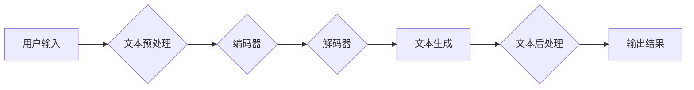

> ChatGPT,文本生成,Transformer,GPT模型,自然语言处理,深度学习

## 1. 背景介绍

近年来，人工智能技术取得了飞速发展，自然语言处理（NLP）领域也取得了突破性进展。其中，基于Transformer架构的生成式预训练语言模型（如GPT-3、LaMDA、ChatGPT）展现出强大的文本生成能力，能够生成流畅、连贯、富有创意的文本，在聊天机器人、文本摘要、机器翻译等领域展现出广阔的应用前景。

ChatGPT作为其中一个代表性模型，由OpenAI开发，基于GPT-3.5架构，拥有1750亿参数，能够进行对话式文本生成，并能根据用户输入进行上下文理解和响应，展现出令人惊叹的文本生成能力。

## 2. 核心概念与联系

### 2.1 Transformer架构

Transformer是一种新型的神经网络架构，其核心特点是利用自注意力机制（Self-Attention）来捕捉文本序列中的长距离依赖关系。传统的循环神经网络（RNN）在处理长文本序列时容易出现梯度消失或梯度爆炸问题，而Transformer通过自注意力机制能够有效地解决这个问题，并展现出更强的文本理解和生成能力。

### 2.2 GPT模型

GPT（Generative Pre-trained Transformer）模型是一种基于Transformer架构的生成式预训练语言模型。它通过在海量文本数据上进行预训练，学习了语言的语法、语义和上下文关系，从而能够生成高质量的文本。GPT模型的训练目标是预测下一个词，通过不断预测和调整模型参数，最终能够生成流畅、连贯的文本。

### 2.3  ChatGPT

ChatGPT是基于GPT-3.5架构的对话式文本生成模型，它在GPT模型的基础上进行了进一步的训练和优化，使其能够更好地理解和响应用户的对话请求。ChatGPT通过学习大量的对话数据，掌握了对话的规则和技巧，能够进行自然、流畅的对话。

**Mermaid 流程图**



## 3. 核心算法原理 & 具体操作步骤

### 3.1  算法原理概述

ChatGPT的文本生成过程主要基于Transformer架构和自注意力机制。

1. **文本预处理:** 将用户输入的文本进行清洗、分词、标记等预处理操作，使其能够被模型理解。

2. **编码器:** 将预处理后的文本序列编码成向量表示，捕捉文本序列中的语义信息和上下文关系。

3. **解码器:** 基于编码器的输出，生成目标文本序列，并利用自注意力机制捕捉文本序列中的长距离依赖关系，生成流畅、连贯的文本。

4. **文本后处理:** 对生成的文本进行格式化、语法检查等后处理操作，使其更加符合用户的预期。

### 3.2  算法步骤详解

1. **输入文本:** 用户输入一段文本，例如“今天天气真好”。

2. **文本预处理:** 将输入文本进行分词，得到“今天 天气 好”等词语序列。

3. **编码器处理:** 将词语序列编码成向量表示，每个词语对应一个向量，向量之间通过注意力机制捕捉上下文关系。

4. **解码器生成:** 解码器根据编码器的输出，逐个生成目标文本序列的词语。

5. **输出结果:** 生成完成的文本序列，例如“今天天气真好”。

### 3.3  算法优缺点

**优点:**

* **强大的文本生成能力:** ChatGPT能够生成流畅、连贯、富有创意的文本。
* **上下文理解能力强:** 通过自注意力机制，能够捕捉文本序列中的长距离依赖关系，更好地理解上下文信息。
* **可迁移性强:** 预训练模型能够在不同的任务上进行微调，提高效率。

**缺点:**

* **训练成本高:** 预训练大型语言模型需要大量的计算资源和数据。
* **存在偏差和错误:** 模型的训练数据可能存在偏差，导致模型生成文本存在偏见或错误。
* **缺乏真实世界知识:** 模型的知识主要来自于训练数据，缺乏对真实世界事件和知识的理解。

### 3.4  算法应用领域

* **聊天机器人:** ChatGPT能够进行自然、流畅的对话，用于开发聊天机器人、虚拟助手等应用。
* **文本摘要:** 可以自动生成文本的摘要，用于新闻报道、文档分析等领域。
* **机器翻译:** 可以将文本从一种语言翻译成另一种语言。
* **代码生成:** 可以根据自然语言描述生成代码，提高开发效率。
* **创意写作:** 可以帮助作家进行创意写作，例如生成故事、诗歌等。

## 4. 数学模型和公式 & 详细讲解 & 举例说明

### 4.1  数学模型构建

ChatGPT的数学模型主要基于Transformer架构，其核心是自注意力机制和多头注意力机制。

**自注意力机制:**

自注意力机制能够捕捉文本序列中词语之间的关系，计算每个词语与其他词语之间的相关性。其公式如下：

$$
Attention(Q, K, V) = softmax(\frac{QK^T}{\sqrt{d_k}})V
$$

其中：

* $Q$：查询矩阵
* $K$：键矩阵
* $V$：值矩阵
* $d_k$：键向量的维度
* $softmax$：softmax函数

**多头注意力机制:**

多头注意力机制将自注意力机制应用于多个不同的子空间，并将其结果进行融合，能够捕捉更丰富的文本关系。其公式如下：

$$
MultiHead(Q, K, V) = Concat(head_1, head_2, ..., head_h)W^O
$$

其中：

* $head_i$：第$i$个子空间的注意力输出
* $h$：注意力头的数量
* $W^O$：最终输出层的权重矩阵

### 4.2  公式推导过程

自注意力机制的公式推导过程如下：

1. 将查询矩阵$Q$、键矩阵$K$和值矩阵$V$分别进行线性变换，得到$Q'$, $K'$和$V'$。

2. 计算每个词语与其他词语之间的相关性，即$QK^T$。

3. 对$QK^T$进行归一化，使用softmax函数得到每个词语与其他词语之间的权重。

4. 将权重与值矩阵$V'$进行加权求和，得到每个词语的注意力输出。

### 4.3  案例分析与讲解

假设我们有一个文本序列“我爱学习编程”，其词语向量表示为：

* 我：[0.1, 0.2, 0.3]
* 爱：[0.4, 0.5, 0.6]
* 学习：[0.7, 0.8, 0.9]
* 编程：[1.0, 1.1, 1.2]

使用自注意力机制计算每个词语与其他词语之间的相关性，可以得到以下注意力权重矩阵：

```
[0.2, 0.3, 0.5]
[0.1, 0.4, 0.5]
[0.3, 0.2, 0.4]
[0.4, 0.3, 0.3]
```

从注意力权重矩阵可以看出，"学习"与"编程"之间的相关性最高，因为它们是紧密相关的概念。

## 5. 项目实践：代码实例和详细解释说明

### 5.1  开发环境搭建

ChatGPT的开发环境搭建需要以下软件和工具：

* Python 3.7+
* PyTorch 或 TensorFlow
* CUDA 和 cuDNN (可选，用于GPU加速)
* Git

### 5.2  源代码详细实现

ChatGPT的源代码由OpenAI开源，可以从GitHub上获取：

[https://github.com/openai/gpt-3](https://github.com/openai/gpt-3)

### 5.3  代码解读与分析

ChatGPT的源代码主要包含以下部分：

* 数据加载和预处理模块
* 模型架构定义模块
* 训练和评估模块
* 文本生成模块

### 5.4  运行结果展示

运行ChatGPT的代码，可以生成各种类型的文本，例如：

* 聊天对话
* 故事
* 诗歌
* 代码

## 6. 实际应用场景

### 6.1  聊天机器人

ChatGPT可以用于开发聊天机器人，例如客服机器人、虚拟助手等。

### 6.2  文本摘要

ChatGPT可以自动生成文本的摘要，例如新闻报道、文档分析等领域。

### 6.3  机器翻译

ChatGPT可以将文本从一种语言翻译成另一种语言。

### 6.4  未来应用展望

ChatGPT在未来将有更广泛的应用场景，例如：

* 教育领域：个性化学习辅导、自动批改作业等。
* 医疗领域：辅助医生诊断、生成医疗报告等。
* 艺术领域：创作诗歌、小说、剧本等。

## 7. 工具和资源推荐

### 7.1  学习资源推荐

* **书籍:**

    * 《深度学习》
    * 《自然语言处理》

* **在线课程:**

    * Coursera: 自然语言处理
    * edX: 深度学习

### 7.2  开发工具推荐

* **Python:** 

    * PyTorch
    * TensorFlow

* **文本处理工具:**

    * NLTK
    * SpaCy

### 7.3  相关论文推荐

* **Attention Is All You Need:** https://arxiv.org/abs/1706.03762
* **BERT: Pre-training of Deep Bidirectional Transformers for Language Understanding:** https://arxiv.org/abs/1810.04805

## 8. 总结：未来发展趋势与挑战

### 8.1  研究成果总结

ChatGPT的出现标志着自然语言处理领域取得了新的突破，其强大的文本生成能力和上下文理解能力为人工智能的应用带来了新的可能性。

### 8.2  未来发展趋势

* **模型规模更大:** 未来将会有更大规模的语言模型出现，其文本生成能力和理解能力将进一步提升。
* **多模态生成:** 将文本生成与其他模态（例如图像、音频）相结合，实现多模态文本生成。
* **更强的可解释性:** 研究如何提高语言模型的可解释性，使其生成的文本更加透明和可理解。

### 8.3  面临的挑战

* **数据偏见:** 语言模型的训练数据可能存在偏见，导致模型生成文本存在偏见或错误。
* **安全风险:** 语言模型可能被用于生成恶意文本，例如虚假新闻、网络攻击等。
* **伦理问题:** 语言模型的应用可能引发伦理问题，例如隐私泄露、信息操控等。

### 8.4  研究展望

未来研究将集中在解决以上挑战，提高语言模型的安全性、可靠性和伦理性，使其能够更好地服务于人类社会。

## 9. 附录：常见问题与解答

### 9.1  ChatGPT与GPT-3的区别是什么？

ChatGPT是基于GPT-3.5架构的对话式文本生成模型，而GPT-3是一个更通用的文本生成模型。ChatGPT在对话场景下进行了专门的训练，使其能够更好地理解和响应用户的对话请求。

### 9.2  如何使用ChatGPT进行文本生成？

可以使用ChatGPT的API进行文本生成。API提供多种接口，可以根据不同的需求进行调用。

### 9.3  ChatGPT的训练数据是什么？

ChatGPT的训练数据由OpenAI收集整理，包含大量的文本数据，例如书籍、文章、代码等。

### 9.4  ChatGPT的安全性如何？

OpenAI对ChatGPT进行了安全评估，并采取了多种措施来防止其被用于恶意目的。

### 9.5  ChatGPT的未来发展方向是什么？

ChatGPT的未来发展方向包括