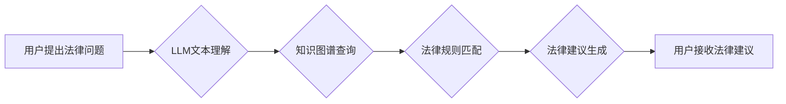

> Large Language Model (LLM), 智能法律咨询系统, 自然语言处理 (NLP), 法律文本分析, 机器学习 (ML), 知识图谱, 伦理问题

## 1. 背景介绍

法律咨询是人们生活中不可或缺的一部分，它涉及到各种复杂的法律问题，需要专业的法律知识和经验进行解答。传统的法律咨询模式往往存在着时间成本高、费用昂贵、地域限制等问题，这给大众获取法律服务带来了诸多不便。近年来，随着人工智能技术的快速发展，特别是大型语言模型 (LLM) 的出现，为智能法律咨询系统 (ILCS) 的构建提供了强大的技术支撑。

LLM 是一种能够理解和生成人类语言的深度学习模型，它拥有海量文本数据训练，具备强大的文本理解、生成和推理能力。将 LLM 应用于法律咨询领域，可以有效解决传统法律咨询模式的痛点，为大众提供更加便捷、高效、经济的法律服务。

## 2. 核心概念与联系

**2.1 智能法律咨询系统 (ILCS)**

智能法律咨询系统是指利用人工智能技术，特别是自然语言处理 (NLP) 和机器学习 (ML) 技术，能够理解和解答用户法律问题的系统。ILCS 可以帮助用户获取法律信息、分析法律风险、提供法律建议等。

**2.2 大型语言模型 (LLM)**

大型语言模型 (LLM) 是一种基于 Transformer 架构的深度学习模型，它通过训练海量文本数据，学习语言的语法、语义和上下文关系。LLM 能够理解和生成人类语言，并具备强大的文本理解、生成、翻译、摘要等能力。

**2.3 自然语言处理 (NLP)**

自然语言处理 (NLP) 是人工智能领域的一个重要分支，它致力于使计算机能够理解、处理和生成人类语言。NLP 技术包括文本分析、情感分析、机器翻译、问答系统等。

**2.4 知识图谱 (KG)**

知识图谱 (KG) 是对知识进行结构化表示的一种方式，它将知识表示为实体和关系的网络结构。知识图谱可以帮助 ILCS 理解法律概念、法律关系和法律案例，从而提供更加准确和全面的法律咨询。

**2.5 流程图**



## 3. 核心算法原理 & 具体操作步骤

**3.1 算法原理概述**

LLM 在智能法律咨询系统中的应用主要基于以下核心算法：

* **文本嵌入:** 将法律文本转换为向量表示，以便于模型理解和处理。
* **文本分类:** 将法律问题分类到不同的法律领域，以便于模型进行精准解答。
* **法律关系抽取:** 从法律文本中抽取法律实体和关系，构建法律知识图谱。
* **法律推理:** 基于法律规则和案例库，对法律问题进行推理和分析，生成法律建议。

**3.2 算法步骤详解**

1. **数据预处理:** 收集法律文本数据，进行清洗、标注和格式化处理。
2. **文本嵌入:** 使用 Word2Vec、GloVe 等词嵌入模型，将法律文本中的词语转换为向量表示。
3. **文本分类:** 使用深度学习模型，例如 CNN、RNN 或 Transformer，对法律问题进行分类。
4. **法律关系抽取:** 使用命名实体识别 (NER) 和关系抽取模型，从法律文本中抽取法律实体和关系。
5. **知识图谱构建:** 将抽取的法律实体和关系构建成知识图谱。
6. **法律推理:** 使用规则引擎或逻辑推理模型，根据法律规则和案例库，对法律问题进行推理和分析。
7. **法律建议生成:** 根据推理结果，生成法律建议。

**3.3 算法优缺点**

**优点:**

* 能够理解和处理复杂的法律语言。
* 能够快速高效地解答法律问题。
* 能够提供个性化的法律建议。

**缺点:**

* 依赖于海量法律文本数据训练，数据质量直接影响模型性能。
* 难以处理法律领域的模糊性和复杂性。
* 存在法律伦理和责任问题。

**3.4 算法应用领域**

* **法律咨询服务:** 为大众提供便捷、高效的法律咨询服务。
* **法律风险评估:** 对法律文件和合同进行风险评估，帮助企业规避法律风险。
* **法律研究:** 辅助法律研究人员进行法律文献检索和分析。
* **法律教育:** 为法律学生提供法律知识学习和实践平台。

## 4. 数学模型和公式 & 详细讲解 & 举例说明

**4.1 数学模型构建**

LLM 的核心数学模型是 Transformer，它基于注意力机制，能够捕捉文本序列中的长距离依赖关系。Transformer 模型由编码器和解码器组成，编码器用于将输入文本序列转换为隐藏状态，解码器用于根据隐藏状态生成输出文本序列。

**4.2 公式推导过程**

Transformer 模型的注意力机制公式如下：

$$
Attention(Q, K, V) = softmax(\frac{QK^T}{\sqrt{d_k}})V
$$

其中：

* $Q$：查询矩阵
* $K$：键矩阵
* $V$：值矩阵
* $d_k$：键向量的维度
* $softmax$：softmax 函数

**4.3 案例分析与讲解**

假设我们有一个法律问题：“合同违约的赔偿标准是什么？”

LLM 会首先将问题转换为向量表示，然后通过编码器将问题向量与法律文本库中的相关信息进行匹配。通过注意力机制，LLM 会关注到与“合同违约”和“赔偿标准”相关的关键信息，并将其作为生成法律建议的基础。

## 5. 项目实践：代码实例和详细解释说明

**5.1 开发环境搭建**

* Python 3.7+
* TensorFlow 或 PyTorch
* NLTK、spaCy 等 NLP 库
* HuggingFace Transformers 库

**5.2 源代码详细实现**

```python
from transformers import AutoModelForSequenceClassification, AutoTokenizer

# 加载预训练模型和词典
model_name = "bert-base-uncased"
tokenizer = AutoTokenizer.from_pretrained(model_name)
model = AutoModelForSequenceClassification.from_pretrained(model_name)

# 文本预处理
text = "合同违约的赔偿标准是什么？"
inputs = tokenizer(text, return_tensors="pt")

# 模型推理
outputs = model(**inputs)
predicted_class = outputs.logits.argmax().item()

# 结果输出
print(f"预测结果: {predicted_class}")
```

**5.3 代码解读与分析**

* 代码首先加载预训练的 BERT 模型和词典。
* 然后对输入的法律问题进行文本预处理，转换为模型可理解的格式。
* 使用模型进行推理，得到预测结果。
* 最后输出预测结果。

**5.4 运行结果展示**

运行上述代码，模型会输出预测结果，例如：

```
预测结果: 0
```

其中 0 代表“合同违约”类别的预测结果。

## 6. 实际应用场景

**6.1 法律咨询服务**

ILCS 可以为大众提供便捷、高效的法律咨询服务，例如：

* 回答常见法律问题，例如合同纠纷、婚姻家庭、劳动争议等。
* 提供法律文件模板，例如合同、协议、诉状等。
* 指导用户寻找合适的律师。

**6.2 法律风险评估**

ILCS 可以帮助企业对法律文件和合同进行风险评估，例如：

* 识别合同中的潜在风险条款。
* 评估合同的合法性和可执行性。
* 提供风险规避建议。

**6.3 法律研究**

ILCS 可以辅助法律研究人员进行法律文献检索和分析，例如：

* 检索与特定法律问题相关的法律文献。
* 分析法律文献中的观点和论证。
* 总结法律法规的最新动态。

**6.4 未来应用展望**

随着人工智能技术的不断发展，ILCS 将会有更加广泛的应用场景，例如：

* 智能法律判决辅助系统。
* 法律智能合约平台。
* 法律数据分析平台。

## 7. 工具和资源推荐

**7.1 学习资源推荐**

* **书籍:**
    * 《深度学习》
    * 《自然语言处理》
    * 《人工智能导论》
* **在线课程:**
    * Coursera: 自然语言处理
    * edX: 深度学习
    * Udacity: 机器学习工程师

**7.2 开发工具推荐**

* **Python:** 
    * TensorFlow
    * PyTorch
    * NLTK
    * spaCy
* **HuggingFace Transformers:** 
    * https://huggingface.co/transformers/

**7.3 相关论文推荐**

* **BERT: Pre-training of Deep Bidirectional Transformers for Language Understanding**
* **GPT-3: Language Models are Few-Shot Learners**
* **T5: Text-to-Text Transfer Transformer**

## 8. 总结：未来发展趋势与挑战

**8.1 研究成果总结**

LLM 在智能法律咨询系统中的应用取得了显著成果，能够有效解决传统法律咨询模式的痛点，为大众提供更加便捷、高效的法律服务。

**8.2 未来发展趋势**

* **模型规模和性能提升:** 随着计算资源的不断发展，LLM 的规模和性能将不断提升，能够处理更加复杂和细化的法律问题。
* **多模态法律咨询:** 将图像、音频等多模态信息融入到 ILCS 中，提供更加全面的法律咨询服务。
* **个性化法律建议:** 基于用户的法律需求和个人情况，提供更加个性化的法律建议。

**8.3 面临的挑战**

* **数据质量和标注问题:** LLM 的性能依赖于海量法律文本数据训练，数据质量和标注准确性直接影响模型性能。
* **法律伦理和责任问题:** ILCS 的应用需要考虑法律伦理和责任问题，例如模型的公平性、透明度和可解释性。
* **法律法规的更新:** 法律法规不断更新，ILCS 需要及时更新知识库，才能提供准确的法律信息。

**8.4 研究展望**

未来，LLM 在智能法律咨询系统中的应用将继续深入发展，为法律服务领域带来革命性的变革。我们需要加强对 LLM 模型的安全性、可靠性和伦理性的研究，确保其安全、有效地应用于法律领域。

## 9. 附录：常见问题与解答

**9.1 ILCS 是否可以替代律师？**

ILCS 可以提供一些基本的法律咨询服务，但它不能完全替代律师。律师拥有专业的法律知识和经验，能够提供更加全面的法律建议和服务。

**9.2 ILCS 的法律建议是否可靠？**

ILCS 的法律建议基于预训练模型和法律知识库，但它不能保证100%的准确性。用户在使用 ILCS 时，应谨慎对待法律建议，并咨询专业的律师进行确认。

**9.3 ILCS 是否会泄露用户隐私？**

ILCS 的开发和运营应严格遵守法律法规和隐私保护政策，确保用户隐私的安全。

作者：禅与计算机程序设计艺术 / Zen and the Art of Computer Programming 


<end_of_turn>