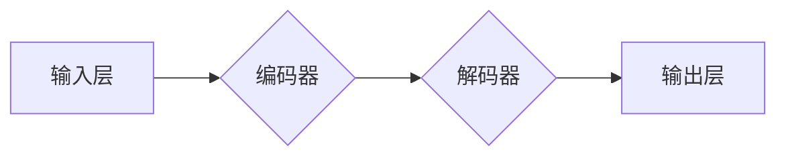
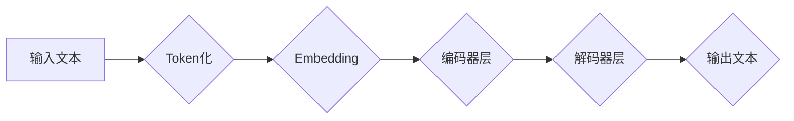

> GPT, 大语言模型, Transformer, 训练数据, 优化算法, 迁移学习

## 1. 背景介绍

近年来，人工智能领域取得了令人瞩目的进展，其中大语言模型（LLM）的出现尤为引人注目。作为一种强大的文本生成模型，LLM能够理解和生成人类语言，在自然语言处理、机器翻译、文本摘要等领域展现出巨大的潜力。其中，由OpenAI开发的GPT系列模型（Generative Pre-trained Transformer）无疑是LLM领域最具代表性的成果之一。

GPT模型凭借其强大的文本生成能力和广泛的应用场景，迅速成为人工智能研究和应用的热点。OpenAI首席科学家Ilya Sutskever在多次公开演讲和采访中，详细阐述了GPT模型取得成功的关键因素。

## 2. 核心概念与联系

GPT模型的核心概念是**Transformer**架构，它是一种专门设计用于处理序列数据的网络结构。与传统的循环神经网络（RNN）相比，Transformer具有以下优势：

* **并行计算能力强:** Transformer可以并行处理输入序列中的所有元素，大大提高了训练速度。
* **长距离依赖关系处理能力强:** Transformer通过**自注意力机制**（Self-Attention）可以捕捉输入序列中任意两个元素之间的依赖关系，即使它们相隔很远，也能有效地处理长距离依赖关系。

**GPT模型架构**

**核心概念原理和架构的 Mermaid 流程图**

## 3. 核心算法原理 & 具体操作步骤

### 3.1  算法原理概述

GPT模型的核心算法是**Transformer**架构，它基于**自注意力机制**和**多头注意力机制**来处理序列数据。

* **自注意力机制:**  允许模型关注输入序列中不同位置的词，并计算它们之间的相关性。
* **多头注意力机制:**  使用多个自注意力头来捕捉不同类型的依赖关系，提高模型的表达能力。

### 3.2  算法步骤详解

1. **Token化:** 将输入文本分割成一个个独立的单词或子词（Token）。
2. **Embedding:** 将每个Token映射到一个低维向量空间中，每个向量代表一个Token的语义信息。
3. **编码器:** 使用多层Transformer编码器层对输入序列进行编码，每个编码器层包含多头注意力机制和前馈神经网络。
4. **解码器:** 使用多层Transformer解码器层对编码后的序列进行解码，生成输出文本。解码器层也包含多头注意力机制和前馈神经网络，并使用**掩码机制**来防止模型预测未来词的信息。

### 3.3  算法优缺点

**优点:**

* 处理长距离依赖关系能力强
* 并行计算能力强
* 表达能力强

**缺点:**

* 训练成本高
* 参数量大
* 容易出现过拟合问题

### 3.4  算法应用领域

* 自然语言处理：文本分类、情感分析、问答系统
* 机器翻译
* 文本摘要
* 代码生成
* 聊天机器人

## 4. 数学模型和公式 & 详细讲解 & 举例说明

### 4.1  数学模型构建

GPT模型的数学模型构建基于Transformer架构，主要包括以下几个部分：

* **词嵌入层:** 将每个词映射到一个低维向量空间中，可以使用Word2Vec或GloVe等预训练词嵌入模型。
* **编码器层:** 使用多层Transformer编码器层对输入序列进行编码，每个编码器层包含多头注意力机制和前馈神经网络。
* **解码器层:** 使用多层Transformer解码器层对编码后的序列进行解码，生成输出文本。解码器层也包含多头注意力机制和前馈神经网络，并使用掩码机制来防止模型预测未来词的信息。

### 4.2  公式推导过程

Transformer架构的核心是**自注意力机制**，其计算公式如下：

$$
Attention(Q, K, V) = softmax(\frac{QK^T}{\sqrt{d_k}})V
$$

其中：

* $Q$：查询矩阵
* $K$：键矩阵
* $V$：值矩阵
* $d_k$：键向量的维度
* $softmax$：softmax函数

### 4.3  案例分析与讲解

假设我们有一个输入序列“我爱学习编程”，其对应的词嵌入向量分别为：

* 我：[0.1, 0.2, 0.3]
* 爱：[0.4, 0.5, 0.6]
* 学习：[0.7, 0.8, 0.9]
* 编程：[1.0, 1.1, 1.2]

我们可以使用自注意力机制计算每个词与其他词之间的相关性，例如，计算“我”与“学习”之间的相关性：

$$
Attention(Q_{我}, K_{学习}, V_{学习})
$$

通过计算上述公式，我们可以得到“我”与“学习”之间的相关性分数，该分数表示这两个词之间的语义相似度。

## 5. 项目实践：代码实例和详细解释说明

### 5.1  开发环境搭建

GPT模型的开发环境通常需要以下软件：

* Python 3.x
* PyTorch 或 TensorFlow
* CUDA 和 cuDNN（用于GPU加速）

### 5.2  源代码详细实现

GPT模型的源代码通常由OpenAI或其他开源社区提供，例如HuggingFace。

### 5.3  代码解读与分析

GPT模型的源代码主要包含以下几个部分：

* **词嵌入层:** 使用预训练词嵌入模型，例如Word2Vec或GloVe。
* **编码器层:** 使用多层Transformer编码器层，每个编码器层包含多头注意力机制和前馈神经网络。
* **解码器层:** 使用多层Transformer解码器层，每个解码器层包含多头注意力机制和前馈神经网络，并使用掩码机制来防止模型预测未来词的信息。
* **训练脚本:** 使用训练数据训练GPT模型，并使用验证数据评估模型性能。

### 5.4  运行结果展示

训练好的GPT模型可以用于各种自然语言处理任务，例如文本生成、机器翻译、问答系统等。

## 6. 实际应用场景

GPT模型在各个领域都有着广泛的应用场景：

* **聊天机器人:** GPT模型可以用于构建更智能、更自然对话的聊天机器人。
* **文本生成:** GPT模型可以用于生成各种类型的文本，例如文章、故事、诗歌等。
* **机器翻译:** GPT模型可以用于实现更准确、更流畅的机器翻译。
* **代码生成:** GPT模型可以用于生成代码，帮助程序员提高开发效率。

### 6.4  未来应用展望

随着GPT模型的不断发展，其应用场景将会更加广泛，例如：

* **个性化教育:** GPT模型可以根据学生的学习情况提供个性化的学习内容和辅导。
* **医疗诊断:** GPT模型可以辅助医生进行疾病诊断，提高诊断准确率。
* **法律服务:** GPT模型可以用于法律文本分析和法律意见撰写。

## 7. 工具和资源推荐

### 7.1  学习资源推荐

* **OpenAI官方文档:** https://openai.com/blog/
* **HuggingFace:** https://huggingface.co/
* **论文:** “Attention Is All You Need”

### 7.2  开发工具推荐

* **PyTorch:** https://pytorch.org/
* **TensorFlow:** https://www.tensorflow.org/

### 7.3  相关论文推荐

* “Attention Is All You Need”
* “BERT: Pre-training of Deep Bidirectional Transformers for Language Understanding”
* “GPT-3: Language Models are Few-Shot Learners”

## 8. 总结：未来发展趋势与挑战

### 8.1  研究成果总结

GPT模型的成功标志着大语言模型在人工智能领域取得了重大突破，为自然语言处理带来了新的可能性。

### 8.2  未来发展趋势

未来，大语言模型将会朝着以下方向发展：

* **模型规模更大:** 模型参数量将会进一步增加，提升模型的表达能力和泛化能力。
* **训练数据更丰富:** 模型将训练于更丰富、更全面的数据，提升模型的知识储备和理解能力。
* **应用场景更广泛:** 大语言模型将应用于更多领域，例如教育、医疗、法律等。

### 8.3  面临的挑战

大语言模型也面临着一些挑战：

* **训练成本高:** 训练大型语言模型需要大量的计算资源和时间，成本很高。
* **数据安全和隐私问题:** 大语言模型的训练数据可能包含敏感信息，需要妥善处理数据安全和隐私问题。
* **模型可解释性问题:** 大语言模型的决策过程难以理解，需要提高模型的可解释性。

### 8.4  研究展望

未来，研究者将继续探索大语言模型的潜力，解决其面临的挑战，推动大语言模型在人工智能领域的进一步发展。

## 9. 附录：常见问题与解答

**常见问题:**

* GPT模型的训练数据是什么？
* GPT模型的模型参数量是多少？
* GPT模型的应用场景有哪些？

**解答:**

* GPT模型的训练数据包括大量的文本数据，例如书籍、文章、代码等。
* GPT模型的模型参数量根据不同的版本而有所不同，例如GPT-3的模型参数量为1750亿。
* GPT模型的应用场景包括聊天机器人、文本生成、机器翻译、代码生成等。

作者：禅与计算机程序设计艺术 / Zen and the Art of Computer Programming 
<end_of_turn>