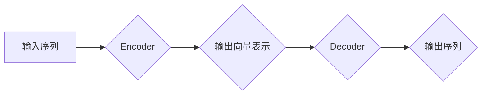

> Transformer, 序列模型, self-attention, encoder-decoder, 自然语言处理, 机器翻译

## 1. 背景介绍

在深度学习领域，序列模型一直是自然语言处理 (NLP) 和计算机视觉等领域的核心技术之一。传统的循环神经网络 (RNN) 模型，例如 LSTM 和 GRU，在处理序列数据时表现出色，但它们存在一些缺点，例如梯度消失问题和训练速度慢。

2017 年，谷歌发布了名为 Transformer 的全新序列模型架构，彻底改变了 NLP 的发展方向。Transformer 摒弃了 RNN 的循环结构，改用了一种称为 self-attention 的机制来捕捉序列中的长距离依赖关系。由于其强大的性能和训练效率，Transformer 迅速成为 NLP 领域最流行的模型架构之一，并在机器翻译、文本摘要、问答系统等任务中取得了突破性的成果。

## 2. 核心概念与联系

Transformer 的核心概念是 self-attention 机制，它允许模型关注序列中任意两个词之间的关系，从而更好地理解上下文信息。

**Transformer 架构**

Transformer 的架构由两个主要部分组成：encoder 和 decoder。

* **Encoder:** 负责将输入序列编码成一个固定长度的向量表示。
* **Decoder:** 负责根据编码后的向量表示生成输出序列。

**Mermaid 流程图**



**核心概念**

* **Self-Attention:**  允许模型关注序列中任意两个词之间的关系，并计算它们之间的相关性。
* **Multi-Head Attention:** 使用多个 self-attention 头来捕捉不同类型的依赖关系。
* **Positional Encoding:**  由于 Transformer 不像 RNN 那样具有循环结构，因此需要使用额外的机制来表示词的顺序信息。
* **Feed-Forward Networks:** 在每个 Transformer 块中，使用全连接神经网络对每个词的表示进行进一步处理。

## 3. 核心算法原理 & 具体操作步骤

### 3.1  算法原理概述

Transformer 的核心算法是 self-attention 机制。它通过计算每个词与所有其他词之间的相关性来捕捉序列中的长距离依赖关系。

**Self-Attention 计算过程**

1. **查询 (Query)、键 (Key) 和值 (Value) 矩阵:** 将输入序列中的每个词分别映射到三个不同的向量空间：查询空间、键空间和值空间。
2. **注意力权重计算:** 计算每个词的查询向量与所有其他词的键向量的点积，然后通过 softmax 函数将其归一化，得到每个词对所有其他词的注意力权重。
3. **加权求和:** 将每个词的值向量与其对应的注意力权重相乘，然后求和，得到每个词的上下文表示。

### 3.2  算法步骤详解

1. **输入序列:** 将输入序列中的每个词转换为词嵌入向量。
2. **Positional Encoding:** 为每个词嵌入向量添加位置信息。
3. **Encoder:** 将输入序列通过多个 Transformer 块进行编码。每个 Transformer 块包含以下层：
    * **Multi-Head Attention:** 使用多个 self-attention 头来捕捉不同类型的依赖关系。
    * **Feed-Forward Network:** 使用全连接神经网络对每个词的表示进行进一步处理。
    * **Layer Normalization:** 对每个层的输出进行归一化。
4. **Decoder:** 将编码后的向量表示作为输入，通过多个 Transformer 块进行解码。每个 Decoder 块与 Encoder 块类似，但它还包含一个 **Masked Multi-Head Attention** 层，用于防止模型预测未来词的信息。
5. **输出序列:** 将解码后的向量表示转换为输出序列。

### 3.3  算法优缺点

**优点:**

* **捕捉长距离依赖关系:** Self-attention 机制可以有效地捕捉序列中任意两个词之间的关系，即使它们相隔很远。
* **并行计算:** Transformer 的架构允许并行计算，从而提高了训练速度。
* **可扩展性:** Transformer 可以轻松扩展到处理长序列数据。

**缺点:**

* **计算复杂度高:** Self-attention 机制计算量较大，尤其是在处理长序列数据时。
* **参数量大:** Transformer 模型参数量较大，需要大量的计算资源进行训练。

### 3.4  算法应用领域

Transformer 在 NLP 领域有着广泛的应用，例如：

* **机器翻译:** Transformer 模型在机器翻译任务中取得了显著的性能提升。
* **文本摘要:** Transformer 可以用于生成高质量的文本摘要。
* **问答系统:** Transformer 可以用于构建更智能的问答系统。
* **文本生成:** Transformer 可以用于生成各种类型的文本，例如诗歌、小说和代码。

## 4. 数学模型和公式 & 详细讲解 & 举例说明

### 4.1  数学模型构建

Transformer 的核心数学模型是 self-attention 机制。

**Self-Attention 公式:**

$$
Attention(Q, K, V) = softmax(\frac{QK^T}{\sqrt{d_k}})V
$$

其中：

* $Q$ 是查询矩阵。
* $K$ 是键矩阵。
* $V$ 是值矩阵。
* $d_k$ 是键向量的维度。

**Multi-Head Attention 公式:**

$$
MultiHead(Q, K, V) = Concat(head_1, head_2, ..., head_h)W^O
$$

其中：

* $head_i$ 是第 $i$ 个 self-attention 头的输出。
* $h$ 是 self-attention 头的数量。
* $W^O$ 是一个线性变换矩阵。

### 4.2  公式推导过程

**Self-Attention 公式推导:**

1. 计算每个词的查询向量与所有其他词的键向量的点积。
2. 对点积结果进行 softmax 操作，得到每个词对所有其他词的注意力权重。
3. 将每个词的值向量与其对应的注意力权重相乘，然后求和，得到每个词的上下文表示。

**Multi-Head Attention 公式推导:**

1. 将输入序列分别映射到多个查询、键和值空间。
2. 对每个空间分别计算 self-attention，得到多个 self-attention 头的输出。
3. 将多个 self-attention 头的输出拼接起来，然后进行线性变换，得到最终的输出。

### 4.3  案例分析与讲解

**机器翻译案例:**

在机器翻译任务中，Transformer 可以将源语言的句子编码成一个向量表示，然后解码成目标语言的句子。

**举例说明:**

假设我们有一个源语言句子 "The cat sat on the mat"，目标语言是 "Le chat s'est assis sur le tapis"。

Transformer 模型会将源语言句子中的每个词转换为词嵌入向量，然后通过 encoder 将其编码成一个向量表示。然后，decoder 会根据编码后的向量表示生成目标语言的句子。

## 5. 项目实践：代码实例和详细解释说明

### 5.1  开发环境搭建

* Python 3.6+
* PyTorch 或 TensorFlow
* CUDA 和 cuDNN (可选)

### 5.2  源代码详细实现

```python
import torch
import torch.nn as nn

class Transformer(nn.Module):
    def __init__(self, vocab_size, embedding_dim, num_heads, num_layers, d_model):
        super(Transformer, self).__init__()
        self.embedding = nn.Embedding(vocab_size, embedding_dim)
        self.encoder = nn.TransformerEncoder(nn.TransformerEncoderLayer(d_model, num_heads), num_layers)
        self.decoder = nn.TransformerDecoder(nn.TransformerDecoderLayer(d_model, num_heads), num_layers)
        self.linear = nn.Linear(d_model, vocab_size)

    def forward(self, src, tgt, src_mask, tgt_mask):
        src = self.embedding(src)
        tgt = self.embedding(tgt)
        encoder_output = self.encoder(src, src_mask)
        decoder_output = self.decoder(tgt, encoder_output, tgt_mask)
        output = self.linear(decoder_output)
        return output
```

### 5.3  代码解读与分析

* **Embedding 层:** 将输入词转换为词嵌入向量。
* **Encoder 层:** 使用 Transformer Encoder 来编码输入序列。
* **Decoder 层:** 使用 Transformer Decoder 来解码编码后的向量表示。
* **Linear 层:** 将解码后的向量表示转换为输出序列。

### 5.4  运行结果展示

运行 Transformer 模型可以生成目标语言的句子。

## 6. 实际应用场景

### 6.1  机器翻译

Transformer 模型在机器翻译任务中取得了显著的性能提升，例如 Google Translate 和 DeepL 使用 Transformer 模型进行翻译。

### 6.2  文本摘要

Transformer 可以用于生成高质量的文本摘要，例如 BART 和 T5 模型。

### 6.3  问答系统

Transformer 可以用于构建更智能的问答系统，例如 BERT 和 XLNet 模型。

### 6.4  未来应用展望

Transformer 模型在 NLP 领域有着广泛的应用前景，例如：

* **代码生成:** Transformer 可以用于生成代码。
* **对话系统:** Transformer 可以用于构建更自然和流畅的对话系统。
* **文本创作:** Transformer 可以用于辅助文本创作，例如诗歌、小说和剧本。

## 7. 工具和资源推荐

### 7.1  学习资源推荐

* **论文:** "Attention Is All You Need"
* **博客:** Jay Alammar's Blog
* **课程:** Stanford CS224N

### 7.2  开发工具推荐

* **PyTorch:** https://pytorch.org/
* **TensorFlow:** https://www.tensorflow.org/

### 7.3  相关论文推荐

* BERT: https://arxiv.org/abs/1810.04805
* GPT-3: https://arxiv.org/abs/2005.14165
* T5: https://arxiv.org/abs/1910.10683

## 8. 总结：未来发展趋势与挑战

### 8.1  研究成果总结

Transformer 模型在 NLP 领域取得了突破性的成果，例如在机器翻译、文本摘要、问答系统等任务中取得了显著的性能提升。

### 8.2  未来发展趋势

* **模型规模:** 未来 Transformer 模型的规模将继续扩大，从而提高模型性能。
* **效率:** 研究人员将继续探索提高 Transformer 模型训练和推理效率的方法。
* **多模态:** Transformer 模型将扩展到处理多模态数据，例如文本、图像和音频。

### 8.3  面临的挑战

* **计算资源:** 训练大型 Transformer 模型需要大量的计算资源。
* **数据标注:** 训练 Transformer 模型需要大量的标注数据。
* **可解释性:** Transformer 模型的内部机制比较复杂，难以解释其决策过程。

### 8.4  研究展望

未来研究将集中在以下几个方面：

* **高效的 Transformer 模型设计:** 探索新的 Transformer 模型架构，提高模型效率。
* **低资源场景下的 Transformer 模型应用:** 研究如何在低资源场景下应用 Transformer 模型。
* **Transformer 模型的可解释性:** 研究 Transformer 模型的内部机制，提高其可解释性。

## 9. 附录：常见问题与解答

**Q1: Transformer 模型为什么比 RNN 模型更好？**

A1: Transformer 模型可以有效地捕捉序列中任意两个词之间的关系，即使它们相隔很远，而 RNN 模型在处理长序列数据时容易出现梯度消失问题。

**Q2: Transformer 模型的计算复杂度高吗？**

A2: 是的，Transformer 模型的计算复杂度较高，尤其是在处理长序列数据时。

**Q3: 如何训练 Transformer 模型？**

A3: 训练 Transformer 模型需要大量的标注数据和计算资源。可以使用 PyTorch 或 TensorFlow 等深度学习框架进行训练。

**作者：禅与计算机程序设计艺术 / Zen and the Art of Computer Programming**<end_of_turn>