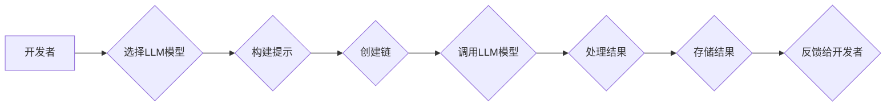

> LangChain, 大语言模型, 应用开发, 编程框架, AI助手, 自然语言处理, 聊天机器人, 代码生成

## 1. 背景介绍

近年来，大语言模型（LLM）的快速发展掀起了人工智能领域的热潮。这些强大的模型能够理解和生成人类语言，展现出令人惊叹的文本生成、翻译、问答和代码编写能力。然而，直接与LLM交互往往需要复杂的API调用和数据处理，这给开发者带来了不少挑战。为了简化LLM应用开发，LangChain应运而生。

LangChain是一个开源的框架，旨在帮助开发者构建基于LLM的应用程序。它提供了一套丰富的工具和组件，可以轻松地将LLM与其他数据源、工具和服务集成，从而构建更强大、更灵活的AI应用。

## 2. 核心概念与联系

LangChain的核心概念围绕着“链”这个词展开，它将LLM与其他组件连接起来，形成一个完整的应用流程。

**核心组件：**

* **模型（Model）：** LangChain支持多种主流LLM，例如OpenAI的GPT-3、Google的PaLM等。开发者可以根据应用需求选择合适的模型。
* **提示（Prompt）：** 这是与LLM交互的关键，它包含了开发者想要LLM完成的任务描述和上下文信息。LangChain提供了一系列提示模板和工具，帮助开发者构建更有效的提示。
* **链（Chain）：** 这是LangChain的核心概念，它将多个组件连接起来，形成一个完整的应用流程。例如，一个简单的聊天机器人链可能包含一个LLM模型、一个提示模板、一个存储对话历史的组件等。
* **内存（Memory）：** 为了让LLM能够记住之前的对话上下文，LangChain提供了内存组件，可以存储和检索对话历史信息。
* **工具（Tool）：** LangChain支持将外部工具集成到应用中，例如搜索引擎、数据库、代码库等。开发者可以利用这些工具扩展LLM的功能。

**架构图：**



## 3. 核心算法原理 & 具体操作步骤

LangChain的核心算法原理是基于Transformer模型的文本生成和理解能力。

### 3.1  算法原理概述

Transformer模型是一种深度学习模型，其核心是注意力机制，能够捕捉文本序列中不同词语之间的关系，从而理解上下文信息。

### 3.2  算法步骤详解

1. **输入处理：** 将用户输入的文本转换为模型可理解的格式，例如词嵌入。
2. **编码：** 使用Transformer编码器将文本序列编码成一个向量表示，捕捉文本的语义信息。
3. **解码：** 使用Transformer解码器根据编码结果生成文本输出。
4. **输出处理：** 将模型生成的文本输出转换为人类可读的格式。

### 3.3  算法优缺点

**优点：**

* 强大的文本生成和理解能力
* 可以捕捉长距离依赖关系
* 训练效率高

**缺点：**

* 模型参数量大，需要大量的计算资源
* 训练数据量大，需要大量高质量的文本数据
* 容易受到训练数据偏差的影响

### 3.4  算法应用领域

* 文本生成：文章写作、故事创作、代码生成
* 翻译：机器翻译
* 问答：智能问答系统
* 对话系统：聊天机器人

## 4. 数学模型和公式 & 详细讲解 & 举例说明

Transformer模型的核心是注意力机制，其数学模型和公式如下：

### 4.1  数学模型构建

**注意力机制：**

```latex
Attention(Q, K, V) = softmax(\frac{QK^T}{\sqrt{d_k}})V
```

其中：

* Q：查询矩阵
* K：键矩阵
* V：值矩阵
* $d_k$：键向量的维度
* softmax：归一化函数

**解释：**

注意力机制计算每个查询词与所有键词之间的相关性，并根据相关性权重加权求和，得到最终的输出值。

### 4.2  公式推导过程

注意力机制的推导过程涉及到矩阵运算和概率论。

* 首先，将查询矩阵Q与键矩阵K进行矩阵乘法，得到一个得分矩阵。
* 然后，对得分矩阵进行softmax归一化，得到每个键词的权重。
* 最后，将权重与值矩阵V进行加权求和，得到最终的输出值。

### 4.3  案例分析与讲解

**举例：**

假设我们有一个句子“我爱吃苹果”，我们要计算“吃”这个词与句子中其他词之间的注意力权重。

* Q：查询矩阵为“吃”对应的词向量
* K：键矩阵为句子中所有词对应的词向量
* V：值矩阵为句子中所有词对应的词向量

通过计算注意力机制，我们可以得到“吃”这个词与其他词之间的注意力权重，例如，“我”的权重可能较高，“苹果”的权重也可能较高，而“爱”的权重可能较低。

## 5. 项目实践：代码实例和详细解释说明

以下是一个简单的LangChain应用示例，演示如何使用LangChain构建一个简单的问答机器人。

### 5.1  开发环境搭建

* 安装Python 3.7+
* 安装LangChain库：`pip install langchain`
* 安装OpenAI API库：`pip install openai`

### 5.2  源代码详细实现

```python
from langchain.llms import OpenAI
from langchain.chains import ConversationChain
from langchain.memory import ConversationBufferMemory

# 设置OpenAI API密钥
openai.api_key = "YOUR_API_KEY"

# 创建OpenAI模型实例
llm = OpenAI(temperature=0.7)

# 创建对话内存
memory = ConversationBufferMemory()

# 创建对话链
conversation = ConversationChain(
    llm=llm,
    memory=memory,
    prompt=f"你好，我是你的AI助手。请问有什么可以帮你的吗？"
)

# 与机器人对话
while True:
    user_input = input("你:")
    response = conversation.run(user_input)
    print("机器人:", response)
```

### 5.3  代码解读与分析

* 首先，我们导入必要的库，并设置OpenAI API密钥。
* 然后，我们创建OpenAI模型实例，并设置温度参数，控制模型的随机性。
* 接着，我们创建对话内存，用于存储对话历史信息。
* 接下来，我们创建对话链，将模型、内存和提示信息连接起来。
* 最后，我们进入循环，不断接收用户输入，并通过对话链获取机器人回复。

### 5.4  运行结果展示

运行代码后，我们可以与机器人进行对话，例如：

```
你: 你好
机器人: 你好，我是你的AI助手。请问有什么可以帮你的吗？
你: 你叫什么名字？
机器人: 我没有名字，你可以叫我AI助手。
```

## 6. 实际应用场景

LangChain在各种实际应用场景中都展现出强大的潜力。

### 6.1  聊天机器人

LangChain可以用于构建更智能、更自然的聊天机器人，例如客服机器人、陪伴机器人等。

### 6.2  内容创作

LangChain可以帮助用户生成各种类型的文本内容，例如文章、故事、诗歌、代码等。

### 6.3  教育辅助

LangChain可以作为教育辅助工具，帮助学生学习新知识、完成作业、进行知识问答等。

### 6.4  未来应用展望

随着LLM技术的不断发展，LangChain的应用场景将更加广泛，例如：

* 个性化学习
* 智能写作助手
* 代码自动生成
* 虚拟助理

## 7. 工具和资源推荐

### 7.1  学习资源推荐

* LangChain官方文档：https://python.langchain.com/docs/
* LangChain GitHub仓库：https://github.com/langchain-ai/langchain

### 7.2  开发工具推荐

* Python 3.7+
* Jupyter Notebook

### 7.3  相关论文推荐

* Attention Is All You Need: https://arxiv.org/abs/1706.03762

## 8. 总结：未来发展趋势与挑战

LangChain作为一款开源的LLM应用框架，为开发者提供了便捷的工具和组件，加速了LLM应用的开发和推广。

### 8.1  研究成果总结

LangChain已经取得了显著的成果，例如：

* 提供了丰富的LLM模型支持
* 提供了多种链类型和工具集成
* 拥有活跃的社区和丰富的学习资源

### 8.2  未来发展趋势

未来，LangChain将朝着以下方向发展：

* 更强大的模型支持
* 更灵活的链构建
* 更丰富的工具集成
* 更易于使用的API

### 8.3  面临的挑战

LangChain也面临着一些挑战，例如：

* 模型参数量大，部署成本高
* 数据安全和隐私问题
* 算法偏见和可解释性问题

### 8.4  研究展望

未来，LangChain的研究方向将包括：

* 开发更轻量级的模型
* 提高模型的效率和可解释性
* 解决数据安全和隐私问题
* 探索新的应用场景

## 9. 附录：常见问题与解答

**常见问题：**

* 如何选择合适的LLM模型？
* 如何构建自定义链？
* 如何集成外部工具？

**解答：**

* 选择合适的LLM模型取决于应用场景和性能需求。LangChain支持多种主流模型，开发者可以根据实际情况选择。
* 构建自定义链需要定义链的类型、模型、提示和工具等参数。LangChain提供了丰富的链类型和工具，开发者可以根据需求进行组合。
* 集成外部工具需要定义工具的类型、接口和参数。LangChain支持多种工具类型，开发者可以根据需求进行集成。


作者：禅与计算机程序设计艺术 / Zen and the Art of Computer Programming 
<end_of_turn>