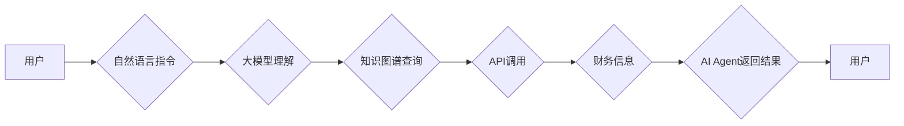

> 大模型、AI Agent、财务信息查询、自然语言处理、知识图谱、API调用、Python

## 1. 背景介绍

随着人工智能技术的飞速发展，大模型的出现为我们带来了前所未有的机遇。大模型拥有强大的语言理解和生成能力，能够理解复杂的自然语言指令，并生成相应的文本、代码或其他数据。基于大模型的AI Agent正逐渐成为一种新兴的应用模式，它能够自动执行各种任务，例如查询信息、完成交易、提供服务等。

财务信息查询是企业和个人日常生活中必不可少的任务。传统的财务信息查询方式通常需要人工操作，效率低下，且容易出错。而基于大模型的AI Agent能够自动完成财务信息查询，提高效率，降低成本，并提供更便捷的用户体验。

## 2. 核心概念与联系

### 2.1 大模型

大模型是指参数量巨大的人工智能模型，通常拥有数十亿甚至数千亿个参数。通过训练海量数据，大模型能够学习到复杂的语言模式和知识，从而实现强大的语言理解和生成能力。

### 2.2 AI Agent

AI Agent是一种能够感知环境、做出决策并执行行动的智能体。它通常由以下几个核心组件组成：

* **感知模块:** 用于获取环境信息，例如文本、图像、音频等。
* **推理模块:** 用于分析环境信息，做出决策。
* **执行模块:** 用于执行决策，例如发送指令、控制设备等。

### 2.3 财务信息查询

财务信息查询是指获取有关财务状况、交易记录、报表等信息的活动。

**核心概念与联系的Mermaid流程图:**



## 3. 核心算法原理 & 具体操作步骤

### 3.1 算法原理概述

本案例中，我们主要利用大模型的自然语言理解能力和知识图谱的结构化知识表示能力，结合API调用技术，实现AI Agent自动查询财务信息的功能。

具体步骤如下：

1. 用户使用自然语言输入财务信息查询指令。
2. 大模型对用户指令进行理解和解析，提取关键信息，例如查询对象、时间范围、数据类型等。
3. 根据提取的关键信息，大模型查询知识图谱，获取相关财务信息。
4. 如果需要，大模型调用相应的API接口，获取更详细的财务数据。
5. 大模型将查询到的财务信息进行整合和处理，并以自然语言形式返回给用户。

### 3.2 算法步骤详解

1. **用户指令预处理:** 将用户输入的自然语言指令进行清洗、分词、词性标注等预处理操作，以便大模型更好地理解指令内容。
2. **指令意图识别:** 利用大模型的预训练知识和训练数据，识别用户指令的意图，例如查询资产、查看交易记录、分析财务报表等。
3. **关键信息提取:** 从指令中提取关键信息，例如查询对象、时间范围、数据类型等。
4. **知识图谱查询:** 根据提取的关键信息，查询知识图谱，获取相关财务信息。
5. **API调用:** 如果需要，调用相应的API接口，获取更详细的财务数据。
6. **信息整合与处理:** 将查询到的财务信息进行整合和处理，例如格式化、排序、摘要等。
7. **结果生成:** 将处理后的财务信息以自然语言形式返回给用户。

### 3.3 算法优缺点

**优点:**

* **自然语言交互:** 用户可以使用自然语言进行查询，无需学习特定指令格式。
* **智能化查询:** 大模型能够理解用户的意图，并自动提取关键信息，提高查询效率。
* **知识图谱支持:** 知识图谱能够提供结构化的财务信息，方便大模型进行查询和分析。
* **API调用:** 可以调用外部API接口，获取更丰富和准确的财务数据。

**缺点:**

* **模型训练成本:** 大模型的训练需要大量的计算资源和数据，成本较高。
* **数据依赖性:** 大模型的性能依赖于训练数据的质量和数量。
* **解释性问题:** 大模型的决策过程通常是黑盒式的，难以解释其推理逻辑。

### 3.4 算法应用领域

* **金融服务:** 自动化财务报表分析、风险评估、客户服务等。
* **企业管理:** 自动化财务数据查询、预算管理、成本控制等。
* **个人理财:** 自动化投资建议、财务规划、风险管理等。

## 4. 数学模型和公式 & 详细讲解 & 举例说明

### 4.1 数学模型构建

在构建AI Agent查询财务信息模型时，我们可以使用以下数学模型：

* **词嵌入模型:** 将单词映射到低维向量空间，用于捕捉单词之间的语义关系。常用的词嵌入模型包括Word2Vec、GloVe等。
* **Transformer模型:** 用于处理序列数据，例如文本，能够捕捉长距离依赖关系。常用的Transformer模型包括BERT、GPT等。
* **知识图谱嵌入模型:** 将知识图谱中的实体和关系映射到低维向量空间，用于进行知识推理和查询。常用的知识图谱嵌入模型包括TransE、TransR等。

### 4.2 公式推导过程

由于篇幅限制，这里只列举一些常用的数学公式，并简要说明其含义：

* **词嵌入模型的损失函数:**

$$
L = \sum_{i=1}^{N} \sum_{j=1}^{M} \left\| \mathbf{w}_i - \mathbf{w}_j \right\|^2
$$

其中，$N$和$M$分别为词典大小和上下文窗口大小，$\mathbf{w}_i$和$\mathbf{w}_j$分别为词$i$和词$j$的词向量。

* **Transformer模型的注意力机制:**

$$
Attention(Q, K, V) = \frac{exp(Q \cdot K^T / \sqrt{d_k})}{exp(Q \cdot K^T / \sqrt{d_k})} \cdot V
$$

其中，$Q$, $K$, $V$分别为查询矩阵、键矩阵和值矩阵，$d_k$为键向量的维度。

### 4.3 案例分析与讲解

假设我们想要查询某个公司的财务报表数据。我们可以使用以下步骤：

1. 用户输入自然语言指令：“查询公司ABC的2023年财务报表”。
2. 大模型对指令进行理解，提取关键信息：公司名称为ABC，年份为2023，报表类型为财务报表。
3. 大模型查询知识图谱，获取公司ABC的财务报表数据链接。
4. 大模型调用API接口，获取公司ABC的2023年财务报表数据。
5. 大模型将财务报表数据进行格式化和处理，并以自然语言形式返回给用户。

## 5. 项目实践：代码实例和详细解释说明

### 5.1 开发环境搭建

本案例使用Python语言开发，需要安装以下软件包：

* **Python:** Python 3.7或更高版本
* **transformers:** 用于加载预训练Transformer模型
* **requests:** 用于发送API请求
* **pandas:** 用于数据处理和分析
* **jieba:** 用于中文分词

### 5.2 源代码详细实现

```python
import requests
from transformers import pipeline
import pandas as pd

# 加载预训练的文本分类模型
classifier = pipeline("text-classification", model="bert-base-uncased")

# 定义API接口地址
api_url = "https://api.example.com/financial_report"

def query_financial_report(company_name, year):
    # 使用自然语言理解模型识别用户意图
    intent = classifier(f"查询公司{company_name}的{year}年财务报表")[0]['label']

    # 根据意图调用API接口获取财务报表数据
    if intent == "财务报表查询":
        params = {"company_name": company_name, "year": year}
        response = requests.get(api_url, params=params)
        data = response.json()

        # 将财务报表数据转换为pandas DataFrame
        df = pd.DataFrame(data)

        # 返回财务报表数据
        return df

# 示例用法
company_name = "ABC"
year = 2023
financial_report = query_financial_report(company_name, year)
print(financial_report)
```

### 5.3 代码解读与分析

* **加载预训练模型:** 使用transformers库加载预训练的文本分类模型，用于识别用户意图。
* **定义API接口地址:** 定义API接口地址，用于获取财务报表数据。
* **查询财务报表函数:** 定义一个函数`query_financial_report`，接受公司名称和年份作为参数，并返回财务报表数据。
* **识别用户意图:** 使用文本分类模型识别用户指令的意图，例如“财务报表查询”。
* **调用API接口:** 根据用户意图调用API接口，获取财务报表数据。
* **数据处理:** 将获取到的财务报表数据转换为pandas DataFrame，方便后续分析和处理。
* **返回结果:** 返回处理后的财务报表数据。

### 5.4 运行结果展示

运行上述代码后，将输出公司ABC的2023年财务报表数据。

## 6. 实际应用场景

### 6.1 企业财务管理

AI Agent可以帮助企业自动完成财务报表分析、风险评估、预算管理、成本控制等任务，提高财务管理效率，降低成本。

### 6.2 个人理财

AI Agent可以帮助个人自动完成投资建议、财务规划、风险管理等任务，提供个性化的理财服务。

### 6.3 金融服务

AI Agent可以帮助金融机构自动完成客户服务、贷款审批、欺诈检测等任务，提高服务效率，降低风险。

### 6.4 未来应用展望

随着大模型技术的不断发展，AI Agent在财务信息查询领域的应用将更加广泛和深入。未来，AI Agent可能能够：

* 更准确地理解用户的财务需求，提供更个性化的服务。
* 自动生成财务报表分析报告，帮助用户更好地理解财务状况。
* 与其他金融系统进行集成，实现更全面的财务管理。

## 7. 工具和资源推荐

### 7.1 学习资源推荐

* **大模型技术入门:**
    * 《深度学习》 by Ian Goodfellow
    * 《自然语言处理》 by Dan Jurafsky
* **AI Agent开发:**
    * 《Reinforcement Learning: An Introduction》 by Richard S. Sutton
    * 《Artificial Intelligence: A Modern Approach》 by Stuart Russell

### 7.2 开发工具推荐

* **Python:** 
    * TensorFlow
    * PyTorch
    * Hugging Face Transformers
* **API接口测试工具:**
    * Postman
    * Insomnia

### 7.3 相关论文推荐

* **BERT:** Devlin, J., Chang, M. W., Lee, K., & Toutanova, K. (2018). BERT: Pre-training of deep bidirectional transformers for language understanding. arXiv preprint arXiv:1810.04805.
* **GPT:** Radford, A., Wu, J., Child, R., Luan, D., Amodei, D., & Sutskever, I. (2019). Language models are few-shot learners. OpenAI blog.
* **知识图谱嵌入模型:** Bordes, A., Nickel, M., & Parvaresh, S. (2013). Translating embeddings for modeling relations. In Advances in neural information processing systems (pp. 2787-2795).

## 8. 总结：未来发展趋势与挑战

### 8.1 研究成果总结

本案例展示了如何利用大模型和知识图谱技术，构建AI Agent自动查询财务