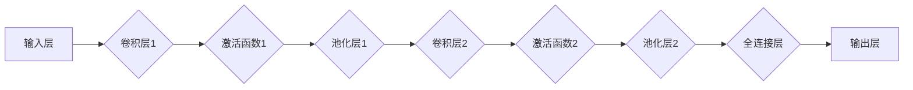

> 卷积神经网络(CNN)、深度学习、图像识别、特征提取、卷积操作、池化操作、全连接层

## 1. 背景介绍

卷积神经网络(CNN)作为深度学习领域最成功的应用之一，在图像识别、物体检测、语音识别等领域取得了突破性的进展。其强大的特征提取能力和鲁棒性使其成为人工智能领域不可或缺的工具。然而，对于初学者来说，CNN的原理和结构可能显得复杂难懂。本文将从基础概念出发，深入浅出地讲解CNN的原理解析，帮助读者理解其工作机制和应用场景。

## 2. 核心概念与联系

CNN的核心思想是通过模仿人类视觉系统对图像进行处理，利用卷积操作和池化操作来提取图像特征。

**2.1 卷积操作**

卷积操作是CNN的核心运算之一，它通过一个称为卷积核(kernel)的滤波器在图像上滑动，计算每个位置的卷积结果。卷积核本质上是一个小的矩阵，它包含了特定类型的特征信息，例如边缘、纹理等。当卷积核滑动到图像某个位置时，它与该位置的图像区域进行点乘运算，并将结果累加起来，得到该位置的卷积结果。

**2.2 池化操作**

池化操作用于降低图像的维度，同时保留其最重要的特征信息。常见的池化操作包括最大池化和平均池化。最大池化选择每个池化窗口内的最大值作为输出，而平均池化则计算每个池化窗口内的平均值作为输出。池化操作可以有效地减少计算量，提高模型的鲁棒性。

**2.3 全连接层**

全连接层是CNN的最后一层，它将卷积和池化操作提取出的特征进行分类或回归。全连接层将每个卷积特征映射到一个神经元，并通过权重和激活函数进行计算，最终输出分类结果或回归值。

**2.4 CNN架构图**



## 3. 核心算法原理 & 具体操作步骤

### 3.1 算法原理概述

CNN的算法原理基于以下几个核心概念：

* **局部连接:** 每个神经元只连接到局部区域的输入特征，类似于人类视觉系统对局部信息的感知。
* **权值共享:** 卷积核中的权值在整个图像上共享，这可以有效地减少参数数量，提高模型的泛化能力。
* **层次化特征提取:** 通过多层卷积和池化操作，CNN可以逐层提取图像的抽象特征，从低层次的边缘、纹理到高层次的物体、场景等。

### 3.2 算法步骤详解

1. **输入图像预处理:** 将输入图像调整到CNN模型所需的尺寸和格式。
2. **卷积操作:** 使用卷积核在图像上滑动，计算每个位置的卷积结果。
3. **激活函数:** 将卷积结果输入激活函数，例如ReLU函数，以引入非线性特性。
4. **池化操作:** 对激活后的特征图进行池化操作，例如最大池化，以降低特征图的维度。
5. **重复步骤2-4:** 将卷积层、激活函数和池化层重复若干层，以提取多层次的特征。
6. **全连接层:** 将卷积和池化操作提取出的特征输入全连接层，进行分类或回归。
7. **输出结果:** 全连接层输出的分类结果或回归值作为最终的预测结果。

### 3.3 算法优缺点

**优点:**

* **强大的特征提取能力:** CNN可以自动学习图像的特征，无需人工设计特征。
* **鲁棒性:** CNN对图像的噪声和变形具有较强的鲁棒性。
* **可移植性:** CNN模型可以应用于不同的图像识别任务。

**缺点:**

* **计算量大:** CNN的训练和推理过程需要大量的计算资源。
* **参数量大:** CNN模型的参数量较大，需要大量的训练数据才能有效训练。
* **可解释性差:** CNN的决策过程比较复杂，难以解释其决策依据。

### 3.4 算法应用领域

CNN在图像识别、物体检测、语音识别、自然语言处理等领域都有广泛的应用。

* **图像识别:** CNN可以识别图像中的物体、场景、人物等。
* **物体检测:** CNN可以定位图像中物体的边界框和类别。
* **语音识别:** CNN可以将语音信号转换为文本。
* **自然语言处理:** CNN可以用于文本分类、情感分析、机器翻译等任务。

## 4. 数学模型和公式 & 详细讲解 & 举例说明

### 4.1 数学模型构建

CNN的数学模型主要包括卷积操作、激活函数和池化操作。

**4.1.1 卷积操作**

卷积操作的数学公式如下：

$$
y(i,j) = \sum_{m=0}^{M-1} \sum_{n=0}^{N-1} x(i+m,j+n) * w(m,n)
$$

其中：

* $y(i,j)$ 是卷积结果的像素值。
* $x(i+m,j+n)$ 是输入图像的像素值。
* $w(m,n)$ 是卷积核的权值。
* $M$ 和 $N$ 是卷积核的大小。

**4.1.2 激活函数**

激活函数的作用是引入非线性特性，使CNN模型能够学习更复杂的特征。常见的激活函数包括ReLU函数、Sigmoid函数和Tanh函数。

**4.1.3 池化操作**

池化操作的数学公式取决于具体的池化方法。例如，最大池化操作的公式如下：

$$
y(i,j) = \max_{m=0}^{M-1} \max_{n=0}^{N-1} x(i+m,j+n)
$$

其中：

* $y(i,j)$ 是池化结果的像素值。
* $x(i+m,j+n)$ 是输入特征图的像素值。
* $M$ 和 $N$ 是池化窗口的大小。

### 4.2 公式推导过程

卷积操作的公式推导过程可以参考相关文献，例如LeCun等人的论文《Gradient-Based Learning Applied to Document Recognition》。

### 4.3 案例分析与讲解

假设我们有一个3x3的输入图像和一个3x3的卷积核，卷积核的权值如下：

```
[[1, 2, 3],
 [4, 5, 6],
 [7, 8, 9]]
```

我们可以使用卷积操作计算图像的卷积结果。例如，当卷积核滑动到图像的左上角时，卷积结果为：

$$
y(0,0) = 1*x(0,0) + 2*x(0,1) + 3*x(0,2) + 4*x(1,0) + 5*x(1,1) + 6*x(1,2) + 7*x(2,0) + 8*x(2,1) + 9*x(2,2)
$$

其中，$x(i,j)$ 是输入图像的像素值。

## 5. 项目实践：代码实例和详细解释说明

### 5.1 开发环境搭建

为了实现CNN模型，我们需要搭建一个深度学习开发环境。常用的深度学习框架包括TensorFlow、PyTorch和Keras。本文使用Keras框架进行示例。

**5.1.1 安装依赖库:**

```bash
pip install tensorflow keras numpy matplotlib
```

### 5.2 源代码详细实现

```python
from tensorflow.keras.models import Sequential
from tensorflow.keras.layers import Conv2D, MaxPooling2D, Flatten, Dense

# 定义CNN模型
model = Sequential()
model.add(Conv2D(32, (3, 3), activation='relu', input_shape=(28, 28, 1)))
model.add(MaxPooling2D((2, 2)))
model.add(Conv2D(64, (3, 3), activation='relu'))
model.add(MaxPooling2D((2, 2)))
model.add(Flatten())
model.add(Dense(10, activation='softmax'))

# 编译模型
model.compile(optimizer='adam', loss='sparse_categorical_crossentropy', metrics=['accuracy'])

# 训练模型
model.fit(x_train, y_train, epochs=10, batch_size=32)

# 评估模型
loss, accuracy = model.evaluate(x_test, y_test)
print('Test loss:', loss)
print('Test accuracy:', accuracy)
```

### 5.3 代码解读与分析

* **Sequential()**: 创建一个顺序模型，层级结构清晰。
* **Conv2D()**: 卷积层，定义卷积核大小、输出通道数和激活函数。
* **MaxPooling2D()**: 池化层，使用最大池化操作降低特征图维度。
* **Flatten()**: 将多维特征图展平为一维向量。
* **Dense()**: 全连接层，连接所有特征向量，输出分类结果。
* **compile()**: 编译模型，指定优化器、损失函数和评价指标。
* **fit()**: 训练模型，输入训练数据和超参数。
* **evaluate()**: 评估模型，输入测试数据并计算损失和准确率。

### 5.4 运行结果展示

训练完成后，我们可以使用测试数据评估模型的性能。模型的准确率通常会达到较高的水平，表明CNN模型能够有效地学习图像特征并进行分类。

## 6. 实际应用场景

CNN在图像识别、物体检测、语音识别等领域都有广泛的应用。

### 6.1 图像识别

CNN可以识别图像中的物体、场景、人物等。例如，在自动驾驶汽车中，CNN可以识别道路上的车辆、行人、交通信号灯等，帮助车辆安全行驶。

### 6.2 物体检测

CNN可以定位图像中物体的边界框和类别。例如，在医疗影像分析中，CNN可以检测图像中的肿瘤、骨折等异常区域，帮助医生进行诊断。

### 6.3 语音识别

CNN可以将语音信号转换为文本。例如，在智能语音助手中，CNN可以识别用户的语音指令，并执行相应的操作。

### 6.4 未来应用展望

随着深度学习技术的不断发展，CNN的应用场景将会更加广泛。例如，CNN可以应用于视频分析、自然语言处理、药物发现等领域。

## 7. 工具和资源推荐

### 7.1 学习资源推荐

* **书籍:**
    * 《深度学习》
    * 《动手学深度学习》
* **在线课程:**
    * Coursera: 深度学习
    * Udacity: 深度学习工程师
* **博客:**
    * https://blog.csdn.net/
    * https://zhuanlan.zhihu.com/

### 7.2 开发工具推荐

* **TensorFlow:** https://www.tensorflow.org/
* **PyTorch:** https://pytorch.org/
* **Keras:** https://keras.io/

### 7.3 相关论文推荐

* LeCun, Y., Bengio, Y., & Hinton, G. (2015). Deep learning. Nature, 521(7553), 436-444.
* Krizhevsky, A., Sutskever, I., & Hinton, G. E. (2012). Imagenet classification with deep convolutional neural networks. In Advances in neural information processing systems (pp. 1