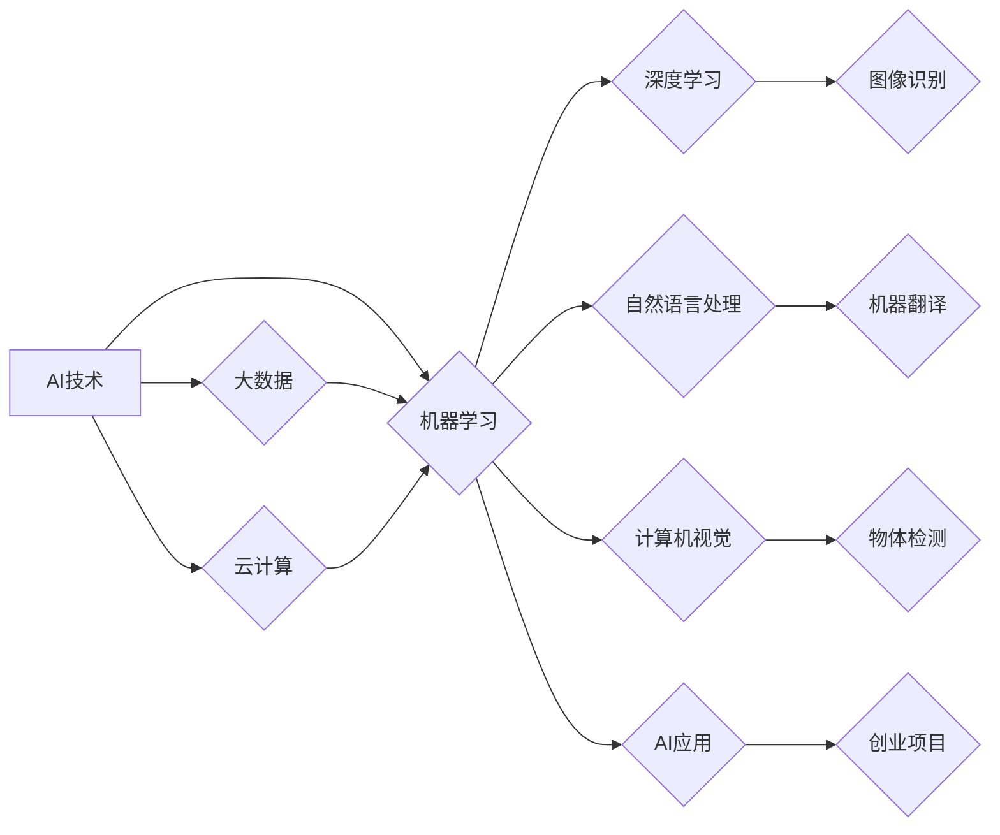

> 人工智能，创业，技术前沿，深度学习，机器学习，自然语言处理，计算机视觉，大数据，云计算

## 1. 背景介绍

人工智能（AI）正以惊人的速度发展，其应用领域不断拓展，从医疗保健到金融，再到自动驾驶，AI正在改变着我们生活的方方面面。对于创业者来说，AI技术带来的机遇是巨大的，但也充满了挑战。如何把握AI技术前沿，将AI技术应用于自己的创业项目，是创业者需要认真思考的问题。

## 2. 核心概念与联系

**2.1  人工智能（AI）**

人工智能是指模拟人类智能行为的计算机系统。这些行为包括学习、推理、决策、感知和语言理解等。

**2.2  机器学习（ML）**

机器学习是人工智能的一个子领域，它使计算机能够从数据中学习，无需明确编程。机器学习算法通过分析数据模式，建立数学模型，从而预测未来结果或做出决策。

**2.3  深度学习（DL）**

深度学习是机器学习的一个更高级的子领域，它使用多层神经网络来模拟人类大脑的结构和功能。深度学习算法能够处理海量数据，并从中提取更深层次的特征，从而实现更准确的预测和更复杂的决策。

**2.4  自然语言处理（NLP）**

自然语言处理是指使计算机能够理解、解释和生成人类语言的技术。NLP应用广泛，包括机器翻译、文本摘要、情感分析和对话系统等。

**2.5  计算机视觉（CV）**

计算机视觉是指使计算机能够“看”和理解图像的技术。CV应用包括图像识别、物体检测、图像分割和视频分析等。

**2.6  大数据**

大数据是指海量、高速度、高多样性的数据。AI算法需要大量数据进行训练，大数据为AI的发展提供了重要的基础。

**2.7  云计算**

云计算是指通过互联网提供计算资源、存储资源和软件服务的模式。云计算为AI开发提供了强大的计算能力和存储空间。

**2.8  AI创业生态系统**

AI创业生态系统包括AI技术提供商、AI应用开发商、AI数据服务商、AI硬件制造商以及政府和投资机构等。

**Mermaid 流程图**



## 3. 核心算法原理 & 具体操作步骤

### 3.1  算法原理概述

**3.1.1  监督学习**

监督学习是机器学习的一种类型，它使用标记数据进行训练。标记数据是指每个数据点都带有对应的标签或类别。监督学习算法的目标是学习一个模型，能够将新的数据点映射到正确的标签或类别。

**3.1.2  无监督学习**

无监督学习是机器学习的一种类型，它使用未标记数据进行训练。无监督学习算法的目标是发现数据中的隐藏模式或结构。

**3.1.3  强化学习**

强化学习是机器学习的一种类型，它使用奖励机制进行训练。强化学习算法的目标是学习一个策略，能够在环境中采取最优行动，从而获得最大的奖励。

### 3.2  算法步骤详解

**3.2.1  数据预处理**

数据预处理是机器学习算法训练前的关键步骤，它包括数据清洗、数据转换、数据特征提取等操作。

**3.2.2  模型选择**

根据具体的应用场景和数据特点，选择合适的机器学习算法模型。

**3.2.3  模型训练**

使用标记数据训练机器学习模型，调整模型参数，使模型能够准确地预测或分类数据。

**3.2.4  模型评估**

使用测试数据评估模型的性能，常用的评估指标包括准确率、召回率、F1-score等。

**3.2.5  模型部署**

将训练好的模型部署到实际应用环境中，用于预测或分类新的数据。

### 3.3  算法优缺点

**3.3.1  监督学习**

优点：准确率高，能够处理分类和回归问题。

缺点：需要大量标记数据，数据标注成本高。

**3.3.2  无监督学习**

优点：不需要标记数据，能够发现数据中的隐藏模式。

缺点：模型解释性较差，难以评估模型性能。

**3.3.3  强化学习**

优点：能够学习复杂的决策策略，适用于动态环境。

缺点：训练过程复杂，需要大量的试错和奖励机制设计。

### 3.4  算法应用领域

**3.4.1  图像识别**

用于识别图像中的物体、场景和人脸。

**3.4.2  自然语言处理**

用于机器翻译、文本摘要、情感分析和对话系统等。

**3.4.3  推荐系统**

用于推荐用户感兴趣的商品、服务或内容。

**3.4.4  医疗诊断**

用于辅助医生诊断疾病，例如癌症检测和疾病预测。

## 4. 数学模型和公式 & 详细讲解 & 举例说明

### 4.1  数学模型构建

**4.1.1  线性回归模型**

线性回归模型是一种用于预测连续数值的机器学习算法。其数学模型如下：

$$
y = w_0 + w_1x_1 + w_2x_2 + ... + w_nx_n + \epsilon
$$

其中：

* $y$ 是预测值
* $w_0, w_1, w_2, ..., w_n$ 是模型参数
* $x_1, x_2, ..., x_n$ 是输入特征
* $\epsilon$ 是误差项

**4.1.2  逻辑回归模型**

逻辑回归模型是一种用于预测分类结果的机器学习算法。其数学模型如下：

$$
p(y=1|x) = \frac{1}{1 + e^{-(w_0 + w_1x_1 + w_2x_2 + ... + w_nx_n)}}
$$

其中：

* $p(y=1|x)$ 是预测类别为1的概率
* $w_0, w_1, w_2, ..., w_n$ 是模型参数
* $x_1, x_2, ..., x_n$ 是输入特征

### 4.2  公式推导过程

**4.2.1  线性回归模型参数估计**

可以使用最小二乘法估计线性回归模型的参数。最小二乘法的目标是找到一组参数，使得模型预测值与实际值之间的误差平方和最小。

**4.2.2  逻辑回归模型参数估计**

可以使用最大似然估计法估计逻辑回归模型的参数。最大似然估计法的目标是找到一组参数，使得模型能够最大化观测数据的似然概率。

### 4.3  案例分析与讲解

**4.3.1  房价预测**

可以使用线性回归模型预测房价。输入特征包括房屋面积、房间数、地理位置等。

**4.3.2  客户流失预测**

可以使用逻辑回归模型预测客户是否会流失。输入特征包括客户的购买历史、使用频率、反馈意见等。

## 5. 项目实践：代码实例和详细解释说明

### 5.1  开发环境搭建

**5.1.1  Python环境**

使用Anaconda或Pyenv安装Python3.7或更高版本。

**5.1.2  机器学习库**

使用pip安装Scikit-learn、TensorFlow或PyTorch等机器学习库。

**5.1.3  数据处理库**

使用pandas、NumPy等数据处理库。

### 5.2  源代码详细实现

**5.2.1  线性回归模型代码示例**

```python
from sklearn.linear_model import LinearRegression
from sklearn.model_selection import train_test_split
import pandas as pd

# 加载数据
data = pd.read_csv('housing.csv')

# 分割数据
X = data[['面积', '房间数']]
y = data['价格']
X_train, X_test, y_train, y_test = train_test_split(X, y, test_size=0.2)

# 创建线性回归模型
model = LinearRegression()

# 训练模型
model.fit(X_train, y_train)

# 预测测试数据
y_pred = model.predict(X_test)

# 评估模型性能
print('模型系数:', model.coef_)
print('截距:', model.intercept_)
```

**5.2.2  逻辑回归模型代码示例**

```python
from sklearn.linear_model import LogisticRegression
from sklearn.model_selection import train_test_split
import pandas as pd

# 加载数据
data = pd.read_csv('customer_churn.csv')

# 分割数据
X = data[['购买历史', '使用频率']]
y = data['流失']
X_train, X_test, y_train, y_test = train_test_split(X, y, test_size=0.2)

# 创建逻辑回归模型
model = LogisticRegression()

# 训练模型
model.fit(X_train, y_train)

# 预测测试数据
y_pred = model.predict(X_test)

# 评估模型性能
print('模型准确率:', model.score(X_test, y_test))
```

### 5.3  代码解读与分析

**5.3.1  数据加载和预处理**

代码首先加载数据，然后进行数据预处理，例如特征选择、数据转换等。

**5.3.2  模型选择和训练**

根据具体的应用场景，选择合适的机器学习算法模型，并使用训练数据训练模型。

**5.3.3  模型评估和预测**

使用测试数据评估模型的性能，并使用训练好的模型预测新的数据。

### 5.4  运行结果展示

运行代码后，会输出模型的训练结果、评估指标和预测结果。

## 6. 实际应用场景

### 6.1  医疗诊断

AI可以辅助医生诊断疾病，例如癌症检测、心血管疾病预测等。

### 6.2  金融风险管理

AI可以用于识别金融欺诈、评估信用风险、预测市场波动等。

### 6.3  个性化推荐

AI可以根据用户的兴趣和行为，推荐个性化的商品、服务或内容。

### 6.4  未来应用展望

AI技术将继续发展，并在更多领域得到应用，例如自动驾驶、机器人、智能家居等。

## 7. 工具和资源推荐

### 7.1  学习资源推荐

* **在线课程:** Coursera、edX、Udacity等平台提供丰富的AI课程。
* **书籍:** 《深度学习》、《机器学习实战》等书籍是学习AI的基础。
* **博客和论坛:** Kaggle、Towards Data Science等网站提供AI相关的博客文章和论坛讨论。

### 7.2  开发工具推荐

* **Python:** 广泛用于AI开发，拥有丰富的机器学习库。
* **TensorFlow:** Google开发的开源深度学习框架。
* **PyTorch:** Facebook开发的开源深度学习框架。
* **Jupyter Notebook:** 用于交互式编程和数据可视化的工具。

### 7.3  相关论文推荐

* **《ImageNet Classification with Deep Convolutional Neural Networks》**
* **《Attention Is All You Need》**
* **《Generative Adversarial Networks》**

## 8. 总结：未来发展趋势与挑战

### 8.1  研究成果总结

近年来，AI技术取得了长足的进步，例如深度学习算法的突破、大规模数据集的积累、计算能力的提升等。

### 8.2  未来发展趋势

* **模型更加强大:** AI模型