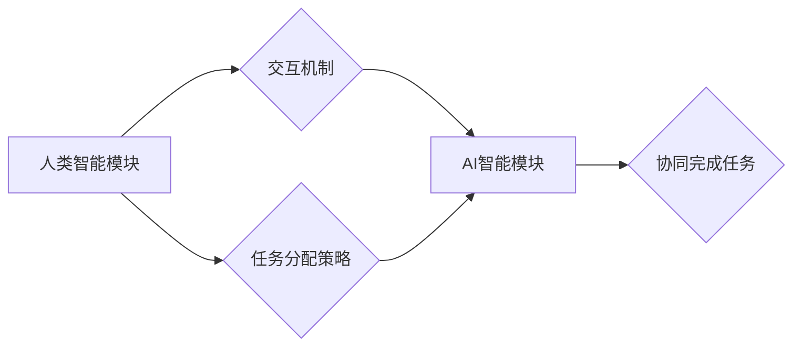

> 人工智能，人类-AI协作，协同智能，增强人类潜能，AI能力，融合发展，未来趋势

## 1. 背景介绍

人工智能（AI）技术近年来发展迅速，已渗透到各个领域，深刻地改变着人类的生活方式和工作模式。从自动驾驶、语音识别到医疗诊断、金融分析，AI技术的应用日益广泛，展现出强大的潜力。然而，AI技术也面临着一些挑战，例如数据依赖、算法黑盒化、伦理道德等问题。

人类-AI协作作为一种新的智能交互模式，正逐渐成为AI发展的重要方向。它旨在通过融合人类的智慧和创造力与AI的计算能力和数据处理能力，实现互补、协同，从而提升整体智能水平。

## 2. 核心概念与联系

**2.1 人类-AI协作的定义**

人类-AI协作是指人类和人工智能系统在共同目标下进行合作，相互补充、共同完成任务的过程。这种合作并非简单的“人指挥AI”，而是更强调双方平等、互动的关系。

**2.2 协同智能的架构**

协同智能的架构通常包括以下几个关键要素：

* **人类智能模块:** 包括人类的认知能力、决策能力、创造力等。
* **AI智能模块:** 包括AI算法、机器学习模型、知识库等。
* **交互机制:** 用于实现人类和AI系统之间的信息传递和反馈机制。
* **任务分配策略:** 用于根据任务特点和双方能力进行合理的任务分配。

**2.3 协同智能的优势**

人类-AI协作具有以下优势：

* **增强人类能力:** AI可以帮助人类处理大量数据、进行复杂计算、自动化重复性任务，从而释放人类的创造力和智力资源。
* **提升AI能力:** 人类可以提供AI系统所需的知识、经验、判断和反馈，帮助AI系统更好地理解和应对复杂环境。
* **促进创新:** 人类和AI的合作可以激发新的想法和解决方案，推动科技创新和社会进步。

**Mermaid 流程图**



## 3. 核心算法原理 & 具体操作步骤

**3.1 算法原理概述**

人类-AI协作的核心算法原理主要包括：

* **强化学习:** AI系统通过与环境交互，学习最佳的策略，以获得最大奖励。
* **迁移学习:** AI系统将已学习到的知识和技能迁移到新的任务或领域。
* **知识图谱:** 建立人类知识的结构化表示，帮助AI系统理解和推理。
* **自然语言处理:** 理解和生成人类语言，实现人机自然交互。

**3.2 算法步骤详解**

以强化学习为例，人类-AI协作的具体操作步骤如下：

1. **环境建模:** 建立模拟真实世界的环境模型，以便AI系统进行训练和测试。
2. **奖励机制设计:** 设计合理的奖励机制，引导AI系统朝着目标方向学习。
3. **策略学习:** AI系统通过强化学习算法，学习最佳的策略，以获得最大奖励。
4. **人类反馈:** 人类观察AI系统的行为，并提供反馈信息，帮助AI系统改进策略。
5. **策略更新:** AI系统根据人类反馈，更新策略，不断提升性能。

**3.3 算法优缺点**

**优点:**

* 能够学习复杂的任务和环境。
* 能够不断改进和优化策略。
* 能够适应变化的环境。

**缺点:**

* 需要大量的训练数据和计算资源。
* 算法训练过程可能比较复杂。
* 算法的解释性和可解释性较差。

**3.4 算法应用领域**

强化学习在以下领域有广泛的应用：

* **机器人控制:** 训练机器人完成复杂的任务，例如导航、抓取、组装等。
* **游戏AI:** 开发更智能的游戏对手，例如围棋、象棋、Go等。
* **金融交易:** 优化投资策略，提高交易收益。
* **医疗诊断:** 辅助医生进行诊断，提高诊断准确率。

## 4. 数学模型和公式 & 详细讲解 & 举例说明

**4.1 数学模型构建**

强化学习的数学模型通常基于马尔可夫决策过程（MDP）。

MDP 由以下几个要素组成：

* **状态空间 S:** 所有可能的系统状态的集合。
* **动作空间 A:** 在每个状态下可执行的动作的集合。
* **转移概率 P(s', r|s, a):** 从状态 s 执行动作 a 后，转移到状态 s' 的概率，以及获得奖励 r 的概率。
* **奖励函数 R(s, a):** 在状态 s 执行动作 a 后获得的奖励。

**4.2 公式推导过程**

强化学习的目标是找到一个策略 π(s)，使得在该策略下，获得的总奖励最大化。

Bellman方程是强化学习的核心公式，用于计算状态价值函数 V(s)：

$$V(s) = \max_a \sum_{s', r} P(s', r|s, a) [R(s, a) + \gamma V(s')]$$

其中：

* γ 是折扣因子，控制未来奖励的权重。

**4.3 案例分析与讲解**

例如，训练一个机器人完成导航任务，我们可以将状态空间定义为地图上的所有位置，动作空间定义为移动方向（上、下、左、右），转移概率根据地图的拓扑结构和机器人的运动能力确定，奖励函数根据机器人是否到达目标位置和移动距离进行设计。

通过使用Bellman方程和强化学习算法，机器人可以学习最优的导航策略，从而高效地到达目标位置。

## 5. 项目实践：代码实例和详细解释说明

**5.1 开发环境搭建**

* Python 3.x
* TensorFlow 或 PyTorch 深度学习框架
* OpenAI Gym 机器人控制环境

**5.2 源代码详细实现**

```python
import gym
import tensorflow as tf

# 定义强化学习模型
model = tf.keras.Sequential([
    tf.keras.layers.Dense(128, activation='relu'),
    tf.keras.layers.Dense(64, activation='relu'),
    tf.keras.layers.Dense(4, activation='softmax')
])

# 定义损失函数和优化器
loss_fn = tf.keras.losses.CategoricalCrossentropy()
optimizer = tf.keras.optimizers.Adam()

# 训练循环
for episode in range(1000):
    state = env.reset()
    done = False
    total_reward = 0

    while not done:
        # 选择动作
        action = model.predict(state)[0]
        # 执行动作
        next_state, reward, done, _ = env.step(action)
        # 更新状态
        state = next_state
        # 更新奖励
        total_reward += reward

    # 更新模型参数
    with tf.GradientTape() as tape:
        # 计算损失
        loss = loss_fn(labels, model.predict(state))
    # 计算梯度
    gradients = tape.gradient(loss, model.trainable_variables)
    # 更新模型参数
    optimizer.apply_gradients(zip(gradients, model.trainable_variables))

    # 打印奖励
    print(f"Episode {episode+1}, Total Reward: {total_reward}")
```

**5.3 代码解读与分析**

这段代码实现了基于深度学习的强化学习算法，用于训练一个机器人完成导航任务。

* 模型定义：使用多层感知机（MLP）作为强化学习模型，输入状态信息，输出动作概率分布。
* 损失函数：使用交叉熵损失函数，衡量模型预测动作概率与真实动作概率之间的差异。
* 优化器：使用Adam优化器，更新模型参数。
* 训练循环：迭代训练模型，每个迭代周期称为一个episode。
* 状态更新：根据执行的动作，更新机器人当前的状态。
* 奖励更新：根据执行的动作和环境反馈，更新总奖励。
* 参数更新：使用梯度下降算法，更新模型参数，使其能够更好地预测动作。

**5.4 运行结果展示**

训练完成后，机器人能够根据地图信息和目标位置，规划出最优的导航路径，并高效地到达目标位置。

## 6. 实际应用场景

**6.1 自动驾驶**

AI可以辅助驾驶员进行决策，例如识别交通信号灯、避让障碍物、规划路线等，提高驾驶安全性。

**6.2 医疗诊断**

AI可以辅助医生进行疾病诊断，例如分析医学影像、识别病症特征、预测患者病情等，提高诊断准确率。

**6.3 金融分析**

AI可以分析市场数据、识别投资机会、预测股票价格等，帮助投资者做出更明智的决策。

**6.4 教育培训**

AI可以个性化定制学习内容，根据学生的学习进度和能力提供相应的辅导和帮助，提高学习效率。

**6.5 未来应用展望**

随着AI技术的不断发展，人类-AI协作将在更多领域得到应用，例如：

* **科学研究:** AI可以辅助科学家进行数据分析、模型构建、实验设计等，加速科学发现。
* **艺术创作:** AI可以与艺术家合作，创作出新的艺术作品，拓展艺术的边界。
* **社会治理:** AI可以辅助政府部门进行决策分析、资源分配、公共服务等，提高社会管理效率。

## 7. 工具和资源推荐

**7.1 学习资源推荐**

* **书籍:**
    * 《深度强化学习》
    * 《人工智能：一种现代方法》
* **在线课程:**
    * Coursera: 强化学习
    * Udacity: 深度学习工程师
* **开源项目:**
    * OpenAI Gym
    * TensorFlow

**7.2 开发工具推荐**

* **Python:** 广泛应用于AI开发，拥有丰富的库和工具。
* **TensorFlow:** Google开发的开源深度学习框架。
* **PyTorch:** Facebook开发的开源深度学习框架。

**7.3 相关论文推荐**

* **Deep Reinforcement Learning: An Overview**
* **Human-in-the-Loop Reinforcement Learning**
* **Cooperative Multi-Agent Reinforcement Learning**

## 8. 总结：未来发展趋势与挑战

**8.1 研究成果总结**

人类-AI协作在多个领域取得了显著成果，例如自动驾驶、医疗诊断、金融分析等。

**8.2 未来发展趋势**

未来，人类-AI协作将朝着以下方向发展：

* **更智能的AI系统:** AI系统将更加智能、更加能够理解和响应人类的需求。
* **更广泛的应用场景:** 人类-AI协作将应用于更多领域，例如科学研究、艺术创作、社会治理等。
* **更紧密的合作模式:** 人类和AI系统将更加紧密地合作，共同完成复杂的任务。

**8.3 面临的挑战**

人类-AI协作也面临一些挑战：

* **算法解释性和可解释性:** 许多AI算法的决策过程难以解释，这可能会导致信任问题。
* **数据安全和隐私保护:** 人类-AI协作需要处理大量数据，因此数据安全和隐私保护至关重要。
* **伦理道德问题:** 人类-AI协作可能会引发一些伦理道德问题，例如责任归属、算法偏见等。

**8.4 研究展望**

未来研究需要重点关注以下几个方面：

* **开发更可解释的AI算法:** 使AI系统的决策过程更加透明，提高人类的信任度。
* **加强数据安全和隐私保护:** 建立有效的机制，保护人类数据的安全和隐私。
* **探讨人类-AI协作的伦理道德问题:** 制定相应的规范和制度，引导人类-AI协作朝着更加可持续的方向发展。

## 9. 附录：常见问题与解答

**9.1 如何选择合适的AI算法？**

选择