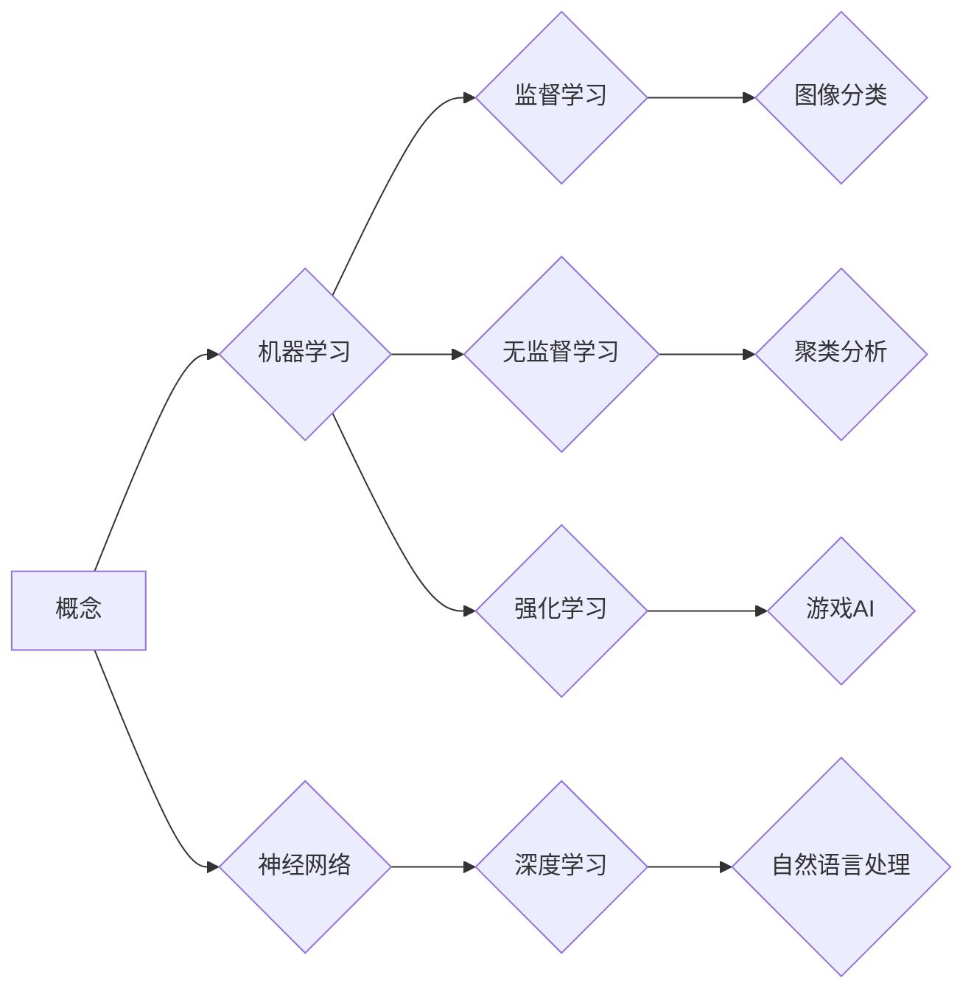

> 人工智能，深度学习，神经网络，算法，模型，应用

## 1. 背景介绍

在瞬息万变的科技时代，人工智能（AI）正以惊人的速度发展，深刻地改变着我们的生活和工作方式。从智能手机的语音助手到自动驾驶汽车，AI技术的应用无处不在。然而，AI技术的本质是什么？它是如何从概念到洞见的？

本篇文章将深入探讨AI的核心概念，分析其背后的算法原理和数学模型，并通过实际项目实践，揭示AI技术从概念到洞见的演变过程。

## 2. 核心概念与联系

人工智能的核心概念是模拟人类智能的行为。这包括学习、推理、决策、感知和语言理解等能力。

**2.1. 学习**

机器学习是AI的重要分支，它通过算法从数据中学习，不断改进其性能。机器学习算法可以分为监督学习、无监督学习和强化学习三大类。

* **监督学习:**  利用标记数据训练模型，预测未知数据。例如，图像分类、文本识别等。
* **无监督学习:**  从未标记数据中发现模式和结构。例如，聚类分析、异常检测等。
* **强化学习:**  通过试错学习，在环境中获得最大奖励。例如，游戏AI、机器人控制等。

**2.2. 神经网络**

神经网络是模拟生物神经网络的计算模型，是深度学习的基础。它由多个层级的神经元组成，每个神经元接收输入信号，进行处理，并输出信号。

**2.3. 深度学习**

深度学习是利用多层神经网络进行学习的机器学习方法。它能够学习更复杂的特征表示，从而提高模型的性能。

**2.4. 联系**

机器学习、神经网络和深度学习相互关联，共同构成了AI技术的基础。机器学习提供了一般性的学习框架，神经网络是实现机器学习的常用模型，深度学习则是利用多层神经网络进行更深入的学习。

**Mermaid 流程图**



## 3. 核心算法原理 & 具体操作步骤

### 3.1  算法原理概述

深度学习算法的核心是反向传播算法。反向传播算法通过计算误差，并根据误差调整神经网络的权重，从而使模型的预测结果越来越准确。

### 3.2  算法步骤详解

1. **前向传播:** 将输入数据传递到神经网络中，计算每个神经元的输出值。
2. **误差计算:** 将神经网络的输出值与真实值进行比较，计算误差。
3. **反向传播:** 将误差反向传播到神经网络的各个层级，计算每个神经元的梯度。
4. **权重更新:** 根据梯度更新神经网络的权重，使模型的预测结果越来越准确。

### 3.3  算法优缺点

**优点:**

* 能够学习复杂的特征表示。
* 性能优于传统机器学习算法。
* 在图像识别、语音识别等领域取得了突破性进展。

**缺点:**

* 需要大量的训练数据。
* 计算量大，训练时间长。
* 模型解释性差，难以理解模型的决策过程。

### 3.4  算法应用领域

深度学习算法广泛应用于以下领域:

* **计算机视觉:** 图像识别、物体检测、图像分割、人脸识别等。
* **自然语言处理:** 文本分类、情感分析、机器翻译、对话系统等。
* **语音识别:** 语音转文本、语音搜索等。
* **推荐系统:** 商品推荐、内容推荐等。
* **医疗诊断:** 疾病诊断、影像分析等。

## 4. 数学模型和公式 & 详细讲解 & 举例说明

### 4.1  数学模型构建

深度学习模型的数学基础是神经网络。神经网络由多个层级的神经元组成，每个神经元接收输入信号，进行处理，并输出信号。

**4.1.1. 神经元模型**

一个神经元的数学模型可以表示为：

$$
y = f(w^T x + b)
$$

其中：

* $x$ 是输入向量。
* $w$ 是权重向量。
* $b$ 是偏置项。
* $f$ 是激活函数。
* $y$ 是输出值。

**4.1.2. 多层神经网络**

多层神经网络由多个神经元层组成，每个层级的神经元接收上一层级的输出作为输入。

### 4.2  公式推导过程

反向传播算法的核心是计算误差梯度，并根据梯度更新神经网络的权重。

**4.2.1. 损失函数**

损失函数用于衡量模型的预测结果与真实值的差距。常见的损失函数包括均方误差（MSE）和交叉熵损失（Cross-Entropy Loss）。

**4.2.2. 梯度下降**

梯度下降算法用于更新神经网络的权重。它通过计算损失函数的梯度，并沿着梯度的负方向更新权重，从而使损失函数的值逐渐减小。

### 4.3  案例分析与讲解

**4.3.1. 图像分类**

在图像分类任务中，深度学习模型可以学习图像的特征表示，并将其分类到不同的类别。例如，可以训练一个深度学习模型，识别猫和狗的图像。

**4.3.2. 自然语言处理**

在自然语言处理任务中，深度学习模型可以学习文本的语义表示，并进行文本分类、情感分析、机器翻译等任务。例如，可以训练一个深度学习模型，识别文本的情感倾向。

## 5. 项目实践：代码实例和详细解释说明

### 5.1  开发环境搭建

本项目使用Python语言进行开发，并使用TensorFlow深度学习框架。

**5.1.1. 安装Python**

下载并安装Python语言环境。

**5.1.2. 安装TensorFlow**

使用pip命令安装TensorFlow框架。

```
pip install tensorflow
```

### 5.2  源代码详细实现

本项目实现一个简单的图像分类模型，用于识别猫和狗的图像。

```python
import tensorflow as tf

# 定义模型结构
model = tf.keras.models.Sequential([
    tf.keras.layers.Conv2D(32, (3, 3), activation='relu', input_shape=(64, 64, 3)),
    tf.keras.layers.MaxPooling2D((2, 2)),
    tf.keras.layers.Conv2D(64, (3, 3), activation='relu'),
    tf.keras.layers.MaxPooling2D((2, 2)),
    tf.keras.layers.Flatten(),
    tf.keras.layers.Dense(10, activation='softmax')
])

# 编译模型
model.compile(optimizer='adam',
              loss='sparse_categorical_crossentropy',
              metrics=['accuracy'])

# 加载数据
(x_train, y_train), (x_test, y_test) = tf.keras.datasets.cifar10.load_data()

# 训练模型
model.fit(x_train, y_train, epochs=10)

# 评估模型
loss, accuracy = model.evaluate(x_test, y_test)
print('Test loss:', loss)
print('Test accuracy:', accuracy)
```

### 5.3  代码解读与分析

**5.3.1. 模型结构**

代码中定义了一个简单的卷积神经网络模型。模型包含两个卷积层、两个最大池化层、一个全连接层和一个输出层。

**5.3.2. 编译模型**

模型使用Adam优化器、稀疏类别交叉熵损失函数和准确率作为评估指标进行编译。

**5.3.3. 加载数据**

代码使用CIFAR-10数据集进行训练和评估。CIFAR-10数据集包含60000张彩色图像，每张图像大小为32x32，共有10个类别。

**5.3.4. 训练模型**

模型使用训练数据进行训练，训练epochs设置为10。

**5.3.5. 评估模型**

训练完成后，使用测试数据评估模型的性能。

### 5.4  运行结果展示

运行代码后，会输出测试集上的损失值和准确率。

## 6. 实际应用场景

深度学习技术在各个领域都有广泛的应用场景。

### 6.1. 医疗诊断

深度学习可以用于辅助医生进行疾病诊断，例如识别肿瘤、分析医学影像等。

### 6.2. 自动驾驶

深度学习是自动驾驶汽车的关键技术之一，用于感知周围环境、识别道路标志和障碍物等。

### 6.3. 金融风险管理

深度学习可以用于识别金融风险，例如欺诈检测、信用评分等。

### 6.4  未来应用展望

随着深度学习技术的不断发展，其应用场景将更加广泛。例如，在个性化教育、智能家居、机器人等领域都有巨大的潜力。

## 7. 工具和资源推荐

### 7.1  学习资源推荐

* **书籍:**
    * 深度学习 (Deep Learning) - Ian Goodfellow, Yoshua Bengio, Aaron Courville
    * 构建深度学习模型 (Hands-On Machine Learning with Scikit-Learn, Keras & TensorFlow) - Aurélien Géron
* **在线课程:**
    * 深度学习 Specialization - Andrew Ng (Coursera)
    * fast.ai - Practical Deep Learning for Coders

### 7.2  开发工具推荐

* **TensorFlow:** 开源深度学习框架，支持多种硬件平台。
* **PyTorch:** 开源深度学习框架，以其灵活性和易用性而闻名。
* **Keras:** 高级深度学习API，可以运行在TensorFlow、Theano或CNTK等框架之上。

### 7.3  相关论文推荐

* **ImageNet Classification with Deep Convolutional Neural Networks** - Alex Krizhevsky, Ilya Sutskever, Geoffrey E. Hinton
* **Attention Is All You Need** - Ashish Vaswani, Noam Shazeer, Niki Parmar, Jakob Uszkoreit, Llion Jones, Aidan N Gomez, Łukasz Kaiser, Illia Polosukhin

## 8. 总结：未来发展趋势与挑战

### 8.1  研究成果总结

深度学习技术取得了令人瞩目的成就，在图像识别、语音识别、自然语言处理等领域取得了突破性进展。

### 8.2  未来发展趋势

* **模型效率提升:** 研究更轻量级、更高效的深度学习模型。
* **数据增强:** 利用数据增强技术，提高模型对少量数据的鲁棒性。
* **可解释性增强:** 研究更可解释的深度学习模型，提高模型的透明度和可信度。
* **边缘计算:** 将深度学习模型部署到边缘设备，实现更快速的推理速度和更低的延迟。

### 8.3  面临的挑战

* **数据获取和标注:** 深度学习模型需要大量的训练数据，数据获取和标注成本高昂。
* **模型解释性:** 深度学习模型的决策过程难以理解，缺乏可解释性。
* **公平性和偏见:** 深度学习模型可能存在公平性和偏见问题，需要进行更深入的研究和解决。

### 8.4  研究展望

未来，深度学习技术将继续发展，并在更多领域发挥重要作用。研究人员将继续探索更有效的模型架构、更强大的训练算法和更可解释的模型，推动深度学习技术向更智能、更安全、更可持续的方向发展。

## 9. 附录：常见问题与解答

### 9.1  Q1: 深度学习和机器学习有什么区别？

**A1:** 深度学习是机器学习的一种